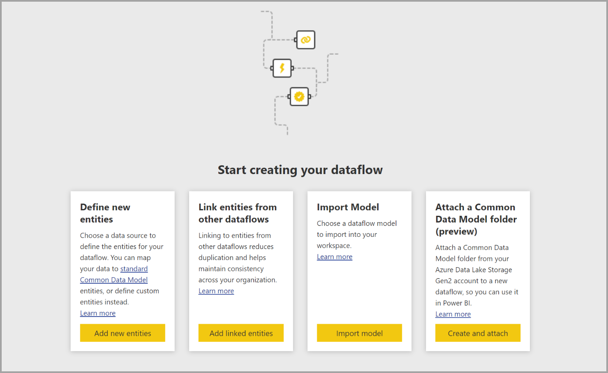
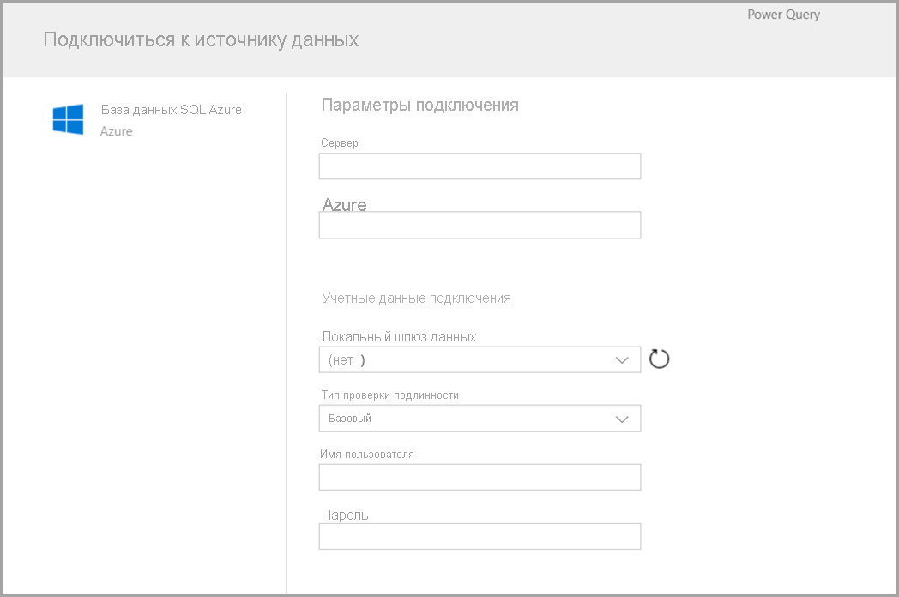

# Создание потока данных
**Поток данных** — это коллекция сущностей (сущности здесь аналогичны таблицам), которые создаются и администрируются в рабочих областях в службе Power BI. **Сущность или таблица** — это набор полей, используемых для хранения данных, аналогично таблице в базе данных. Можно добавлять и изменять сущности или таблицы в потоке данных, а также управлять расписаниями обновления данных непосредственно из рабочей области, в которой был создан поток данных.

Чтобы создать поток данных, запустите службу Power BI в браузере и в области навигации слева выберите **рабочую область** (потоки данных недоступны в разделе *my-workspace* в службе Power BI), как показано на следующем экране. Вы также можете создать рабочую область для создания потока данных.

Существует несколько способов создания потока данных:

* [Создание потока данных с помощью определения новых сущностей](#create-a-dataflow-using-define-new-entities)
* [Создание потока данных с помощью связанных сущностей](#create-a-dataflow-using-linked-entities)
* [Создание потока данных с помощью вычисляемой сущности](#create-a-dataflow-using-a-computed-entity)
* [Создание потока данных с помощью импорта или экспорта](#create-a-dataflow-using-importexport)

В следующих разделах все эти способы создания потока данных рассматриваются более подробно.

## Создание потока данных с помощью определения новых сущностей

С помощью определения новых сущностей можно определить новую сущность или таблицу и подключиться к новому источнику данных.

При выборе источника данных вам нужно указать параметры подключения, в том числе учетную запись для подключения к источнику данных, как показано на следующем рисунке.

Подключившись, вы сможете выбрать данные, используемые для сущности. Когда вы выберете данные и источник, Power BI переподключится к этому источнику для обновления данных в потоке данных с частотой, которую вы настроите позже.

Выбрав данные для использования в сущности, вы сможете с помощью редактора потока данных изменить их формат для использования с потоком данных. 

## Создание потока данных с помощью связанных сущностей

Создание потока данных с помощью связанных сущностей позволяет ссылаться на существующую сущность, определенную в другом потоке данных, в режиме только для чтения. Ниже перечислены некоторые причины выбора этого подхода.

* Для многократного использования сущности в нескольких потоках данных, таких как сущность даты или статическая таблица подстановок, следует создать сущность один раз, а затем ссылаться на нее в других потоках данных.

* Чтобы не создавать несколько обновлений для источника данных, рекомендуется использовать связанные сущности для хранения данных и работы в качестве кэша. В этом случае все следующие потребители смогут использовать эту сущность, уменьшая нагрузку на базовый источник данных.

* Если необходимо объединить две сущности.

> [!NOTE]
> Связанные сущности доступны только в Power BI Premium.

## Создание потока данных с помощью вычисляемой сущности

Создание потока данных с помощью вычисляемой сущности позволяет ссылаться на связанную сущность и выполнять операции на ее основе в режиме только для записи. В результате формируется новая сущность, которая является частью потока данных. Чтобы преобразовать связанную сущность в вычисленную, можно либо создать запрос из операции слияния, либо, если необходимо изменить или преобразовать сущность, создать ссылку или дубликат сущности.

### Создание вычисляемых сущностей

Создав поток данных со списком сущностей, вы можете выполнять по этих сущностям вычисления.
В средстве разработки потоков данных службы Power BI выберите действие **Изменение сущностей**, затем щелкните правой кнопкой мыши ту сущность, на основе которой вы намерены создать вычисляемую сущность, т. е. по которой будете выполнять вычисления. В контекстном меню выберите **Ссылка**.
Чтобы сущность можно было назначить вычисляемой сущностью, должен быть установлен флажок **Включить загрузку**, как показано на следующем рисунке. Щелкните сущность правой кнопкой мыши, чтобы отобразить контекстное меню.

Установив флажок **Включить загрузку**, вы создаете новую сущность, источником для которой будет исходная сущность. Значок сменится на значок **вычисляемой** сущности, как показано на следующем рисунке.

Любое преобразование, выполняемое для новой сущности, использует те данные, которые уже находятся в хранилище потока данных Power BI. Это значит, что запрос будет выполняться не к внешнему источнику данных, из которого были импортированы данные (например, к базе данных SQL, из которой извлекались данные), а к тем данным, которые уже находятся в хранилище потока данных.

**Примеры вариантов использования.** Какого рода преобразования можно выполнять для вычисляемых сущностей? Для вычислений в хранилище поддерживаются любые преобразования, которое обычно задаются с помощью пользовательского интерфейса преобразований в Power BI или редакторе M.

Рассмотрим следующий пример: у вас есть сущность *Account* (Учетная запись), которая содержит необработанные данные для всех клиентов из подписки Dynamics 365. Также у вас есть необработанные данные *ServiceCalls* из центра поддержки по всем обращениям в службу поддержки, которые выполнялись для другой учетной записи за каждый день года.

Предположим, вы хотите дополнить сущность *Account* данными из *ServiceCalls*.
Сначала вам следует агрегировать данные из *ServiceCalls*, чтобы вычислить число обращений в службу поддержки, которые выполнялись для каждой учетной записи в течение последнего года.

После этого следует объединить сущность *Account* с сущностью *ServiceCallsAggregated*, чтобы вычислить дополненную таблицу *Account*.

После этого вы увидите результаты, представленные на следующем рисунке как *EnrichedAccount*.

Вот и все — преобразование выполняется по данным в потоке данных, которые хранятся в подписке Power BI Premium, а не по исходным данным.

> [!NOTE]
> Вычисляемые сущности доступны только по подписке Premium.

## Создание потока данных с помощью папки CDM

Создание потока данных из папки CDM позволяет ссылаться на сущность, записанную другим приложением в формате Common Data Model (CDM). Вам будет предложено указать полный путь к файлу в формате CDM, хранящемуся в ADLS 2-го поколения.

 

В следующем списке приведены несколько ограничений для создания потоков данных из папок CDM:

* Чтобы PBI получить доступ к файлу, учетная запись ADLS Gen 2 должна иметь соответствующие разрешения.

* Учетная запись ADLS 2-го поколения должна быть доступна пользователю, пытающемуся создать поток данных.

* Создание потоков данных из папки CDM доступно только в новом интерфейсе рабочей области.

* URL-адрес должен быть прямым путем к файлу JSON. Кроме того, в нем должна использоваться конечная точка ADLS 2-го поколения. blob.core не поддерживается

## Создание потока данных с помощью импорта или экспорта

Создание потока данных с помощью импорта или экспорта позволяет импортировать поток данных из файла. Это полезно, если необходимо сохранить копию потока данных в автономном режиме или переместить поток данных из одной рабочей области в другую. 

Чтобы экспортировать поток данных, выберите созданный поток данных и щелкните пункт меню **Дополнительно** (многоточие), чтобы развернуть параметры, а затем выберите **export .json**. Вам будет предложено начать скачивание потока данных, представленного в формате CDM.

Чтобы импортировать поток данных, выберите поле "Импорт" и отправьте файл. Power BI создает поток данных и позволяет сохранить его как есть или выполнить дополнительные преобразования.

## Дальнейшие действия

Создав поток данных с помощьюPower BI Desktop и службы Power BI, вы можете создавать наборы данных, отчеты, панели мониторинга и приложения на основе данных из потоков данных Power BI. Это позволит вам получить ценные аналитические сведения о вашей коммерческой деятельности. В следующих статьях содержатся более подробные сведения о типичных сценариях применения потоков данных.

* [Вводные сведения о потоках данных и самостоятельной подготовке данных](dataflows-introduction-self-service.md)
* [Настройка и использование потока данных](dataflows-configure-consume.md)
* [Настройка хранилища потоков данных для использования Azure Data Lake 2-го поколения](dataflows-azure-data-lake-storage-integration.md)
* [Функции потоков данных уровня "Премиум"](dataflows-premium-features.md)
* [ИИ с потоками данных](dataflows-machine-learning-integration.md)
* [Рекомендации и ограничения, касающиеся потоков данных](dataflows-features-limitations.md)