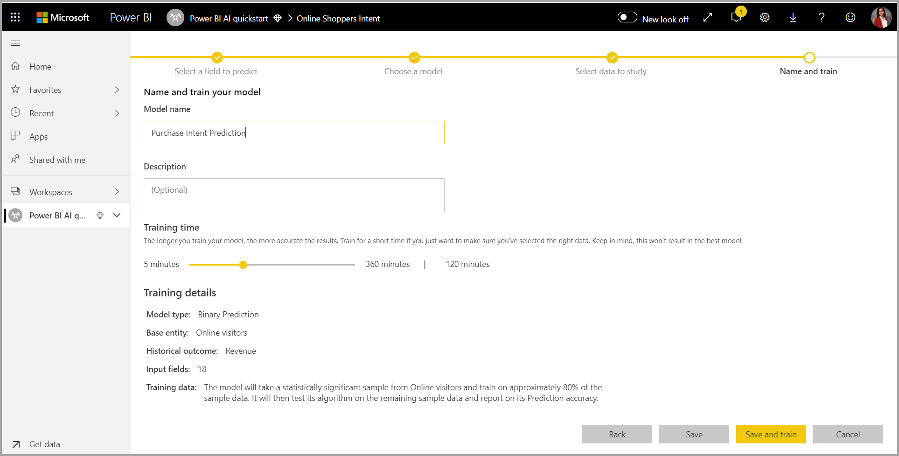
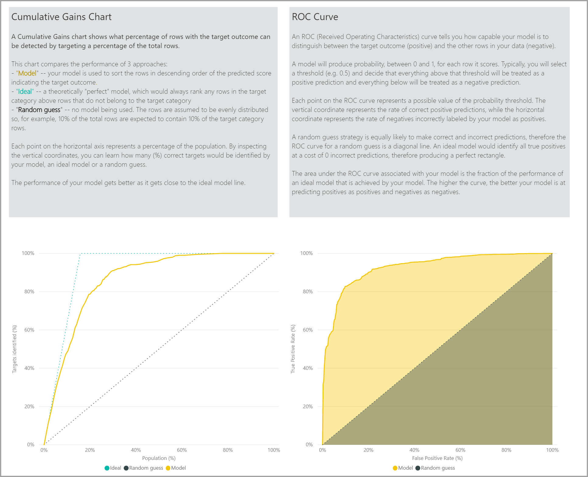

# ИИ с потоками данных

В этой статье рассматриваются способы использования искусственного интеллекта (ИИ) с потоками данных. Ниже перечислены темы, затрагиваемые в этой статье.

* Cognitive Services
* Автоматизированное машинное обучение
* Интеграция машинного обучения Azure

## Использование Cognitive Services в Power BI

С помощью Cognitive Services в Power BI можно применять различные алгоритмы из [Azure Cognitive Services](https://azure.microsoft.com/services/cognitive-services/), чтобы дополнить данные при самостоятельной подготовке данных для потоков данных.

Сейчас поддерживаются службы [анализа тональности](https://docs.microsoft.com/azure/cognitive-services/text-analytics/how-tos/text-analytics-how-to-sentiment-analysis), [извлечения ключевых фраз](https://docs.microsoft.com/azure/cognitive-services/text-analytics/how-tos/text-analytics-how-to-keyword-extraction), [распознавания языка](https://docs.microsoft.com/azure/cognitive-services/text-analytics/how-tos/text-analytics-how-to-language-detection) и [добавления тегов к изображению](https://docs.microsoft.com/azure/cognitive-services/computer-vision/concept-tagging-images). Преобразования выполняются в службе Power BI, для чего не требуется подписка на Azure Cognitive Services. Эта функция доступна в Power BI Premium.

### **Включение функций искусственного интеллекта**

Поддержка Cognitive Services обеспечивается такими узлами емкости Premium, как EM2, A2 или P1 и более производительными. В емкости используется отдельная рабочая нагрузка искусственного интеллекта для запуска Cognitive Services. На этапе общедоступной предварительной версии (до июня 2019 г.) эта рабочая нагрузка была по умолчанию отключена. Прежде чем использовать Cognitive Services в Power BI, необходимо включить рабочую нагрузку искусственного интеллекта в настройках емкости на портале администрирования. Включить рабочую нагрузку искусственного интеллекта можно в разделе рабочих нагрузок. При этом необходимо задать максимальный объем памяти для нее. Рекомендуется выделять для нее не более 20 %. Превышение этого объема приведет к замедлению обработки запросов.

### **Начало работы с Cognitive Services в Power BI**

Выполняемые Cognitive Services преобразования являются частью [самостоятельной подготовки данных для потоков данных](https://powerbi.microsoft.com/blog/introducing-power-bi-data-prep-wtih-dataflows/). Чтобы дополнить данные с помощью Cognitive Services, сперва откорректируйте поток данных.

В верхней ленте редактора Power Query нажмите кнопку **Аналитика ИИ**.

Во всплывающем окне выберите функцию, которую вы хотите использовать, и данные для преобразования. В этом примере выполняется оценка намерения в столбце, содержащем текст для проверки.

**Cultureinfo** — это необязательные входные данные для определения языка текста. В этом поле необходимо указать код языка по стандарту ISO. В качестве входных данных для Cultureinfo можно задать текст столбца или выбрать значение самостоятельно. В этом примере для всего столбца задан английский язык (en). Если оставить это поле пустым, Power BI автоматически определит язык перед применением функции. Нажмите **Вызвать**.

После вызова функции результат добавляется в таблицу в новом столбце. Преобразование также отображается как примененный шаг в запросе.

Если функция возвращает несколько полей выходных данных, добавляется новый столбец с записью нескольких полей выходных данных.

Разверните столбец, чтобы добавить к данным одно или оба значения в виде столбцов.

### **Доступные функции**

В этом разделе описаны функции, доступные в Cognitive Services в Power BI.

#### **Определение языка**

Функция определения языка оценивает введенный текст и для каждого поля возвращает название языка и его код ISO. Эту функция удобно использовать для столбцов данных с произвольным текстом, язык которого неизвестен. Входные данные функции должны быть в текстовом формате.

API анализа текста распознает до 120 языков. Дополнительные сведения см. в статье [Поддержка языков и регионов в API анализа текста](https://docs.microsoft.com/azure/cognitive-services/text-analytics/text-analytics-supported-languages).

#### **Извлечение ключевых фраз**

Функция **Извлечь ключевые фразы** оценивает неструктурированный текст и для каждого текстового поля возвращает список ключевых фраз. В качестве входных данных для функции требуется текстовое поле или необязательный параметр **Cultureinfo**. (См. раздел **Начало работы с Cognitive Services в Power BI** этой статьи).

Извлечение ключевых фраз лучше всего работает с большими фрагментами текста. тогда как анализ тональности более эффективен при использовании небольших фрагментов текста. Для получения наилучших результатов обеих операций советуем реструктуризировать входные данные соответствующим образом.

#### **Оценка тональности**

Функция **Score Sentiment** (Оценка тональности) оценивает введенный текст и возвращает оценку тональности для каждого документа в диапазоне от 0 (негативная) до 1 (позитивная). Эта функция полезна при определении положительных и отрицательных мнений в социальных сетях, отзывах клиентов и на форумах.

API анализа текста использует алгоритм машинного обучения классификации для оценки тональности в диапазоне от 0 до 1. Близкие к 1 оценки указывают на положительную тональность, а близкие к 0 — наоборот. Модель предварительно обучена с использованием большого массива текста с различными тональностями. Сейчас модель нельзя обучить на своих данных. В ходе анализа модель использует ряд методов — обработку текста, анализ частей речи, упорядочивание слов и создание словесных ассоциаций. Дополнительные сведения об этом алгоритме см. в [обзорной статье об API анализа текста](/archive/blogs/machinelearning/machine-learning-and-text-analytics).

Анализ тональности выполняется над всеми входными данными, в отличие от извлечения тональности в отношении конкретной сущности в тексте. Как подтверждает практика, точность оценки повышается, когда документ содержит одно или два предложения, а не большие блоки текста. В ходе оценки объективности модель определяет, является ли заданный текст описательным или он содержит тональности. Над описательным по большей части текстом анализ тональности не выполняется. Он получает оценку 0,50 и больше не обрабатывается. На следующем этапе тексту, который далее обрабатывается в конвейере, присваивается оценка выше или ниже 0,50 в зависимости от обнаруженной тональности.

API анализа тональности сейчас поддерживает английский, немецкий, испанский и французский языки. Другие языки находятся на этапе предварительной версии. Дополнительные сведения см. в [списке поддерживаемых языков](https://docs.microsoft.com/azure/cognitive-services/text-analytics/text-analytics-supported-languages).

#### **Добавление тегов к изображениям**

Функция **Tag Images** (Добавление тегов к изображениям) позволяет добавлять теги к более чем 2000 распознаваемым объектам, живым существам, пейзажам и действиям. Если возникает неопределенность с добавлением тега, в выходных данных можно разъяснить смысл тега в используемом контексте. Теги не упорядочены по таксономии и не существуют в иерархиях наследования. Коллекция тегов содержимого формирует основу для "описания" изображения, отображаемого на понятном для пользователя языке и отформатированного в полные предложения.

После загрузки изображения или указав его URL-адрес, алгоритмы компьютерного зрения выводят теги, в зависимости от объектов, живых существ и действий, указанных на изображении. Теги добавляются не только к основному субъекту, например человеку на переднем плане, но и к окружению (интерьеру или экстерьеру), например предметам мебели, инструментам, растениям, животным, аксессуарам, устройствам и т. д.

Для работы этой функции в качестве входных данных требуется наличие URL-адреса изображения или текст в формате Base64. Сейчас функция добавления тегов к изображениям поддерживает английский, испанский, японский, португальский и упрощенный китайский язык. Дополнительные сведения см. в [списке поддерживаемых языков](https://docs.microsoft.com/rest/api/cognitiveservices/computervision/tagimage/tagimage#uri-parameters).

## Автоматизированное машинное обучение в Power BI

Автоматизированное машинное обучение (AutoML) для потоков данных позволяет бизнес-аналитикам обучать, проверять и вызывать модели машинного обучения (ML) непосредственно из Power BI. Эта служба предоставляет простой интерфейс для создания модели машинного обучения, в которой аналитики могут указывать потоки данных для указания входных данных для обучения модели. Служба автоматически извлекает наиболее релевантные компоненты, выбирает подходящий алгоритм, настраивает и проверяет модель машинного обучения. После обучения модели Power BI автоматически создает отчет о производительности с результатами проверки. Эту модель затем можно вызвать для любых новых или обновленных данных в потоке данных.

Автоматизированное машинное обучение доступно только для потоков данных, размещенных на емкостях Power BI Premium и Embedded.

### Работа с AutoML

Потоки данных позволяют самостоятельно подготавливать наборы для больших данных. Служба AutoML интегрирована в потоки данных и позволяет использовать процесс подготовки данных для создания моделей машинного обучения прямо в Power BI.

AutoML в Power BI позволяет аналитикам данных создавать модели машинного обучения на основе потоков данных, используя упрощенный интерфейс и навыки работы с Power BI. Большая часть действий по обработке и анализу данных, выполняемых для создания моделей машинного обучения, выполняется в Power BI автоматически. Определенные ограничения гарантируют хорошее качество создаваемой модели и полную прозрачность процесса, используемого для создания модели машинного обучения.

AutoML поддерживает создание моделей **двоичного прогнозирования**, **классификации** и **регрессии** для потоков данных. Это контролируемые типы моделей машинного обучения, то есть они используют известные результаты прошлых наблюдений для прогнозирования результатов других наблюдений. Входной набор данных для обучения модели AutoML содержит набор записей **с информацией** об известных результатах.

AutoML в Power BI применяет [автоматизированное машинное обучение](https://docs.microsoft.com/azure/machine-learning/service/concept-automated-ml) из службы [Машинное обучение Azure](https://docs.microsoft.com/azure/machine-learning/service/overview-what-is-azure-ml) для создания моделей машинного обучения. Но для использования AutoML в Power BI не требуется подписка Azure. Процесс обучения и размещения моделей машинного обучения полностью управляется службой Power BI.

После обучения модели машинного обучения AutoML автоматически создает отчет Power BI с информацией о предполагаемой эффективности полученной модели машинного обучения. AutoML уделяет особое внимание объяснению причин, выделяя из входных данных ключевые факторы, влияющие на возвращаемые моделью прогнозы. Отчет также содержит ключевые метрики модели.

На других страницах созданного отчета отображаются статистические сведения о модели и процессе обучения. Эта статистическая сводка будет интересна тем пользователям, которые предпочитают видеть меры эффективности модели, стандартно используемые в отрасли обработки и анализа данных. В сведениях об обучении собрана сводная информация по всем итерациям, которые выполнялись для создания модели, с указанием параметров моделирования. Здесь также описывается, как использовался каждый вход при создании модели машинного обучения.

После этого вы сможете применить модель машинного обучения к данным для ее оценки. При обновлении потока данных прогнозы, полученные из модели машинного обучения, автоматически применяются к данным. Power BI также предоставляет подробное объяснение для каждого конкретного прогноза, который создает модель машинного обучения.

### Создание модели машинного обучения

В этом разделе описывается, как создать модель AutoML.

#### Подготовка данных для создания модели машинного обучения

Чтобы создать модель машинного обучения в Power BI, необходимо сначала создать поток данных с результатами предыдущих измерений для обучения модели машинного обучения. Кроме того, есть смысл добавить вычисляемые столбцы для всех бизнес-метрик, которые могут быть надежными прогностическими факторами для прогнозируемого результата. Дополнительные сведения о настройке потока данных см. в статье о [настройке и использовании потока данных](dataflows-configure-consume.md).

AutoML налагает определенные требования на данные для обучения модели машинного обучения. Эти требования описаны в разделах ниже для каждого типа моделей.

#### Настройка входных данных для модели машинного обучения

Чтобы создать модель AutoML, щелкните значок машинного обучения в столбце **Действия** для сущности потока данных и выберите действие **Добавить модель машинного обучения**.

Откроется несложный интерфейс мастера настройки, который поможет вам создать модель машинного обучения. Этот мастер содержит описанные ниже шаги.

**1. Выбор сущности с историческими данными и поля с результатами, для которого требуется прогноз**

Поле с результатами определяет атрибут метки для обучения модели машинного обучения, как показано на рисунке ниже.

**2. Выбор типа модели**

После выбора поля с результатами AutoML оценивает данные меток и рекомендует наиболее подходящий тип модели машинного обучения. Вы можете выбрать другую модель, щелкнув ссылку "Выбрать другую модель", как показано ниже.

> [!NOTE]
> Бывает так, что некоторые типы моделей не поддерживаются для выбранных данных и поэтому отключены. В приведенном выше примере отключен тип "Регрессия", так как в качестве поля с результатами выбран текстовый столбец.

**3. Выбор входных данных, которые модель будет использовать в качестве прогнозных сигналов**

AutoML анализирует выборку из выбранной сущности, чтобы предложить входные данные для обучения модели машинного обучения. Рядом с полями, которые не были выбраны, приводятся пояснения. Если поле имеет слишком много уникальных значений, только одно значение либо слишком низкую или высокую корреляцию с полем результата, оно не рекомендуется.

Не следует использовать для обучения модели машинного обучения любые входные данные, которые зависят от поля результатов (или от поля метки), так как это негативно влияет на эффективность модели. Такие поля помечаются как имеющие подозрительно высокую корреляцию с полем результата. Включение этих полей в обучающие данные приводит к утечке меток, то есть модель будет хорошо работать с проверочными или тестовыми данными, но не сможет показать такие же результаты при оценке рабочих данных. Одним из признаков утечки меток в моделях AutoML является неправдоподобно высокая эффективность обучения модели.

Признаки рекомендуются на основе выборки данных, поэтому вам стоит проверить используемые входные данные. Вы можете изменить выбранные поля, оставив только те, которые необходимо изучить в модели. Вы также можете выбрать все поля, установив флажок рядом с именем сущности.

**4. Присвоение имени модели и сохранение конфигурации**

На последнем шаге можно присвоить модели имя и выбрать команду "Сохранить и обучить", чтобы начать ее обучение. Вы можете уменьшить время обучения, чтобы получить результаты быстро, или увеличить его, чтобы получить более точную модель.

#### Обучение модели машинного обучения

Обучение моделей AutoML является частью процесса обновления потока данных. Сначала AutoML готовит данные для обучения.
AutoML разделяет предоставленные исторические данные на обучающие и проверочные наборы данных. Тестовый набор данных выполняет роль контрольного набора для проверки эффективности модели, которая выполняется после обучения. Эти наборы представлены в потоке данных в виде сущностей **обучения и тестирования**. AutoML использует перекрестную проверку для проверки модели.

Затем каждое поле ввода анализируется и отсутствующие значения заполняются вычисляемыми данными. AutoML использует несколько разных стратегий подстановки отсутствующих значений. Для входных атрибутов, рассматриваемых как числовые признаки, для подстановки отсутствующих значений используется среднее значение столбца. Для входных атрибутов, рассматриваемых как категориальные признаки, для подстановки отсутствующих значений AutoML использует режим значений столбца. Среднее значение и мода значений, используемые для подстановки отсутствующих значений, рассчитываются платформой AutoML на основе подвыборки из набора обучающих данных.

После этого к данным применяются все необходимые методы выборки и нормализации. Для моделей классификации AutoML подвергает входные данные послойной выборке и уравновешивает классы, чтобы обеспечить для них равное количество строк.

AutoML применяет несколько преобразований для каждого выбранного входного поля, основываясь на типе данных и статистических свойствах этого поля. AutoML использует эти преобразования для извлечения компонентов, которые будут использоваться для обучения модели машинного обучения.

Процесс обучения для моделей AutoML состоит из нескольких итераций (до 50) с разными алгоритмами и параметрами моделирования, по итогам которых выбирается модель с лучшей эффективностью. Обучение может завершиться после меньшего количества итераций, если служба AutoML не будет наблюдать повышения эффективности. Эффективность каждой из моделей оценивается путем проверки по набору контрольных данных. На этом этапе обучения AutoML создает несколько конвейеров для обучения и проверки этих итераций. Процесс оценки производительности моделей может занять от нескольких минут до нескольких часов (но не более настроенного в мастере времени обучения) в зависимости от размера набора данных и доступных ресурсов для выделенной емкости.

В некоторых случаях итоговая модель создается как ансамбль, в котором участвует сразу несколько моделей для повышения эффективности прогнозирования.

#### Доступность моделей AutoML для объяснения

После обучения модели AutoML анализирует связи между компонентами входных данных и выходными данными модели. Для каждого входного признака оценивается величина изменения, которое он оказывает на выходные данные модели по контрольному набору данных. Это называется _важностью компонентов_. Это происходит в процессе обновления после завершения обучения. Поэтому обновление может занять больше времени, чем настроенная в мастере длительность обучения.

#### Отчет по модели AutoML

AutoML формирует отчет Power BI, в котором собраны сводные данные о производительности модели во время проверки, а также глобальные данные о важности компонентов. Доступ к этому отчету можно получить на вкладке "Модель машинного обучения" после успешного обновления потока данных. В отчете собираются результаты применения модели машинного обучения к контрольным (тестовым) данным, а результаты прогнозов сравниваются с известными значениями результата.

Отчет по модели позволяет оценить ее эффективность. По нему также можно убедиться, что ключевые факторы влияния в модели соответствуют существующей бизнес-аналитике по известным результатам.

Диаграммы и меры, которые используются в отчете для описания эффективности модели, зависят от типа модели. Эти диаграммы и меры производительности описаны в следующих разделах.

Дополнительные страницы в отчете могут описывать статистические меры по модели с точки зрения обработки и анализа данных. Например, отчет по **двоичному прогнозу** включает диаграмму выгоды и кривую ROC для модели.

Отчеты также содержат страницу **сведений об обучении**, на которой есть описание процесса обучения модели и диаграмма эффективности модели в каждой итерации.

Другой раздел на этой странице описывает определенный тип поля входных данных и метод, который применялся для добавления отсутствующих значений. Он также включает параметры, используемые в конечной модели.

Если созданная модель использует ансамбль обучения, то на странице **сведений об обучении** добавляется диаграмма, на которой представлены вес и параметры каждой модели, составляющей этот ансамбль.

### Применение модели AutoML

Если вас устраивает эффективность созданной модели машинного обучения, вы можете применить ее к новым или обновленным данным при обновлении потока данных. Это можно сделать прямо из отчета о модели, нажав кнопку **Применить** в правом верхнем углу или кнопку "Применить модель ML" в разделе действий на вкладке "Модели машинного обучения".

Чтобы применить модель машинного обучения, необходимо указать имя сущности, к которой она будет применена, и префикс для столбцов, которые будут добавлены в эту сущность для выходных данных модели. По умолчанию префиксом для имен столбцов назначается имя модели. Функция _Применить_ может принимать дополнительные параметры в зависимости от типа модели.

При применении модели машинного обучения создаются две сущности потока данных, содержащие прогнозы, и контекстные пояснения для каждой строки, которая оценивается в выходной сущности. Например, если вы примените модель _PurchaseIntent_ к сущности _OnlineShoppers_, на выходе будут сформированы сущности **OnlineShoppers enriched PurchaseIntent** и **OnlineShoppers enriched PurchaseIntent explanations**. Для каждой строки в сущности enriched **пояснения** разбиваются на несколько строк в сущности enriched explanations на основе входного признака. **ExplanationIndex** помогает сопоставить строки из сущности enriched explanations со строкой в сущности enriched.

Вы также можете применить любую модель AutoML в Power BI к сущностям в любом потоке данных в одной рабочей области с помощью функции "Аналитика ИИ" в обозревателе функций PQO. Так вы сможете использовать модели, созданные другими пользователями в одной и той же рабочей области, даже не имея прав владения на поток данных, который содержит модель. Power Query обнаруживает все модели машинного обучения Power BI в рабочей области и предоставляет их в качестве динамических функций Power Query. Вы можете вызвать эти функции на ленте в редакторе Power Query или непосредственно с помощью функции M.Сейчас эта функция поддерживается только для потоков данных Power BI и Power Query Online в службе Power BI. Обратите внимание, что такой подход значительно отличается от применения моделей машинного обучения в потоке данных с помощью мастера AutoML. В таком случае отсутствует сущность объяснений, созданная с использованием этого метода, и если вы не являетесь владельцем потока данных, вы не можете получить доступ к отчетам по обучению модели или запустить ее повторное обучение. Если исходная модель изменена (с добавлением или удалением входных полей) либо модель или исходный поток данных были удалены, такой зависимый поток данных будет разорван.

После применения модели AutoML всегда поддерживает актуальность прогнозов при каждом обновлении потока данных.

Чтобы использовать аналитические сведения и прогнозы из модели ML в отчете Power BI, подключитесь к выходной сущности из Power BI Desktop с помощью соединителя **потоков данных**.

### Модели двоичного прогнозирования

Модели двоичного прогнозирования, официально именуемые **моделями двоичной классификации**, используются для классификации набора данных в две группы. Они используются для прогнозирования событий с двумя возможными исходами, например будет ли конвертирована возможность для продажи, уйдет ли клиент, будет ли счет своевременно оплачен, является ли транзакция мошеннической и т. д.

Выходные данные модели двоичного прогнозирования содержат оценку вероятности, то есть долю уверенности в том, что будет достигнут положительный результат.

#### Обучение модели двоичного прогнозирования

Предварительные требования:

- Для каждого возможного исхода нужно предоставить не менее 20 строк исторических данных.

Процесс создания модели двоичного прогнозирования содержит те же шаги, что и для других моделей AutoML, как описано выше в разделе **Настройка входных данных для модели машинного обучения**. Единственное отличие имеется на шаге "Выбор модели", на котором можно выбрать положительный исход, который вас интересует. Кроме того, можно указать понятные метки для результатов, которые будут использоваться в автоматически создаваемом отчете с результатами проверки модели.

#### Отчет о модели двоичного прогнозирования

Модель двоичного прогнозирования возвращает в качестве выходных данных оценку вероятности того, что для этой записи будет получен положительный результат. Отчет содержит срез по порогу вероятностей, который влияет на интерпретацию оценок выше и ниже порога вероятности.

Эффективность модели в этом отчете оценивается по категориям _истинные положительные результаты, ложные положительные результаты, истинные отрицательные результаты и ложные отрицательные результаты_. Истинные положительные и истинные отрицательные результаты — это правильно спрогнозированные исходы по двум классам. Ложные положительные результаты — это записи, для которых был спрогнозирован положительный исход, но на самом деле исход был иным. Напротив, ложные отрицательные результаты — это записи, которые имели положительный исход, хотя спрогнозированный исход был иным.

Дополнительные меры, такие как точность и полнота, описывают влияние значения порога на прогнозируемые результаты. Изменяя срез порога вероятности, вы можете выбрать такое пороговое значение, при котором достигается сбалансированный компромисс между точностью и полнотой.

Отчет также содержит средство анализа затрат и выгод, помогающее определить целевое подмножество совокупности, позволяющее получить максимальную прибыль. Исходя из оценочных затрат на нацеливание и выгоды от достижения целевого результата для единицы, средство анализа затрат и выгод пытается добиться максимальной прибыли. Это средство можно использовать для выбора порога вероятности на основе максимальной точки на графике, чтобы максимально увеличить прибыль. График также можно использовать для расчета прибыли или затрат для выбранного порога вероятности.

Страница **отчета о точности** в отчете о модели содержит диаграмму _совокупного прироста_ и кривую ROC для модели. Это статистические меры эффективности модели. В отчетах есть описания отображаемых диаграмм.

#### Применение модели двоичного прогнозирования

Чтобы применить модель двоичного прогнозирования, необходимо указать сущность с данными, к которым вы хотите применить прогнозы по модели машинного обучения. Укажите такие параметры, как префикс имени для выходного столбца и порог вероятности для классификации прогнозируемого результата.

При применении модели двоичного прогнозирования она добавляет в расширенную выходную сущность четыре выходных столбца: **Outcome**, **PredictionScore**, **PredictionExplanation** и **ExplanationIndex**. Имена столбцов в сущности дополняются префиксом, который вы указали при применении модели.

**PredictionScore** — это вероятность в процентах, то есть доля уверенности в том, что будет достигнут положительный результат.

Столбец **Outcome** содержит прогнозируемую метку исхода. Для записей, для которых вероятность превышает пороговое значение, прогнозируется достижение положительного результата, и они получают метку "Истина". Для записей с вероятностью ниже порогового значения прогнозируется неблагоприятный исход, и они получают метку "Ложь".

Столбец **PredictionExplanation** содержит объяснение того, какое конкретное влияние оказали входные компоненты на оценку **PredictionScore**.

### Модели классификации

Модели классификации используются для распределения набора данных в несколько групп или классов. Они используются для прогнозирования событий, которые могут иметь один из нескольких возможных результатов, например очень высокая, высокая, средняя или низкая ценность клиента за время его существования; высокий, средний, низкий или очень низкий уровень риска невыплат и т. д.

Выходные данные модели классификации содержат оценку вероятности, то есть прогнозируемая уверенность в том, что для записи будут выполняться критерии определенного класса.

#### Обучение модели классификации

Для модели классификации нужно предоставить входную сущность с обучающими данными, где существует строковое или целочисленное поле с результатами, то есть с данными об уже известных событиях.

Предварительные требования:

- Для каждого возможного исхода нужно предоставить не менее 20 строк исторических данных.

Процесс создания модели классификации содержит те же шаги, что и для других моделей AutoML, как описано выше в разделе **Настройка входных данных для модели машинного обучения**.

#### Отчет о модели классификации

Отчет о модели классификации создается путем применения модели машинного обучения к контрольным (тестовым) данным и сравнения прогнозируемых результатов с фактическим значением для каждой записи.

Отчет о модели содержит диаграмму с разбивкой по правильным и неправильным результатам классификации для каждого известного класса.

Более подробный анализ для каждого класса позволяет узнать, как распределялись прогнозы по каждому известному классу. Он показывает другие классы, в которые ошибочно относились записи конкретного класса.

Описание модели в отчете также включает самые важные прогностические факторы для каждого класса.

Отчет по модели классификации также содержит страницу с подробными сведениями о обучении, как и для других типов моделей, как описано в разделе **Отчет по модели AutoML** выше в этой статье.

#### Применение модели классификации

Чтобы применить модель классификации машинного обучения, нужно указать сущность со входными данными и префикс для имени выходного столбца.

При применении модели классификации она добавляет в расширенную выходную сущность пять выходных столбцов: **ClassificationScore**, **ClassificationResult**, **ClassificationExplanation**, **ClassProbabilities** и **ExplanationIndex**. Имена столбцов в сущности дополняются префиксом, который вы указали при применении модели.

Столбец **ClassProbabilities** содержит список с оценками вероятности для каждого возможного класса по этой записи.

**ClassificationScore** — это вероятность в процентах, то есть доля уверенности в том, что для записи будут выполняться критерии определенного класса.

Столбец **ClassificationResult** содержит наиболее вероятный прогнозируемый класс для записи.

Столбец **ClassificationExplanation** содержит объяснение того, какое конкретное влияние оказали входные признаки на оценку **ClassificationScore**.

### Модели регрессии

Модели регрессии используются для прогнозирования определенного значения, например дохода от продажи, ценности клиента за все время существования, оплаченной суммы по счету, даты оплаты счета и т. д.

Результатом модели регрессии является прогнозируемое значение.

#### Обучение модели регрессии

Для модели регрессии нужно предоставить входную сущность с обучающими данными, где существует числовое поле с результатами, то есть с уже известными значениями.

Предварительные требования:

- Для модели регрессии нужно предоставить не менее 100 строк исторических данных.

Процесс создания модели регрессии содержит те же шаги, что и для других моделей AutoML, как описано выше в разделе **Настройка входных данных для модели машинного обучения**.

#### Отчет по модели регрессии

Как и в отчетах по другим моделям AutoML, отчет по модели регрессии основан на результатах применения модели к контрольным (тестовым) данным.

Отчет по модели содержит диаграмму, где прогнозируемые значения сравниваются с фактическими. На этой диаграмме отклонение от диагонали означает ошибку в прогнозе.

На диаграмме "остаточная ошибка" представлено распределение доли среднего отклонения для разных значений в контрольном наборе данных. По горизонтальной оси откладывается среднее фактическое значение для группы, а размер пузырька обозначает частоту или число значений в этом диапазоне. По вертикальной оси отмечается средняя остаточная ошибка.

Отчет по модели регрессии также содержит страницу с подробными сведениями о обучении, как и для других типов моделей, как описано выше в разделе **Отчет по модели AutoML**.

#### Применение модели регрессии

Чтобы применить модель регрессии машинного обучения, нужно указать сущность со входными данными и префикс для имени выходного столбца.

При применении модели регрессии она добавляет в расширенную выходную сущность три выходных столбца: **RegressionResult**, **RegressionExplanation** и **ExplanationIndex**. Имена столбцов в сущности дополняются префиксом, который вы указали при применении модели.

Столбец **RegressionResult** содержит прогнозируемое для записи значение, основанное на полях входных данных. Столбец **RegressionExplanation** содержит объяснение того, какое конкретное влияние оказали входные признаки на результат **RegressionResult**.

## Интеграция Машинного обучения Azure в Power BI

Модели **машинного обучения** используются множеством организаций для получения аналитики и создания прогнозов, связанных с развитием бизнеса. Возможность визуализировать и использовать данные, полученные из этих моделей, в своих отчетах, на панелях мониторинга и в других средствах аналитики позволяет распространять эти сведения среди бизнес-пользователей, которые больше в них всего нуждаются.  Теперь Power BI позволяет легко внедрять аналитические сведения, полученные из размещенных в службе "Машинное обучение Azure" моделей, с помощью простых интерактивных жестов.

Чтобы использовать эту возможность, специалист по анализу и обработке данных может просто предоставить бизнес-аналитику доступ к модели Azure ML с помощью портала Azure.  В начале каждого сеанса Power Query обнаруживает все модели Azure ML, к которым у пользователя есть доступ, и представляет их в виде динамических функций Power Query.  После этого пользователь может вызывать эти функции на ленте в редакторе Power Query или непосредственно с помощью функции M. Power BI также автоматически объединяет запросы на доступ при вызове модели Azure ML для набора строк, чтобы улучшить производительность.

Сейчас эта функция поддерживается только для потоков данных Power BI и Power Query онлайн в службе Power BI.

Дополнительные сведения о потоках данных см. в статье [Вводные сведения о потоках данных и самостоятельной подготовке данных](dataflows-introduction-self-service.md).

См. дополнительные сведения о Машинном обучении Azure:

- Обзор.  [Что такое Машинное обучение Azure?](https://docs.microsoft.com/azure/machine-learning/service/overview-what-is-azure-ml)
- Краткие руководства и руководства по использованию Машинного обучения Azure:  [Документация по Службе машинного обучения Azure](https://docs.microsoft.com/azure/machine-learning/)

> [!NOTE]
> Для использования интеграции с Машинным обучением Azure требуется подписка Power BI Premium.

### Предоставление пользователю Power BI доступа к модели Azure ML

Чтобы получить доступ к модели Azure ML из Power BI, у пользователя должен быть **доступ на чтение** к подписке Azure.  Кроме того:

- Для моделей Студии машинного обучения (классической) — доступ на **чтение** к веб-службе "Студия машинного обучения" (классической)
- Для моделей машинного обучения — доступ на **чтение** к рабочей области машинного обучения

В этой статье описывается, как предоставить пользователю Power BI доступ к размещенной в службе Azure ML модели с помощью функции Power Query.  См. дополнительные сведения в руководстве по [управлению доступом к ресурсам Azure с помощью RBAC и портала Azure](https://docs.microsoft.com/azure/role-based-access-control/role-assignments-portal).

1. Войдите на [портал Azure](https://portal.azure.com).

2. Перейдите на страницу **Подписки**. Страницу **Подписки** можно найти в списке **Все службы** в меню области навигации на портале Azure слева.

    

3. Выберите свою подписку.

    

4. Щелкните **Управление доступом (IAM)** , а затем нажмите кнопку **Добавить**.

    

5. Выберите роль **Читатель**. Выберите пользователя Power BI, которому вы хотите предоставить доступ к модели Azure ML.

    

6. Нажмите кнопку **Сохранить**.

7. Повторите шаги с 3 по 6, чтобы предоставить пользователю доступ на **чтение** к конкретной веб-службе "Студия машинного обучения" (классической) *или* рабочей области машинного обучения, в которой размещена модель.

### Обнаружение схем для моделей машинного обучения

Для разработки и развертывания моделей машинного обучения для службы "Машинное обучение" специалисты по анализу и обработке данных в основном пользуются языком Python.  В отличие от Студии машинного обучения (классической), которая помогает автоматизировать задачу создания файла схемы для модели, для машинного обучения таким специалистам нужно явно создать файл схемы с помощью Python.

Этот файл схемы нужно включить в развернутую веб-службу для моделей машинного обучения. Чтобы автоматически создать схему для веб-службы, нужно указать пример входных/выходных данных в сценарии ввода для развернутой модели. См. подраздел о [(необязательном) автоматическом создании схемы Swagger в документации по развертыванию моделей с помощью Службы машинного обучения Azure](https://docs.microsoft.com/azure/machine-learning/how-to-deploy-and-where#optional-define-model-web-service-schema). Эта ссылка включает пример сценария ввода с операторами для создания схемы. 

В частности, функции *\@input_schema* и *\@output_schema* в сценарии ввода ссылаются на форматы примеров входных и выходных данных в переменных *input_sample* и *output_sample*, а также используют эти примеры для создания спецификации OpenAPI (Swagger) для веб-службы во время развертывания.

Эти инструкции для создания схемы посредством обновления сценария ввода также необходимо применить к модели, созданной с помощью автоматических экспериментов машинного обучения с использованием пакета SDK Машинного обучения Azure.

> [!NOTE]
> Модели, созданные с помощью визуального интерфейса машинного обучения Azure, сейчас не поддерживают создание схемы, но такая возможность появится в последующих выпусках. 

### Вызов модели Azure ML в Power BI

Вы можете вызвать любую модель Azure ML, к которой у вас есть доступ, непосредственно из Редактора Power Query в потоке данных. Чтобы получить доступ к моделям Azure ML, нажмите кнопку **Изменить** для сущности, в которую вы хотите добавить сведения из модели Azure ML, как показано на следующем рисунке.

При нажатии кнопки **Изменить** откроется редактор Power Query для сущностей в потоке данных.

Нажмите кнопку **Аналитика ИИ** на ленте, а затем выберите папку _Модели Машинного обучения Azure_ в меню области навигации. Все модели Azure ML, к которым у вас есть доступ, перечислены здесь в качестве функции Power Query. Кроме того, входные параметры модели Azure ML автоматически сопоставляются с параметрами соответствующей функции Power Query.

Чтобы вызвать модель Azure ML, вы можете указать в качестве входных данных любой из столбцов выбранной сущности из раскрывающегося списка. Кроме того, в качестве входных данных вы можете указать константу, переключив значок столбца слева от диалогового окна ввода.

Щелкните **Вызвать** для просмотра предварительной версии выходных данных модели Azure ML в виде нового столбца в таблице сущности. Кроме того, вы увидите вызов модели, который применяется для запроса.

Если модель возвращает несколько выходных параметров, они группируются как запись в столбце с выходными данными. Для отображения конкретных выходных параметров в отдельных столбцах вы можете развернуть столбец.

После сохранения потока данных модель автоматически вызывается при обновлении этого потока данных для любых новых или обновленных строк в таблице сущностей.

## Дальнейшие действия

В этой статье кратко описывается интеграция автоматизированного машинного обучения с потоками данных в службу Power BI. Следующие статьи также содержат полезные сведения на эти темы.

- [Руководство. Создание модели машинного обучения в Power BI](../../connect-data/service-tutorial-build-machine-learning-model.md)
- [Руководство. Использование служб Cognitive Services в Power BI](../../connect-data/service-tutorial-use-cognitive-services.md)
- [Руководство. Вызов модели Студии машинного обучения (классической) в Power BI (предварительная версия)](../../connect-data/service-tutorial-invoke-machine-learning-model.md)

Дополнительные сведения о потоках данных и Power BI вы можете получить в следующих статьях.

* [Вводные сведения о потоках данных и самостоятельной подготовке данных](dataflows-introduction-self-service.md)
* [Создание потока данных](dataflows-create.md)
* [Настройка и использование потока данных](dataflows-configure-consume.md)
* [Настройка хранилища потоков данных для использования Azure Data Lake 2-го поколения](dataflows-azure-data-lake-storage-integration.md)
* [Функции потоков данных уровня "Премиум"](dataflows-premium-features.md)
* [Рекомендации и ограничения, касающиеся потоков данных](dataflows-features-limitations.md) 