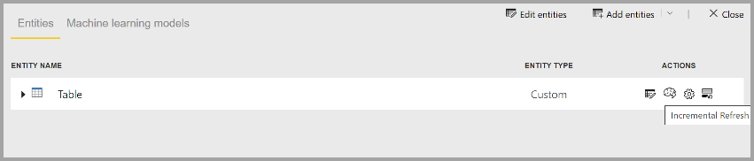

# Функции потоков данных уровня "Премиум"

Потоки данных поддерживаются для пользователей Power BI Pro и Power BI Premium. Некоторые возможности доступны только по подписке Power BI Premium. В этой статье приводится описание и сведения об использовании возможностей, доступных только по подписке Premium. 

В Power BI Premium доступны следующие возможности:

* Расширенное ядро вычислений
* Используя режим DirectQuery
* Вычисляемые сущности
* Связанные сущности
* Добавочное обновление

Подробное описание каждой возможности приводится в следующих разделах.

## Расширенное ядро вычислений

Расширенное ядро вычислений в Power BI позволяет подписчикам Power BI Premium использовать имеющуюся емкость для оптимизации использования потоков данных. Расширенное ядро вычислений обеспечивает следующие преимущества.

* Значительно сокращает время обновления, необходимое для длительных действий ETL по сравнению с вычисленными сущностями, например выполнение *соединений*, *определения различий*, *применения фильтров,* и *группирования*
* Выполнение запросов DirectQuery по сущностям

Включение расширенного ядра вычислений описано далее. Кроме того, вы можете ознакомиться с ответами на часто задаваемые вопросы по теме.

### Использование расширенного ядра вычислений

Расширенное ядро вычислений включается на странице **Параметры емкости** в службе Power BI в разделе **Потоки данных**. По умолчанию расширенное ядро вычислений **отключено**. Чтобы включить его, установите переключатель в положение **Вкл.** , как показано на следующем рисунке, и сохраните настройки. 

> [!IMPORTANT]
> Расширенное ядро вычислений работает только с емкостями Power BI уровня A3 и выше.

После включения расширенного ядра вычислений вернитесь к **потокам данных**, и вы увидите повышение производительности в любой вычисленной сущности, которая выполняет сложные операции, такие как операции *соединения* или *группирования* потоков данных, созданных из существующих связанных объектов в той же емкости. 

Чтобы обеспечить оптимальное использование ядра вычислений, разделите этап ETL на два отдельных потока данных следующим образом.

* **Поток данных 1** — этот поток должен принимать только все необходимые данные из источника и помещать их в Поток данных 2.
* **Поток данных 2** — выполнение всех операций ETL в этом втором потоке данных, однако следует убедиться в том, что вы ссылаетесь на Поток данных 1, который должен находиться в той же емкости. Кроме того, перед выполнением каких-либо других операций необходимо выполнить операции, которые вычисляются сначала (применение фильтра, группировка, определение различий, соединение), чтобы обеспечить использование ядра вычислений.

### Общие вопросы и ответы

**Вопрос.** После включения расширенного ядра вычислений обновления стали выполняться медленнее. Почему?

**Ответ.** Существует два возможных объяснения снижения времени обновления после включения расширенного ядра вычислений.

 * Если расширенное ядро вычислений включено, для его правильной работы требуется некоторый объем памяти. Таким образом, объем памяти, доступной для выполнения обновления, уменьшается, и, следовательно, повышается вероятность того, что обновления помещаются в очередь, что, в свою очередь, сокращает число потоков данных, которые могут обновляться одновременно. Чтобы устранить это, при включении расширенного ядра вычислений увеличьте объем памяти, выделенной для потоков данных, чтобы объем памяти, доступной для параллельного обновления потоков данных, оставался неизменным.

 * Другая причина, приводящая к замедлению обновлений, заключается в том, что ядро вычислений работает только на основе существующих сущностей. Если поток данных ссылается на источник, который не является потоком данных, улучшения не будет. Повышения производительности не будет, поскольку в некоторых сценариях обработки больших данных начальное считывание из источника данных будет выполняться медленнее, так как данные должны передаваться в расширенное ядро вычислений.  

**Вопрос.** Не отображается переключатель расширенного ядра вычислений. Почему?

**Ответ.** Выпуск расширенного ядра вычислений выполняется поэтапно для регионов по всему миру. Мы ожидаем, что поддержка будет реализована во всех регионах к концу 2020 г.

**Вопрос.** Какие типы данных поддерживаются ядром вычислений?

**Ответ.** В настоящее время расширенное ядро вычислений и потоки данных поддерживают следующие типы данных. Если поток данных не использует один из следующих типов, во время обновления возникает ошибка:

* Дата и время
* Десятичное число
* Текст
* Целое число
* Дата, время, часовой пояс
* Истина/ложь
* Дата
* Время

## Использование DirectQuery с потоками данных в Power BI (предварительная версия)

DirectQuery можно использовать для прямого подключения к потокам данных и, следовательно, для подключения непосредственно к потоку данных без необходимости импортировать данные. 

Использование DirectQuery с потоками данных обеспечивает следующие улучшения процессов Power BI и потоков данных.

* **Отсутствие необходимости в отдельных расписаниях обновления** — DirectQuery напрямую подключается к потоку данных, избавляя от необходимости создавать импортируемый набор данных. Таким образом, использование DirectQuery с потоками данных означает, что вам больше не требуются отдельные расписания обновления для потоков данных и наборов данных, чтобы обеспечить синхронизацию данных.

* **Фильтрация данных** — DirectQuery полезен для работы с отфильтрованным представлением данных внутри потока данных. Если требуется отфильтровать данные для работы с меньшим поднабором данных в потоке, можно использовать DirectQuery (и ядро вычислений) для фильтрации данных потока данных и работы с требуемым поднабором.

### Использование DirectQuery для потоков данных

Использование DirectQuery с потоками данных — это предварительная версия функции в Power BI Desktop, которая доступна, начиная с майской версии 2020 г. 

Существуют также предварительные требования для использования DirectQuery с потоками данных.

* Поток данных должен находиться в рабочей области, для которой включена Power BI Premium
* Должно быть включено **ядро вычислений**.

### Включение DirectQuery для потоков данных

Чтобы убедиться, что поток данных доступен для DirectQuery, расширенное ядро вычислений должно находиться в оптимизированном состоянии. Чтобы включить DirectQuery для потоков данных, задайте для нового параметра **Параметры расширенного ядра вычислений** значение **Включено**. На следующем рисунке показан правильно выбранный параметр.

После применения этого параметра обновите поток данных, чтобы оптимизация вступила в силу.

### Рекомендации и ограничения для DirectQuery

Существует несколько известных ограничений для DirectQuery и потоков данных.

* Пока данная функция доступна в предварительной версии, некоторые клиенты могут столкнуться с задержками или снижением производительности при использовании DirectQuery с потоками данных. Такие проблемы активно устраняются в течение этого периода предварительной версии.

* Составные и смешанные модели с источниками данных импорта и DirectQuery в настоящее время не поддерживаются.

* Большие потоки данных могут создавать проблемы с истечением времени ожидания при просмотре визуализаций. Для больших потоков данных, вызывающих истечение времени ожидания, следует использовать режим импорта.

* При использовании DirectQuery в параметрах источника данных для соединителя потока данных будут отображаться недопустимые учетные данные. Это не мешает набору данных работать правильно. 

## Вычисляемые сущности

Вы можете выполнять **вычисления в хранилище** при использовании **потоков данных** в подписке Power BI Premium. Это позволяет выполнять вычисления для существующих потоков данных и возвращать результаты, чтобы сосредоточиться на создании отчетов и аналитики.

Чтобы выполнять вычисления в хранилище, сначала необходимо создать поток данных и перенести данные в хранилище этого потока данных в Power BI. Создав поток данных и наполнив его данными, вы можете создать вычисляемые сущности, т. е. сущности, которые производят вычисления в хранилище.

### Рекомендации и ограничения для вычисляемых сущностей

* При работе с потоками данных, созданными в учетной записи организации в Azure Data Lake Storage 2-го поколения, связанные сущности и вычисляемые сущности работают правильно, только если сущности находятся в одной учетной записи. 

При выполнении вычислений с использованием объединенных локальных и облачных данных рекомендуется создать поток данных для каждого источника (один для локального и один для облачного), а затем создать третий поток данных для объединения этих двух источников или выполнения вычислений с ними.

## Связанные сущности

На существующие потоки данных, используемые с подпиской Power BI Premium, можно ссылаться, что позволяет либо выполнять вычисления с этими сущностями с помощью вычисляемых сущностей, либо создать единую таблицу достоверных данных для многократного использования с несколькими потоками данных.

## Добавочное обновление

Чтобы не запрашивать все данные при каждом обновлении, для потоков данных можно настроить добавочное обновление. Для этого выберите поток данных и щелкните значок добавочного обновления.

При настройке добавочного обновления в поток данных добавляются параметры для указания диапазона дат. Подробные сведения о настройке добавочного обновления см. в статье о [добавочном обновлении](https://docs.microsoft.com/power-query/dataflows/incremental-refresh).

### Когда не следует задавать добавочное обновление

Не задавайте добавочное обновление для потока данных в следующих ситуациях.

* Связанные сущности не должны использовать добавочное обновление, если они ссылаются на поток данных. Потоки данных не поддерживают свертывание запросов (даже если сущность поддерживает DirectQuery). 
* Наборы данных, ссылающиеся на потоки данных, не должны использовать добавочное обновление. Обновления для потоков данных обычно выполняются нормально. Если применение обновлений занимает больше времени, чем ожидалось, рекомендуется использовать ядро вычислений и режим DirectQuery.

## Дальнейшие действия
Дополнительные сведения о потоках данных и Power BI вы можете получить в следующих статьях.

* [Вводные сведения о потоках данных и самостоятельной подготовке данных](dataflows-introduction-self-service.md)
* [Создание потока данных](dataflows-create.md)
* [Настройка и использование потока данных](dataflows-configure-consume.md)
* [Настройка хранилища потоков данных для использования Azure Data Lake 2-го поколения](dataflows-azure-data-lake-storage-integration.md)
* [ИИ с потоками данных](dataflows-machine-learning-integration.md)
* [Рекомендации и ограничения, касающиеся потоков данных](dataflows-features-limitations.md)