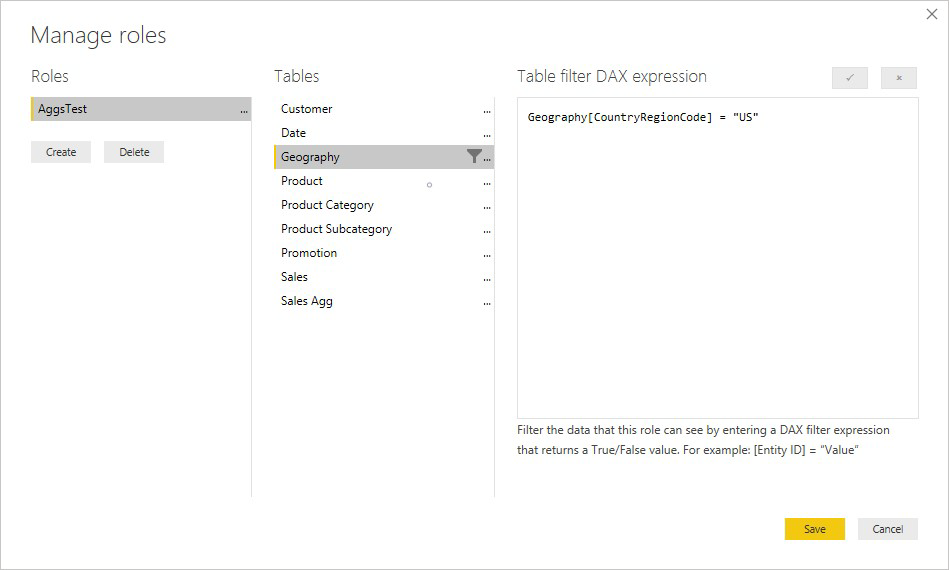
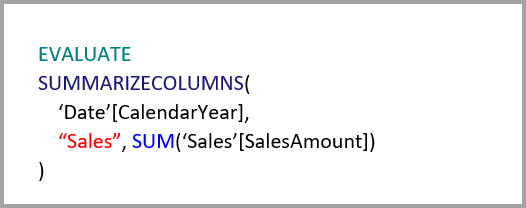

# Использование агрегатов в Power BI Desktop

*Агрегаты* в Power BI позволяют уменьшить размеры таблиц, чтобы сосредоточиться на важных данных и повысить производительность запросов. Они обеспечивают уникальные способы интерактивного анализа больших данных и могут существенно сократить затраты на раскрытие потенциала больших наборов данных для принятия решений.

Ниже перечислены некоторые преимущества использования агрегатов.

- **Повышение производительности запросов к большим данным**. При каждом взаимодействии с визуальными элементами Power BI к набору данных выполняются запросы DAX. Для кэшированных агрегированных данных требуется в разы меньше ресурсов, чем для подробных, что позволяет использовать большие данные способами, которые иначе были бы недоступны.
- **Оптимизация обновления данных**. Благодаря сокращению размера кэша ускоряется обновление, поэтому пользователи быстрее получают данные.
- **Сбалансированная архитектура**. Кэш в памяти Power BI позволяет обрабатывать агрегированные запросы, что уменьшает количество запросов, отправляемых в режиме DirectQuery, и позволяет соблюдать пределы параллелизма. Оставшиеся запросы уровня детализации, как правило, являются отфильтрованными запросами на уровне транзакций. Такие запросы обычно без проблем обрабатываются хранилищами данных и системами больших данных.

Многомерные источники данных, такие как хранилища данных и киоски данных, могут использовать [агрегаты на основе связей](#aggregation-based-on-relationships). Источники больших данных на базе Hadoop часто используют [агрегаты, основанные на столбцах "группировать по"](#aggregation-based-on-groupby-columns). В этой статье описываются типичные различия моделирования в Power BI для каждого из типов источников данных.

## Создание агрегированной таблицы

Чтобы создать агрегированную таблицу, выполните указанные ниже действия.
1. Настройте новую таблицу с нужными полями в зависимости от источника данных и модели. 
1. Определите агрегаты в диалоговом окне **Управление агрегатами**.
1. Если необходимо, измените [режим хранения](#storage-modes) для агрегированной таблицы. 

### Управление агрегатами

После создания таблицы с нужными полями в области **Поля** любого представления Power BI Desktop щелкните эту таблицу правой кнопкой мыши и выберите пункт **Управление агрегатами**.

В диалоговом окне **Управление агрегатами** отображаются строки для каждого столбца в таблице, где можно указать поведение агрегирования. В приведенном ниже примере запросы к таблице подробных сведений **Sales** внутренним образом перенаправляются в агрегированную таблицу **Sales Agg**. 

В раскрывающемся меню **Сводные данные** в диалоговом окне **Управление агрегатами** содержатся перечисленные ниже значения.
- Count
- GroupBy
- Max
- Min
- Sum
- Подсчитать строки таблицы

В этом примере агрегата на основе связей записи GroupBy являются необязательными. За исключением DISTINCTCOUNT, они не влияют на поведение агрегата и в основном предназначены для удобства чтения. Без записей GroupBy агрегаты по-прежнему будут получать обращения на основе связей. Это поведение отличается от [примера больших данных](#aggregation-based-on-groupby-columns) далее в этой статье, в котором записи GroupBy обязательны.

После определения нужных агрегатов нажмите кнопку **Применить все**. 

### Проверки

В диалоговом окне **Управление агрегатами** применяются указанные ниже важные проверки.

- **Столбец сведений** должен иметь тот же тип данных, что и **столбец агрегата**, за исключением функций **формирования сводных данных** "Число" и "Подсчитать строки таблицы". Функции "Число" и "Подсчитать строки таблицы" доступны только для агрегирования целых чисел и не требуют соответствующего типа данных.
- Цепочки агрегатов, охватывающие три и более таблиц, использовать запрещено. Например, агрегаты для **таблицы A** не могут ссылаться на **таблицу B**, включающую агрегаты, ссылающиеся на **таблицу С**.
- Не допускаются повторяющиеся агрегаты, в которых две записи используют одну и ту же функцию **формирования сводных данных** и ссылаются на те же **таблицу сведений** и **столбец сведений**.
- **Таблица сведений** должна работать в режиме хранения DirectQuery, а не импорта.
- Группирование по столбцу внешнего ключа, используемому неактивной связью и основанному на функции USERELATIONSHIP для попаданий агрегатов, не поддерживается.

Большинство проверок применяется путем отключения значений в раскрывающемся списке и отображения пояснительного текста во всплывающей подсказке, как показано на рисунке ниже.

### Таблицы агрегирования скрыты

Пользователи с доступом только для чтения к набору данных не могут направлять запросы в таблицы агрегирования. Это позволяет избежать проблем с безопасностью при использовании *безопасности на уровне строк (RLS)* . Потребители и запросы ссылаются на таблицу сведений, а не на таблицу агрегирования. Им не нужно знать, что таблица агрегирования существует.

По этой причине таблицы агрегирования скрыты в представлении **отчета**. Если таблица еще не скрыта, диалоговое окно **Управление агрегатами** делает ее скрытой при нажатии кнопки **Применить все**.

### Режимы хранения
Функция агрегатов работает с режимами хранения на уровне таблицы. Таблицы Power BI могут использовать режимы хранения *DirectQuery*, *импорта* или *двойной*. В режиме DirectQuery сервер запрашивается напрямую, а в режиме импорта данные кэшируются в памяти и запросы выполняются к кэшированным данным. Все источники импорта Power BI и источники DirectQuery (не многомерные) могут работать с агрегатами. 

Чтобы установить для агрегированной таблицы режим хранения "Импорт" с целью ускорения запросов, выберите агрегированную таблицу в представлении **Модель** в Power BI Desktop. В области **Свойства** разверните раздел **Дополнительно** и в раскрывающемся списке **Режим хранения** выберите пункт **Импорт**. Имейте в виду, что это действие необратимо. 

Дополнительные сведения о режимах хранения таблиц см. в статье [Управление режимом хранения в Power BI Desktop](desktop-storage-mode.md).

### RLS для агрегатов

В выражениях RLS для правильной работы с агрегатами нужно фильтровать как таблицу агрегирования, так и таблицу сведений. 

В приведенном ниже примере выражение RLS в таблице **Geography** будет работать для агрегатов, так как Geography находится на стороне фильтрации связей с обеими таблицами: **Sales** и **Sales Agg**. Безопасность RLS будет успешно применена к запросам, которые попадают и не попадают в таблицу агрегирования.

Выражение RLS в таблице **Product** фильтрует только таблицу сведений **Sales**, но не агрегированную таблицу **Sales Agg**. Так как таблица агрегирования является другим представлением данных в таблице сведений, было бы небезопасно отвечать на запросы из таблицы агрегирования, если применить фильтр RLS было бы невозможно. Фильтровать только таблицу сведений не рекомендуется, так как запросы пользователей с этой ролью не будут использовать преимущества попаданий агрегатов. 

Выражение RLS, которое фильтрует только таблицу агрегирования **Sales Agg**, но не таблицу сведений **Sales**, недопустимо.

В случае с [агрегатами, основанными на столбцах "группировать по"](#aggregation-based-on-groupby-columns), выражение RLS, применяемое к таблице сведений, можно использовать для фильтрации таблицы агрегирования, так как все столбцы "группировать по" в таблице агрегирования учтены в таблице сведений. С другой стороны, фильтр RLS в таблице агрегирования невозможно применить к таблице сведений, поэтому это запрещено.

## Агрегат, основанный на связях

В многомерных моделях обычно используются *агрегаты, основанные на связях*. Наборы данных Power BI из хранилищ данных и киосков данных напоминают схемы типа "звезда" или "снежинка" со связями между таблицами измерений и таблицами фактов.

В представленной ниже модели из одного источника данных таблицы используют режим хранения DirectQuery. Таблица фактов **Sales** содержит миллиарды строк. Указание режима хранения "Импорт" для таблицы **Sales** для кэширования существенно повышает затраты на управление и память.

Вместо этого следует создать таблицу агрегирования **Sales Agg**. В таблице **Sales Agg** число строк равно сумме в столбце **SalesAmount**, сгруппированном по **CustomerKey**, **DateKey** и **ProductSubcategoryKey**. Для таблицы **Sales Agg** характерна более высокая степень детализации, чем для таблицы **Sales**, поэтому вместо миллиардов в ней могут быть миллионы строк, что гораздо проще для обработки.

Если приведенные ниже таблицы измерений чаще всего используются для запросов с высокой ценностью для бизнеса, они могут фильтровать **Sales Agg** с помощью связи *один ко многим* или *многие к одному*.

- Географический регион
- Customer
- Date
- Подкатегория продукта
- Категория продуктов

Эта модель показана на следующем рисунке.

В следующей таблице показаны агрегаты для таблицы **Sales Agg**.

> [!NOTE]
> Таблицу **Sales Agg**, как и любую другую, можно загружать различными способами. Агрегирование можно выполнить в базе данных-источнике с помощью процессов ETL/ELT или [M-выражения](/powerquery-m/power-query-m-function-reference) для таблицы. Для агрегированной таблицы может использоваться режим хранения "Импорт" с [добавочным обновлением в Power BI Premium](../admin/service-premium-incremental-refresh.md) или без него или режим DirectQuery и оптимизация для быстрого выполнения запросов с помощью [индексов columnstore](/sql/relational-databases/indexes/columnstore-indexes-overview). Такая гибкость обеспечивает сбалансированную архитектуру, которая может распределять нагрузку запросов во избежание узких мест.

Если для агрегированной таблицы **Sales Agg** изменить режим хранения на **Импорт**, появится диалоговое окно с сообщением о том, что для связанных таблиц измерений может быть задан режим хранения *Двойной*. 

Установка режима "Двойной" для связанных таблиц измерений позволяет им работать в режиме импорта или DirectQuery в зависимости от вложенного запроса. Ознакомьтесь со следующим примером:

- Запросы, которые объединяют метрики из таблицы **Sales Agg**, работающей в режиме импорта, и выполняют группирование по атрибутам из связанных таблиц в режиме "Двойной", могут возвращать результаты из кэша в памяти.
- Запросы, которые объединяют метрики из таблицы **Sales**, работающей в режиме DirectQuery, и выполняют группирование по атрибутам из связанных таблиц в режиме "Двойной", могут возвращать результаты в режиме DirectQuery. Логика запросов, включая операцию "группировать по", передается в базу данных-источник.

Дополнительные сведения о режиме хранения "Двойной" см. в статье [Управление режимом хранения в Power BI Desktop](desktop-storage-mode.md).

### Обычные и ограниченные связи

Для обращения к агрегату, основанному на связях, требуются обычные связи.

Обычные связи включают перечисленные ниже сочетания режимов хранения, где обе таблицы принадлежат к одному источнику.

| Таблица на стороне *многие* | Таблица на стороне *одного* |
| ------------- |----------------------| 
| Двойной режим          | Двойной режим                 | 
| Импортировать        | Импорт или двойной режим       | 
| DirectQuery   | DirectQuery или двойной режим  | 

Единственный случай, когда связь *между источниками* считается обычной, — когда для обеих таблиц установлен режим импорта. Связи "многие ко многим" всегда считаются ограниченными.

Сведения об обращении к агрегатам *между источниками*, которые не зависят от связей, см. в разделе [Агрегаты, основанные на столбцах группирования](#aggregation-based-on-groupby-columns). 

### Примеры запросов к агрегатам на основе связей

Следующий запрос обращается к агрегату, так как столбцы в таблице **Date** находятся на том уровне детализации, который может обратиться к агрегату. Для столбца **SalesAmount** используется агрегат **Sum**.

Следующий запрос не достигнет агрегата. Хотя запрос выполняется для получения суммы **SalesAmount**, он выполняет операцию группирования по столбцу в таблице **Product**, но степень ее детализации не позволяет обращаться к агрегату. Если в модели выполняются связи, подкатегория продукта может иметь несколько строк **Product**. При этом запрос не сможет определить, по какому продукту следует выполнять агрегирование. В этом случае запрос возвращается в режим DirectQuery и отправляет запрос SQL в источник данных.

Агрегаты — это не просто вычисления для подсчета суммы. Они могут также быть удобны для сложных вычислений. По сути, сложное вычисление разделяется на вложенные запросы для каждой функции SUM, MIN, MAX и COUNT, и каждый вложенный запрос вычисляется для определения возможности обращения к агрегату. Эта логика не соблюдается во всех случаях из-за оптимизации плана запроса, но в целом она должна применяться. Следующий пример запроса достигнет агрегата:

Агрегаты можно использовать для функции COUNTROWS. Приведенный ниже запрос обращается к агрегату, так как для таблицы **Sales** определен агрегат **Подсчитать строки таблицы**.

Агрегаты можно использовать для функции AVERAGE. Следующий запрос достигнет агрегата, так как результат AVERAGE внутренним образом рассчитывается как сумма (SUM), деленная на количество (COUNT). Так как столбец **UnitPrice** включает агрегаты, определенные для SUM и COUNT, агрегирование выполняется.

В некоторых случаях агрегаты можно использовать для функции DISTINCTCOUNT. Следующий запрос достигнет агрегата, так как существует запись GroupBy для **CustomerKey**, что обеспечивает различие **CustomerKey** в таблице агрегирования. Однако при использовании этого метода может быть достигнуто пороговое значение производительности: около 2–5 миллионов уникальных значений могут повлиять на производительность запросов. Тем не менее это может быть удобно в ситуациях, когда в таблице сведений содержатся миллиарды строк, но в столбце всего 2–5 миллионов уникальных значений. В этом случае функция DISTINCTCOUNT может выполняться быстрее, чем проверка таблицы с миллиардами строк, даже если они содержатся в кэше в памяти.

Функции логики операций со временем DAX поддерживают агрегирование. Следующий запрос использует агрегирование, так как функция DATESYTD создает таблицу значений**CalendarDay**, а таблица агрегирования находится на уровне детализации столбцов группировки таблицы **Даты**. Это пример возвращающего табличное значение фильтра функции CALCULATE, который может работать с агрегатами.

## Агрегаты, основанные на столбцах группирования 

Характеристики моделей больших данных на базе Hadoop отличаются от многомерных моделей. Во избежание объединений между большими таблицами в таких моделях часто не используют связи. Вместо этого атрибуты измерений денормализуются до таблиц фактов. Модели больших данных можно использовать для интерактивного анализа, прибегнув к *агрегатам, основанным на столбцах "группировать по"* .

В следующей таблице содержится числовой столбец **Movement** для агрегирования. Все остальные столбцы являются атрибутами для группирования. Таблица содержит данные Интернета вещей и значительное количество строк. Режимом хранения является DirectQuery. Запросы в источнике данных, выполняющие агрегирование по всему набору данных, выполняются медленно из-за огромного объема. 

Чтобы обеспечить интерактивный анализ на основе этого набора данных, можно добавить таблицу агрегирования, выполняющую группировку по большинству атрибутов, но исключающую атрибуты с высокой кратностью, такие как широта и долгота. Это значительно уменьшает количество строк, и таблица становиться достаточно небольшой для помещения в кэш в памяти. 

Сопоставления агрегатов для таблицы **Driver Activity Agg** определяются в диалоговом окне **Управление агрегатами**. 

В агрегатах, основанных на столбцах "группировать по", записи **GroupBy** являются обязательными. Без них не получится обратиться к агрегатам. Это поведение отличается от использования агрегатов на основе связей, в которых записи GroupBy являются необязательными.

В следующей таблице показаны агрегаты для таблицы **Driver Activity Agg**.

Для таблицы **Driver Activity Agg** можно установить режим хранения "Импорт".

### Пример запроса к агрегату GroupBy

Приведенный ниже запрос достигнет агрегата, так как столбец **Activity Date** охватывается таблицей агрегирования. Функция COUNTROWS использует агрегат **Подсчитать строки таблицы**.

Для моделей, которые содержат атрибуты фильтра в таблицах фактов, особенно рекомендуется использовать агрегаты **Подсчитать строки таблицы**. Power BI может отправлять запросы к набору данных с помощью COUNTROWS в случаях, когда нет явного запроса пользователя. Например, в диалоговом окне фильтра отображается число строк для каждого значения.

## Сочетание методов агрегирования

В агрегатах можно сочетать связи и столбцы "группировать по". Для агрегатов на основе связей может потребоваться разделить денормализованные таблицы измерений на несколько таблиц. Если это затратно или нецелесообразно для определенных таблиц измерений, необходимые атрибуты можно реплицировать в таблице агрегирования для этих измерений и использовать связи для остальных.

Например, приведенная ниже модель реплицирует **Month**, **Quarter**, **Semester** и **Year** в таблице **Sales Agg**. Между таблицами **Sales Agg** и **Date** связи нет, но с **Customer** и **Product Subcategory** связи существуют. Режим хранения **Sales Agg** — импорт.

В следующей таблице показаны записи, заданные в диалоговом окне **Управление агрегированием** для таблицы **Sales Agg**. Записи GroupBy, где **Date** является таблицей сведений, обязательны для обращения к агрегатам для запросов, которые выполняют группирование по атрибутам **Date**. Как и в предыдущем примере, записи **GroupBy** для **CustomerKey** и **ProductSubcategoryKey** не влияют на обращения к агрегатам (за исключением DISTINCTCOUNT) из-за наличия связей.

### Примеры запросов к комбинированным агрегатам

Приведенный ниже запрос достигает агрегата, так как столбец **CalendarMonth** охватывается таблицей агрегирования, а столбец **CategoryName** доступен через связи "один ко многим". Для столбца **SalesAmount** используется агрегат **SUM**.

Приведенный ниже запрос не достигнет агрегата, так как столбец **CalendarDay** не охватывается таблицей агрегирования.

Приведенный ниже запрос логики операций со временем не достигнет агрегата, так как функция DATESYTD создает таблицу со значениями из столбца **CalendarDay**, но таблица агрегирования не охватывает **CalendarDay**.

## Приоритет агрегирования

Приоритет агрегирования позволяет учитывать несколько таблиц агрегирования в одном вложенном запросе.

Ниже приведен пример [составной модели](desktop-composite-models.md), содержащей несколько источников.

- Таблица **Driver Activity**, работающая в режиме DirectQuery, содержит более триллиона строк данных Интернета вещей, полученных из системы больших данных. Она обслуживает запросы детализации для просмотра отдельных показаний Интернета вещей в управляемом контексте фильтров.
- Таблица **Driver Activity Agg** — промежуточная таблица агрегирования в режиме DirectQuery. Она содержит более миллиарда строк в Хранилище данных SQL Azure и оптимизирована в источнике с помощью индексов columnstore.
- Для таблицы **Driver Activity Agg2**, работающей в режиме импорта, характерен высокий уровень детализации, так как она содержит немного атрибутов "группировать по" с низкой кратностью. Количество строк может ограничиваться тысячами, поэтому она легко помещается в кэш в памяти. Эти атрибуты используются важной панелью мониторинга для руководителей, поэтому запросы, ссылающиеся на них, должны выполняться с максимально возможной скоростью.

> [!NOTE]
> Таблицы агрегирования DirectQuery, использующие другой источник данных для таблицы сведений, поддерживаются только в том случае, если таблица агрегирования получена из источника SQL Server, SQL Azure или Хранилища данных SQL Azure.

Объем памяти для этой модели относительно небольшой, но она дает доступ к возможностям огромного набора данных. Эта модель представляет сбалансированную архитектуру, так как распределяет нагрузку запросов по нескольким компонентам архитектуры, используя их в зависимости от сильных сторон.

В диалоговом окне **Управление агрегатами** для таблицы **Driver Activity Agg2** в поле **Приоритет** установлено значение *10*. Это значение больше, чем у таблицы **Driver Activity Agg**. Более высокое значение приоритета означает, что таблица **Driver Activity Agg2** будет первой рассматриваться запросами, использующими агрегаты. Вложенные запросы, которые находятся не на том уровне детализации, на который может отвечать **Driver Activity Agg2**, будут обращаться к таблице **Driver Activity Agg**. Подробные запросы, на которые нельзя ответить по любой из таблиц агрегирования, будут направляться в таблицу **Driver Activity**.

Таблица, указанная в столбце **Detail Table**, — **Driver Activity**, а не **Driver Activity Agg**, так как цепочки агрегатов запрещены.

В следующей таблице показаны агрегаты для таблицы **Driver Activity Agg2**.

## Определение того, обращаются ли запросы к агрегатам

SQL Profiler может определять, возвращаются ли запросы из кэша в памяти (подсистема хранилища) или отправляются в источник данных в режиме DirectQuery. Этот процесс также можно использовать для обнаружения обращения к агрегатам. Дополнительные сведения см. в разделе [Запросы, попадающие или не попадающие в кэш](desktop-storage-mode.md#queries-that-hit-or-miss-the-cache). 

SQL Profiler также предоставляет расширенное событие `Query Processing\Aggregate Table Rewrite Query`.

В следующем фрагменте JSON показан пример выходных данных события при использовании агрегирования.

- **matchingResult** показывает, что вложенный запрос использовал агрегат.
- **dataRequest** показывает столбцы "группировать по" и агрегированные столбцы, которые использовались вложенным запросом.
- **mapping** показывает столбцы в таблице агрегирования, с которыми выполнялось сопоставление.

## Синхронизация кэшей

Агрегаты, сочетающие режимы хранения DirectQuery, импорта и двойной режим, могут возвращать разные данные, если кэш в памяти не синхронизируется с исходными данными. Например, при выполнении запроса не будет произведена попытка скрыть проблемы с данными путем фильтрации результатов DirectQuery, соответствующих кэшированным значениям. При необходимости можно воспользоваться установленными методами обработки таких проблем на стороне источника. Оптимизации производительности следует использовать только способами, которые не влияют на возможность выполнения бизнес-требований. Ответственность за знание потоков данных в организации и правильное проектирование лежит на вас. 

## Дальнейшие действия

Дополнительные сведения о составных моделях см. в следующих статьях.

- [Использование составных моделей в Power BI Desktop](desktop-composite-models.md)
- [Применение связей "многие ко многим" в Power BI Desktop](desktop-many-to-many-relationships.md)
- [Управление режимом хранения в Power BI Desktop](desktop-storage-mode.md)

Дополнительные сведения о DirectQuery см. в следующих статьях.

- [Использование DirectQuery в Power BI](../connect-data/desktop-directquery-about.md)
- [Источники данных Power BI](../connect-data/power-bi-data-sources.md)
