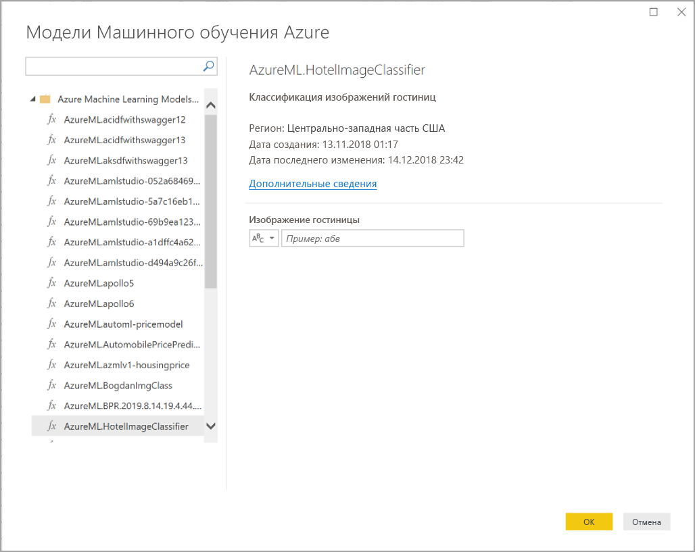

# Использование Аналитики ИИ в Power BI Desktop

В Power BI можно использовать Аналитику ИИ для получения доступа к набору предварительно обученных моделей машинного обучения, повышающих эффективность подготовки данных. Доступ к компоненту "Аналитика ИИ" осуществляется в **редакторе Power Query**, а связанные с ним функции доступны через вкладки **Главная** и **Добавление столбца** в **редакторе Power Query**. 

В этой статье рассматриваются функции Анализа текста и Компьютерного зрения Azure Cognitive Services. Здесь также описаны пользовательские функции, доступные в Power BI из Машинного обучения Azure.

## Включение Аналитики ИИ

Аналитика ИИ стала общедоступной с выпуском Power BI Desktop за июнь 2020 г. В более ранних версиях Power BI Desktop Аналитику ИИ в Power BI нужно включить следующим образом: выберите **File > Options and settings > Options** (Файл > Параметры и настройки > Параметры), а затем **Предварительные версии функций** в левом столбце. В правой панели находится пункт **Обозреватель функций Аналитики ИИ**. Установите флажок рядом с пунктом **Обозреватель функций Аналитики ИИ**, чтобы включить предварительную версию функции. Чтобы изменения предварительной версии функции вступили в силу, необходимо перезапустить Power BI Desktop.

> [!NOTE]
> Аналитика ИИ общедоступна для всех версий Power BI Desktop начиная с выпуска за июнь 2020 г.,поэтому для таких версий ее не нужно включать как предварительную версию функции.

## Использование Анализа текста и Компьютерного зрения

С помощью Анализа текста и Компьютерного зрения в Power BI можно применить различные алгоритмы из [Azure Cognitive Services](https://azure.microsoft.com/services/cognitive-services/), чтобы обогатить данные в Power Query.

В настоящее время поддерживаются следующие службы:

* [анализ тональности](https://docs.microsoft.com/azure/cognitive-services/text-analytics/how-tos/text-analytics-how-to-sentiment-analysis);
* [извлечение ключевых фраз](https://docs.microsoft.com/azure/cognitive-services/text-analytics/how-tos/text-analytics-how-to-keyword-extraction);
* [распознавание языка](https://docs.microsoft.com/azure/cognitive-services/text-analytics/how-tos/text-analytics-how-to-language-detection);
* [добавление тегов к изображениям](https://docs.microsoft.com/azure/cognitive-services/computer-vision/concept-tagging-images). 

Преобразования выполняются в службе Power BI, для чего не требуется подписка на Azure Cognitive Services. 

> [!IMPORTANT]
> 
> Для использования функций Анализа текста или Компьютерного зрения требуется Power BI Premium.

### Включение Анализа текста и Компьютерного зрения для емкости уровня "Премиум"

Поддержка Cognitive Services обеспечивается такими узлами емкости Premium, как EM2, A2 или P1 и более производительными. В емкости используется отдельная рабочая нагрузка искусственного интеллекта для запуска Cognitive Services. На этапе общедоступной предварительной версии этих функций (до июня 2019 г.) эта рабочая нагрузка была по умолчанию отключена. Прежде чем использовать Cognitive Services в Power BI, необходимо включить рабочую нагрузку искусственного интеллекта в **настройках емкости** на портале администрирования. Включить **рабочую нагрузку искусственного интеллекта** можно в разделе **рабочих нагрузок**. При этом необходимо задать максимальный объем памяти для нее. Рекомендуется выделять для нее не более 20 %. Превышение этого объема приведет к замедлению обработки запросов.

### Доступные функции

В этом разделе описаны функции, доступные в Cognitive Services в Power BI.

#### Определение языка

Функция определения языка оценивает введенный текст и для каждого поля возвращает название языка и его код ISO. Эту функция удобно использовать для столбцов данных с произвольным текстом, язык которого неизвестен. Входные данные функции должны быть в текстовом формате.

API анализа текста распознает до 120 языков. Дополнительные сведения см. в статье [Поддержка языков и регионов в API анализа текста](https://docs.microsoft.com/azure/cognitive-services/text-analytics/text-analytics-supported-languages).

#### Извлечение ключевых фраз

Функция **Извлечь ключевые фразы** оценивает неструктурированный текст и для каждого текстового поля возвращает список ключевых фраз. В качестве входных данных для функции требуется текстовое поле. Она принимает необязательные входные данные **языка и региональных параметров**.

Извлечение ключевых фраз лучше всего работает с большими фрагментами текста. тогда как анализ тональности более эффективен при использовании небольших фрагментов текста. Для получения наилучших результатов обеих операций советуем реструктуризировать входные данные соответствующим образом.

#### Оценка тональности

Функция **Score Sentiment** (Оценка тональности) оценивает введенный текст и возвращает оценку тональности для каждого документа в диапазоне от 0 (негативная) до 1 (позитивная). Эта функция полезна при определении положительных и отрицательных мнений в социальных сетях, отзывах клиентов и на форумах.

API анализа текста использует алгоритм машинного обучения классификации для оценки тональности в диапазоне от 0 до 1. Близкие к 1 оценки указывают на положительную тональность, а близкие к 0 — наоборот. Модель предварительно обучена с использованием большого массива текста с различными тональностями. Сейчас модель нельзя обучить на своих данных. В ходе анализа модель использует ряд методов — обработку текста, анализ частей речи, упорядочивание слов и создание словесных ассоциаций. Дополнительные сведения об этом алгоритме см. в [обзорной статье об API анализа текста](https://blogs.technet.microsoft.com/machinelearning/2015/04/08/introducing-text-analytics-in-the-azure-ml-marketplace/).

Анализ тональности выполняется над всеми входными данными, в отличие от извлечения тональности в отношении конкретной сущности в тексте. Как подтверждает практика, точность оценки повышается, когда документ содержит одно или два предложения, а не большие блоки текста. В ходе оценки объективности модель определяет, является ли заданный текст описательным или он содержит тональности. Над описательным по большей части текстом анализ тональности не выполняется. Он получает оценку 0,50 и больше не обрабатывается. На следующем этапе тексту, который далее обрабатывается в конвейере, присваивается оценка выше или ниже 0,50 в зависимости от обнаруженной тональности.

API анализа тональности сейчас поддерживает английский, немецкий, испанский и французский языки. Другие языки находятся на этапе предварительной версии. Дополнительные сведения см. в статье [Поддержка языков и регионов в API анализа текста](https://docs.microsoft.com/azure/cognitive-services/text-analytics/text-analytics-supported-languages).

#### Добавление тегов к изображениям

Функция **добавления тегов к изображениям** позволяет добавлять теги к более чем двум тысячам распознаваемых объектов, живых существ, пейзажей и действий. Если возникает неопределенность с добавлением тега, в выходных данных можно *разъяснить* смысл тега в используемом контексте. Теги не упорядочены по таксономии и не существуют в иерархиях наследования. Коллекция тегов содержимого является основой для *описания* отображаемого изображения на естественном языке, изложенном в предложениях.

После загрузки изображения или указав его URL-адрес, алгоритмы компьютерного зрения выводят теги, в зависимости от объектов, живых существ и действий, указанных на изображении. Теги добавляются не только к основному субъекту, например человеку на переднем плане, но и к окружению (интерьеру или экстерьеру), например предметам мебели, инструментам, растениям, животным, аксессуарам, устройствам и т. д.

Для работы этой функции в качестве входных данных требуется наличие URL-адреса изображения или текст в формате Base-64. Сейчас функция добавления тегов к изображениям поддерживает английский, испанский, японский, португальский и упрощенный китайский язык. Дополнительные сведения см. в статье [Поддержка языков и регионов в API анализа текста](https://docs.microsoft.com/rest/api/cognitiveservices/computervision/tagimage/tagimage#uri-parameters).

### Вызов функций Анализа текста или Компьютерного зрения в Power Query

Чтобы расширить свои данные с помощью функций Анализа текста или Компьютерного зрения, откройте **редактор Power Query**. В этом примере рассматривается оценка тональности текста. Те же действия можно выполнить для извлечения ключевых фраз, определения языка и добавления тегов к изображениям.

Нажмите кнопку **Анализ текста** на ленте **Главная** или **Добавление столбца**. Вам будет предложено выполнить вход.

После входа во всплывающем окне выберите функцию, которую необходимо использовать, и столбец данных, который необходимо преобразовать.

Power BI выбирает емкость Premium для запуска функции и отправляет результаты обратно в Power BI Desktop. Выбранная емкость используется только для функций Анализа текста и Компьютерного зрения во время работы и обновлений в Power BI Desktop. После публикации отчета обновления выполняются в емкости Premium рабочей области, в которой публикуется отчет. Вы можете изменить емкость, используемую для всех Cognitive Services, в раскрывающемся списке в левом нижнем углу всплывающего окна.

**Cultureinfo** — это необязательные входные данные для определения языка текста. Это поле является кодом ISO. В качестве входных данных для Cultureinfo можно задать текст столбца или выбрать значение самостоятельно. В этом примере для всего столбца задан английский язык (en). Если оставить это поле пустым, Power BI автоматически определит язык перед применением функции. Затем нажмите кнопку **Применить**.

При первом использовании Аналитики ИИ в новом источнике данных вам будет предложено задать уровень конфиденциальности данных.

> [!NOTE]
> Обновление набора данных в Power BI будет работать только для источников данных, для которых установлен уровень конфиденциальности "Общедоступный" или "Корпоративный".

После вызова функции результат добавляется в таблицу в новом столбце. Преобразование также отображается как примененный шаг в запросе.

В случае добавления тегов к изображениям и извлечения ключевых фраз результаты могут возвращать несколько значений. Каждый отдельный результат возвращается в дубликате исходной строки.

### Публикация отчета с помощью функций Анализа текста или Компьютерного зрения

При редактировании в Power Query и выполнении обновлений в Power BI Desktop Анализ текста и Компьютерное зрение используют емкость Premium, выбранную в редакторе Power Query. После публикации отчета в Power BI для него используется емкость Premium рабочей области, в которой он был опубликован.

Отчеты с примененными функциями Анализа текста и Компьютерного зрения должны быть опубликованы в рабочей области, которая не находится в емкости Premium, в противном случае обновление набора данных завершится ошибкой.

### Управление влиянием на емкость Premium

В следующих разделах описывается, как можно управлять влиянием Анализа текста и Компьютерного зрения на емкость.

#### Выбор емкости

Авторы отчетов могут выбрать емкость Premium, на которой будет выполняться Аналитика ИИ. По умолчанию Power BI выбирает первую созданную емкость, к которой у пользователя есть доступ.

#### Мониторинг с помощью приложения метрик емкости

Владельцы емкости Premium могут отслеживать влияние функций Анализа текста и Компьютерного зрения на емкость с помощью [приложения метрик емкости Power BI Premium](../admin/service-admin-premium-monitor-capacity.md). Приложение предоставляет подробные метрики о работоспособности рабочих нагрузок ИИ в пределах емкости. На верхней диаграмме показано использование памяти рабочими нагрузками искусственного интеллекта. Администраторы емкости Premium могут устанавливать ограничение памяти для рабочей нагрузки ИИ на каждую емкость. Если использование памяти достигает предела памяти, можно увеличить предельный объем памяти или переместить некоторые рабочие области в другую емкость.

### Сравнение Power Query и Power Query Online

Функции Анализа текста и Компьютерного зрения, используемые в Power Query и Power Query Online, одинаковы. Ниже перечислены единственные различия между интерфейсами:

* Power Query содержит отдельные кнопки для Анализа текста, Компьютерного зрения и Машинного обучения Azure. В Power Query Online они объединяются в одном меню.
* В Power Query автор отчета может выбрать емкость Premium, которая будет использоваться для выполнения функций. Это не требуется в Power Query Online, так как поток данных уже находится в определенной емкости.

### Рекомендации и ограничения для Анализа текста

При использовании Анализа текста необходимо учитывать несколько рекомендаций и ограничений.

* Добавочное обновление поддерживается, но может вызвать проблемы с производительностью при использовании в запросах с примененной Аналитикой ИИ.
* Direct Query не поддерживается.

## Использование Машинного обучения Azure

Модели **машинного обучения** используются множеством организаций для получения аналитики и создания прогнозов, связанных с развитием бизнеса. Возможность визуализировать и использовать данные, полученные из этих моделей, в своих отчетах, на панелях мониторинга и в других средствах аналитики позволяет распространять эти сведения среди бизнес-пользователей, которые больше в них всего нуждаются. Power BI позволяет легко внедрять аналитические сведения, полученные из размещенных в службе "Машинное обучение Azure" моделей, с помощью простых интерактивных жестов.

Чтобы использовать эту возможность, специалист по анализу и обработке данных может просто предоставить бизнес-аналитику доступ к модели Azure ML с помощью портала Azure. В начале каждого сеанса Power Query обнаруживает все модели Azure ML, к которым у пользователя есть доступ, и представляет их в виде динамических функций Power Query. После этого пользователь может вызывать эти функции на ленте в редакторе Power Query или непосредственно с помощью функции M. Power BI также автоматически объединяет запросы на доступ при вызове модели Azure ML для набора строк, чтобы улучшить производительность.

Эта функция поддерживается в Power BI Desktop, потоках данных Power BI и Power Query Online в службе Power BI.

См. дополнительные сведения о потоках данных в руководстве по [самостоятельной подготовке данных в Power BI](service-dataflows-overview.md).

Дополнительные сведения о Машинном обучении Azure см. в следующих статьях:

- Общие сведения. [Что такое Машинное обучение Azure?](https://docs.microsoft.com/azure/machine-learning/service/overview-what-is-azure-ml)
- Краткие руководства и руководства по использованию Машинного обучения Azure: [Документация по Службе машинного обучения Azure](https://docs.microsoft.com/azure/machine-learning/)

### Предоставление доступа к модели Машинного обучения Azure

Чтобы получить доступ к модели Azure ML из Power BI, у пользователя должен быть **доступ на чтение** к подписке Azure. Кроме того, они должны иметь следующее:

- Для моделей Студии машинного обучения (классической) — доступ на **чтение** к веб-службе "Студия машинного обучения" (классической)
- Для моделей машинного обучения — доступ на **чтение** к рабочей области машинного обучения

В этом разделе описывается, как предоставить пользователю Power BI доступ к размещенной в службе Azure ML модели с помощью функции Power Query. См. дополнительные сведения в руководстве по [управлению доступом к ресурсам Azure с помощью RBAC и портала Azure](https://docs.microsoft.com/azure/role-based-access-control/role-assignments-portal).

1. Войдите на [портал Azure](https://portal.azure.com/).
2. Перейдите на страницу **Подписки**. Страницу **Подписки** можно найти в списке **Все службы** в меню навигации на портале Azure слева.
3. Выберите свою подписку.
4. Щелкните **Управление доступом (IAM)** , а затем нажмите кнопку **Добавить**.
5. Выберите роль **Читатель**. Выберите пользователя Power BI, которому вы хотите предоставить доступ к модели Azure ML.
6. Нажмите кнопку **Сохранить**.
7. Повторите шаги с 3 по 6, чтобы предоставить пользователю доступ на **чтение** к конкретной веб-службе "Студия машинного обучения" (классической) *или* рабочей области машинного обучения, в которой размещена модель.

### Обнаружение схем для моделей машинного обучения

Для разработки и развертывания моделей машинного обучения для службы "Машинное обучение" специалисты по анализу и обработке данных в основном пользуются языком Python. В отличие от Студии машинного обучения (классической), которая помогает автоматизировать задачу создания файла схемы для модели, для машинного обучения таким специалистам нужно явно создать файл схемы с помощью Python.

Этот файл схемы нужно включить в развернутую веб-службу для моделей машинного обучения. Чтобы автоматически создать схему для веб-службы, нужно указать пример входных/выходных данных в сценарии ввода для развернутой модели. См. подраздел о [(необязательном) автоматическом создании схемы Swagger в документации по развертыванию моделей с помощью Службы машинного обучения Azure](https://docs.microsoft.com/azure/machine-learning/how-to-deploy-and-where#optional-define-model-web-service-schema). Эта ссылка включает пример сценария ввода с операторами для создания схемы.

В частности, функции _@input\_schema_ и _@output\_schema_ в сценарии ввода ссылаются на форматы примеров входных и выходных данных в переменных _input\_sample_ и _output\_sample_, а также используют эти примеры для создания спецификации OpenAPI (Swagger) для веб-службы во время развертывания.

Эти инструкции для создания схемы посредством обновления сценария ввода также необходимо применить к модели, созданной с помощью автоматических экспериментов машинного обучения с использованием пакета SDK Машинного обучения Azure.

> [!NOTE]
> Модели, созданные с помощью визуального интерфейса машинного обучения Azure, сейчас не поддерживают создание схемы, но такая возможность появится в последующих выпусках.
> 
### Вызов модели Машинного обучения Azure в Power Query

Вы можете вызвать любую модель Azure ML, к которой у вас есть доступ, непосредственно из редактора Power Query. Чтобы получить доступ к моделям Машинного обучения Azure, нажмите кнопку **Машинное обучение Azure** на ленте **Главная** или **Добавление столбца** в редакторе Power Query.

Все модели Azure ML, к которым у вас есть доступ, перечислены здесь в качестве функции Power Query. Кроме того, входные параметры модели Azure ML автоматически сопоставляются с параметрами соответствующей функции Power Query.

Чтобы вызвать модель Azure ML, вы можете указать в качестве входных данных любой из столбцов выбранной сущности из раскрывающегося списка. Кроме того, в качестве входных данных вы можете указать константу, переключив значок столбца слева от диалогового окна ввода.

Нажмите кнопку **ОК** для просмотра предварительной версии выходных данных модели Azure ML в виде нового столбца в таблице сущности. Кроме того, вы увидите вызов модели, который применяется для запроса.

Если модель возвращает несколько выходных параметров, они группируются как запись в столбце с выходными данными. Для отображения конкретных выходных параметров в отдельных столбцах вы можете развернуть столбец.

### Рекомендации и ограничения Машинного обучения Azure

Следующие рекомендации и ограничения относятся к Машинному обучению Azure в Power BI Desktop.

* Модели, созданные с помощью визуального интерфейса машинного обучения Azure, сейчас не поддерживают создание схемы. Поддержка ожидается в следующих выпусках.
* Добавочное обновление поддерживается, но может вызвать проблемы с производительностью при использовании в запросах с примененной Аналитикой ИИ.
* Direct Query не поддерживается.

## Дальнейшие действия

В этой статье кратко описывается интеграция Машинного обучения в Power BI Desktop. Следующие статьи могут оказаться не менее интересными и полезными.

- [Руководство. Вызов модели Студии машинного обучения (классической) в Power BI](../connect-data/service-tutorial-invoke-machine-learning-model.md)
- [Руководство. Использование служб Cognitive Services в Power BI](../connect-data/service-tutorial-use-cognitive-services.md)
- [Использование Cognitive Services в Power BI](service-cognitive-services.md)
- [Интеграция Машинного обучения Azure в Power BI](service-machine-learning-integration.md)
- [Мониторинг емкостей Premium в приложении](../admin/service-admin-premium-monitor-capacity.md)
- [Запись блога о метриках ИИ в приложении метрик емкости Premium](https://powerbi.microsoft.com/blog/ai-metrics-now-available-in-power-bi-premium-capacity-metrics-app/)
