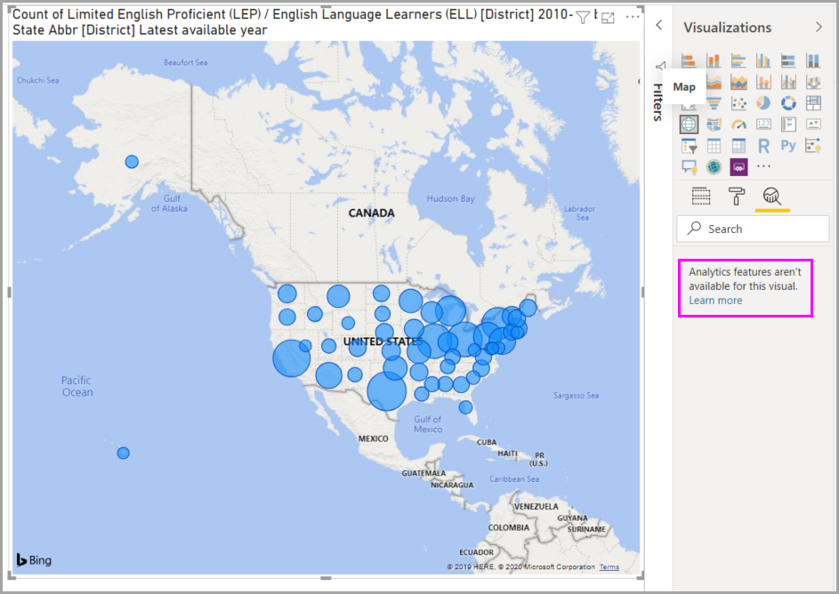

# Использование панели "Аналитика" в Power BI Desktop

Панель **Аналитика** в Power BI Desktop позволяет добавлять динамические *опорные линии* для визуальных элементов, чтобы сосредоточиться на важных трендах и сведениях. Значок и панель **Аналитика** находятся в области **Визуализации** в Power BI Desktop.

> [!NOTE]
> Панель **Аналитика** отобразится, только если выбрать визуальный элемент на холсте Power BI Desktop.

## Поиск по панели "Аналитика"

Начиная с выпуска Power BI Desktop за февраль 2018 г. (2.55.5010.201 или более поздней версии), вы можете выполнять поиск по панели **Аналитика**, которая является подразделом области **Визуализации**. При выборе значка **Аналитика** отображается поле поиска.

## Использование панели "Аналитика"

С помощью панели **Аналитика** можно создать следующие типы динамических опорных линий:

* линия константы оси X;
* линия константы оси Y;
* Линия минимума
* линия максимума;
* линия среднего значения;
* Линия медианы
* линия процентиля.
* Симметричное затенение

> [!NOTE]
> Для некоторых типов визуальных элементов доступны не все виды линий.

В следующих разделах показано, как использовать панель **Аналитика** и динамические строки ссылок в визуализациях.

Чтобы посмотреть доступные динамические строки ссылок для визуального элемента, сделайте следующее:

1. Выберите или создайте визуальный элемент, а затем в разделе **Визуализации** щелкните значок **Аналитика**.

    

2. Выберите тип создаваемой линии, чтобы развернуть ее параметры. В данном случае выбираем **линию среднего значения**.

    

3. Чтобы создать новую линию, щелкните **+&nbsp;+ Добавить**. Затем можно присвоить имя линии. Дважды щелкните текстовое поле и введите нужное имя.

    Теперь у вас есть все виды параметров для этой линии. Можно указать **Цвет**, **Процент прозрачности**, **Стиль линии**, а также **Расположение** (по сравнению с элементами данных визуального элемента). Можно также указать, следует ли включать **Метку данных**. Чтобы указать визуальную меру, на которой должна основываться ваша линия, выберите раскрывающийся список **Мера**, который автоматически заполняется элементами данных из визуального элемента. Здесь нужно выбрать **Культура** в качестве меры, пометить ее *Средняя культура* и настроить несколько других параметров.

    

4. Если требуется отображать метку данных, измените значение параметра **Метка данных** с **Выкл.** на **Вкл.** После этого появится целый набор дополнительных параметров для метки данных.

    

5. Обратите внимание на число, которое отображается рядом с элементом **Линия среднего значения** на панели **Аналитика**. Оно указывает на количество динамических строк, созданных для визуального элемента, и их тип. Если добавить **Линию максимума** для **Affordability** (Уровень цен), на панели **Аналитика** будет показано, что теперь к этому визуальному элементу также применена динамическая строка ссылки типа **Линия максимума**.

    

Если к выбранному визуальному элементу не применяются динамические строки ссылок (в данном случае визуальный элемент **Карта**), при выборе панели **Аналитика** вы увидите следующее сообщение:

Вы можете выделить много интересных сведений, создав динамические опорные линии с помощью панели **Аналитика**.

Мы планируем добавить больше функций и возможностей, в частотности расширить ряд типов визуальных элементов, к которым можно применить динамические строки ссылок. Следите за обновлениями.

## Применение прогнозирования

Если в источнике данных находятся временные данные, можно использовать функцию *прогнозирования*. Просто выберите визуальный элемент, а затем разверните раздел **Прогнозирование** панели **Аналитика**. Для изменения прогноза можно указать множество входных данных, например **Длина прогноза** или **Доверительный интервал**. На следующем рисунке показан визуальный элемент базовой линии с примененным прогнозированием. Проявите фантазию (и попробуйте разные варианты прогнозирования), чтобы увидеть, как оно может применяться к вашим моделям.

> [!NOTE]
> Функция прогнозирования доступна только для визуальных элементов графика.

## Ограничения

Возможность использовать динамические строки ссылок зависит от типа используемого визуального элемента. В списках ниже эти ограничения описаны точнее.

Вы можете использовать *линию константы оси X*, *линию константы оси Y* и *симметричное затенение* на следующем визуальном элементе:

* точечная диаграмма;

*Линия константы*, *линия минимума*, *линия максимума*, *линия среднего значения*, *линия медианы* и *линия процентиля* доступны на таких визуальных элементах:

* диаграмма с областями;
* линейчатая диаграмма с группировкой;
* Гистограмма с группировкой
* График
* точечная диаграмма;

Следующие визуальные элементы работают только с *линиями константы* из панели **Аналитика**:

* диаграмма с областями и накоплением;
* линейчатая диаграмма с накоплением;
* Гистограмма с накоплением
* Каскадная диаграмма
* нормированная линейчатая диаграмма с накоплением;
* нормированная гистограмма с накоплением.

На следующих визуальных элементах при наличии временных данных может использоваться *линия тренда*:

* диаграмма с областями;
* Гистограмма с группировкой
* График
* график и гистограмма с группировкой.

Наконец, в настоящее время вы не можете применить какие-либо динамические линии ко многим визуальным элементам, в числе которых:

* Воронкообразная диаграмма
* график и гистограмма с группировкой.
* график и гистограмма с накоплением;
* Ленточная диаграмма
* недекартовы визуальные элементы, такие как кольцевая диаграмма, датчик, матрица, круговая диаграмма и таблица.

Строка процентиля доступна только при использовании импортированных данных в *Power BI Desktop*, а также при динамическом подключении к модели на сервере под управлением **Analysis Services 2016** или более поздней версии, **Azure Analysis Services** или набору данных в службе Power BI.

## Дальнейшие действия

Power BI Desktop предоставляет широкие возможности. Дополнительные сведения об этих возможностях см. в следующих ресурсах.

* [Новые возможности Power BI Desktop](../fundamentals/desktop-latest-update.md)
* [Получение Power BI Desktop](../fundamentals/desktop-get-the-desktop.md)
* [Что такое Power BI Desktop?](../fundamentals/desktop-what-is-desktop.md)
* [Об использовании Редактора запросов в Power BI Desktop](desktop-query-overview.md)
* [Типы данных в Power BI Desktop](../connect-data/desktop-data-types.md)
* [Формирование и объединение данных в Power BI Desktop](../connect-data/desktop-shape-and-combine-data.md)
* [Выполнение популярных задач в Power BI Desktop](desktop-common-query-tasks.md)
