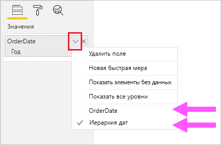
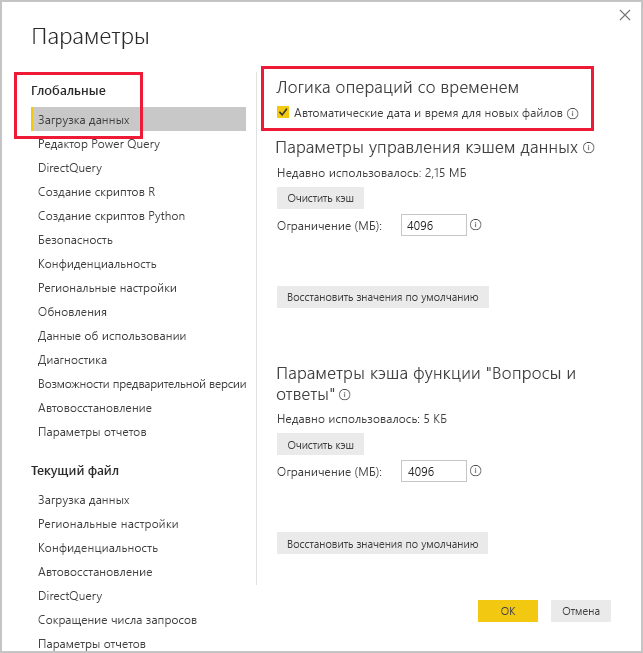

# <a name="apply-auto-datetime-in-power-bi-desktop"></a>Применение автоматических даты и времени в Power BI Desktop

Эта статья предназначена для разработчиков моделей данных, создающих модели импорта или составные модели в Power BI Desktop. В ней рассказывается о параметре _Автоматические дата и время_.

Автоматические дата и время — это параметр загрузки данных в Power BI Desktop. Этот параметр предназначен для поддержки удобного создания отчетов логики операций со временем на основе столбцов дат, загруженных в модель. В частности, он позволяет авторам отчетов, использующим вашу модель данных, фильтровать, группировать и детализировать данные с помощью календарных периодов времени (годы, кварталы, месяцы и дни). При этом вам не нужно явно разрабатывать эти возможности логики операций со временем.

Если этот параметр включен, Power BI Desktop создает скрытую таблицу с автоматическими датой и временем для каждого столбца дат, для которых выполняются все следующие условия:

- режим хранения таблицы — импорт;
- столбец не является вычисляемым;
- столбец дат имеет тип данных "Дата" или "Дата и время";
- столбец не является стороной "многие" связи модели.

## <a name="how-it-works"></a>Принципы работы

Каждая таблица c автоматическими датой и временем на самом деле является [вычисляемой таблицей](desktop-calculated-tables.md), которая создает строки данных с помощью функции DAX [CALENDAR](/dax/calendar-function-dax). Каждая таблица также содержит шесть вычисляемых столбцов: **День**, **№Месяца**, **Месяц**, **№Квартала**, **Квартал** и **Год**.

> [!NOTE]
> Имена и значения столбцов переводятся и форматируются в Power BI в соответствии с [языком модели](../fundamentals/supported-languages-countries-regions.md#choose-the-language-for-the-model-in-power-bi-desktop). Например, если модель была создана на английском языке, названия месяцев и т. д. в ней в по-прежнему будут отображаться на английском языке даже при просмотре с помощью клиента для корейского языка.

В Power BI Desktop также создается связь между столбцом **Дата** в таблице с автоматическими датой и временем и столбцом дат модели.

Таблица с автоматическими датой и временем содержит полные календарные годы, включая все значения дат, хранящиеся в столбце дат модели. Например, если самое раннее значение в столбце дат равно 20 марта 2016 года, а последнее — 23 октября 2019 года, таблица будет содержать 1461 строку. Представляется одна строка для каждой даты за четыре календарных года с 2016 по 2019. Когда Power BI обновляет модель, также обновляются все таблицы с автоматическими датами и временем. Таким образом, модель всегда содержит даты, охватывающие значения столбцов дат.

Строки таблицы с автоматическими датой и временем (если бы их можно было увидеть) выглядели бы следующим образом.


> [!NOTE]
> Таблицы с автоматическими датой и временем всегда скрыты даже от разработчиков моделей. Они не отображаются в области **Поля** или в схеме представления модели, а их строки нельзя увидеть в представлении данных. Кроме того, выражения DAX не могут ссылаться на таблицу и ее столбец напрямую.
>
> С ними также нельзя работать при использовании функции [Анализ в Excel](../collaborate-share/service-analyze-in-excel.md) или подключении к модели с помощью конструкторов отчетов, отличных от Power BI.

Таблица также определяет иерархию, предоставляя визуальные элементы с детализацией по годам, кварталам, месяцам и дням.

Если бы на схеме представления модели можно было просмотреть таблицу с автоматическими датой и временем, то она выглядела бы следующим образом (связанные столбцы выделены).


## <a name="work-with-auto-datetime"></a>Работа с автоматическими датой и временем

Если для столбца дат существует таблица с автоматическими датой и временем (и этот столбец видимый), авторы отчетов не смогут найти этот столбец как поле в области **Поля**. Вместо этого они видят развертываемый объект с именем столбца дат. Его можно легко найти, так как он оформлен со значком календаря. Когда авторы отчета развертывают объект календаря, они видят иерархию с именем **Иерархия дат**. После развертывания иерархии они видят четыре уровня: **Год**, **Квартал**, **Месяц** и **День**.


Иерархия, созданная на основе автоматических даты и времени, может использоваться для настройки визуального элемента точно так же, как и обычные иерархии. Визуальные элементы можно настроить с использованием всей иерархии **Иерархия дат** или конкретных уровней иерархии.

Но есть одна дополнительная возможность, которая не поддерживается обычными иерархиями. Когда иерархия с автоматическими датой и временем (или уровнем из иерархии) добавляется в контейнер визуального элемента, авторы отчета могут переключаться между использованием иерархии и столбца дат. Это разумный подход для некоторых визуальных элементов, если требуется только столбец дат, а не иерархия и ее уровни. Начните с настройки поля визуального элемента (щелкните правой кнопкой мыши поле или щелкните стрелку вниз), а затем используйте контекстное меню для переключения между иерархией и столбцом дат.



Кроме того, вычисления модели, написанные на языке DAX, могут ссылаться на столбец дат _напрямую_ или на столбцы скрытой таблицы с автоматическими датой и временем _косвенно_.

Формула, записанная в Power BI Desktop, может ссылаться на столбец дат обычным способом. Однако на столбцы таблицы с автоматическими датой и временем необходимо ссылаться с помощью специального расширенного синтаксиса. Сначала вы ссылаетесь на столбец дат, а затем указываете точку (.). После этого автоматическое заполнение строки формул позволит выбрать столбец из таблицы с автоматическими датой и временем.

![Пример ввода выражения меры DAX в строке формул. На данный момент формула выглядит так "Date Count = COUNT(Sales[OrderDate]", а автоматически заполненный список содержит все семь столбцов из скрытой таблицы с автоматическими датой и временем. Это такие столбцы: "Дата", "День", "Месяц", "№Месяца", "Квартал", "№Квартала" и "Год".](media/desktop-auto-date-time/auto-date-time-dax-auto-complete.png)

Вот допустимое выражение меры в Power BI Desktop:

```dax
Date Count = COUNT(Sales[OrderDate].[Date])
```

> [!NOTE]
> Хотя это выражение меры допустимо в Power BI Desktop, это неправильный синтаксис для DAX. На внутреннем уровне Power BI Desktop транспонирует выражение для ссылки на истинный (скрытый) столбец таблицы с автоматическими датой и временем.

## <a name="configure-auto-datetime-option"></a>Настройка параметра автоматических даты и времени

Автоматические дату и время можно настроить _глобально_ или для _текущего файла_. Глобальный параметр применяется к новым файлам Power BI Desktop, и его можно включить или отключить в любое время. В новой установке Power BI Desktop оба варианта включены по умолчанию.

Параметр для текущего файла также можно включить или отключить в любое время. Если этот режим включен, создаются таблицы с автоматическими датой и временем. Если этот режим отключен, из модели удаляются все таблицы с автоматическими датой и временем.

> [!CAUTION]
> Будьте внимательны, когда отключаете параметр для текущего файла, так как это приведет к удалению таблиц с автоматическими датой и временем. Не забудьте исправить все неработающие фильтры отчетов или визуальные элементы, которые были настроены для их использования.

В Power BI Desktop выберите _Файл > Параметры и настройки > Параметры_, а затем перейдите на страницу **Глобальная** или **Текущий файл**. На этих страницах параметр находится в разделе **Логика операций со временем**.



## <a name="next-steps"></a>Дальнейшие действия

Дополнительные сведения, связанные с темой этой статьи, см. в следующих ресурсах.

- [Автоматические дата и время в Power BI Desktop](../guidance/auto-date-time.md)
- [Настройка и использование таблиц дат в Power BI Desktop](desktop-date-tables.md)
- У вас появились вопросы? [Попробуйте задать вопрос в сообществе Power BI.](https://community.powerbi.com/)
- У вас есть предложения? [Идеи по улучшению Power BI](https://ideas.powerbi.com/)
