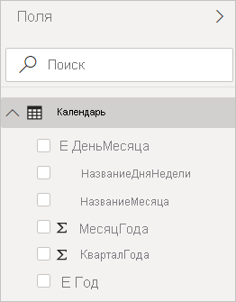
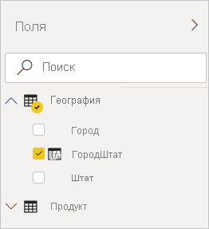

# Создание вычисляемых столбцов в Power BI Desktop
С помощью вычисляемых столбцов можно добавлять новые данные в таблицу уже в модели. Однако вместо запроса и загрузки значений в новый столбец из источника данных вы создаете формулу на языке DAX, которая определяет значения столбца. В Power BI Desktop вычисляемые столбцы создаются с помощью функции "Создать столбец" в представлении **Отчет**.

В отличие от настраиваемых столбцов, создаваемых как часть запроса с помощью команды **Добавить настраиваемый столбец** в редакторе Power Query, вычисляемые столбцы, создаваемые в представлении **Отчет** или **Данные**, строятся на данных, которые уже загружены в модель. Например, вы можете объединить значения из двух разных столбцов в двух разных, но связанных таблицах, сложить эти значения или извлечь вложенные строки.

Созданные вычисляемые столбцы отображаются в списке **Поля** подобно любому другому полю, но они будут иметь специальный значок, указывающий, что значения этих столбцов являются результатом выполнения формулы. Столбцам можно присваивать любые имена и добавлять их в новую или существующую визуализацию отчета так же, как любое другое поле.

 
Вычисляемые столбцы вычисляют результаты с помощью DAX — языка формул, предназначенного для работы с реляционными данными, как в Power BI Desktop. DAX включает библиотеку из более чем 200 функций, операторов и конструкций. Она обеспечивает огромную гибкость при создании формул для вычисления результатов практически любого необходимого анализа данных. Дополнительные сведения о DAX см. в статье [Основные сведения о DAX в Power BI Desktop](desktop-quickstart-learn-dax-basics.md).

Формулы DAX похожи на формулы Excel. Фактически многие функции в DAX такие же, как в Excel. В то же время функции DAX предназначены для работы с данными, интерактивно отобранными или сгруппированными в отчете, например в Power BI Desktop. В Excel для каждой строки в таблице можно использовать разные формулы. В Power BI при создании формулы DAX для нового столбца она будет вычислять результат для каждой строки в таблице. Значения столбца вычисляются повторно по мере необходимости, например при обновлении базовых данных и изменении значений.

## Давайте рассмотрим пример
Джефф является менеджером по доставке в компании Contoso и хочет создать отчет, показывающий количество отгрузок в разные города. У него есть таблица **Geography** (География) с отдельными полями для города и штата. Но Джефф хочет, чтоб в его отчете город и штат отображались как одно значение в той же строке. Однако в настоящее время в таблице **Geography** Джеффа отсутствует нужное поле.

Но, используя вычисляемый столбец, Джефф может объединить город из столбца **City** со штатом из столбца **State**.

Джефф щелкает правой кнопкой мыши таблицу **Geography** и выбирает команду **Создать столбец**. Затем он вводит в строке формулы следующую формулу DAX:

Эта формула просто создает новый столбец с именем **CityState**. Для каждой строки в таблице **Geography** он принимает значения из столбца **City**, добавляет запятую и пробел, а затем присоединяет значения из столбца **State**.

Теперь у Джеффа есть нужное поле.

И он может добавить его на свой холст отчета вместе с количеством отгрузок. С минимальными усилиями Джефф получил поле **CityState** с городом и штатом, которое можно добавить практически в любой тип визуализации. Когда Джефф создает новую карту, Power BI Desktop уже знает, как считывать значения города и штата в новом столбце.

## Дальнейшие действия
Здесь представлены только краткие сведения о вычисляемых столбцах. Дополнительные сведения см. на следующих страницах.

* Чтобы скачать пример файла и получить пошаговые инструкции по созданию столбцов, см. [Учебник. Создание вычисляемых столбцов в Power BI Desktop](desktop-tutorial-create-calculated-columns.md)

* Дополнительные сведения о DAX см. в статье [Основные сведения о DAX в Power BI Desktop](desktop-quickstart-learn-dax-basics.md).

* Дополнительные сведения о столбцах, создаваемых в рамках запроса, см. в разделе **Создание настраиваемых столбцов** статьи [Распространенные задачи запросов в Power BI Desktop.](desktop-common-query-tasks.md)  

