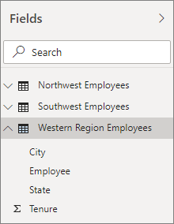

# <a name="create-calculated-tables-in-power-bi-desktop"></a>Создание вычисляемых таблиц в Power BI Desktop
В большинстве случаев вы создаете таблицы путем импорта данных в модель из внешнего источника данных. Но *вычисляемые таблицы* позволяют добавлять новые таблицы на основе данных, уже загруженных в модель. Вместо запроса и загрузки значений в столбцы новой таблицы из источника данных вы создаете [формулу на языке DAX](/dax/index), которая определяет значения таблицы.

DAX — это язык формул для работы с реляционными данными, как в Power BI Desktop. DAX включает библиотеку из более чем 200 функций, операторов и конструкций, предоставляя огромную гибкость при создании формул, чтобы вычислять результаты практически для любого необходимого анализа данных. Вычисляемые таблицы прекрасно подходят для промежуточных вычислений и данных, которые нужно сохранить в модели, а не рассчитывать на ходу или получать в виде результатов запросов. Например, таблицы можно *объединять* и *соединять перекрестно*.

Вычисляемые таблицы, как и другие таблицы Power BI Desktop, могут быть связаны с другими таблицами. Столбцы в вычисляемой таблице имеют типы данных и форматирование и могут относиться к категории данных. Столбцам можно присваивать любые имена и добавлять их в новую или существующую визуализацию отчета так же, как любое другое поле. Пересчет вычисляемых таблиц выполняется, если обновляется одна из таблиц, из которой они извлекают данные, но только если такая таблица не получает данные из таблицы, использующей DirectQuery. В этом случае изменения в таблице произойдут только после обновления набора данных. Если таблица получает данные в режиме DirectQuery, для вычисляемой таблицы рекомендуется также задать этот режим.

## <a name="create-a-calculated-table"></a>Создание вычисляемой таблицы

В Power BI Desktop вычисляемые таблицы создаются с помощью функции **Создать таблицу** в представлении отчетов или в представлении данных.

Например, представьте, что вы являетесь менеджером по персоналу, у которого есть таблица **Сотрудников на северо-западе** и еще одна таблица **Сотрудников на юго-западе**. Необходимо объединить две таблицы в одну таблицу с названием **Сотрудники на западе**.

**Северо-западные сотрудники**

 

**Юго-западные сотрудники**

 

В "Просмотре отчетов" или "Просмотре данных" Power BI Desktop в группе **Вычисления** на вкладке **Моделирование** выберите **Новая таблица**. В "Просмотре данных" это проще сделать, так как после этого можно сразу же увидеть новую вычисляемую таблицу.

 

В строке формул введите следующую формулу:

```dax
Western Region Employees = UNION('Northwest Employees', 'Southwest Employees')
```

Новая таблица **Сотрудники на западе** создана и отображается в области **Поля** вместе со всеми остальными таблицами. Вы можете создать для нее связи с другими таблицами, вставить единицы измерений и вычисляемые столбцы или добавить поля таблицы в отчеты точно так же, как при работе с любыми другими таблицами.

 

 

## <a name="functions-for-calculated-tables"></a>Функции для вычисляемых таблиц

Вы можете определять вычисляемую таблицу любым выражением DAX, которое возвращает таблицу, включая простую ссылку на другую таблицу. Например:

```dax
New Western Region Employees = 'Western Region Employees'
```

Эта статья предоставляет только краткие сведения о вычисляемых таблицах. Вычисляемые таблицы, созданные с помощью DAX, можно использовать для решения многих аналитических задач. Вот некоторые наиболее часто используемые функции таблиц DAX.

* DISTINCT
* VALUES
* CROSSJOIN
* UNION
* NATURALINNERJOIN
* NATURALLEFTOUTERJOIN
* INTERSECT
* CALENDAR
* CALENDARAUTO

Описание этих и других функций DAX, возвращающих таблицы, см. в [справочнике по функциям DAX](/dax/dax-function-reference).

