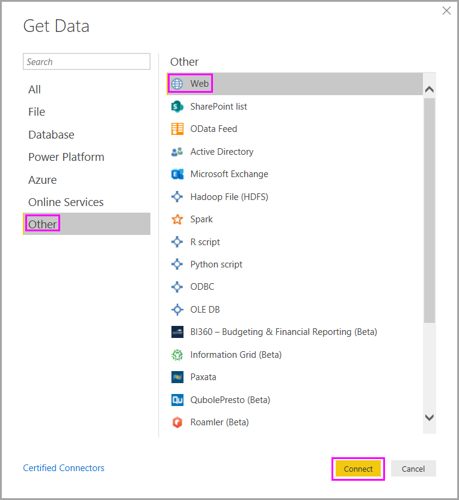
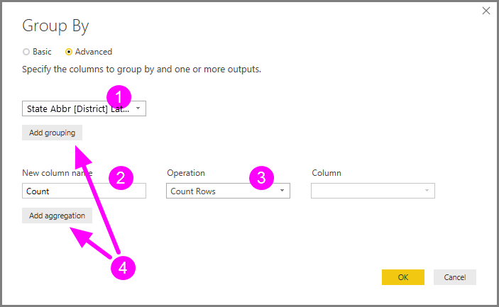
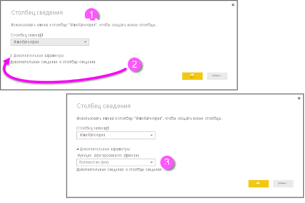
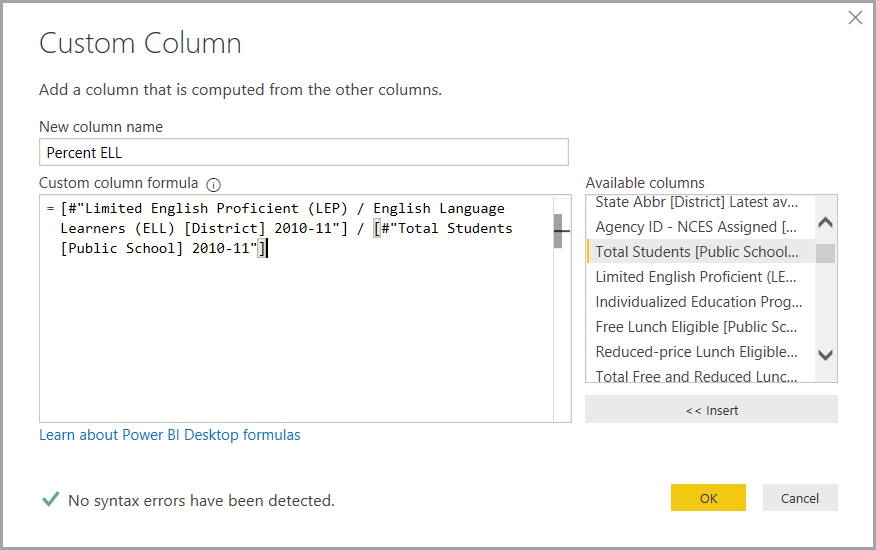
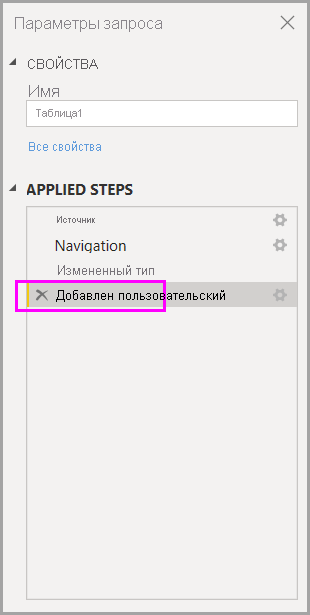
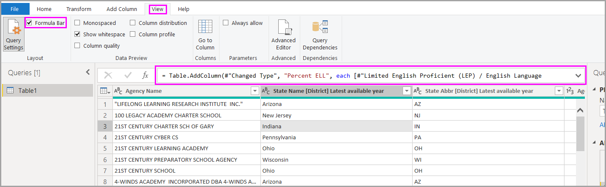
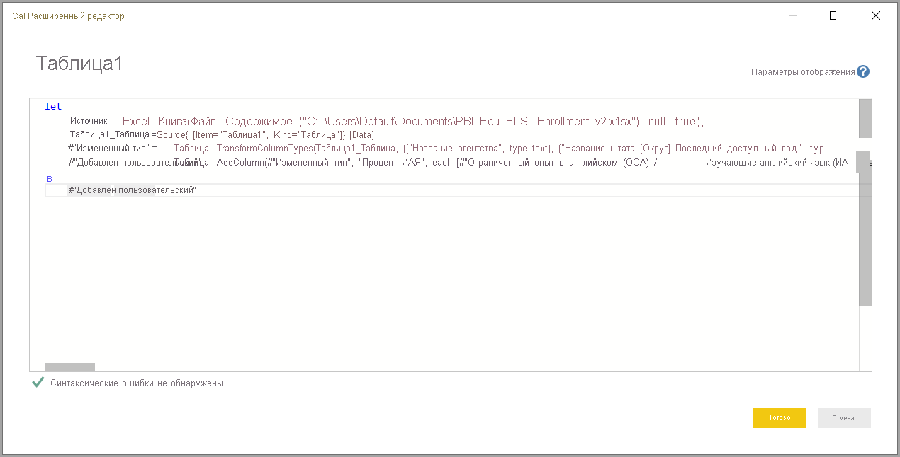

# Выполнение общих задач с запросами в Power BI Desktop

При работе в окне Редактора Power Query в Power BI Desktop можно воспользоваться рядом стандартных задач. В этой статье показаны эти задачи и приведены ссылки для получения дополнительных сведений.

Здесь рассматриваются такие распространенные задачи с запросами:

* Подключение к данным
* Формирование и объединение данных.
* Группирование строк.
* Сводные столбцы.
* Создание настраиваемых столбцов.
* Формулы запросов.

Мы будем использовать несколько подключений к данным для выполнения этих задач. Данные доступны для загрузки или подключения, если вы хотите самостоятельно выполнить эти задачи.

Первое подключение к данным — это [книга Excel](https://download.microsoft.com/download/5/7/0/5701F78F-C3C2-450C-BCCE-AAB60C31051D/PBI_Edu_ELSi_Enrollment_v2.xlsx), которую можно скачать и сохранить локально. Второе — веб-ресурс, который также используется в других статьях по Power BI Desktop:

<https://www.bankrate.com/retirement/best-and-worst-states-for-retirement/>

Распространенные задачи с запросами начинаются с шагов, необходимых для подключения к этим источникам данных.

## Подключение к данным

Для подключения к данным в Power BI Desktop на вкладке ленты **Главная** нажмите кнопку **Получить данные**. В Power BI Desktop откроется меню с наиболее распространенными источниками данных. Чтобы открыть полный список источников данных, к которым может подключаться Power BI Desktop, выберите **Больше** в конце меню. Дополнительные сведения см. в статье [Источники данных в Power BI Desktop](../connect-data/desktop-data-sources.md).

Для начала выберите **Excel**, укажите упомянутую ранее книгу Excel, а затем выберите **Открыть**. После выбора таблицы запрос изучает книгу и представляет найденные данные в диалоговом окне **Навигатор**.

Вы можете нажать кнопку **Преобразовать данные**, чтобы изменить, скорректировать или *сформировать* данные перед загрузкой в Power BI Desktop. Редактирование особенно полезно при работе с большими наборами данных, которые требуется сократить перед загрузкой.

Подключение к другим типам данных выполняется так же просто. Нужно также подключиться к веб-ресурсу. Выберите **Получить данные** > **Больше**, а затем **Другое** > **Интернет** > **Подключить**.

Отобразится диалоговое окно **Из Интернета**, где можно ввести URL-адрес веб-страницы.

Выберите **ОК**. Как и ранее, Power BI Desktop изучает данные веб-страницы и отображает параметры предварительного просмотра в диалоговом окне **Навигатор**. При выборе таблицы данные отображаются в режиме предварительного просмотра.

Другие подключения к данным выполняются аналогично. Если для подключения к данным требуется аутентификация, в Power BI Desktop отобразится запрос на ввод соответствующих учетных данных.

Пошаговую демонстрацию подключения к данным в Power BI Desktop см. в [этой статье](../connect-data/desktop-connect-to-data.md).

## Формирование и объединение данных.

Вы можете легко формировать и объединять данные с помощью Редактора Power Query. В этом разделе приводится несколько примеров формирования данных. Полную демонстрацию формирования и объединения данных с помощью Power BI Desktop см. в [этой статье](../connect-data/desktop-shape-and-combine-data.md).

В предыдущем разделе вы подключались к двум наборам данных: книге Excel и веб-ресурсу. После загрузки данных в Редактор Power Query выберите запрос веб-страницы из доступных запросов в области **Запросы**, как показано ниже.

При формировании данных источник данных преобразуется в нужные форму и формат.

В представлении Редактора Power Query на ленте и в контекстном меню можно найти множество команд. Например, если щелкнуть правой кнопкой мыши столбец, то с помощью контекстного меню можно удалить этот столбец. Вы также можете выбрать столбец, а затем нажать кнопку **Удалить столбцы** на вкладке ленты **Главная**.

Существует множество других способов формирования данных в этом запросе. Вы можете удалить любое количество строк сверху или снизу, а также добавлять или разделять столбцы, заменять значения и выполнять другие задачи формирования. Благодаря этому в Редакторе Power Query можно настроить нужный вам вид получаемых данных.

## Группирование строк.

В Редакторе Power Query можно группировать значения из нескольких строк в одно значение. Это полезно при суммировании количества продуктов, общего объема продаж или количества учащихся.

В этом примере вы группируете строки в наборе данных по численности обучающихся в образовательных учреждениях. Данные получены из книги Excel. Они сформированы в Редакторе Power Query, чтобы извлечь только нужные столбцы, переименовать таблицу и выполнить несколько других преобразований.

Давайте выясним, сколько образовательных учреждений находится в каждом штате. (В том числе школьных округов и других образовательных учреждений, таких как региональные службы и т. д.) Выберите столбец **Agency ID - NCES Assigned \[District\] Latest available year**, а затем нажмите кнопку **Группировать по** на вкладке **Преобразование** или **Главная** на ленте. (Кнопка **Группировать по** есть на обеих вкладках.)

Откроется диалоговое окно **Группировать по**. Когда Редактор Power Query группирует строки, он создает новый столбец, в который помещаются результаты выполнения команды **Группировать по**. Скорректировать операцию **Группировать по** можно следующими способами.

1. В раскрывающемся списке указывается столбец для группирования. Редактор Power Query выбирает столбец по умолчанию, но его можно изменить на любой столбец в таблице.
2. **Имя нового столбца:** Редактор Power Query автоматически предлагает имя для нового столбца с учетом операции, которая применяется к группируемому столбцу. Однако этому новому столбцу можно присвоить любое имя.
3. **Operation:** вы можете выбрать операцию, которую применяет Редактор Power Query, например **Сумма**, **Медиана** или **Посчитать уникальные строки**. Значение по умолчанию — **Считать строки**.
4. **Добавление группирования** и **Добавление агрегирования**: эти кнопки доступны, только если выбран параметр **Дополнительно**. С помощью этих кнопок в рамках одной операции можно выполнять операции группирования (действия **Группировать по**) с несколькими столбцами и создавать несколько агрегатов. С учетом выбранных в этом диалоговом окне значений Редактор Power Query создает столбец, который работает с несколькими столбцами.

Нажмите кнопку **Добавление группирования** или **Добавление агрегирования**, чтобы добавить группирования или агрегаты в операцию **Группировать по**. Чтобы удалить группирование или агрегат, щелкните значок многоточия ( **...** ) справа от строки, а затем выберите **Удалить**. Попробуйте выполнить операцию **Группировать по** со значениями по умолчанию, чтобы увидеть, что произойдет.

Когда вы нажмете кнопку **ОК**, Редактор Power Query выполнит операцию **Группировать по** и возвратит результаты. Итак, взглянем: сейчас в штатах Огайо, Иллинойс, Техас и Калифорния более тысячи образовательных учреждений в каждом!

C помощью Редактора Power Query всегда можно удалить последнюю операцию формирования. В области **Параметры запроса** в разделе **Примененные шаги** просто щелкните **X** рядом с только что завершенным действием. Поэкспериментируйте. Если вы не довольны результатами, повторяйте этот шаг до тех пор, пока Редактор Power Query не сформирует данные так, как нужно вам.

## Сводные столбцы.

Вы можете сводить столбцы и создавать таблицу, которая содержит агрегированные значения для каждого уникального значения в столбце. Например, чтобы узнать, сколько разных продуктов в каждой категории, можно быстро создать таблицу, которая позволяет решить эту задачу.

Рассмотрим следующий пример. Таблица **Products_by_Categories** сформирована так, что в ней отображаются только уникальные продукты (по имени) и указано, к какой категории продуктов они относятся. Чтобы создать новую таблицу, которая показывает количество продуктов в каждой категории (на основе столбца **CategoryName**), выберите столбец, а затем щелкните **Преобразование** > **Столбец сведения**.

Откроется диалоговое окно **Столбец сведения**, в котором можно узнать, какие значения столбца будут использоваться для создания новых столбцов (1). (Если требуемое имя столбца **CategoryName** не отображается, выберите его из раскрывающегося списка.) Развернув раздел **Дополнительные параметры** (2), можно выбрать функцию, которая будет применяться к агрегированным значениям (3).

При нажатии кнопки **ОК**, запрос отображает таблицу в соответствии с инструкциями преобразования, предоставленными в диалоговом окне **Столбец сведения**.

## Создание настраиваемых столбцов.

В Редакторе Power Query можно создавать настраиваемые формулы, которые работают по нескольким столбцам в таблице. Затем результаты таких формул можно поместить в новый (настраиваемый) столбец. Редактор Power Query упрощает создание настраиваемых столбцов.

Используя данные книги Excel в Редакторе Power Query, перейдите на вкладку ленты **Добавить столбец**, а затем выберите **Настраиваемый столбец**.

Появится представленное ниже диалоговое окно. В этом примере создается настраиваемый столбец с именем *Процент ИАЯ*, который вычисляет процент всех студентов, изучающих английский язык.

Как и любое другое действие, выполненное в Редакторе Power Query, если новый настраиваемый столбец не предоставляет нужных данных, можно удалить это действие. В области **Параметры запроса** в разделе **Примененные шаги** просто щелкните **X** рядом с действием **Добавлен пользовательский объект**.

## Формулы запросов.

Вы можете изменить действия, которые создает Редактор Power Query. Вы также можете создавать пользовательские формулы, позволяющие более точно подключаться к данным и формировать их. Всякий раз когда Редактор Power Query выполняет то или иное действие с данными, формула, связанная с этим действием, отображается в строке формул. Для просмотра строки формул перейдите на вкладку ленты **Представление**, а затем выберите элемент **Строка формул**.

Редактор Power Query сохраняет все примененные действия по каждому запросу как текст, который можно просмотреть или изменить. Вы можете просмотреть или изменить текст любого запроса с помощью **расширенного Редактора**. Просто выберите **Представление**, а затем — **Расширенный Редактор**.

Здесь представлен **Расширенный редактор** с действиями запроса, связанными с отображаемым запросом **USA\_StudentEnrollment**. Эти действия создаются на языке формул Power Query, который часто называют *M*. Дополнительные сведения см. в статье [Формулы Power Query](https://support.office.com/article/learn-about-power-query-formulas-6bc50988-022b-4799-a709-f8aafdee2b2f). См. дополнительные сведения о [спецификации языка Power Query M](/powerquery-m/power-query-m-language-specification).

Power BI Desktop предоставляет широкий набор категорий формул. Дополнительные сведения и полный перечень всех формул Редактора Power Query см. в [этой статье](/powerquery-m/power-query-m-function-reference).

## Дальнейшие действия

Power BI Desktop предоставляет широкие возможности. Дополнительные сведения об этих возможностях см. в следующих ресурсах.

* [Что такое Power BI Desktop?](../fundamentals/desktop-what-is-desktop.md)
* [Об использовании Редактора запросов в Power BI Desktop](desktop-query-overview.md)
* [Источники данных в Power BI Desktop](../connect-data/desktop-data-sources.md)
* [Подключение к данным в Power BI Desktop](../connect-data/desktop-connect-to-data.md)
* [Формирование и объединение данных в Power BI Desktop](../connect-data/desktop-shape-and-combine-data.md)
