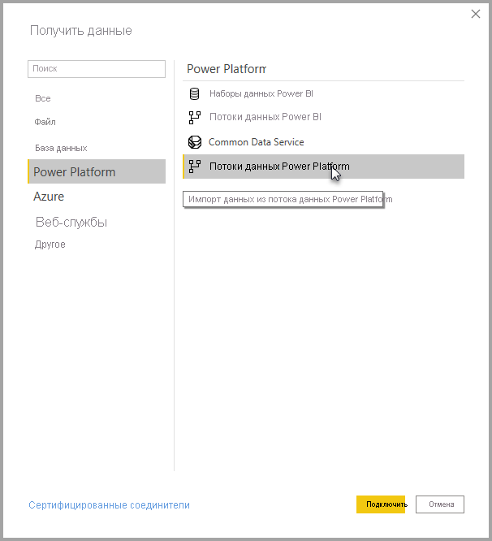

# Подключение к данным, созданным потоками данных Power Platform в Power BI Desktop
С помощью **Power BI Desktop** вы можете подключаться к данным, созданным **потоками данных Power Platform** и использовать их так же, как и любой другой источник данных в Power BI Desktop.

Соединитель **потоков данных Power Platform** позволяет подключаться к сущностям, создаваемым потоками данных в службе Power BI. 

## Рекомендации и ограничения

Для запуска **соединителя потоков данных Power Platform** необходимо использовать последнюю версию **Power BI Desktop**. Вы всегда можете [скачать Power BI Desktop](../fundamentals/desktop-get-the-desktop.md) и установить его на ваш компьютер, чтобы использовать самую последнюю версию приложения.  

> [!NOTE]
> Для предыдущей версии соединителя потоков данных Power Platform нужно было скачать MEZ-файл и поместить его в папку. Текущая версия **Power BI Desktop** включает соединитель для потоков данных Power Platform, поэтому тот файл больше не нужен и, более того, может конфликтовать с включенной версией соединителя. Если вы ранее вручную помещали MEZ-файл в папку, *обязательно* удалите этот скачанный MEZ-файл из папки **Документы > Power BI Desktop > Настраиваемые соединители**, чтобы избежать конфликтов. 

## Производительность версии Power BI Desktop
Приложение **Power BI Desktop** выполняется локально на компьютере, на котором оно установлено. Производительность приема потоков данных определяется несколькими факторами. К ним относятся размер данных, ресурсы ЦП и памяти компьютера, пропускная способность сети, расстояние до центра обработки данных и т. д.

Вы можете повысить производительность приема данных для потоков данных. Например, если размер принимаемых данных слишком большой и **Power BI Desktop** не может справиться с ними на локальном компьютере, примените в потоках данных связанные и вычисляемые сущности для статистической обработки данных (прямо в этих потоках данных) и получайте из них уже подготовленные и агрегированные данные. 

Благодаря такому подходу обработка больших объемов данных выполняется в облачных потоках данных, а не на локально запущенном экземпляре с **Power BI Desktop**. Power BI Desktop будет принимать меньше данных и сохранит хорошую скорость и отзывчивость интерфейса взаимодействия с потоками данных.

## Дополнительные сведения

Большинство потоков данных находятся в клиенте службы Power BI. Однако у пользователей **Power BI Desktop** нет доступа к потокам данных, которые хранятся в учетной записи Azure Data Lake Storage 2-го поколения, если они не являются владельцами потока данных, или им явно не разрешен доступ к папке CDM потока данных. Рассмотрим следующую ситуацию:

1.  Анна создает рабочую область и настраивает хранение в ней потоков данных из озера данных организации.
2.  Бен, который также является членом рабочей области, которую создала Анна, хочет с помощью Power BI Desktop и соединителя потока данных получить данные из потока данных, созданного Анной.
3.  У Бена возникает ошибка, потому что его не добавили как авторизованного пользователя в папку CDM потока данных в Data Lake.

Чтобы устранить эту проблему, Бену необходимо предоставить разрешения читателя в папке CDM и ее файлах. Дополнительные сведения о том, как предоставить доступ к папке CDM, см. в статье о [настройке и использовании потока данных](dataflows/dataflows-configure-consume.md).

## Дальнейшие действия
С помощью потоков данных можно выполнять много интересных действий. Дополнительные сведения см. на следующих страницах.

* [Вводные сведения о потоках данных и самостоятельной подготовке данных](dataflows/dataflows-introduction-self-service.md)
* [Создание потока данных](dataflows/dataflows-create.md)
* [Настройка и использование потока данных](dataflows/dataflows-configure-consume.md)
* [Настройка хранилища потоков данных для использования Azure Data Lake 2-го поколения](dataflows/dataflows-azure-data-lake-storage-integration.md)
* [Функции потоков данных уровня "Премиум"](dataflows/dataflows-premium-features.md)
* [ИИ с потоками данных](dataflows/dataflows-machine-learning-integration.md)

Также вам могут оказаться полезны статьи о **Power BI Desktop**.

* [Источники данных в Power BI Desktop](../connect-data/desktop-data-sources.md)
* [Формирование и объединение данных в Power BI Desktop](../connect-data/desktop-shape-and-combine-data.md)
* [Ввод данных непосредственно в Power BI Desktop](../connect-data/desktop-enter-data-directly-into-desktop.md)