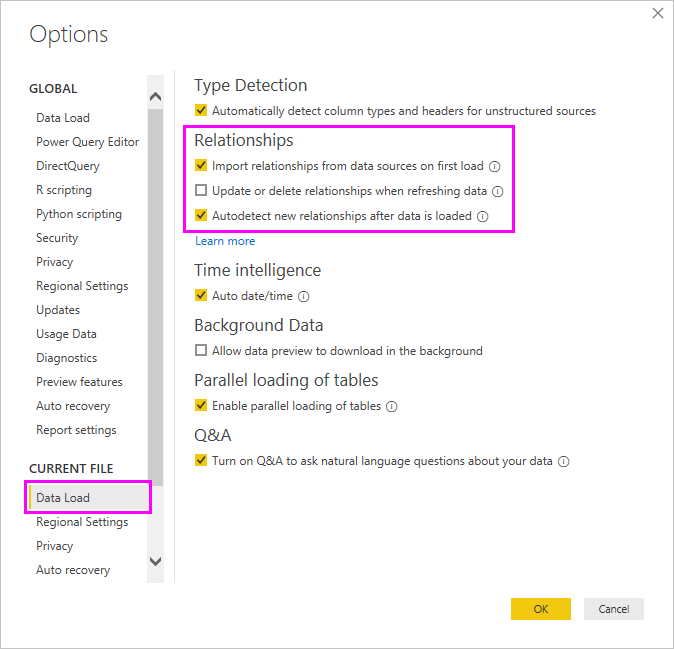

# Создание связей и управление ими в Power BI Desktop
При импорте нескольких таблиц, скорее всего, вам понадобится провести анализ, используя данные из них. Связи между этими таблицами необходимы, чтобы точно вычислить результаты и отобразить правильные сведения в отчетах. Power BI Desktop значительно упрощает создание таких связей. Фактически в большинстве случаев вам не нужно ничего делать — функция автообнаружения сделает все автоматически. Однако в некоторых случаях может потребоваться создать связи вручную или внести некоторые изменения в полученные связи. В любом случае очень важно понимать связи в Power BI Desktop, а также способы их создания и изменения.

## Автообнаружение при загрузке
Если вы одновременно запрашиваете несколько таблиц, при загрузке данных Power BI Desktop автоматически пытается найти и создать связи. Параметры связи **Кратность**, **Направление кросс-фильтрации** и **Сделать эту связь активной** устанавливаются автоматически. Power BI Desktop анализирует имена столбцов в запрашиваемых таблицах, чтобы определить, существуют ли потенциальные связи. Если это так, эти связи создаются автоматически. Если Power BI Desktop не может определить соответствие с высоким уровнем достоверности, он не создает связи. Но вы по-прежнему можете использовать диалоговое окно **Управление связями** для создания и изменения связей вручную.

## Создание связи с помощью автообнаружения
На вкладке **Главная** щелкните **Управление связями** \> **Автообнаружение**.

## Создание связи вручную
1. На вкладке **Главная** щелкните **Управление связями** \> **Создать**.

2. В диалоговом окне **Создание связи** в раскрывающемся списке "Первая таблица" выберите таблицу. Выберите столбец, который необходимо использовать в связи.

3. В раскрывающемся списке "Вторая таблица" выберите другую таблицу, которая будет использоваться в связи. Выберите другой столбец, который необходимо использовать, и нажмите **ОК**.

   

По умолчанию Power BI Desktop автоматически настраивает параметры **Кратность** (направление), **Направление кросс-фильтрации** и **Сделать эту связь активной** для новой связи. Однако при необходимости эти параметры можно изменить. Дополнительные сведения см. в разделе [Основные сведения о дополнительных параметрах](#understanding-additional-options).

Если ни одна из таблиц, выбранных для связи, не имеет уникальных значений, вы увидите следующую ошибку: *Один из столбцов должен содержать уникальные значения*. По крайней мере одна из таблиц, участвующих в связи, *должна* иметь уникальный список ключевых значений. Это стандартное требование для любых реляционных баз данных. 

Устранить эту проблему можно несколькими способами.

* Используйте функцию **Удалить дубликаты**, чтобы получить столбец с уникальными значениями. Недостаток такого подхода в том, что при удалении повторяющихся строк часть данных теряется, хотя часто на дублирование ключей (строк) есть причины.
* Добавьте промежуточную таблицу, состоящую из списка отдельных ключевых значений модели, а затем свяжите ее с обоими исходными столбцами, участвующими в связи.

Дополнительные сведения см. в этой [записи блога](https://blogs.technet.microsoft.com/cansql/2016/12/19/relationships-in-power-bi-fixing-one-of-the-columns-must-have-unique-values-error-message/).

## Изменение связи
1. На вкладке **Главная** щелкните **Управление связями**.

2. В диалоговом окне **Управление связями** выберите связь, а затем нажмите кнопку **Изменить**.

## Настройка дополнительных параметров
При создании или изменении связи вы можете настроить дополнительные параметры. По умолчанию Power BI Desktop автоматически настраивает дополнительные параметры с использованием наиболее подходящих значений, которые могут отличаться для каждой связи в зависимости от данных в столбцах.

### Кратность
Параметр **Кратность** может иметь одно из следующих значений.

**Многие к одному (\*:1)** . Связь "многие к одному" является наиболее распространенным типом связи по умолчанию. Это означает, что у столбца в отдельной таблице может быть несколько экземпляров значения, а у другой связанной таблицы, которую часто называют таблицей подстановки, есть только один экземпляр значения.

**Один к одному (1:1)** . В связи "один к одному" у столбца в этой таблице есть только один экземпляр определенного значения, а у связанной таблицы также только один экземпляр определенного значения.

**Один ко многим (1:*)** . В связи "один ко многим" у столбца в этой таблице есть только один экземпляр определенного значения, а у связанной таблицы может быть несколько экземпляров значения.

**Многие ко многим (\*:\*)** . В составных моделях между таблицами можно установить связи "многие ко многим", которые избавляют от необходимости поддерживать уникальные значения в таблицах. Также они позволяют обойтись без предыдущих обходных путей, таких как создание новых таблиц исключительно для образования связей. Дополнительные сведения см. в статье [Связи с кратностью "многие ко многим"](https://docs.microsoft.com/power-bi/desktop-many-to-many-relationships). 

Дополнительные сведения об изменении кратности см. в разделе [Общие сведения о дополнительных параметрах](#understanding-additional-options).

### Направление кроссфильтрации
Параметр **Направление кросс-фильтрации** может иметь одно из следующих значений.

**Двунаправленная**. При фильтрации обе таблицы обрабатываются так же, как одна. Параметр **Двунаправленная** хорошо работает с одной таблицей, которую окружает несколько таблиц подстановки. Примером может служить таблица фактических данных по продажам с таблицей подстановки для отделов. Такая конфигурация часто называется схемой типа "звезда" (центральная таблица с несколькими таблицами подстановки). При наличии нескольких таблиц, у которых также есть таблицы подстановки (некоторые из которых являются общими), не следует использовать параметр **Двунаправленная**. Продолжая предыдущий пример, предположим, что в этом случае также есть таблица бюджета, содержащая целевой бюджет для каждого отдела. Таблица отделов подключена к таблице продаж и таблице бюджета. Избегайте направления связи **Двунаправленная** для конфигурации такого вида.

**Однонаправленная**. Это наиболее распространенное стандартное направление означает, что фильтрация вариантов в подключенных таблицах выполняется в таблице, где значения агрегируются. При импорте модели данных Power Pivot в Excel 2013 или более ранней версии все связи будут однонаправленными. 

Дополнительные сведения об изменении направления кросс-фильтрации см. в разделе [Общие сведения о дополнительных параметрах](#understanding-additional-options).

### Активировать связь
Если этот флажок установлен, связь служит в качестве активной связи по умолчанию. Если между двумя таблицами есть несколько связей, активная связь позволяет Power BI Desktop автоматически создавать визуализации, включающие обе таблицы.

Дополнительные сведения о назначении активной связи см. в разделе [Общие сведения о дополнительных параметрах](#understanding-additional-options).

## Основные сведения о связях
После соединения двух таблиц с помощью связи вы можете работать с данными в обеих таблицах так, будто они находятся в одной таблице, что позволяет не беспокоиться о связях или преобразовании таблиц в плоскую структуру перед их импортом. Во многих случаях Power BI Desktop может автоматически создавать связи. Но если Power BI Desktop не может с высокой степенью точности определить, должна ли быть определенная связь между двумя таблицами, то он не создает ее автоматически. Вам нужно будет сделать это вручную. 

Кратко рассмотрим, как связи работают в Power BI Desktop.

>[!TIP]
>Этот урок можно пройти самостоятельно. 
>
> 1. Скопируйте следующую таблицу **ProjectHours** в лист Excel (за исключением заголовка), выберите все ячейки, а затем выберите **Вставить** \> **Таблица**. 
> 2. В диалоговом окне **Создание таблицы** нажмите кнопку **ОК**. 
> 3. Выберите любую ячейку таблицы, выберите **Конструктор таблиц** \> **Имя таблицы**, а затем введите *ProjectHours*. 
> 4. То же сделайте для таблицы **CompanyProject**. 
> 5. Импортируйте данные, нажав кнопку **Получить данные** в Power BI Desktop. Выберите две таблицы в качестве источника данных, а затем нажмите **Загрузить**.

Первая таблица, **ProjectHours**, представляет собой запись рабочих заданий, в которых зафиксировано время работы пользователя над определенным проектом. 

**ProjectHours**

| **Ticket** | **SubmittedBy** | **Hours** | **Project** | **DateSubmit** |
| ---:|:--- | ---:|:--- | ---:|
| 1001 |Brewer, Alan |22 |Синий |1\.01.2013 |
| 1002 |Brewer, Alan |26 |Красный |1\.02.2013 |
| 1003 |Ito, Shu |34 |Желтый |4\.12.2012 |
| 1004 |Brewer, Alan |13 |Оранжевый |1\.2.2012 |
| 1005 |Bowen, Eli |29 |Фиолетовый |01.10.2013 |
| 1006 |Bento, Nuno |35 |Зеленый |1\.02.2013 |
| 1007 |Hamilton, David |10 |Желтый |01.10.2013 |
| 1008 |Han, Mu |28 |Оранжевый |2\.01.2012 |
| 1009 |Ito, Shu |22 |Сиреневый |1\.02.2013 |
| 1010 |Bowen, Eli |28 |Зеленый |1\.10.2013 |
| 1011 |Bowen, Eli |9 |Синий |15.10.2013 |

Вторая таблица, **CompanyProject**, — это список проектов с назначенным приоритетом: A, B или C. 

**CompanyProject**

| **ProjName** | **Priority** |
| --- | --- |
| Синий |А |
| Красный |B |
| Зеленый |C |
| Желтый |C |
| Сиреневый |B |
| Оранжевый |C |

Обратите внимание, что каждая таблица содержит столбец проекта. Имена столбцов немного отличаются, но значения выглядят одинаковыми. Это важно, и мы вернемся к этому немного позже.

После импорта двух таблиц в модель создадим отчет. Первое, что мы хотим получить, — количество часов, выделенное проектам по приоритету, поэтому мы выберем **Priority** и **Hours** в области **Поля**.

Если взглянуть на нашу таблицу на холсте отчета, можно увидеть количество часов — 256 для каждого проекта, а также итоговое значение. Очевидно, что число неверно. Почему? Потому что мы не можем вычислить сумму значений из одной таблицы (**Hours** в таблице **Project**), разделенных по значениям из другой таблицы (**Priority** в **CompanyProject**), без связи между этими двумя таблицами.

Поэтому давайте создадим связь между этими двумя таблицами.

Помните, мы видели в обеих таблицах столбцы с именем проекта и похожими значениями? Мы используем их для создания связи между нашими таблицами.

Почему именно эти столбцы? Если рассмотреть столбец **Project** в таблице **ProjectHours**, мы увидим такие значения, как "Синий", "Красный", "Желтый", "Оранжевый" и т. д. Фактически несколько строк имеют одинаковое значение. На самом деле у нас множество значений цветов для столбца **Project**.

Если мы рассмотрим столбец **ProjName** в таблице **CompanyProject**, мы увидим, что в нем используется только одно из значений цветов для проекта. На самом деле каждое значение цвета в этой таблице уникально, и это важно, поскольку мы можем создать связь между этими двумя таблицами. Это будет связь "многие к одному". В такой связи хотя бы один столбец в одной из таблиц должен содержать уникальные значения. Есть несколько дополнительных параметров для некоторых связей, которые мы рассмотрим позже. Сейчас давайте создадим связь между столбцами проекта в каждой из двух таблиц.

### Создание связи
1. На вкладке **Главная** щелкните **Управление связями**.
2. В окне **Управление связями** щелкните элемент **Создать**, чтобы открыть диалоговое окно **Создание связи**, в котором можно выбрать таблицы, столбцы и дополнительные параметры для нашей связи.
3. В первом раскрывающемся списке выберите **ProjectHours** в качестве первой таблицы, а затем выберите столбец **Project**. Это сторона связи *многие*.
4. Во втором раскрывающемся списке уже выбрана **CompanyProject** в качестве второй таблицы. Выберите столбец **ProjName**. Это сторона связи *один*. 
5. Оставьте значения по умолчанию для других параметров связи и нажмите кнопку **ОК**.

   

6. В диалоговом окне **Управление связями** нажмите кнопку **Закрыть**.

В целях обучения мы создали связь трудным способом. Мы могли просто нажать **Автообнаружение** в диалоговом окне **Управление связями**. То есть автообнаружение автоматически создало бы связи при загрузке данных, если бы у обоих столбцов было одно и то же имя. Но это же слишком просто, не так ли?

Теперь снова рассмотрим таблицу на холсте отчета.

Теперь все выглядит гораздо лучше, правда?

Когда мы суммируем часы по столбцу **Prioroty**, Power BI Desktop найдет каждый экземпляр уникального значения цвета в таблице подстановки **CompanyProject**, затем найдет каждый экземпляр этих значений в таблице **ProjectHours** и вычислит сумму для каждого уникального значения.

Это достаточно просто. А с автообнаружением вам пришлось бы делать еще меньше.

## Общие сведения о дополнительных параметрах
При создании связи, будь то с помощью автообнаружения или вручную, Power BI Desktop автоматически настраивает дополнительные параметры на основе данных в таблицах. Вы можете настроить эти дополнительные параметры связи в нижней части диалоговых окон **Создание связи** и **Изменение связи**.

 

Power BI обычно задает эти параметры автоматически, и вам не нужно их изменять. Но в некоторых ситуациях может потребоваться настроить дополнительные параметры самостоятельно.

## Автоматическое обновление связей

Вы можете управлять тем, как Power BI обрабатывает и автоматически корректирует связи в отчетах и моделях. Чтобы указать, как Power BI следует обрабатывать параметры связи, выберите **Файл** > **Параметры и настройки** > **Параметры** в Power BI Desktop, а затем щелкните **Загрузка данных** в области слева. Появятся параметры для **связей**.

   

Есть три параметра, которые можно выбрать и включить. 

- **Импорт связей из источников данных при первой загрузке**. Этот параметр выбран по умолчанию. Если этот флажок установлен, Power BI проверяет связи, определенные в источнике данных, такие как связи внешнего и первичного ключей в хранилище данных. Если такие связи существуют, они отражаются в модели данных Power BI при начальной загрузке данных. Этот параметр позволяет быстро начать работу с моделью, не требуя поиска или определения этих связей самостоятельно.

- **Обновление или удаление связей при обновлении данных**. Этот параметр не выбран по умолчанию. Если установить этот флажок, Power BI проверяет наличие изменений в связях источника данных при обновлении набора данных. Если эти связи изменены или удалены, Power BI отражает эти изменения в собственной модели данных, обновляя или удаляя их соответственно.

   > [!WARNING]
   > Если используется безопасность на уровне строк, основанная на определенных связях, мы не рекомендуем выбирать этот параметр. Если удалить связь, от которой зависят параметры RLS, модель может стать менее безопасной. 

- **Автоматически искать новые связи после загрузки данных**. Этот параметр описан в разделе [Автообнаружение при загрузке](#autodetect-during-load). 

## Последующие обновления данных требуют другой кратности
Обычно Power BI Desktop может автоматически определить лучшую кратность для связи. Если вам необходимо переопределить автоматические настройки, поскольку вам известно, что данные будут изменяться в будущем, можно выбрать нужное значение в элементе управления **Кратность**. Рассмотрим пример, где нам необходимо выбрать другую кратность.

Таблица **CompanyProjectPriority** — это список всех проектов компании и их приоритетов. Таблица **ProjectBudget** — это набор проектов, для которых был утвержден бюджет.

**CompanyProjectPriority**

| **ProjName** | **Priority** |
| --- | --- |
| Синий |А |
| Красный |B |
| Зеленый |C |
| Желтый |C |
| Сиреневый |B |
| Оранжевый |C |

**ProjectBudget**

| **Approved Projects** | **BudgetAllocation** | **AllocationDate** |
|:--- | ---:| ---:|
| Синий |40 000 |1\.12.2012 |
| Красный |100 000 |1\.12.2012 |
| Зеленый |50 000 |1\.12.2012 |

Если мы создаем связь между столбцом **Approved Projects** в таблице **ProjectBudget** и столбцом **ProjectName** таблицы **CompanyProjectPriority**, Power BI автоматически устанавливает **Кратность** **Один к одному (1:1)** и **Направление кросс-фильтрации** — **Двунаправленная**. 

 

Power BI устанавливает эти параметры, потому что для Power BI Desktop лучшей комбинацией двух таблиц является следующая.

| **ProjName** | **Priority** | **BudgetAllocation** | **AllocationDate** |
|:--- | --- | ---:| ---:|
| Синий |А |40 000 |1\.12.2012 |
| Красный |B |100 000 |1\.12.2012 |
| Зеленый |C |50 000 |1\.12.2012 |
| Желтый |C |  |  |
| Сиреневый |B |  |  |
| Оранжевый |C |  |  |

Между двумя таблицами существует связь "один к одному", поскольку в объединенном столбце **ProjName** таблицы отсутствуют повторяющиеся значения. Столбец **ProjName** уникальный, так как каждое значение проявляется только один раз, поэтому строки из двух таблиц можно объединить напрямую без дублирования.

Однако предположим, что вы знаете, что данные изменятся при следующем обновлении. Обновленная версия таблицы **ProjectBudget** теперь содержит дополнительные строки для синего и красного цвета.

**ProjectBudget**

| **Approved Projects** | **BudgetAllocation** | **AllocationDate** |
| --- | ---:| ---:|
| Синий |40 000 |1\.12.2012 |
| Красный |100 000 |1\.12.2012 |
| Зеленый |50 000 |1\.12.2012 |
| Синий |80 000 |1\.06.2013 |
| Красный |90 000 |1\.06.2013 |

 Эти дополнительные строки означают, что наилучшее сочетание двух таблиц теперь выглядит следующим образом. 

| **ProjName** | **Priority** | **BudgetAllocation** | **AllocationDate** |
| --- | --- | ---:| ---:|
| Синий |А |40 000 |1\.12.2012 |
| Красный |B |100 000 |1\.12.2012 |
| Зеленый |C |50 000 |1\.12.2012 |
| Желтый |C |  |  |
| Сиреневый |B |  |  |
| Оранжевый |C |  |  |
| Синий |А |80 000 |1\.06.2013 |
| Красный |B |90 000 |1\.06.2013 |

В этой новой объединенной таблице столбец **ProjName** содержит повторяющиеся значения. У двух исходных таблиц не будет связи "один к одному" после обновления таблицы. Так как мы знаем, что будущие изменения приведут к появлению повторяющихся значений в столбце **ProjName**, нам нужно выбрать **Кратность** **Многие к одному (\*:1)** . При этом сторона *многие* — это **ProjectBudget**, а сторона *один*— **CompanyProjectPriority**.

## Настройка направления кросс-фильтрации для сложного набора таблиц и связей
Для большинства связей направление кросс-фильтрации имеет значение **Двунаправленная**. Однако в некоторых редких обстоятельствах вам могут потребоваться значения, отличные от настроек по умолчанию, например при импорте модели из более старой версии Power Pivot, где каждая связь однонаправленная. 

Параметр **Двунаправленная** позволяет Power BI Desktop обрабатывать все аспекты связанных таблиц так, будто они представляют одну таблицу. Тем не менее в некоторых ситуациях Power BI Desktop не может задать направление **Двунаправленная** и одновременно сохранить однозначный набор значений по умолчанию для отчетов. Если **двунаправленное** направление кросс-фильтрации не задано, обычно это объясняется тем, что иначе возникла бы неоднозначность. Если настройка по умолчанию для параметра кросс-фильтрации не работает в вашей ситуации, попробуйте установить его на определенную таблицу или выбрать значение **Двунаправленная**.

Однонаправленная кроссфильтрация подходит для многих ситуаций. Фактически, если вы импортировали модель из Power Pivot в Excel 2013 или более ранней версии, все связи будут однонаправленными. Однонаправленная связь означает, что фильтрация вариантов в подключенных таблицах выполняется в той таблице, где данные агрегируются. В некоторых случаях понять кроссфильтрацию довольно сложно, так что давайте рассмотрим пример.

Если вы используете однонаправленную кросс-фильтрацию и создаете отчет, суммирующий часы проекта, вы можете выбрать суммирование (или фильтрацию) по таблице **CompanyProject** и ее столбцу **Priority** или таблице **CompanyEmployee** и ее столбцу **City**. Если же вам нужно подсчитать число сотрудников по проектам (менее типичный вопрос), это не сработает. Вы получите столбец с одинаковыми значениями. В примере ниже направление кросс-фильтрации обеих связей задано как однонаправленное — к таблице **ProjectHours**. В **значениях** для поля **Project** установлено **Количество**.

 

Фильтрация теперь будет направлена от **CompanyProject** к **ProjectHours** (как показано на рисунке ниже), но не будет достигать **CompanyEmployee**. 

 

Но если выбрать **двунаправленную** кросс-фильтрацию, то это будет работать. Параметр **Двунаправленная** позволяет спецификации фильтра подниматься до таблицы **CompanyEmployee**.

 

Если для кросс-фильтрации выбран параметр **Двунаправленная**, наш отчет будет отображаться правильно.

 

Кросс-фильтрация в обоих направлениях хорошо работает для связей между таблицами, которые похожи на шаблон выше. Чаще всего такую конфигурацию называют схемой "звезда".

 

Направление кроссфильтрации плохо подходит для более общего случая, который часто встречается в базах данных, как показано на этой диаграмме:

 

При наличии подобного шаблона с циклами кроссфильтрация может создать неоднозначный набор связей. Например, если просуммировать поле из таблицы X и затем выбрать фильтрацию по какому-либо полю в таблице Y, будет неясно, как фильтр должен перемещаться: по верхней таблице или по нижней. Типичный пример шаблона этого типа: таблица X — таблица продаж с фактическими данными, а таблица Y — с данными бюджета. Еще пример: таблицы в середине являются таблицами подстановки, которыми пользуются две таблицы, например таблица подразделений и таблица регионов. 

Как и для активных и неактивных связей, Power BI Desktop не позволит установить **двунаправленную** связь, если она вызовет неоднозначность в отчетах. В этой ситуации существует несколько решений. Два наиболее распространенных

* Удалите или отметьте связи как неактивные, чтобы избежать неоднозначности. Затем вы сможете установить для связи **двунаправленную** кросс-фильтрацию.
* Внесите таблицу дважды (с другим именем во второй раз), чтобы исключить циклы. Тогда шаблон связей будет похож на схему "звезда". В этой схеме для всех связей можно выбрать параметр **Двунаправленная**.

## Неверная активная связь
Когда Power BI Desktop автоматически создает связи, иногда между двумя таблицами встречается несколько связей. В этом случае только одна из них должна быть активной. Активная связь служит связью по умолчанию, чтобы при выборе полей из двух различных таблиц Power BI Desktop мог автоматически создать визуализацию. Однако в некоторых случаях автоматически может быть выбрана неверная связь. В диалоговом окне **Управление связями** можно сделать связь активной или неактивной. Кроме того, сделать связь активной можно в диалоговом окне **Изменение связи**. 

Чтобы гарантировать, что существует связь по умолчанию, Power BI Desktop допускает только одну активную связь между двумя таблицами в определенный момент времени. Поэтому сначала необходимо установить текущую связь как неактивную, а затем задать связь, которая будет активной.

Рассмотрим следующий пример. Первая таблица — **ProjectTickets**, а вторая таблица — **EmployeeRole**.

**ProjectTickets**

| **Ticket** | **OpenedBy** | **SubmittedBy** | **Hours** | **Project** | **DateSubmit** |
| ---:|:--- |:--- | ---:|:--- | ---:|
| 1001 |Perham, Tom |Brewer, Alan |22 |Синий |1\.01.2013 |
| 1002 |Roman, Daniel |Brewer, Alan |26 |Красный |1\.02.2013 |
| 1003 |Roth, Daniel |Ito, Shu |34 |Желтый |4\.12.2012 |
| 1004 |Perham, Tom |Brewer, Alan |13 |Оранжевый |1\.2.2012 |
| 1005 |Roman, Daniel |Bowen, Eli |29 |Фиолетовый |01.10.2013 |
| 1006 |Roth, Daniel |Bento, Nuno |35 |Зеленый |1\.02.2013 |
| 1007 |Roth, Daniel |Hamilton, David |10 |Желтый |01.10.2013 |
| 1008 |Perham, Tom |Han, Mu |28 |Оранжевый |2\.01.2012 |
| 1009 |Roman, Daniel |Ito, Shu |22 |Сиреневый |1\.02.2013 |
| 1010 |Roth, Daniel |Bowen, Eli |28 |Зеленый |1\.10.2013 |
| 1011 |Perham, Tom |Bowen, Eli |9 |Синий |15.10.2013 |

**EmployeeRole**

| **Employee** | **Role** |
| --- | --- |
| Bento, Nuno |Project Manager |
| Bowen, Eli |Project Lead |
| Brewer, Alan |Project Manager |
| Hamilton, David |Project Lead |
| Han, Mu |Project Lead |
| Ito, Shu |Project Lead |
| Perham, Tom |Project Sponsor |
| Roman, Daniel |Project Sponsor |
| Roth, Daniel |Project Sponsor |

Фактически здесь две связи.
- Между **Employee** в таблице **EmployeeRole** и **SubmittedBy** в таблице **ProjectTickets**.
- Между **OpenedBy** в таблице **ProjectTickets** и **Employee** в таблице **EmployeeRole**.

 

Если мы добавим обе связи в модель (сначала **OpenedBy**), в диалоговом окне **Управление связями** будет показано, что связь **OpenedBy** активна.

 

Если мы создадим отчет, использующий поля **Role** и **Employee** из таблицы **EmployeeRole** и поле **Hours** из **ProjectTickets** в визуализации таблицы на холсте отчета, мы увидим только спонсоров проекта, так как только они открывали билет проекта.

 

Мы можем изменить активную связь и получить **SubmittedBy** вместо **OpenedBy**. В окне **Управление связями** отмените выбор связи **ProjectTickets(OpenedBy)** с **EmployeeRole(Employee)** , а затем выберите связь **EmployeeRole(Employee)** с **Project Tickets(SubmittedBy)** .

## Просмотр всех связей в представлении связей
Иногда модель содержит несколько таблиц и сложные связи между ними. Представление **Связи** в Power BI Desktop показывает все связи в модели, их направление и кратность, используя легкие для понимания, настраиваемые диаграммы. 

Дополнительные сведения см. в разделе [Работа с представлением связей в Power BI Desktop](desktop-relationship-view.md).

