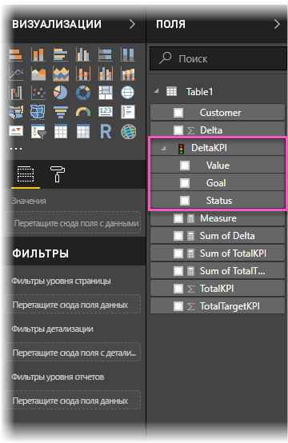
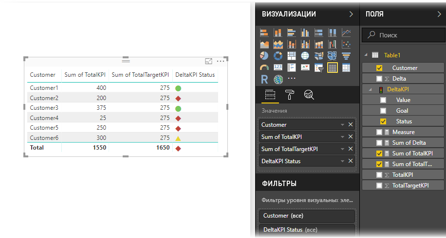

# Импорт и отображение ключевых показателей эффективности в Power BI
С помощью **Power BI Desktop** можно импортировать и отображать ключевые показатели эффективности в таблицах, матрицах и на картах.

Чтобы импортировать и отобразить ключевые показатели эффективности, выполните описанные ниже действия.

1. Начнем с книги Excel, которая содержит модель Power Pivot и ключевые показатели эффективности. В этом упражнении мы будем использовать книгу с именем *KPIs* (ключевые показатели эффективности).

1. Чтобы импортировать книгу, в Power BI, последовательно выберите **Файл -> Импорт -> Содержимое книги Excel**. Сведения о том, как импортировать книги, см. в [этой статье](../connect-data/desktop-import-excel-workbooks.md). 

1. Импортированный в Power BI ключевой показатель эффективности будет отображаться на панели **Поля**, отмеченный значком . Чтобы использовать ключевой показатель эффективности в отчете, разверните его содержимое и поля **Значение**, **Цель** и **Состояние**.

    

1. Импортированные ключевые показатели эффективности лучше всего использовать в стандартных визуализациях, например **табличного** типа. Power BI также включает тип визуализации **ключевого показателя эффективности**, который должен использоваться только для создания новых показателей.
   
    

Вот, собственно, и все. Ключевые показатели эффективности можно использовать для демонстрации тенденций, хода выполнения или других важных индикаторов.
