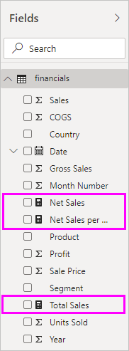

# <a name="create-measures-for-data-analysis-in-power-bi-desktop"></a>Создание мер для анализа данных в Power BI Desktop

Power BI Desktop помогает получать представление о ваших данных с помощью нескольких щелчков. Но иногда данные просто не содержат все необходимое для ответа на некоторые наиболее важные вопросы. Получить эти ответы можно с помощью мер.

Меры используются в некоторых наиболее распространенных методах анализа данных. Простые итоговые значения, такие как суммы, средние значения, минимумы, максимумы и счетчики, можно задать в области **Поля**. Вычисленные результаты мер всегда изменяются в ответ на взаимодействие с отчетами, что обеспечивает быстрый и динамический просмотр данных. Давайте рассмотрим это более подробно. Дополнительные сведения см. в статье [Создание вычисляемых мер](/learn/modules/model-data-power-bi/4b-create-calculated-measures).

## <a name="understanding-measures"></a>Основные сведения о мерах

В Power BI Desktop меры создаются и отображаются в *представлении отчетов* или в *представлении данных*. Меры, которые вы создали сами, отображаются в списке **Поля** со значком калькулятора. Вы можете давать мерам любые имена и добавлять их в новую или существующую визуализацию так же, как любое другое поле.



> [!NOTE]
> Вы также можете поэкспериментировать с *быстрыми мерами* — готовыми мерами, которые можно выбрать в диалоговых окнах. Они позволяют быстро создавать меры и знакомиться с синтаксисом языка выражений анализа данных DAX, так как их автоматически созданные формулы DAX доступны для просмотра. Дополнительные сведения см. в разделе [быстрые меры](desktop-quick-measures.md).
> 
> 

## <a name="data-analysis-expressions"></a>Выражения анализа данных

Меры вычисляют результат из формулы выражений. При создании собственных мер вы используете язык формул [Data Analysis Expressions](/dax/) (DAX). DAX включает библиотеку из более чем 200 функций, операторов и конструкций. Эта библиотека обеспечивает огромную гибкость при создании мер для вычисления результатов практически любого необходимого анализа данных.

Формулы DAX во многом похожи на формулы Excel. В DAX также имеется много функций, аналогичных функциям Excel, например `DATE`, `SUM` и `LEFT`. Но функции DAX предназначены для работы с реляционными данными, как те, что имеются в Power BI Desktop.

## <a name="lets-look-at-an-example"></a>Давайте рассмотрим пример.

Джен является менеджером по продажам в компании Contoso. Ее попросили предоставить прогноз продаж посредников на следующий финансовый год. Она решает строить свои оценки на объемах продаж за прошлый год с годовым ростом в 6 % благодаря различным рекламным акциям, запланированным на следующие шесть месяцев.

Чтобы создать отчет по оценкам, Джен импортирует данные о продажах за прошлый год в Power BI Desktop. Она находит поле **SalesAmount** в таблице **Продажи посредников**. Поскольку импортированные данные содержат только объемы продаж за прошлый год, Джен переименовывает поле **SalesAmount** в поле *Продажи за последний год*. Затем она перетаскивает поле **Продажи за последний год** на холст отчета. Это поле отображается в визуализации диаграммы как одно значение, представляющее собой сумму всех продаж торговых представителей за прошлый год.

Джен замечает, что, хотя вычисление не было задано, оно предоставлено автоматически. Power BI Desktop создал собственную меру путем суммирования всех значений в поле **Продажи за последний год**.

Но Джен нужна мера для расчета прогнозов продаж на будущий год, которая будет получена путем умножения объема продаж за последний год на 1,06, чтобы учесть ожидаемое увеличение на 6 процентов. Для этого вычисления она создает свою меру. С помощью функции *Создать меру* она создает новую меру и вводит следующую формулу DAX.

```dax
    Projected Sales = SUM('Sales'[Last Years Sales])*1.06
```

Затем Джен перетаскивает новую меру "Прогноз продаж" в диаграмму.


Очень быстро и с минимальными усилиями Джен получает меру для вычисления прогнозируемых продаж. Она может дальше анализировать свой прогноз, фильтруя данные по конкретным посредникам или добавляя другие поля в свой отчет.

## <a name="data-categories-for-measures"></a>Категории данных для мер

Вы можете выбрать категории данных для мер.

Помимо прочего, категории данных позволяют использовать меры, чтобы динамически создавать URL-адреса и помечать категории данных как URL-адреса веб-страниц.

Можно создавать таблицы, отображающие меры как URL-адреса веб-страниц, с возможностью щелкнуть URL-адрес, созданный на основе выбранных данных. Это особенно удобно, если вы хотите связать их с другими отчетами Power BI с помощью [параметров фильтра URL-адреса](../collaborate-share/service-url-filters.md).

## <a name="organizing-your-measures"></a>Упорядочение мер

Для мер используется таблица *Начальная*, которая определяет их расположение в списке полей. Вы можете изменить его, выбрав расположение из таблиц в модели.


Кроме того, поля в таблице можно упорядочить в *папки отображения*. Выберите **Модель** от левого края Power BI Desktop. В области **Свойства** выберите поле, которое необходимо переместить из списка доступных полей. Введите имя новой папки в **Папку для отображения** для создания папки. При создании папки в нее перемещается выбранное поле.


Для создания вложенных папок используйте символ обратной косой черты. Например, строка *Финансы\Валюты* создает папку *Финансы* с вложенной папкой *Валюты*.

Вы можете задать отображение поля в нескольких папках, воспользовавшись точкой с запятой для разделения имен папок. Например, строка вида *Продукты\Названия;Подразделения* приведет к отображению поля в папке *Подразделения*, а также в папке *Названия*, вложенной в папку *Продукты*.

Можно создать специальную таблицу, содержащую только меры. Эта таблица всегда появляется в верхней части **полей**. Для этого создайте таблицу только с одним столбцом. Чтобы сделать это, вы можете воспользоваться полем **Ввести данные**. Затем переместите меры в такую таблицу. Наконец, скройте созданный столбец (но не таблицу). Щелкните стрелку в верхней части **Поля**, чтобы закрыть и снова открыть список поля, чтобы увидеть изменения.


## <a name="learn-more"></a>Дополнительные сведения

Здесь представлены только краткие сведения о мерах. Множество других функций помогут вам научиться создавать свои собственные меры. Дополнительные сведения см. в статье [Учебник. Создание собственных мер в Power BI Desktop](desktop-tutorial-create-measures.md) Вы можете скачать пример файла и получить пошаговые инструкции по созданию дополнительных мер.  

Для более детального изучения DAX рекомендуется документ [Основные сведения о DAX в Power BI Desktop](desktop-quickstart-learn-dax-basics.md). В [справочнике по выражениям анализа данных](/dax/) находятся подробные статьи о каждой из функций, синтаксисе, операторах и соглашениях об именовании. DAX уже несколько лет используется в Power Pivot в Excel и SQL Server Analysis Services. Имеется также много других полезных и доступных ресурсов. Рекомендуется также посетить [вики-сайт Центра ресурсов DAX](https://social.technet.microsoft.com/wiki/contents/articles/1088.dax-resource-center.aspx), где влиятельные члены сообщества бизнес-аналитики делятся своими знаниями в области DAX.
