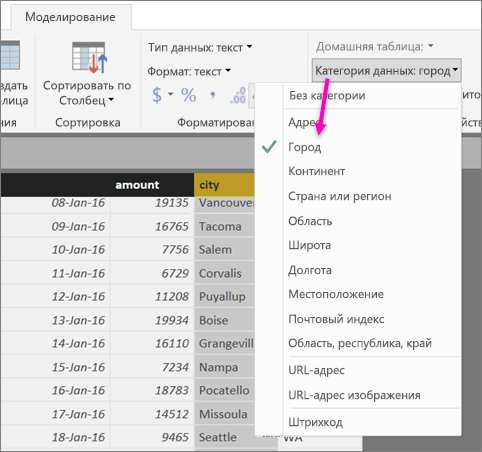
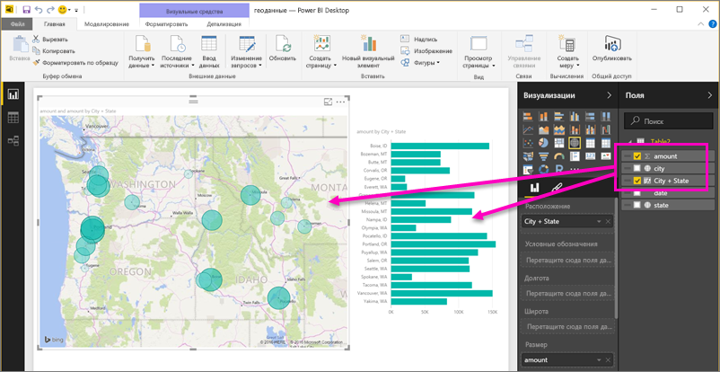
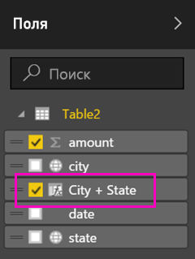
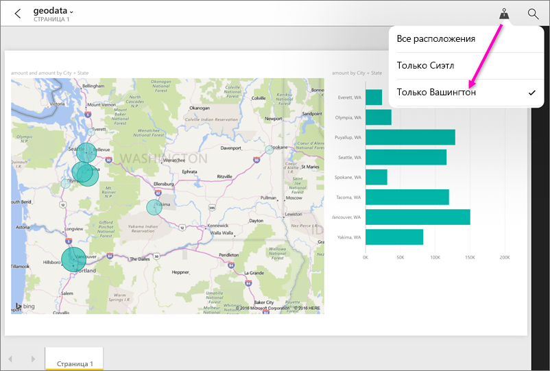

# Настройка географической фильтрации в Power BI Desktop для использования в мобильных приложениях
В Power BI Desktop можно [задать для столбца географическую категорию данных](desktop-data-categorization.md), чтобы приложение Power BI Desktop понимало, как интерпретировать соответствующие значения в визуальных элементах отчета. Кроме того, при просмотре соответствующего отчета мобильное приложение Power BI автоматически предлагает фильтры с учетом местоположения пользователя. 

Например, предположим, что вы — директор по продажам, который ездит в командировки для переговоров с клиентами, и вам бывает нужно быстро отфильтровать данные по общему объему продаж и выручки для клиента, с которым вы планируете встретиться. Вы хотите выбрать данные для своего текущего местоположения (например, по региону, городу или фактическому адресу). Потом, если у вас останется время, вы можете заглянуть и к другим клиентам, которые расположены поблизости. Вы можете [отфильтровать отчет по своему местоположению, чтобы найти соответствующих клиентов](../consumer/mobile/mobile-apps-geographic-filtering.md).

> [!NOTE]
> В мобильном приложении фильтровать данные по географическому расположению можно только в том случае, если названия географических объектов в отчете указаны на английском языке (например, New York City или Germany).
> 
> 

## Определение географических данных в отчете
1. В Power BI Desktop перейдите в представление данных. .
2. Выберите столбец, содержащий географические данные, например "Город".
   
    
3. На вкладке **Моделирование** выберите **Категория данных** и укажите подходящую категорию (в нашем примере — **Город**).
   
    
4. Затем вы можете задать географическую категорию и для других полей в модели. 
   
   > [!NOTE]
   > Для каждой категории данных в модели можно выбрать несколько столбцов, однако в этом случае модель не сможет фильтровать данные по географическому признаку в мобильном приложении Power BI. Для использования географической фильтрации в мобильных приложениях выберите для каждой категории данных не больше одного столбца (например, один столбец **Город**, один — **Область, республика, край**, а один — **Страна**). 
   > 
   > 

## Создание визуальных элементов с помощью географических данных
1. Перейдите в представление отчетов и создайте визуальные элементы, использующие географические поля в данных. 
   
    
   
    В этом примере модель также содержит вычисляемый столбец, в котором объединены город и штат. Сведения о создании вычисляемых столбцов в Power BI Desktop см. [здесь](desktop-calculated-columns.md).
   
    
2. Опубликуйте отчет в службе Power BI.

## Просмотр отчетов в мобильном приложении Power BI
1. Откройте отчет в любом из [мобильных приложений Power BI](../consumer/mobile/mobile-apps-for-mobile-devices.md).
2. Если вы находитесь в каком-либо географическом расположении, данные о котором содержатся в отчете, программа может отфильтровать их автоматически.
   
    

Дополнительные сведения о [фильтровании отчетов по расположению в мобильных приложениях Power BI](../consumer/mobile/mobile-apps-geographic-filtering.md).

## Дальнейшие действия
* [Категоризация данных в Power BI Desktop](desktop-data-categorization.md)  
* У вас появились вопросы? [Попробуйте задать вопрос в сообществе Power BI.](https://community.powerbi.com/)
