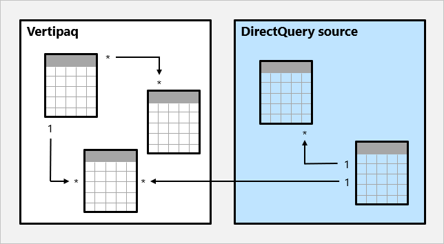

# Связи модели в Power BI Desktop

В этой статье описываются средства моделирования данных импорта, работающие с Power BI Desktop. Это важная тема в сфере разработки моделей, знание которой необходимо, чтобы создавать простые, точные и оптимальные модели.

Подробное обсуждение оптимальной архитектуры моделей, в том числе табличных ролей и связей, см. в статье [Общие сведения о схеме типа "звезда" и ее значении в Power BI](../guidance/star-schema.md).

## Назначение связей

Простыми словами, связи в Power BI распространяют фильтры, примененные к столбцам в таблицах моделей, на другие таблицы моделей. Распространение фильтров занимает много времени, так как есть пути связей, которых необходимо придерживаться, и они могут предусматривать распространение на несколько таблиц.

Пути связей детерминированы. Это значит, что фильтры всегда распространяются одинаково в непроизвольной последовательности. Но связи можно отключать. Можно также изменять контекст их фильтров через вычисления в модели, которые используют определенные функции DAX. Дополнительные сведения см.в разделе [Соответствующие функции DAX](#relevant-dax-functions) далее в этой статье.

> [!IMPORTANT]
> Важно понимать, что связи модели не обеспечивают целостность данных. Дополнительные сведения см.в разделе [Вычисление связей](#relationship-evaluation) далее в этой статье. В этом разделе объясняется поведение связей моделей при проблемах с целостностью данных.

Рассмотрим, как связи распространяют фильтры, на анимированном примере.

В этом примере модель состоит из четырех таблиц: **Категория**, **Продукт**, **Год** и **Продажи**. Таблица **Категория** связана с таблицей **Продукт**, а **Продукт** — с таблицей **Продажи**. Таблица **Год** также связана с таблицей **Продажи**. Все связи работают по принципу "одна ко многим" (подробности представлены далее в этой статье).

В запросе (возможно, созданном визуальным элементом карточки Power BI) требуется общее количество проданного по заказам на продажу, сделанным в одной категории (**Cat-A**) и в течение одного года (**CY2018**). Вот почему показаны фильтры, примененные к таблицам **Категория** и **Год**. Фильтр в таблице **Категория** распространяется на таблицу **Продукт**, изолируя два продукта, назначенных категории **Cat-A**. Затем фильтры таблицы **Продукт** распространяются на таблицу **Продажи**, чтобы изолировать только две строки продаж для этих продуктов. Эти две строки представляют продажи продуктов, назначенных категории **Cat-A**. Их суммарное количество — 14 единиц. В то же время фильтр таблицы **Год** распространяется для дальнейшего фильтрования таблицы **Продажи**. В результате будет только одна строка продаж для продуктов, назначенных категории **Cat-A** и заказанных в году **CY2018**. Значение количества, возвращаемое запросом, равно 11 единицам. Обратите внимание, что если к таблице применить несколько фильтров (как к таблице **Продажи** в этом примере), всегда выполняется операция AND, при которой требуется, чтобы у всех условий было значение true.

### Несвязанные таблицы

Нередко бывают таблицы модели, которые не соединены с другими таблицами. Такую таблицу в допустимом проекте модели можно описать как _несвязанную таблицу_. Несвязанные таблицы не предназначены для распространения фильтров на другие таблицы модели. Они принимают вводимые пользователем данные (возможно, с помощью визуального элемента среза), благодаря чему вычисления модели могут эффективно использовать входное значение. Например, рассмотрим несвязанную таблицу, в которую загружен диапазон значений валютного курса. Поскольку фильтр применяется по одному значению курса, это значение можно использовать в выражении меры для преобразования значений продаж.

Параметр what-if в Power BI Desktop позволяет создать несвязанную таблицу. Дополнительные сведения см. в статье [Создание и использование параметров What if для визуализации переменных в Power BI Desktop](desktop-what-if.md).

## Свойства связей

Связь модели соединяет один столбец в таблице с другим столбцом в другой таблице. (Есть одно исключение, когда это требование не соблюдается, и оно относится только к связям с несколькими столбцами в моделях DirectQuery. Дополнительные сведения см. в статье о функции DAX [COMBINEVALUES](/dax/combinevalues-function-dax).)

> [!NOTE]
> Невозможно связать один столбец с другим столбцом _в одной и той же таблице_. Иногда это путают с возможностью определять ограничение (ссылку таблицы на саму себя) для внешнего ключа реляционной базы данных. Эту концепцию реляционной базы данных можно использовать для хранения отношений "родительский — дочерний элемент"(например, каждую запись сотрудника связать с руководителем). Формирование иерархии модели на основе этого типа связи невозможно выполнить путем создания связей в модели. Дополнительные сведения о том, как это сделать, см. в статье [Родительские и дочерние функции](/dax/parent-and-child-functions-dax).

### Кратность

Связь между моделями должна быть определена с помощью типа кратности. Есть четыре варианта типа кратности, представляющие характеристики данных связанных столбцов отправителя и получателя. Одна сторона означает, что в столбце содержатся уникальные значения, а две стороны — что в столбце могут содержаться дублирующиеся значения.

> [!NOTE]
> Если при обновлении данных происходит попытка загрузить дублирующиеся значения в "односторонний" столбец, вся операция завершится ошибкой.

Четыре варианта типа вместе с их сокращениями:

- одна ко многим (1:\*);
- много к одной (\*:1);
- одна к одной (1:1);
- много ко многим (\*:\*).

При создании связи в Power BI Desktop конструктор автоматически обнаруживает и устанавливает тип кратности. Конструктор запрашивает модель, чтобы узнать, какие столбцы содержат уникальные значения. Для моделей импорта используется внутренняя статистика хранилища. Для моделей DirectQuery отправляются запросы профилирования в источник данных. Но иногда это может привести к неправильному получению. Это происходит потому, что в таблицы еще не загружены данные или в столбцах, где должны содержаться повторяющиеся значения, сейчас содержатся уникальные значения. В любом случае можно обновить тип кратности, предоставив "односторонние"столбцы с уникальными значениями (или подождать, когда в таблицу будут загружены строки данных).

Параметры кратности **одна ко многим** и **много к одной** в основном одинаковы. Это самые распространенные типы кратности.

При настройке связи "одна ко многим" или "много к одной" можно выбрать ту, которая соответствует порядку, в котором связаны столбцы. Обдумайте, как бы вы настроили связь таблиц **Продукт** и **Продажи**, используя содержащийся в них столбец **ProductID**. Здесь будет тип кратности _одна ко многим_, так как в столбце **ProductID** в таблице **Продукт** содержатся уникальные значения. Если вы связали таблицы в обратном направлении, **Продажи** с **Продукт**, то кратность будет _много к одной_.

Связь **одна к одной** означает, что оба столбца содержат уникальные значения. Это самый нераспространенный тип кратности. Скорее всего, он представляет собой неоптимальную структуру модели из-за хранения избыточных данных. Дополнительные сведения об использовании этого типа кратности см. в статье [Руководство по связям типа "один к одному"](../guidance/relationships-one-to-one.md).

Связь **много ко многим** означает, что все столбцы содержат дублирующиеся значения. Этот тип кратности используется редко. Обычно он полезен при проектировании моделей со сложными требованиями. Указания по использованию этого типа кратности см. в статье [Руководство по связи "многие ко многим"](../guidance/relationships-many-to-many.md).

> [!NOTE]
> Тип кратности "много ко многим" сейчас не поддерживается для моделей, разработанных для Сервера отчетов Power BI.

> [!TIP]
> В представлении модели Power BI Desktop можно выяснить тип кратности связи, просмотрев индикаторы (1 или \*) с любой стороны линии связи. Чтобы определить связанные столбцы, необходимо выбрать линию связи, чтобы выделить столбцы, или навести на нее указатель мыши.

### Направление кроссфильтрации

Каждая связь модели должна быть определена с использованием направления кроссфильтрации. Выбор определяет направления, в которых будут распространяться фильтры. Возможные варианты кроссфильтрации зависят от типа кратности.

| Тип кратности | Варианты кроссфильтрации |
| --- | --- |
| "Одна ко многим" (или "много к одной") | Однонаправленная Оба |
| "Одна к одной" | Оба |
| "Много ко многим" | Однонаправленная (таблица 1 к таблице 2) Однонаправленная (таблица 2 к таблице 1) Оба |

_Однонаправленная_ кроссфильтрация означает одно направление, а _Оба_ — оба направления. Связь, которая фильтруется в обоих направлениях, обычно описывают как _двунаправленную_.

Для связей типа "одна ко многим" направление кроссфильтрации всегда исходит с одной стороны, а при необходимости — с нескольких сторон (двунаправленное). Для связей типа "одна к одной" направление кроссфильтрации всегда исходит от всех таблиц. Наконец, для связей "много ко многим" направление кроссфильтрации может исходить либо от одной из таблиц, либо от всех. Обратите внимание, что если тип кратности включает одну сторону, фильтры всегда будут распространяться с нее.

Если для направления перекрестной фильтрации задано **Оба**, то доступно дополнительное свойство. Используя которое вы сможете применять двунаправленную фильтрацию, когда задействуете правила безопасности на уровне строк (RLS). Дополнительные сведения о RLS см. в статье [Ограничение доступа к данным с помощью безопасности на уровне строк (RLS) для Power BI Desktop](../create-reports/desktop-rls.md).

Изменение направления кроссфильтрации для связи (в том числе отключение распространения фильтра) также может выполняться через вычисление для модели. Для этого используют функцию DAX [CROSSFILTER](/dax/crossfilter-function).

Двунаправленные связи могут отрицательно влиять на производительность. Кроме того, попытка настроить двунаправленную связь может привести к неоднозначным путям распространения фильтра. В этом случае Power BI Desktop может не зафиксировать изменение связи и выдаст предупреждение с сообщением об ошибке. Но иногда в Power BI Desktop допускается определение неоднозначных путей для связей между таблицами. Правила приоритета, влияющие на обнаружение неоднозначности и разрешение пути, описаны далее в этой статье в разделе [Правила приоритета](#precedence-rules).

Рекомендуется использовать двунаправленную фильтрацию только при необходимости. Дополнительные сведения см. в [Руководство по двунаправленным связям](../guidance/relationships-bidirectional-filtering.md).

> [!TIP]
> В представлении модели Power BI Desktop можно узнать направление кроссфильтрации связи по стрелкам на линии связи. Одинарной стрелкой обозначается однонаправленный фильтр в направлении указателя. Двойная стрелка — это двунаправленная связь.

### Активировать связь

Между двумя таблицами модели может быть только один активный путь распространения фильтра. Тем не менее можно ввести дополнительные пути связи, но все эти связи должны быть настроены как _неактивные_. Неактивные связи можно активировать только во время вычисления при расчете в модели. Для этого используют функцию DAX [USERELATIONSHIP](/dax/userelationship-function-dax).

Дополнительные сведения см. в статье [Руководство по активным и неактивным связям](../guidance/relationships-active-inactive.md).

> [!TIP]
> В представлении модели Power BI Desktop можно выяснить состояние связи: активное или неактивное. Активная связь обозначается сплошной линией, а неактивная — пунктирной.

### Предполагать целостность данных

Свойство _Предполагать целостность данных_ доступно только для связей типа "одна ко многим" и "одна к одной" между двумя таблицами с режимом хранения DirectQuery, у которых один и тот же источник данных. Если это свойство включено, машинные запросы, отправляемые к источнику данных, объединят две таблицы с использованием семантики INNER JOIN, а не OUTER JOIN. В общем включение этого свойства позволит увеличить производительность запросов, хотя она и зависит в большей степени от конкретных параметров источника данных.

Всегда включайте это свойство, если между двумя таблицами существует ограничение внешнего ключа базы данных. Если такого ограничения нет, все равно можно включить свойство при условии наличия определенной целостности данных.

> [!IMPORTANT]
> Если целостность данных будет нарушена, внутреннее соединение исключит несовпадающие строки между таблицами. Например, рассмотрим таблицу модели **Продажи** со значением столбца **Идентификатор продукта**, которого нет в связанной таблице **Продукт**. Если распространить фильтр таблицы **Продукт** на таблицу **Продажи**, будут исключены строки продаж для неизвестных продуктов. Это повлечет неполное получение результатов продаж.
>
> Дополнительные сведения см. в статье [Применение параметра "Предполагать целостность данных" в Power BI Desktop](../connect-data/desktop-assume-referential-integrity.md).

## Применимые функции DAX

Есть несколько функций DAX, применимых к связям моделей. Каждая функция описана вкратце в следующем маркированном списке:

- [RELATED](/dax/related-function-dax): извлекает значение с одной стороны.
- [RELATEDTABLE](/dax/relatedtable-function-dax): получает таблицы строк с нескольких сторон.
- [USERELATIONSHIP](/dax/userelationship-function-dax): обеспечивает принудительное использование конкретной неактивной связи модели.
- [CROSSFILTER](/dax/crossfilter-function): изменяет направление кроссфильтрации для связи (на одно (one) или все (both)) или отключает распространение фильтра (none).
- [COMBINEVALUES](/dax/combinevalues-function-dax): объединяет две текстовые строки в одну. Эта функция предназначена для обеспечения поддержки связей для нескольких столбцов в моделях DirectQuery.
- [TREATAS](/dax/treatas-function): применяет результат табличного выражения в качестве фильтров к столбцам несвязанной таблицы.
- [Родительские и дочерние функции](/dax/parent-and-child-functions-dax): семейство связанных функций, которые можно использовать, чтобы создавать вычисляемые столбцы и натурализовать иерархию типа "родительский — дочерний элемент". Эти столбцы затем можно использовать для создания иерархии с фиксированными уровнями.

## Вычисление связей

С точки зрения вычислений различают _надежные_ и _слабые_ связи модели. Это свойство связи нельзя настроить. Фактически оно выводится из типа кратности и источника данных двух связанных таблиц. Важно знать тип вычисления, так как в случае нарушения целостности данных могут возникнуть проблемы с производительностью или последствия. Эти проблемы и последствия описаны ниже в этом разделе.

Во-первых, для полного понимания вычисления связей необходимо ознакомиться с теорией моделирования.

Модель импорта или DirectQuery берет все свои данные из кэша Vertipaq или из исходной базы данных. В обоих случаях Power BI может определить, если у связи одна сторона.

Тем не менее составная модель может включать в себя таблицы, использующие различные режимы хранения (импорт, DirectQuery или двойной) или несколько источников DirectQuery. Каждый источник, в том числе кэш Vertipaq данных импорта, считается _островом данных_. Связи модели можно классифицировать как _внутренние_ и _межостровые_. Внутренняя связь — это отношение, которое связывает две таблицы на острове данных, а межостровная связь — таблицы разных островов. Обратите внимание, что связи в моделях импорта или DirectQuery всегда находятся внутри острова.

Рассмотрим пример составной модели.

В этом примере составная модель включает в себя два острова: остров данных Vertipaq и остров исходных данных DirectQuery. Остров данных Vertipaq содержит три таблицы, а остров исходных данных DirectQuery — две. Есть одна межостровная связь, позволяющая связать таблицу на острове данных Vertipaq с таблицей на острове исходных данных DirectQuery.

### Сильные связи

Когда обработчик запросов может определить одну сторону связи, модель называется _сильной_. Это подтверждает то, что в столбце одной стороны содержатся уникальные значения. Все отношения типа "одно ко многим" внутри острова являются сильными.

На примере ниже показаны две сильные связи, помеченные как **S**. Отношения включают в себя связь "одна ко многим", содержащуюся на острове Vertipaq, и связь "одна ко многим", содержащуюся в источнике DirectQuery.

В моделях импорта, где все данные хранятся в кэше Vertipaq, для каждой сильной связи во время обновления создается структура данных. Структуры данных состоят из индексированных сопоставлений всех значений одного столбца к другому. Эти структуры предназначены ускорять объединение таблиц во время выполнения запросов.

Во время выполнения запросов сильные связи позволяют выполнять _расширение таблиц_. Расширение таблиц приводит к созданию виртуальной таблицы путем включения собственных столбцов базовой таблицы и последующего расширения в связанных таблицах. Для расширения таблиц импорта используется обработчик запросов. Для расширения таблиц DirectQuery используется машинный запрос, который отправляется в базу данных-источник (если свойство **Предполагать целостность данных** не включено). Затем обработчик запросов работает над расширенной таблицей, применяя фильтры и группируя по значениям в ее столбцах.

> [!NOTE]
> Неактивные связи также расширяются, даже если связь не используется при вычислении. Двунаправленные связи не влияют на расширение таблицы.

Для связей типа "один ко многим" расширение таблицы происходит с нескольких сторон к одной с использованием семантики "левое внешнее соединение". Если соответствующее значение с нескольких сторон к одной не существует, на одну сторону таблицы будет добавлена пустая виртуальная строка.

Расширение таблицы также происходит для связей типа "одна к одной" внутри острова, но с использованием семантики FULL OUTER JOIN. Это гарантирует, что при необходимости пустые виртуальные строки добавятся с необходимой стороны.

Пустые виртуальные строки фактически являются _неизвестными элементами_. Неизвестные элементы представляют нарушения целостности данных, где значение нескольких сторон не имеет соответствующего значения на одной стороне. В идеале этих пустых строк не должно существовать, и их можно устранить путем очистки или восстановления исходных данных.

Давайте рассмотрим, как работает расширение таблицы, на анимированном примере.

В этом примере модель состоит из трех таблиц: **Категория**, **Продукт** и **Продажи**. Таблица **Категория** связана с таблицей **Продукт** с отношением "одна ко многим", а таблица **Продукт** — с таблицей **Продажи** с отношением "одна ко многим". В таблице **Категория** содержатся две строки, в таблице **Продукт** — три, а в **Продажи** — пять строк. Совпадающие значения со всех сторон всех связей означают отсутствие нарушений целостности данных. Создана расширенная таблица времени выполнения запроса. Таблица состоит из столбцов всех трех таблиц. Это фактически денормализованная перспектива данных, содержащихся в трех таблицах. В таблицу **Продажи** добавлена новая строка со значением рабочего идентификатора (9), для которого нет соответствующего значения в таблице **Продукт**. Это нарушение целостности данных. В расширенной таблице в новой строке будут (пустые) ячейки значений для столбцов **Категория** и **Продукт**.

### Слабые связи

Связь модели считается _слабой_, если нет гарантированной одной стороны. Это может быть в двух случаях:

- Связь использует тип кратности "много ко многим" (даже если в одном или всех столбцах содержатся уникальные значения).
- Связь является межостровной (что может быть только в случае с составными моделями).

На примере ниже показаны две слабых связи, помеченные как **W**. Два отношения включают в себя связь "много ко многим", содержащуюся на острове Vertipaq, и межостровую связь "одна ко многим".

Для моделей импорта структуры данных никогда не создаются для слабых связей. Это означает, что соединения таблиц должны быть выполнены во время выполнения запроса.

При слабых связях никогда не происходит расширение таблиц. Соединения таблиц выполняются с использованием семантики INNER JOIN. По этой причине пустые виртуальные строки не добавляются для компенсации нарушений целостности данных.

Существуют дополнительные ограничения, связанные со слабыми связями:

- Функцию DAX RELATED нельзя использовать для получения значений столбца одной стороны.
- Есть ограничения топологии при принудительном применении RLS.

> [!NOTE]
> В представлении модели Power BI Desktop не всегда можно определить тип связи модели: сильная или слабая. Связь "много ко многим" всегда будет слабой, как и связь "одна ко многим", если она между островами. Чтобы определить, является ли эта связь межостровной, необходимо проверить режимы хранения таблиц и источники данных, чтобы у них было правильное определение.

### Правила приоритета

Двунаправленные связи могут приводить к нескольким и, следовательно, неоднозначным путям распространения фильтров между таблицами модели. В списке ниже перечислены правила приоритета, которые используются в Power BI для обнаружения неоднозначности и разрешения пути:

1. Связи типа "много к одной" и "одна к одной", в том числе слабые.
2. Связи "много ко многим".
3. Двунаправленные связи в обратном направлении (т. е. с нескольких сторон).

### Производительность

В списке ниже указаны характеристики, обеспечивающие производительность распространения фильтров в порядке от самого быстрого до самого медленного:

1. Связи "одна ко многим" внутри острова.
2. Связи с кратностью "много ко многим".
3. Связи модели "много ко многим", полученные с использованием промежуточной таблицы, у которой есть хотя бы одна двунаправленная связь.
4. Межостровные связи.

## Дальнейшие действия

Дополнительные сведения по этим вопросам см. в следующих ресурсах.

- [Общие сведения о схеме типа "звезда" и ее значении в Power BI](../guidance/star-schema.md)
- [Руководство по связям типа "один к одному"](../guidance/relationships-one-to-one.md)
- [Руководство по связи "многие ко многим"](../guidance/relationships-many-to-many.md)
- [Руководство по активным и неактивным связям](../guidance/relationships-active-inactive.md)
- [Руководство по двунаправленным связям](../guidance/relationships-bidirectional-filtering.md)
- [Руководство по устранению неполадок со связями](../guidance/relationships-troubleshoot.md)
- Видео. [Рекомендации и запреты при использовании связей в Power BI](https://www.youtube.com/watch?v=78d6mwR8GtA)
- У вас появились вопросы? [Попробуйте задать вопрос в сообществе Power BI.](https://community.powerbi.com/)
- У вас есть предложения? [Идеи по улучшению Power BI](https://ideas.powerbi.com/)
