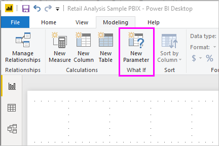
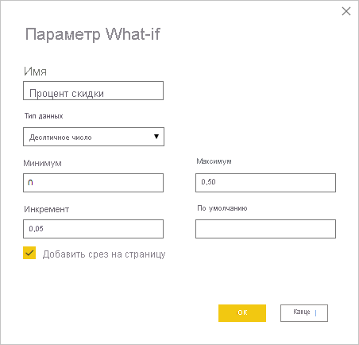
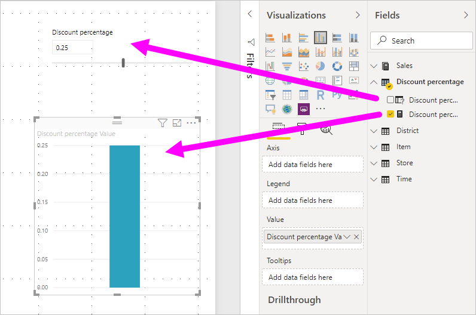
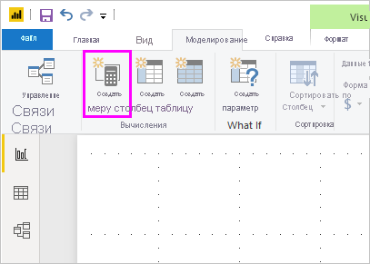
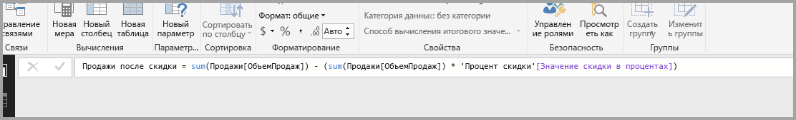
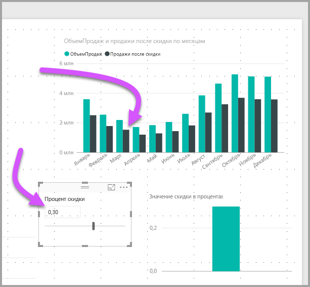

# Создание и использование параметров What if для визуализации переменных в Power BI Desktop

Начиная с августа 2018 г. в *Power BI Desktop* можно создавать переменные *what-if* для отчетов, взаимодействовать с переменной в качестве среза, визуализировать различные ключевые значения в отчетах и определять их количество.

Создайте параметр *what-if* на вкладке **Моделирование** в Power BI Desktop. После перехода на эту вкладку откроется диалоговое окно, где можно настроить этот параметр.

## Создание параметра what-if

Чтобы создать параметр what-if, выберите **Создать параметр** на вкладке **Моделирование** в Power BI Desktop. На следующем рисунке видно, что мы создали параметр с именем *Процент скидки* и задали для него тип **Десятичное число**. **Минимальное** значение — ноль. **Максимальное** — 0,50 (50 процентов). Мы также настроили **шаг приращения** 0,05 или 5 %. Именно с таким шагом параметр будет корректироваться при взаимодействии в отчете.

> [!NOTE]
> Убедитесь, что вы поставили перед десятичным числом ноль, например 0,50, а не просто ,50. В противном случае число не будет проверено, а кнопка **ОК** будет неактивна.
> 
> 

Для вашего удобства при установке флажка **Добавить срез на эту страницу** срез с вашим параметром what-if автоматически помещается на текущую страницу отчета.

Помимо создания этого параметра, при создании параметра what-if также создается мера, которую можно использовать для визуализации текущего значения параметра what-if.

Обратите внимание, что после создания параметра what-if и параметр и мера становятся частью вашей модели. Они доступны в пределах отчета и могут использоваться на других страницах отчета. И поскольку они являются частью модели, то можно удалить срез со страницы отчета. Если вы хотите восстановить его, просто возьмите параметр what-if из списка **Поля** и перетащите его на холст, а затем измените визуальный элемент на срез.

## Использование параметра what-if

Давайте создадим простой пример использования параметра what-if. Мы создали параметр what-if в предыдущем разделе. Теперь мы используем его, создав новую меру, значение которой изменяется с помощью ползунка.

Новая мера будет отражать общий объем продаж с примененной скидкой. Вы можете создавать сложные и интересные меры, которые дадут тем, кто использует ваши отчеты, возможность визуализировать переменную параметра what-if. Например, можно создать отчет, позволяющий торговым представителям увидеть свое вознаграждение за достижение определенных целевых показателей или процентов по продажам или же влияние увеличения продаж на повышение скидок.

Введите формулу меры в строку формул и назовите ее *Продажи после скидки*.

Затем создаем визуальный элемент столбца со значением **OrderDate** на оси и используем **SalesAmount** и созданную меру **Продажи после скидки** в качестве значений.

Затем мы передвигаем ползунок и видим, что в колонке **Продажи после скидки** отображается объем продаж со скидкой.

Вот, собственно, и все. Параметры what-if можно использовать в разных ситуациях. Они предоставляют пользователям отчетов возможность взаимодействовать с разными сценариями, которые в них создаются.
