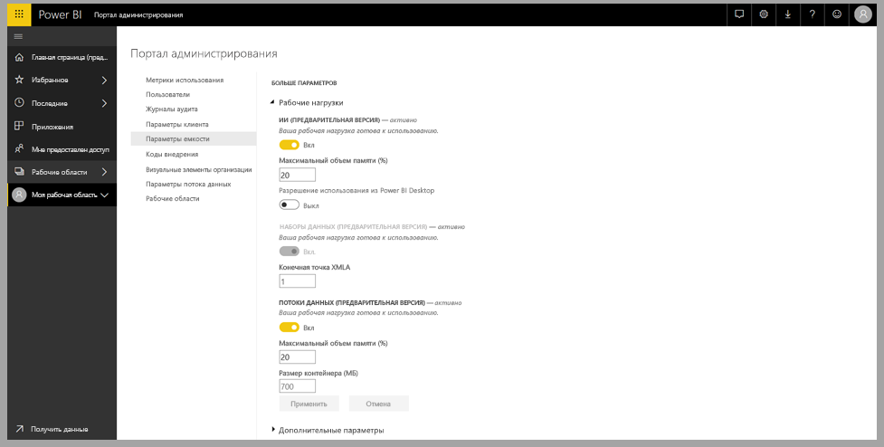
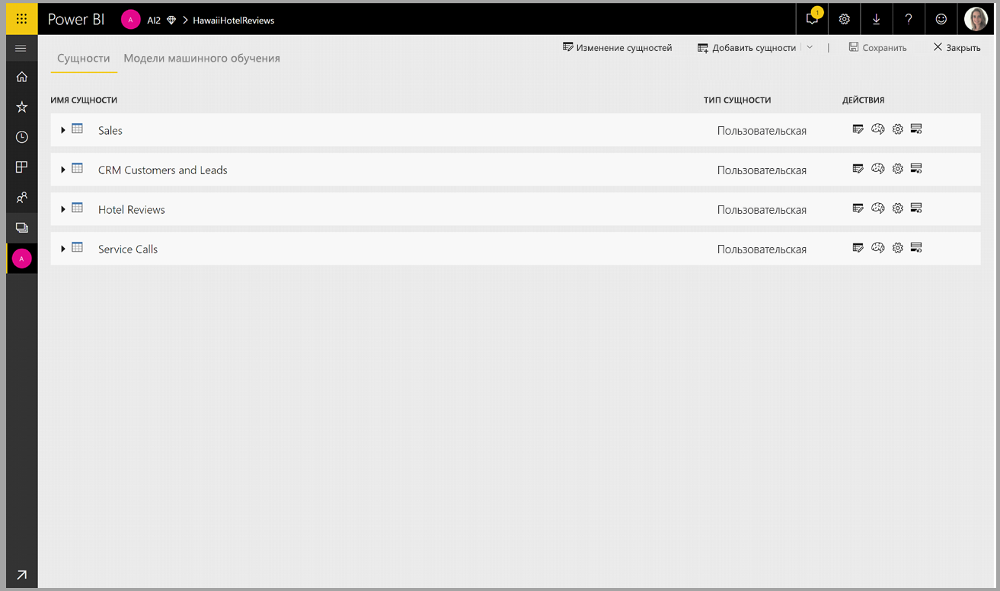
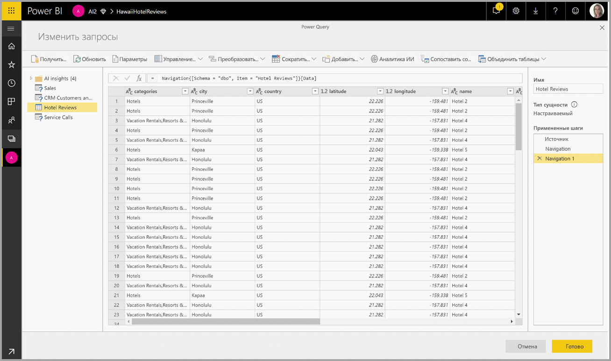
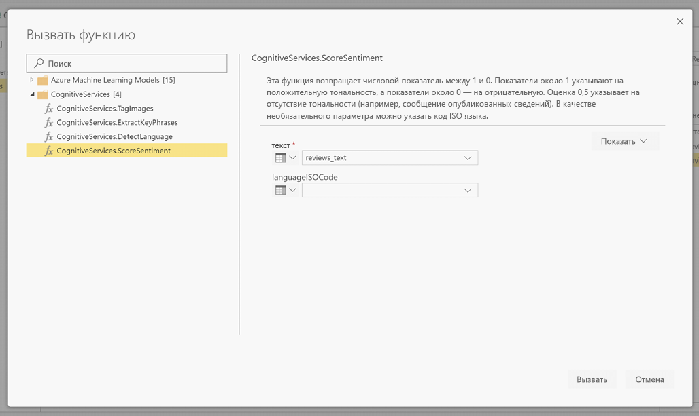
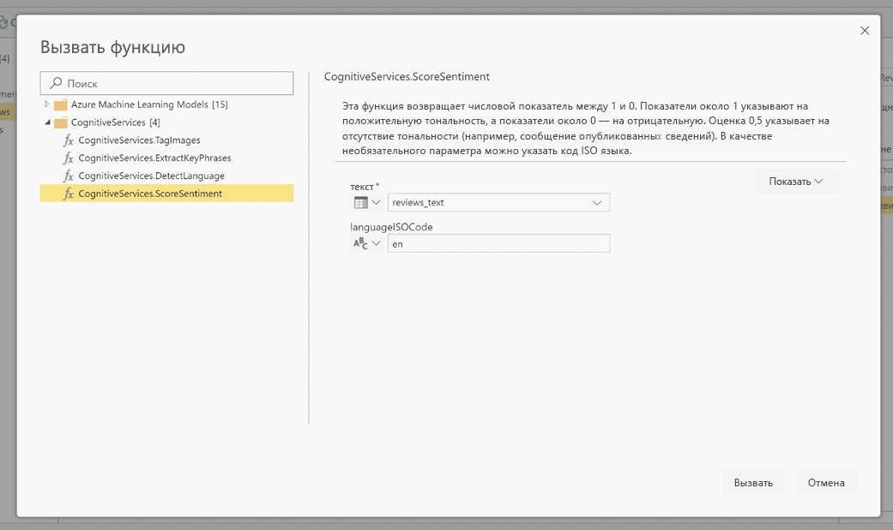
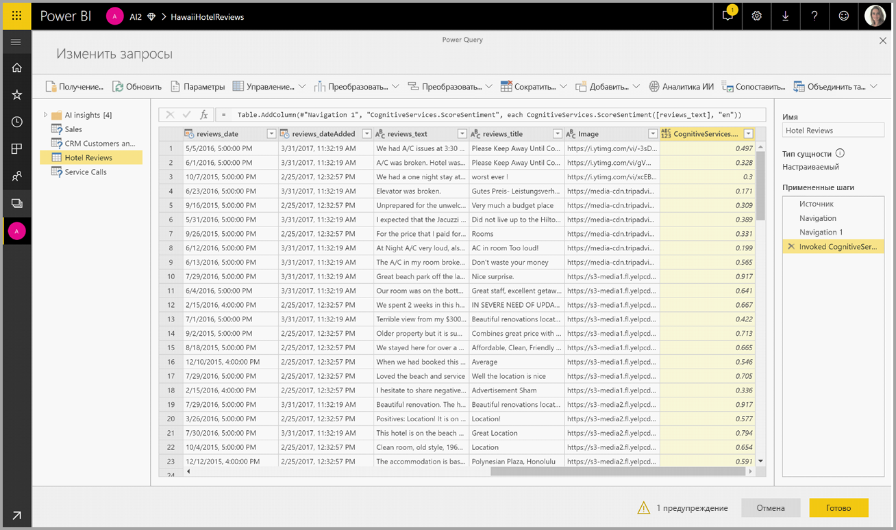
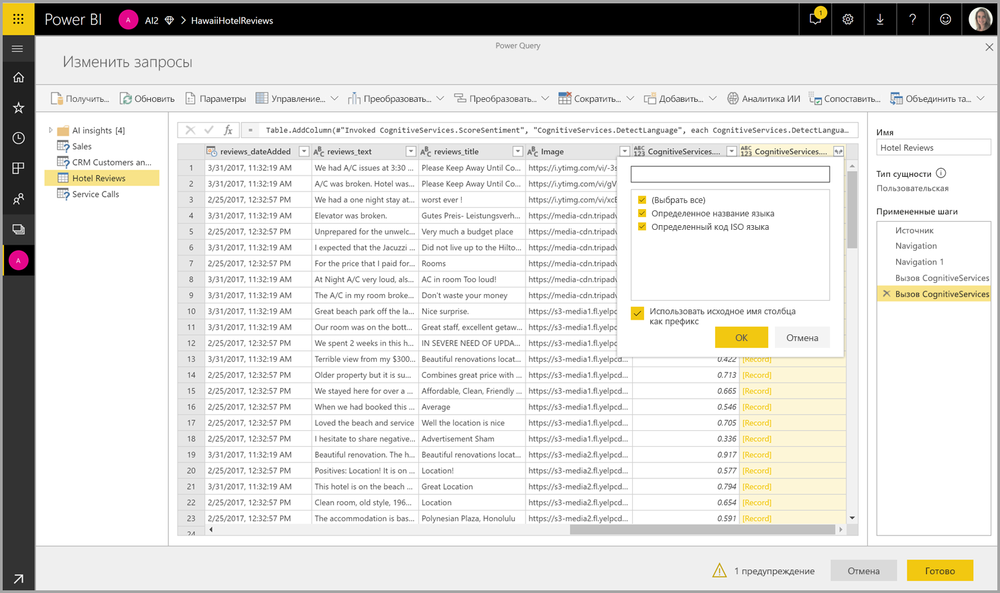

# Использование Cognitive Services в Power BI 

С помощью Cognitive Services в Power BI можно применять различные алгоритмы из [Azure Cognitive Services](https://azure.microsoft.com/services/cognitive-services/), чтобы дополнить данные при самостоятельной подготовке данных для потоков данных.

Сейчас поддерживаются службы [анализа тональности](https://docs.microsoft.com/azure/cognitive-services/text-analytics/how-tos/text-analytics-how-to-sentiment-analysis), [извлечения ключевых фраз](https://docs.microsoft.com/azure/cognitive-services/text-analytics/how-tos/text-analytics-how-to-keyword-extraction), [распознавания языка](https://docs.microsoft.com/azure/cognitive-services/text-analytics/how-tos/text-analytics-how-to-language-detection) и [добавления тегов к изображению](https://docs.microsoft.com/azure/cognitive-services/computer-vision/concept-tagging-images). Преобразования выполняются в службе Power BI, для чего не требуется подписка на Azure Cognitive Services. Эта функция доступна в Power BI Premium.

## **Включение функций искусственного интеллекта**

Поддержка Cognitive Services обеспечивается такими узлами емкости Premium, как EM2, A2 или P1 и более производительными. В емкости используется отдельная рабочая нагрузка искусственного интеллекта для запуска Cognitive Services. На этапе общедоступной предварительной версии (до июня 2019 г.) эта рабочая нагрузка была по умолчанию отключена. Прежде чем использовать Cognitive Services в Power BI, необходимо включить рабочую нагрузку искусственного интеллекта в настройках емкости на портале администрирования. Включить рабочую нагрузку искусственного интеллекта можно в разделе рабочих нагрузок. При этом необходимо задать максимальный объем памяти для нее. Рекомендуется выделять для нее не более 20 %. Превышение этого объема приведет к замедлению обработки запросов.

## **Начало работы с Cognitive Services в Power BI**

Выполняемые Cognitive Services преобразования являются частью [самостоятельной подготовки данных для потоков данных](https://powerbi.microsoft.com/blog/introducing-power-bi-data-prep-wtih-dataflows/). Чтобы дополнить данные с помощью Cognitive Services, сперва откорректируйте поток данных.

В верхней ленте редактора Power Query нажмите кнопку **Аналитика ИИ**.

Во всплывающем окне выберите функцию, которую вы хотите использовать, и данные для преобразования. В этом примере выполняется оценка намерения в столбце, содержащем текст для проверки.

**Cultureinfo** — это необязательные входные данные для определения языка текста. В этом поле необходимо указать код языка по стандарту ISO. В качестве входных данных для Cultureinfo можно задать текст столбца или выбрать значение самостоятельно. В этом примере для всего столбца задан английский язык (en). Если оставить это поле пустым, Power BI автоматически определит язык перед применением функции. Нажмите **Вызвать**.

После вызова функции результат добавляется в таблицу в новом столбце. Преобразование также отображается как примененный шаг в запросе.

Если функция возвращает несколько полей выходных данных, добавляется новый столбец с записью нескольких полей выходных данных.

Разверните столбец, чтобы добавить к данным одно или оба значения в виде столбцов.

## **Доступные функции**

В этом разделе описаны функции, доступные в Cognitive Services в Power BI.

### **Определение языка**

Функция определения языка оценивает введенный текст и для каждого поля возвращает название языка и его код ISO. Эту функция удобно использовать для столбцов данных с произвольным текстом, язык которого неизвестен. Входные данные функции должны быть в текстовом формате.

API анализа текста распознает до 120 языков. Дополнительные сведения см. в статье [Поддержка языков и регионов в API анализа текста](https://docs.microsoft.com/azure/cognitive-services/text-analytics/text-analytics-supported-languages).

### **Извлечение ключевых фраз**

Функция **Извлечь ключевые фразы** оценивает неструктурированный текст и для каждого текстового поля возвращает список ключевых фраз. В качестве входных данных для функции требуется текстовое поле или необязательный параметр **Cultureinfo**. (См. раздел **Начало работы с Cognitive Services в Power BI** этой статьи).

Извлечение ключевых фраз лучше работает с большими фрагментами текста, тогда как анализ тональности более эффективен при использовании небольших фрагментов текста. Чтобы оптимизировать результаты обеих операций, готовьте входные данные соответствующим образом.

### **Оценка тональности**

Функция **Score Sentiment** (Оценка тональности) оценивает введенный текст и возвращает оценку тональности для каждого документа в диапазоне от 0 (негативная) до 1 (позитивная). Эта функция полезна при определении положительных и отрицательных мнений в социальных сетях, отзывах клиентов и на форумах.

API анализа текста использует алгоритм машинного обучения классификации для оценки тональности в диапазоне от 0 до 1. Близкие к 1 оценки указывают на положительную тональность, а близкие к 0 — наоборот. Модель предварительно обучена с использованием большого массива текста с различными тональностями. Сейчас модель нельзя обучить на своих данных. В ходе анализа модель использует ряд методов — обработку текста, анализ частей речи, упорядочивание слов и создание словесных ассоциаций. Дополнительные сведения об этом алгоритме см. в [обзорной статье об API анализа текста](https://blogs.technet.microsoft.com/machinelearning/2015/04/08/introducing-text-analytics-in-the-azure-ml-marketplace/).

Анализ тональности выполняется над всеми входными данными, в отличие от извлечения тональности в отношении конкретной сущности в тексте. Как подтверждает практика, точность оценки повышается, когда документ содержит одно или два предложения, а не большие блоки текста. В ходе оценки объективности модель определяет, является ли заданный текст описательным или он содержит тональности. Над описательным по большей части текстом анализ тональности не выполняется. Он получает оценку 0,50 и больше не обрабатывается. На следующем этапе тексту, который далее обрабатывается в конвейере, присваивается оценка выше или ниже 0,50 в зависимости от обнаруженной тональности.

API анализа тональности сейчас поддерживает английский, немецкий, испанский и французский языки. Для других языков функция доступна в предварительной версии. Дополнительные сведения см. в статье [Поддержка языков и регионов в API анализа текста](https://docs.microsoft.com/azure/cognitive-services/text-analytics/text-analytics-supported-languages).

### **Добавление тегов к изображениям**

Функция **Tag Images** (Добавление тегов к изображениям) позволяет добавлять теги к более чем 2000 распознаваемым объектам, живым существам, пейзажам и действиям. Если возникает неопределенность с добавлением тега, в выходных данных можно разъяснить смысл тега в используемом контексте. Не существует таксономии тегов или их иерархии наследования. Коллекция тегов содержимого является основой для описания отображаемого изображения на естественном языке, изложенном в предложениях.

После загрузки изображения или указания его URL-адреса, алгоритмы компьютерного вывода добавляют к нему теги, распознавая на нем объекты, живые существа и действия. Теги добавляются не только к основному субъекту, например человеку на переднем плане, но и к окружению (интерьеру или экстерьеру), например предметам мебели, инструментам, растениям, животным, аксессуарам, устройствам и т. д.

Для работы этой функции в качестве входных данных требуется наличие URL-адреса изображения или текст в формате Base64. Сейчас функция добавления тегов к изображениям поддерживает английский, испанский, японский, португальский и упрощенный китайский язык. Дополнительные сведения см. в разделе о [поддержке языков](https://docs.microsoft.com/rest/api/cognitiveservices/computervision/tagimage/tagimage#uri-parameters).

## Следующие шаги

Это обзорная статья об использовании Cognitive Services со службой Power BI. Следующие статьи могут оказаться не менее интересными и полезными. 

* [Руководство. Вызов модели Студии машинного обучения (классической) в Power BI](../connect-data/service-tutorial-invoke-machine-learning-model.md)
* [Интеграция Машинного обучения Azure в Power BI](service-machine-learning-integration.md)
* [Руководство. Использование служб Cognitive Services в Power BI](../connect-data/service-tutorial-use-cognitive-services.md)

См. дополнительные сведения о потоках данных в следующих статьях:
* [Creating and using dataflows in Power BI (Preview)](service-dataflows-create-use.md) (Создание и использование потоков данных в Power BI (предварительная версия))
* [Использование вычисляемых сущностей в Power BI Premium](service-dataflows-computed-entities-premium.md)
* [Использование потоков данных с локальными источниками данных](service-dataflows-on-premises-gateways.md)
* [Ресурсы для разработчиков потоков данных Power BI](service-dataflows-developer-resources.md)
* [Потоки данных и интеграция Azure Data Lake (предварительная версия)](service-dataflows-azure-data-lake-integration.md)