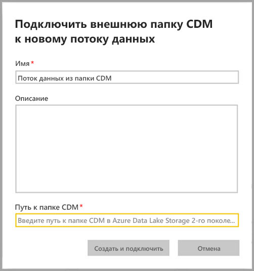
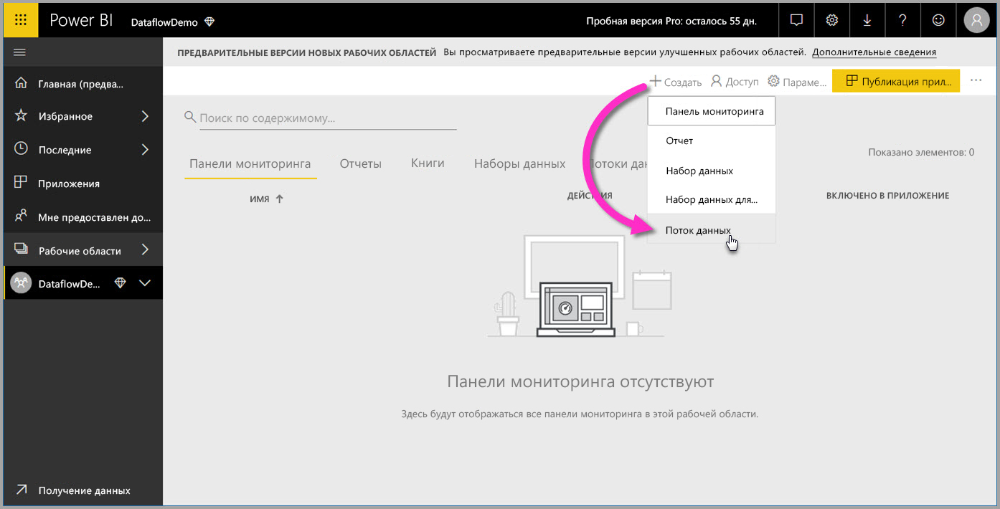
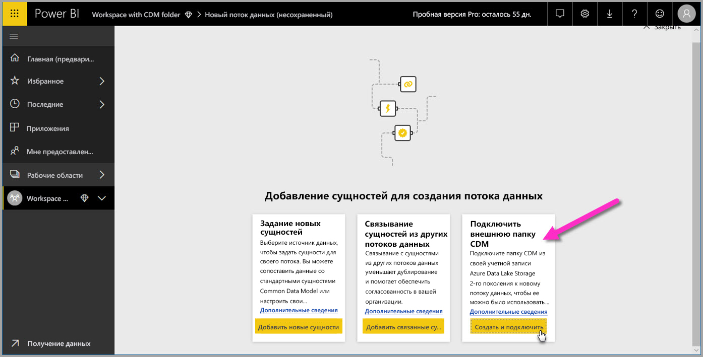
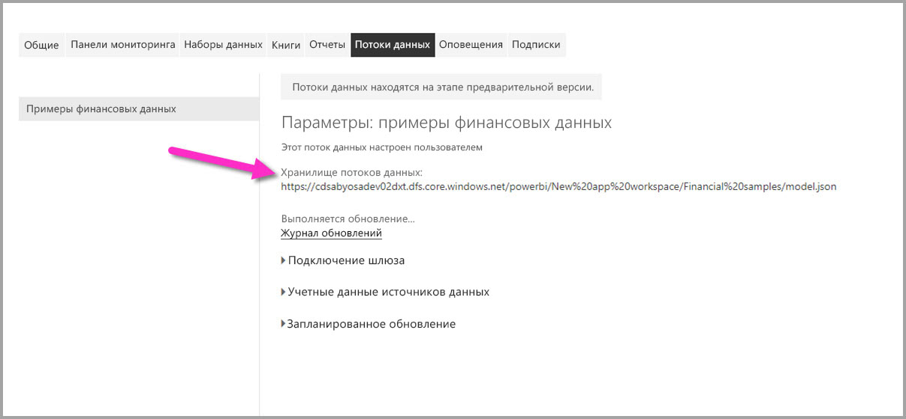

# Добавление папки CDM в Power BI в виде потока данных (предварительная версия)

В Power BI можно добавить папки Common Data Service (CDM), которые хранятся в виде потоков данных в Azure Data Lake Storage 2-го поколения вашей организации. Создав поток данных из папки CDM с помощью**Power BI Desktop** и **службы Power BI**, вы можете создавать наборы данных, отчеты, панели мониторинга и приложения на основе данных из папок CDM.

В следующем списке приведены несколько ограничений для создания потоков данных из папок CDM:

* Администратор должен связать учетную запись хранения ADLS 2-го поколения в Power BI, прежде чем ее можно будет использовать. Инструкции см. в статье [Подключение Azure Data Lake Storage 2-го поколения для хранения потоков данных](service-dataflows-connect-azure-data-lake-storage-gen2.md).
* Создание потоков данных из папок CDM доступно *только* в [новом интерфейсе рабочей области](../collaborate-share/service-create-the-new-workspaces.md). 
* Для добавления папки CDM в Power BI пользователю необходимо добавить папку, чтобы получить [авторизацию для папки CDM и ее файлов](./service-dataflows-azure-data-lake-integration.md).
* Вам необходимо иметь разрешения на чтение и выполнение для всех файлов и папок в папке CDM, чтобы добавить их в Power BI.

В следующих разделах описывается создание потока данных из папки CDM.

## Авторизация доступа пользователей к папкам CDM для создания потока данных

Чтобы создать поток данных из папки CDM, необходимо добавить указанные ниже разрешения.
* Пользователь, который будет получать доступ к папке CDM через Power BI, должен относиться к роли **Владелец данных BLOB-объектов хранилища** учетной записи хранения.
* Пользователь, который будет получать доступ к папке CDM через Power BI, должен быть включен в списки управления доступом **Доступ на чтение** и **Доступ на выполнение** как для самой папки CDM, так и для всех файлов и папок в ней. 

## Создание потока данных из папки CDM

Чтобы приступить к созданию потока данных из папки CDM, запустите **службу Power BI** и выберите **рабочую область** в области навигации. Вы также можете создать рабочую область для создания потока данных.

На появившемся экране выберите **Создать и подключить**, как показано на следующем рисунке.

На следующем появившемся экране можно присвоить имя потоку данных, указать его описание и путь к папке CDM в учетной записи Azure Data Lake Storage 2-го поколения вашей организации. Ознакомьтесь с разделом статьи, в которой описывается, [как получить путь к папке CDM](service-dataflows-configure-workspace-storage-settings.md#get-the-uri-of-stored-dataflow-files). 

После предоставления данных выберите **Создать и подключить**, чтобы создать поток данных.

Потоки данных из папок CDM отмечены *внешним* значком при отображении в Power BI. В следующем разделе описаны различия между стандартными потоками данных и теми, которые созданы из папок CDM.

Правильно задав разрешения, можно подключиться к потокам данных в **Power BI Desktop**, как описано ранее в этой статье.

## Рекомендации и ограничения

При работе с разрешениями к потокам данных, созданных из папки CDM, процесс аналогичен внешним источникам данных в Power BI. Управление разрешениями осуществляется не в Power BI, а в источниках данных. Разрешения должны быть правильно установлены для источника данных, например, для потока данных, созданного из папки CDM, для правильной работы с Power BI.

В следующих списках уточняется, как потоки данных из папки CDM работают с Power BI.

Рабочие области Power BI Pro, Premium и Embedded:
* Потоки данных из папок CDM невозможно изменить.
* Разрешениями на чтение потока данных, созданного из папки CDM, управляет владелец папки CDM, а не Power BI.

Power BI Desktop:
* Только пользователи, которые авторизовались в рабочей области (в которой был создан поток данных) и в папке CDM, могут получить доступ к данным из соединителя потоков данных Power BI.

В списке ниже также описаны некоторые дополнительные рекомендации.

* Создание потоков данных из папки CDM доступно *только* в [новом интерфейсе рабочей области](../collaborate-share/service-create-the-new-workspaces.md).
* Связанные сущности недоступны для потоков данных, созданных из папок CDM.

У клиентов **Power BI Desktop** нет доступа к потокам данных, которые хранятся в учетной записи Azure Data Lake Storage 2-го поколения, если они являются владельцами потока данных, или им явно разрешен доступ к папке CDM потока данных. Рассмотрим следующую ситуацию:

1.    Анна создает рабочую область и настраивает хранение потоков данных из папки CDM в ней.
2.    Бен, который также является членом рабочей области, которую создала Анна, хочет с помощью Power BI Desktop и соединителя потока данных получить данные из потока данных, созданного Анной.
3.    У Бена возникает ошибка, потому что его не добавили как авторизованного пользователя в папку CDM потока данных в Data Lake.

  

Чтобы устранить эту проблему, Бену необходимо предоставить разрешения читателя в папке CDM и ее файлах. Дополнительные сведения о том, как предоставить доступ к папке CDM, см. в [этой статье](./service-dataflows-azure-data-lake-integration.md).

## Следующие шаги

В этой статье предоставляются инструкции по настройке хранилища рабочей области для потоков данных. Дополнительные сведения вы найдете в перечисленных ниже статьях.

Дополнительные сведения о потоках данных, CDM и Azure Data Lake Storage 2-го поколения см. в следующих статьях:

* [Потоки данных и интеграция Azure Data Lake (предварительная версия)](service-dataflows-azure-data-lake-integration.md)
* [Настройка параметров потоков данных рабочей области (предварительная версия)](service-dataflows-configure-workspace-storage-settings.md)
* [Подключение Azure Data Lake Storage 2-го поколения для хранения потока данных (предварительная версия)](service-dataflows-connect-azure-data-lake-storage-gen2.md)

Общие сведения о потоках данных см. в этих статьях:

* [Creating and using dataflows in Power BI (Preview)](service-dataflows-create-use.md) (Создание и использование потоков данных в Power BI (предварительная версия))
* [Использование вычисляемых сущностей в Power BI Premium](service-dataflows-computed-entities-premium.md)
* [Использование потоков данных с локальными источниками данных](service-dataflows-on-premises-gateways.md)
* [Ресурсы для разработчиков потоков данных Power BI](service-dataflows-developer-resources.md)

Дополнительные сведения о службе хранилища Azure см. в следующих статьях:
* [Руководство по безопасности службы хранилища Azure](/azure/storage/common/storage-security-guide)
* [Настройка запланированного обновления](../connect-data/refresh-scheduled-refresh.md)
* [CDM folders and Azure Data Services integration](https://aka.ms/cdmadstutorial) (Интеграция папок CDM и служб данных Azure)

Дополнительные сведения о модели общих данных вы найдете в этой обзорной статье:
* [Что такое модель общих данных?](/powerapps/common-data-model/overview)
* [Папки CDM](/common-data-model/data-lake)
* [The metadata file (model.json) for the Common Data Model](/common-data-model/model-json) (Файл метаданных (model.json) для модели общих данных)

Вы всегда можете [задать вопросы в Сообществе Power BI](https://community.powerbi.com/).