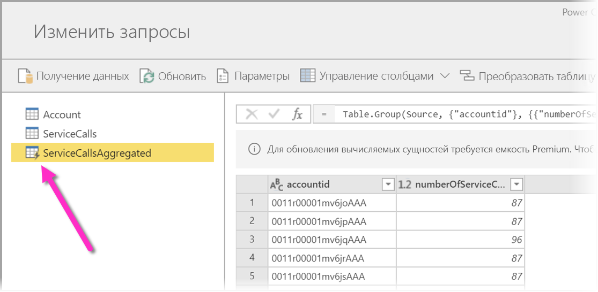
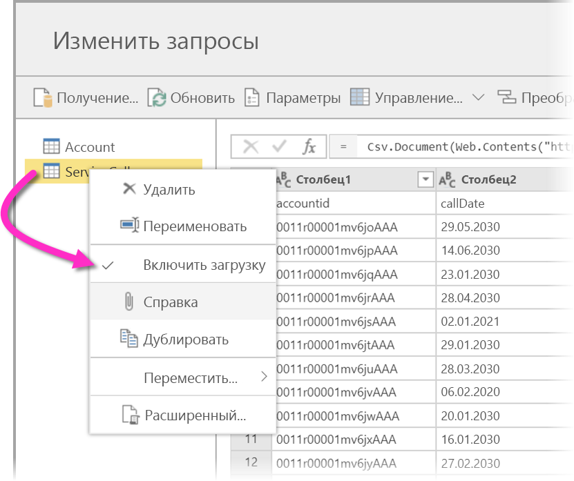
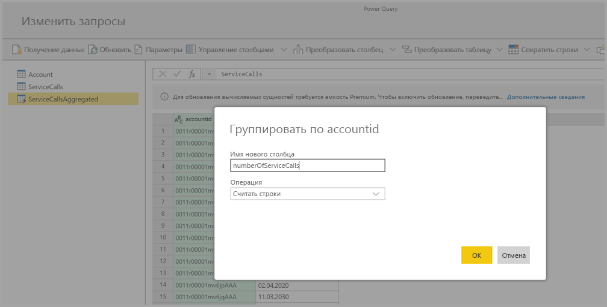
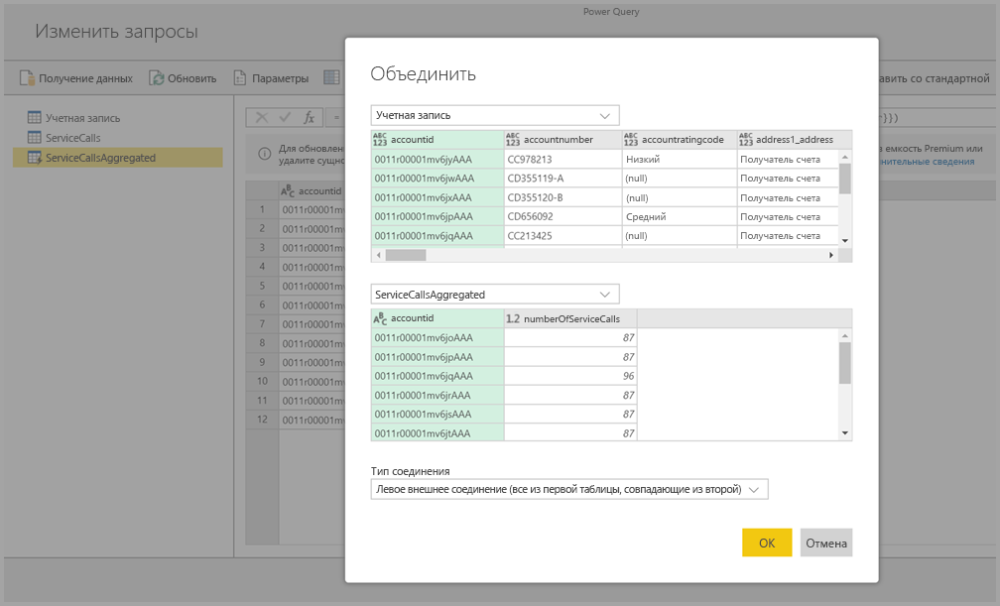
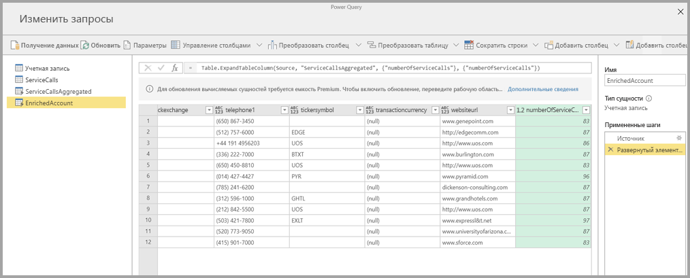

# Использование вычисляемых сущностей в Power BI Premium

Вы можете выполнять **вычисления в хранилище** при использовании **потоков данных** в подписке Power BI Premium. Это позволяет выполнять вычисления для существующих потоков данных и возвращать результаты, чтобы сосредоточиться на создании отчетов и аналитики. 

Чтобы выполнять **вычисления в хранилище**, сначала необходимо создать поток данных и перенести данные в хранилище этого потока данных в Power BI. Создав поток данных и наполнив его данными, вы можете создать **вычисляемые сущности**, т. е. сущности, которые производят вычисления в хранилище. 

Данные из потока можно подключить к Power BI двумя способами:

* [с помощью самостоятельного создания потоков данных](service-dataflows-create-use.md);
* с помощью внешнего поток данных.

Следующие разделы описывают создание вычисляемых сущностей на основе данным из потока данных.

## Создание вычисляемых сущностей 

Создав поток данных со списком сущностей, вы можете выполнять по этих сущностям вычисления.

В средстве разработки потоков данных службы Power BI выберите действие **Изменение сущностей**, затем щелкните правой кнопкой мыши ту сущность, на основе которой вы намерены создать вычисляемую сущность, т. е. по которой будете выполнять вычисления. В контекстном меню выберите **Ссылка**.

Чтобы сущность можно было назначить вычисляемой сущностью, должен быть установлен флажок **Включить загрузку**, как показано на следующем рисунке. Щелкните сущность правой кнопкой мыши, чтобы отобразить контекстное меню.

Установив флажок **Включить загрузку**, вы создаете новую сущность, источником для которой будет исходная сущность. Значок сменится на значок **вычисляемой** сущности, как показано на следующем рисунке.

Любое преобразование, которое вы выполните для новой сущности, будет использовать те данные, которые уже находятся в хранилище потока данных Power BI. Это значит, что запрос будет выполняться не к внешнему источнику данных, из которого были импортированы данные (например, к базе данных SQL, из которой извлекались данные), а к тем данным, которые уже находятся в хранилище потока данных.

### Примеры вариантов использования
Какого рода преобразования можно выполнять для вычисляемых сущностей? Для вычислений в хранилище поддерживаются любые преобразования, которое обычно задаются с помощью пользовательского интерфейса преобразований в Power BI или редакторе M. 

Рассмотрим следующий пример: у вас есть сущность *Account* (Учетная запись), которая содержит необработанные данные для всех клиентов из подписки Dynamics 365. Также у вас есть необработанные данные *ServiceCalls* из центра поддержки по всем обращениям в службу поддержки, которые выполнялись для другой учетной записи за каждый день года.

Предположим, вы хотите дополнить сущность *Account* данными из *ServiceCalls*. 

Сначала вам следует агрегировать данные из ServiceCalls, чтобы вычислить число обращений в службу поддержки, которые выполнялись для каждой учетной записи в течение последнего года. 

После этого следует объединить сущность *Account* с сущностью *ServiceCallsAggregated*, чтобы вычислить дополненную таблицу **Account**.

После этого вы увидите результаты, представленные на следующем рисунке как *EnrichedAccount*.

Вот и все — преобразование выполняется по данным в потоке данных, которые хранятся в подписке Power BI Premium, а не по исходным данным.

## Рекомендации и ограничения

Важно отметить, что в случае удаления рабочей области из емкости Power BI Premium связанный поток данных больше обновляться не будет. 

При работе с потоками данных в специально созданный учетной записи организации в Azure Data Lake Storage 2-го поколения связанные сущности и вычисляемые сущности работают правильно только если сущности находятся в одной учетной записи. Дополнительные сведения см. в статье [ о подключение Azure Data Lake Storage 2-го поколения для хранения потока данных (предварительная версия)](service-dataflows-connect-azure-data-lake-storage-gen2.md).

Связанные сущности недоступны для потоков данных, создаваемых из папок Common Data Model (CDM). Дополнительные сведения: [Добавление папки CDM в Power BI в виде потока данных (предварительная версия)](service-dataflows-add-cdm-folder.md).

Для выполнения вычислений с объединением локальных и облачных данных рекомендуется создавать новую сущность. Это будет более эффективно, чем использовать имеющуюся сущность, которая помимо вычислений будет запрашивать с обоих источников данные и выполнять в Data Lake преобразования.

## Дальнейшие действия

В этой статье описываются вычисляемые сущности и потоки данных, доступные в службе Power BI. Вот еще несколько статьей, которые могут быть полезны:

* [Self-service data prep in Power BI (Preview)](service-dataflows-overview.md) (Самостоятельная подготовка данных в Power BI (предварительная версия))
* [Creating and using dataflows in Power BI (Preview)](service-dataflows-create-use.md) (Создание и использование потоков данных в Power BI (предварительная версия))
* [Использование потоков данных с локальными источниками данных](service-dataflows-on-premises-gateways.md)
* [Ресурсы для разработчиков потоков данных Power BI](service-dataflows-developer-resources.md)
* [Настройка параметров потоков данных рабочей области (предварительная версия)](service-dataflows-configure-workspace-storage-settings.md)
* [Добавление папки CDM в Power BI в виде потока данных (предварительная версия)](service-dataflows-add-cdm-folder.md)
* [Подключение Azure Data Lake Storage 2-го поколения для хранения потока данных (предварительная версия)](service-dataflows-connect-azure-data-lake-storage-gen2.md)

Дополнительные сведения о Power Query и обновлении по расписанию содержатся в следующих статьях:
* [Общие сведения о запросах в Power BI Desktop](desktop-query-overview.md)
* [Настройка запланированного обновления](../connect-data/refresh-scheduled-refresh.md)

Дополнительные сведения о модели общих данных вы найдете в этой обзорной статье:
* [Что такое модель общих данных?](/powerapps/common-data-model/overview)