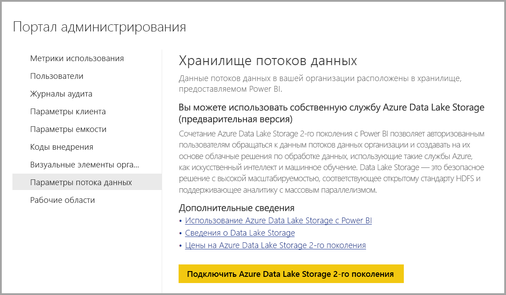
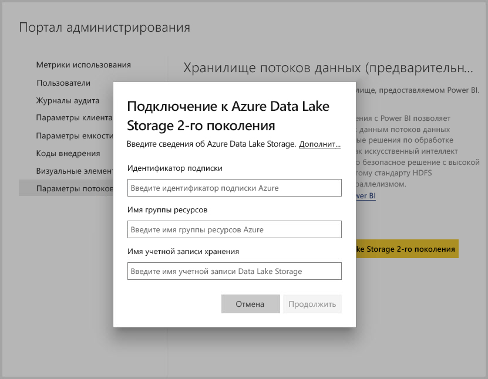
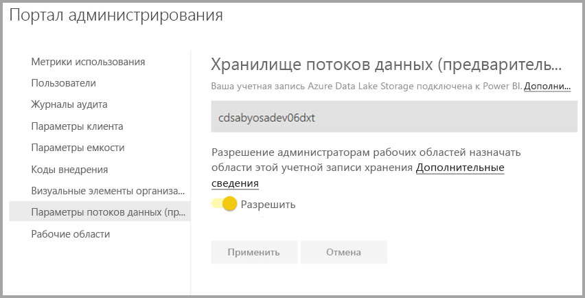

# Подключение Azure Data Lake Storage 2-го поколения для хранения потоков данных

Вы можете настроить рабочую область Power BI для хранения потоков данных в корпоративной учетной записи Azure Data Lake Storage 2-го поколения. В этой статье описаны необходимые шаги, а также предоставлены инструкции и рекомендации. Настройка рабочих областей для хранения определений потоков и файлов данных в вашем озере данных обеспечивает ряд преимуществ, включая следующие:

* Azure Data Lake Storage 2-го поколения предоставляет чрезвычайно масштабируемое хранилище для данных.
* С помощью данных и файлов определений потоков данных разработчики вашего ИТ-отдела могут использовать службы данных Azure и искусственного интеллекта (ИИ), как показано в [примерах для служб данных Azure на сайте GitHub](https://aka.ms/cdmadstutorial)
* Разработчики в вашей организации могут интегрировать данные потоков данных во внутренние приложения и бизнес-решения, используя ресурсы для разработчиков потоков данных и Azure.

Чтобы использовать Azure Data Lake Storage 2-го поколения для потоков данных, необходимы следующие компоненты:

* **Клиент Power BI.** По крайней мере одна учетная запись в клиенте Azure Active Directory (AAD) должна быть зарегистрирована для Power BI.
* **Учетная запись глобального администратора.** Эта учетная запись необходима, чтобы подключить и настроить Power BI для хранения определения потока данных и данных в вашей учетной записи Azure Data Lake Storage 2-го поколения.
* **Подписка Azure.** Подписка Azure необходима для использования Azure Data Lake Storage 2-го поколения.
* **Группа ресурсов.** Используйте уже имеющуюся группу ресурсов или создайте новую.
* **Учетная запись хранения Azure с включенной функцией Data Lake Storage 2-го поколения** 

> [!TIP]
> Если у вас нет подписки Azure, перед началом работы [создайте бесплатную учетную запись](https://azure.microsoft.com/free/).

> [!WARNING]
> Место хранения потока данных нельзя изменить после настройки. Другие важные замечания см. в разделе [Рекомендации и ограничения](#considerations-and-limitations) в конце этой статьи.

## Подготовка Azure Data Lake Storage 2-го поколения для Power BI

Перед настройкой Power BI с учетной записью Azure Data Lake Storage 2-го поколения необходимо создать и настроить учетную запись хранения. Требования для Power BI:

1. Необходимо быть владельцем учетной записи хранения ADLS. Она должна быть назначена на уровне ресурса, а не унаследована от уровня подписки.
2. Учетная запись хранения должна быть создана в том же клиенте AAD, что и ваш клиент Power BI.
3. Учетная запись хранения должна быть создана в том же регионе, что и ваш клиент Power BI. Сведения об определении расположения клиента Power BI см. в [этой статье](../admin/service-admin-where-is-my-tenant-located.md).
4. Для учетной запись хранения необходимо включить функцию *Иерархическое пространство имен*.
5. Если учетная запись хранения не создана текущим пользователем, убедитесь, что текущему пользователю были назначены разрешения [Владелец данных BLOB-объектов хранилища](https://docs.microsoft.com/azure/role-based-access-control/built-in-roles#storage-blob-data-owner) и [Владелец](https://docs.microsoft.com/azure/role-based-access-control/built-in-roles#owner). (Так как у владельца нет разрешения на уровне данных, требуется владелец данных BLOB-объектов.)

В следующих разделах подробно описаны шаги настройки учетной записи Azure Data Lake Storage 2-го поколения.

### Создание учетной записи хранения

Выполните действия, описанные в [этой статье](https://docs.microsoft.com/azure/storage/blobs/data-lake-storage-quickstart-create-account).

1. Убедитесь, что вы выбрали расположение своего клиента Power BI, и в качестве хранилища укажите **StorageV2 (общего назначения версии 2)** .
2. Включите функцию иерархического пространства имен.
3. Рекомендуем установить для параметра репликации значение **Геоизбыточное хранилище с доступом на чтение (RA-GRS)** .

### Предоставление разрешений службам Power BI

Далее необходимо предоставить службе Power BI роли читателя и доступа к данным в созданной учетной записи хранения. Обе эти роли встроенные, поэтому процедура проста. 

Выполните действия, описанные в руководстве по [назначению встроенной роли RBAC](https://docs.microsoft.com/azure/storage/common/storage-auth-aad-rbac#assign-a-built-in-rbac-role).

В окне **Добавление назначения ролей** выберите роль **Модуль чтения и доступ к данным**. Затем с помощью поиска найдите приложение **Служба Power BI**.
Повторите те же действия для роли **Владелец данных BLOB-объектов хранилища** и назначьте ее как приложению **Служба Power BI**, так и приложению **Power BI Premium**.

> [!NOTE]
> Подождите не менее 30 минут, чтобы разрешение на портале появилось в службе Power BI. Каждый раз при изменении разрешений на портале ожидайте 30 минут для их отображения в Power BI. 

## Подключение Azure Data Lake Storage 2-го поколения к Power BI

После настройки учетной записи Azure Data Lake Storage 2-го поколения на портале Azure подключите ее к Power BI на **портале администрирования Power BI**. Кроме того, вы можете управлять хранилищем потоков данных Power BI в разделе параметров **хранилища потоков данных** на портале администрирования Power BI. Инструкции по запуску и базовому использованию см. в статье [Портал администрирования Power BI](../admin/service-admin-portal.md).

Подключить **учетную запись Azure Data Lake Storage 2-го поколения** можно следующим образом:

1. На **портале администрирования Power BI** перейдите на вкладку **Параметры потоков данных**.

     

2. Нажмите кнопку **Подключить Azure Data Lake Storage 2-го поколения**. Появляется следующее окно.

     

3. Укажите **идентификатор подписки** учетной записи хранения.
4. Укажите **имя группы ресурсов**, в которой была создана учетная запись хранения.
5. Укажите **имя учетной записи хранения**.
6. Нажмите кнопку **Подключиться**.

После успешного выполнения этих шагов ваша учетная запись Azure Data Lake Storage 2-го поколения будет подключена к Power BI. 

> [!NOTE]
> Чтобы настроить подключение к Azure Data Lake Storage 2-го поколения на портале администрирования Power BI, необходимо иметь разрешения глобального администратора. При этом глобальные администраторы не могут подключаться к внешнему хранилищу на портале администрирования.  

Затем вам нужно будет разрешить сотрудникам вашей организации настраивать свои рабочие пространства, что позволит им использовать данную учетную запись хранения для определения потока данных и хранения данных. Мы сделаем это в следующем разделе. 

## Разрешение администраторам назначать рабочие области

По умолчанию определение потока данных и файлы данных хранятся в хранилище, предоставленном Power BI. Чтобы получить доступ к файлам потока данных в вашей учетной записи хранения, администраторы рабочей области должны сначала настроить рабочую область для разрешения назначения и хранения потоков данных в новой учетной записи хранения. Для настройки параметров хранилища потока данных администратору рабочей области необходимо предоставить разрешения на назначение хранилища на **портале администрирования Power BI**.

Чтобы предоставить разрешения на назначение хранилища, перейдите на вкладку **Параметры потока данных** на **портале администрирования Power BI**. Для переключателя *Allow workspace admins to assign workspaces to this storage account* (Разрешение администраторам рабочих областей назначать области этой учетной записи хранения) необходимо установить значение **Разрешить**. Включив этот ползунок, нажмите кнопку **Применить**, чтобы изменения вступили в силу. 

 

Вот и все. Теперь администраторы рабочей области Power BI могут назначать рабочие процессы созданной вами файловой системе.

## Рекомендации и ограничения

Эта функция находится в режиме предварительного версии, и ее поведение может измениться. При работе с хранилищем потока данных следует учитывать несколько рекомендаций и ограничений:

* Место хранения потока данных нельзя изменить после настройки.
* Только владельцы потока данных, хранящегося в Azure Data Lake Storage 2-го поколения, могут получить доступ к его данным по умолчанию. Чтобы авторизовать дополнительных пользователей для потоков данных, хранящихся в Azure, необходимо добавить их в папку CDM потока данных. 
* Создание потоков данных со связанными сущностями возможно, только если они хранятся в одной учетной записи хранения.
* Локальные источники данных в общедоступных емкостях Power BI не поддерживаются в потоках данных, хранящихся в озере данных вашей организации.
* Моментальные снимки не удаляются автоматически в ADLS 2-го поколения. Если вы хотите освободить пространство, можно создать функцию Azure для периодической очистки старых моментальных снимков.

В этом разделе описаны некоторые известные проблемы.

У пользователей Power BI Desktop нет доступа к потокам данных, которые хранятся в **учетной записи Azure Data Lake Storage**, если они являются владельцами потока данных, или им разрешен доступ к папке CDM в озере. Ниже описана последовательность действий, которая к этому приводит.

1. Анна создала новую рабочую область и настроила ее для хранения потоков данных в озере данных организации. 
2. Бен, который также является членом рабочей области, которую создала Анна, хочет с помощью Power BI Desktop и соединителя потока данных получить данные из потока данных, созданного Анной.
3. У Бена возникает аналогичная ошибка, потому что ему не предоставили доступ к папке CDM потока данных в озере.

Распространенные вопросы и ответы:

**Вопрос.** Могу ли я изменить место хранения созданных ранее потоков данных в рабочей области?

**Ответ.** Вы не можете изменить место хранения потока данных после его создания. 

**Вопрос.** Когда я могу изменить место хранения потока данных в рабочей области?

**Ответ.** Изменение места хранения потока данных в рабочей области разрешено, только если рабочая область не содержит потоков данных.

## Дальнейшие действия

В этой статье приведены инструкции по подключению Azure Data Lake 2-го поколения для хранения потоков данных. Дополнительные сведения вы найдете в перечисленных ниже статьях.

Дополнительные сведения о потоках данных, CDM и Azure Data Lake Storage 2-го поколения см. в следующих статьях:

* [Потоки данных и интеграция Azure Data Lake (предварительная версия)](service-dataflows-azure-data-lake-integration.md)
* [Настройка параметров потоков данных рабочей области (предварительная версия)](service-dataflows-configure-workspace-storage-settings.md)
* [Добавление папки CDM в Power BI в виде потока данных (предварительная версия)](service-dataflows-add-cdm-folder.md)

Общие сведения о потоках данных см. в этих статьях:

* [Creating and using dataflows in Power BI (Preview)](service-dataflows-create-use.md) (Создание и использование потоков данных в Power BI (предварительная версия))
* [Использование вычисляемых сущностей в Power BI Premium](service-dataflows-computed-entities-premium.md)
* [Использование потоков данных с локальными источниками данных](service-dataflows-on-premises-gateways.md)
* [Ресурсы для разработчиков потоков данных Power BI](service-dataflows-developer-resources.md)

Дополнительные сведения о службе хранилища Azure см. в следующих статьях:
* [Руководство по безопасности службы хранилища Azure](https://docs.microsoft.com/azure/storage/common/storage-security-guide)

Дополнительные сведения о модели общих данных вы найдете в этой обзорной статье:
* [Что такое модель общих данных?](https://docs.microsoft.com/powerapps/common-data-model/overview)
* [Папки CDM](https://go.microsoft.com/fwlink/?linkid=2045304)
* [The metadata file (model.json) for the Common Data Model](https://go.microsoft.com/fwlink/?linkid=2045521) (Файл метаданных (model.json) для модели общих данных)

Вы всегда можете [задать вопросы в Сообществе Power BI](https://community.powerbi.com/).
