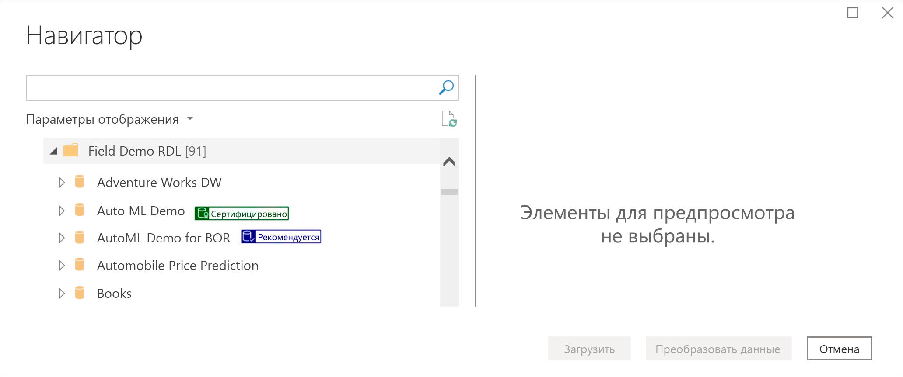
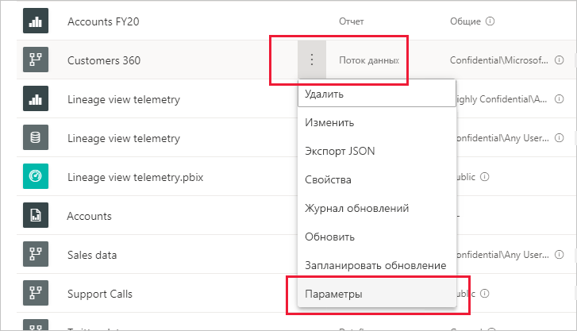
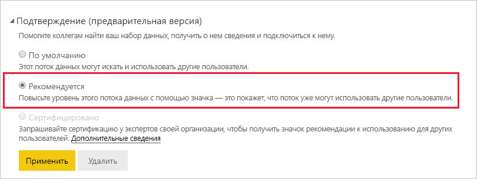
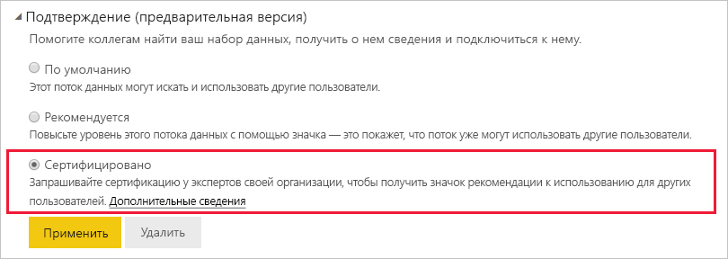

# Повышение уровня или сертификация потоков данных (предварительная версия)

Power BI предоставляет два способа повышения наглядности ценных и высококачественных потоков данных: **повышение уровня** и **сертификация**.

* **Повышение уровня**. Повышение уровня позволяет пользователям выделять потоки данных, которые они считают полезными для других пользователей. Это способствует совместному распространению потоков данных в организации. Любой владелец потока данных или любой участник с разрешениями на запись в рабочей области, где находится поток данных, может просто повысить уровень потока данных, если он считает, что им стоит поделиться.

* **Сертификация**. Сертификация означает, что поток данных был проверен авторизованным рецензентом и является по-настоящему надежным и достоверным источником, подходящим для использования по всей организации. Избранная группа рецензентов, назначенных администратором клиента Power BI, определяет, какие потоки данных следует сертифицировать. Пользователь, который считает, что определенный поток данных должен быть сертифицирован, но не имеет прав на его сертификацию, должен обратиться к администратору клиента.

  Сертификация потоков данных возможна только в том случае, если она была [включена администратором клиента Power BI](../admin/service-admin-setup-certification.md).

Повышение уровня или сертификация потока данных называется *подтверждением*. Создатели отчетов Power BI часто работают с большим количеством потоков данных, и подтверждение помогает им выбирать надежные и достоверные потоки данных.

Подтвержденные потоки данных четко обозначены во многих местах в Power BI, что позволяет авторам отчетов легко находить их при поиске надежных данных, а администраторам и создателям отчетов помогает отслеживать их использование во всей организации.

На рисунке ниже показано, как в Power Query можно легко найти потоки данных с повышением уровня или сертификацией.

В этой статье рассматриваются следующие вопросы.
* Повышение уровня потока данных (владелец потока данных или любой пользователь с разрешениями участника в рабочей области, в которой находится поток данных)
* Сертификация потока данных (авторизованный рецензент потоков данных, назначенный администратором клиента)

Сведения о настройке сертификации потоков данных (администратор клиента) см. в разделе [Настройка сертификации наборов и потоков данных](../admin/service-admin-setup-certification.md)

## Повышение уровня потока данных

Чтобы повысить уровень потока данных, необходимо иметь разрешения на запись в рабочей области, где находится поток данных, для которого требуется повысить уровень.

1. Перейдите к списку потоков данных в рабочей области.
 
1. Выберите **Дополнительные параметры** (...) в потоке данных, уровень которого требуется повысить, а затем выберите **Параметры**.

    

1. Разверните раздел подтверждения и выберите **Повышение уровня**.

    

1. Нажмите кнопку **Применить**.

## Сертификация потока данных

Этот раздел предназначен для пользователей, которым администратор клиента дал разрешение на сертификацию потоков данных. Сертификация потоков данных связана с большой ответственностью. В этом разделе описывается процесс сертификации.

1. Получите разрешения на запись в рабочей области, где находится поток данных, который требуется сертифицировать. Это разрешение может дать владелец потока данных или любой пользователь с разрешениями администратора в рабочей области. 

1. Внимательно изучите поток данных и определите, заслуживает ли он сертификации.

1. Если вы решили сертифицировать поток данных, перейдите в рабочую область, в которой он находится.
 
1. Найдите нужный поток данных, щелкните **Дополнительные параметры** (...), а затем выберите **Параметры**.

    

1. Разверните раздел подтверждения и выберите **Сертифицировано**. 

    

2. Щелкните **Применить**.

## Дальнейшие действия

* [Настройка сертификации наборов и потоков данных](../admin/service-admin-setup-certification.md)
* У вас появились вопросы? [Попробуйте задать вопрос в сообществе Power BI.](https://community.powerbi.com/)