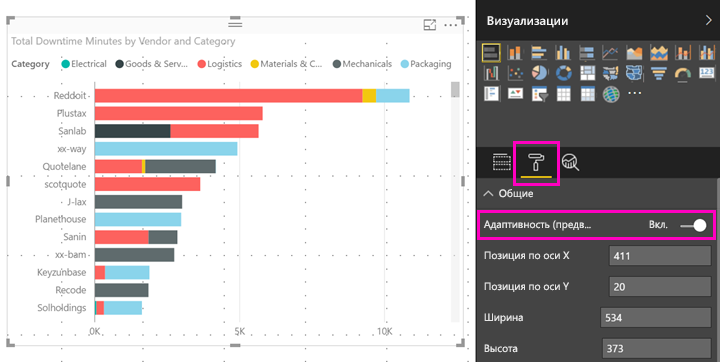

# Оптимизация визуальных элементов Power BI для любого размера
По умолчанию при создании отчета визуальные элементы являются *адаптивными*. Так они могут динамически изменяться, отображая как можно больше данных независимо от размера экрана. В более старых отчетах также можно настроить динамическое изменение размера визуальных элементов.

При изменении размера визуального элемента Power BI определяет приоритеты в представлении данных — например, автоматически удаляет отступы и перемещает условные обозначения наверх, чтобы даже при уменьшении визуальный элемент оставался информативным. Адаптивность особенно важна для визуальных элементов, используемых в мобильном приложении Power BI на телефонах.

Любой визуальный элемент с осями X и Y или срезами может изменяться адаптивно.

## Включение адаптивности в Power BI Desktop
1. В старом отчете в Power BI Desktop на вкладке **Представление** выберите **Макет рабочего стола**.
   
    
2. Выберите визуальный элемент, а затем в области **Визуализации** выберите раздел **Формат**.
3. Разверните раздел **Общие** и установите переключатель **Адаптивность (предварительная версия)** в положение **Вкл.**
   
    
   
     Теперь, когда вы добавите этот визуальный элемент в [отчет, оптимизированный для телефона](../desktop-create-phone-report.md), его размер будет плавно изменяться.

## Включение адаптивности в службе Power BI
Включите адаптивность для визуального элемента в старом отчете в службе Power BI. Для этого необходимо иметь права на изменение отчета.

1. В отчете в службе Power BI ([https://powerbi.com](https://powerbi.com)) выберите **Редактировать отчет**.
2. Выберите визуальный элемент, а затем в области **Визуализации** выберите раздел **Формат**.
3. Разверните раздел **Общие** и установите переключатель **Адаптивность (предварительная версия)** в положение **Вкл.**
   
    
   
     Когда вы [создадите добавите представление для телефона этого отчета](../desktop-create-phone-report.md) и добавите этот визуальный элемент, его размер будет плавно изменяться.

## Дальнейшие действия
* [Создание отчетов, оптимизированных для мобильных приложений Power BI](../desktop-create-phone-report.md)
* [Просмотр отчетов Power BI, оптимизированных для телефона](../consumer/mobile/mobile-apps-view-phone-report.md)
* Появились дополнительные вопросы? [Попробуйте задать вопрос в сообществе Power BI.](http://community.powerbi.com/)

