# Использование визуального элемента "Матрица" в Power BI

[!INCLUDE [power-bi-visuals-desktop-banner](../includes/power-bi-visuals-desktop-banner.md)]

Визуальный элемент "Матрица" похож на таблицу.  Таблица поддерживает два измерения, а данные в ней неструктурированные, то есть повторяющиеся значения отображаются без суммирования. Матрица упрощает содержательное отображение данных по нескольким измерениям благодаря поддержке ступенчатого макета. Матрица автоматически агрегирует данные и обеспечивает их детализацию. 

Вы можете создать визуальный элемент "Матрица" в отчетах **Power BI Desktop**, а также перекрестно выделять элементы внутри матрицы с помощью других визуальных элементов на странице отчета. Например, можно перекрестно выделять строки, столбцы и даже отдельные ячейки. Кроме того, отдельные ячейки и несколько выбранных ячеек можно копировать и вставлять в другие приложения. 

Предусмотрено множество функций для матрицы, которые мы рассмотрим в следующих разделах этой статьи.

## Основные сведения о вычислении итогов в Power BI

Прежде чем использовать визуальный элемент "Матрица", важно узнать, как в Power BI вычисляются промежуточные значения и итоговое в таблицах и матрицах. Для строк итогов и промежуточных итогов Power BI вычисляет меру на основе всех строк в базовых данных. Это не является простым сложением всех значений в видимых или отображаемых строках. Это значит, что в результате значения в строке итогов могут отличаться от ожидаемых.

Обратите внимание на следующие визуальные элементы "Матрица". 

В этом примере в каждой строке визуального элемента "Матрица" справа отображается *сумма* для каждого сочетания даты и имени менеджера по продажам. Но так как для одного менеджера проводится сопоставление с несколькими датами, число может отображаться несколько раз. Таким образом, точное итоговое значение на основе базовых данных и простое сложение отображаемых значений не эквивалентны. Это распространенный подход, когда при суммировании значение представляет сторону "один" в связи "один ко многим".

Что касается итогов и промежуточных итогов, учитывайте, что эти значения основаны на базовых данных, а не только на отображаемых значениях.

<!-- use Nov blog post video

## Expanding and collapsing row headers
There are two ways you can expand row headers. The first is through the right-click menu. You’ll see options to expand the specific row header you clicked on, the entire level or everything down to the very last level of the hierarchy. You have similar options for collapsing row headers as well.

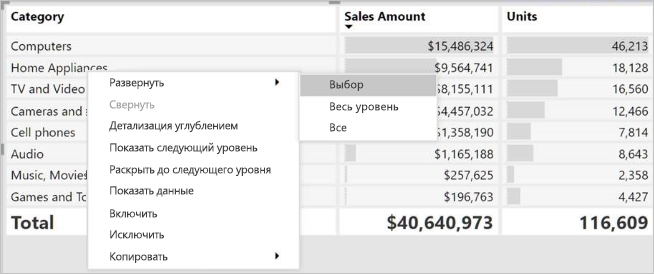

You can also add +/- buttons to the row headers through the formatting pane under the row headers card. By default, the icons will match the formatting of the row header, but you can customize the icons’ color and size separately if you want. 
Once the icons are turned on, they work similarly to the icons from PivotTables in Excel.

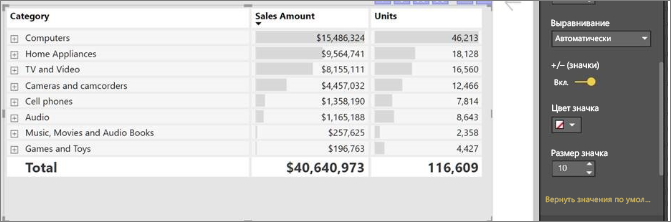

The expansion state of the matrix will save with your report. It can be pinned to dashboards as well, but consumers will need to open up the report to change the state. Conditional formatting will only apply to the inner most visible level of the hierarchy. Note that this expand/collapse experience is not currently supported when connecting to AS servers older than 2016 or MD servers.

Watch the following video to learn more about expand/collapse in the matrix:

-->
## Детализация с помощью визуального элемента "Матрица"
Визуальный элемент "Матрица" позволяет использовать подробные визуализации, недоступные ранее. Вы можете выполнить детализацию с использованием строк, столбцов и даже отдельных разделов и ячеек. Рассмотрим каждый из вариантов детализации.

### Детализация по заголовкам строк

В области визуализаций при добавлении нескольких полей в разделе **Строки** области **Поля** вы включаете детализацию по строкам визуального элемента "Матрица". Это похоже на создание иерархии, которую затем можно детализировать (а потом обобщить), а также выполнить анализ данных на каждом уровне.

На следующем рисунке в разделе **Строки** содержатся элементы *Этап продажи* и *Размер возможной сделки*, формирующие группу (или иерархию) строк, которые можно детализировать.

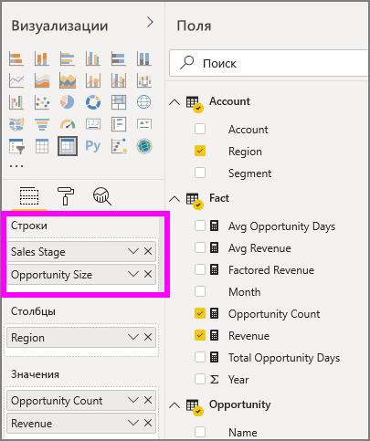

Если в разделе **Строки** для визуального элемента создана группа, в верхней левой части визуального элемента отображаются значки *детализации* и *развертывания*.

Эти кнопки действуют так же, как и подобные кнопки для детализации и развертывания в других визуальных элементах: они позволяют перемещаться по уровням элементов иерархии вниз (или вверх). В этом случае мы можем перейти от элемента *Этап продажи* к элементу *Размер возможной сделки*, как показано на следующем рисунке, на котором выбран значок перехода на один уровень (в виде разветвления).

Помимо использования этих значков можно щелкнуть любой из заголовков строк и выбрать пункт детализации в появившемся меню.

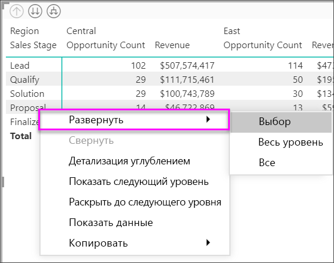

Обратите внимание, что в этом меню есть несколько параметров, используя которые вы получите разные результаты.

Если выбрать пункт **Детализация**, будет развернута матрица для *этого* уровня строки, *за исключением* других заголовков строк, кроме выбранного заголовка строки. На следующем рисунке выбрано **Предложение** > **Детализация**. Обратите внимание, что другие строки верхнего уровня перестали отображаться в матрице. Этот способ детализации — полезная функция. Она очень пригодится, когда мы перейдем к разделу о перекрестном выделении.

Выберите значок **Подняться**, чтобы вернуться к предыдущему представлению верхнего уровня. Если затем выбрать **Предложение** > **Показать следующий уровень**, появится список всех элементов следующего уровня (в данном случае поле *Размер возможной сделки*) с сортировкой по возрастанию без категоризации иерархии верхнего уровня.

Выберите значок **Подняться** в верхнем левом углу, чтобы в матрице отобразились все категории верхнего уровня, а затем выберите **Предложение** > **Раскрыть до следующего уровня**, чтобы увидеть все значения обоих уровней иерархии: *Этап продажи* и *Размер возможной сделки*.

Вы также можете использовать пункт меню **Развернуть** для дополнительного управления отображением.  Например, выберите **Предложение** > **Развернуть** > **Выбор**. Power BI отображает одну строку итогов для каждого параметра *Этап продажи* и все для *Размер возможной сделки* для поля *Предложение*.

### Детализация по заголовкам столбцов
Аналогично детализации по строкам можно также выполнять детализацию по столбцам. На следующем рисунке видно, что в области полей **Столбцы** есть два поля, создающие иерархию, аналогичную той, которую мы использовали для строк ранее в этой статье. В области полей **Столбцы** есть поля *Регион* и *Сегмент*. Как только второе поле было добавлено в область полей **Столбцы**, в новом раскрывающемся меню, которое отображается для визуального элемента, будет показано **Строки**.

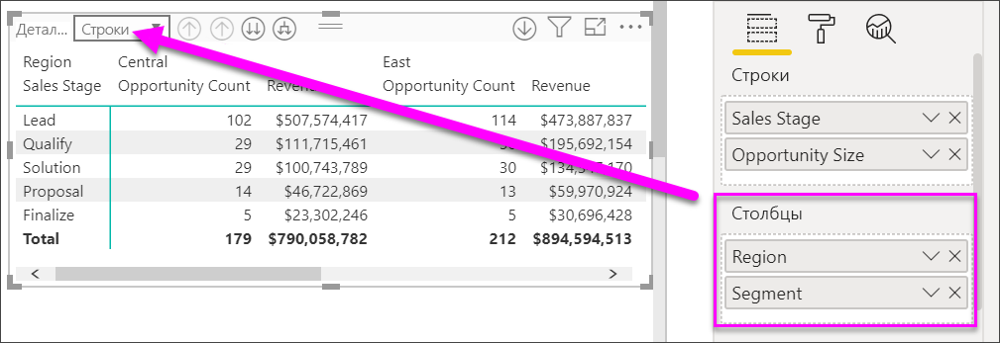

Для детализации столбцов выберите **Столбцы** из меню *Детализация*, которое можно найти в левом верхнем углу матрицы. Выберите *восточный* регион, а затем **Детализация**.

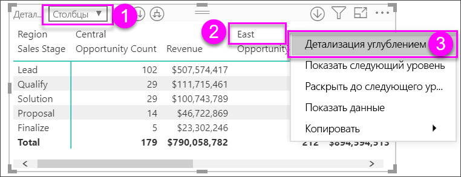

При выборе пункта **Детализация** отображается следующий уровень в иерархии столбцов для *Регион > восточный* (в данном случае — *Количество возможных сделок*). Другой регион скрыт.

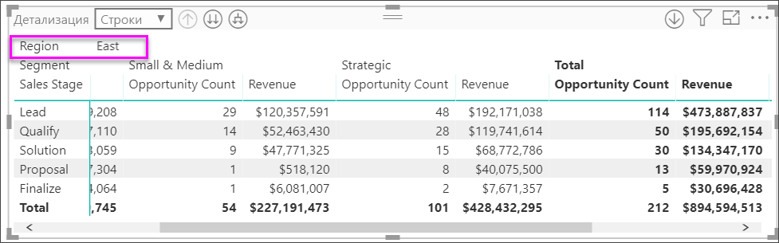

Остальные элементы меню действуют в столбцах так же, как в строках (см. предыдущий раздел о **детализации по заголовкам строк**). Вы можете **показать следующий уровень** для столбцов и **раскрыть их до следующего уровня** так же, как для строк.

> [!NOTE]
> Значки детализации и перехода на уровень выше в верхнем левом углу визуального элемента "матрица" применяются только к строкам. Чтобы выполнить детализацию по столбцам, воспользуйтесь контекстным меню.

## Ступенчатый макет с визуальными элементами с матрицей

Визуальный элемент "Матрица" позволяет автоматически сделать отступы для подкатегорий в иерархии под каждой родительской категорией. Вот что собой представляет ступенчатый макет.

В исходной версии визуального элемента "Матрица" подкатегории отображались в отдельном столбце, занимая больше места в визуальном элементе. На следующем рисунке показана таблица в исходном визуальном элементе "Матрица". Обратите внимание, что подкатегории находятся в отдельном столбце.

На следующем рисунке показан визуальный элемент "Матрица" со ступенчатым макетом. Обратите внимание, что в категории *Компьютеры* подкатегории ("Комплектующие для компьютеров", "Настольные компьютеры", "Ноутбуки", "Мониторы" и т. д.) немного сдвинуты. Таким образом визуальный элемент стал понятнее и меньше по размеру.

Параметры ступенчатого макета можно легко настроить. Выберите визуальный элемент "Матрица" и в области **Визуализации** в разделе **Формат** (значок в виде валика) разверните раздел "Заголовки строк". У вас имеется два элемента: переключатель "Ступенчатый макет" (который включает или выключает этот макет) и параметр "Макет с пошаговым отступом" (позволяет указать уровень отступа в пикселях).

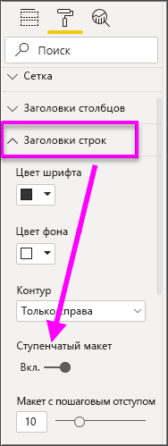

Если отключить ступенчатый макет, Power BI отобразит подкатегории в другом столбце, а не под родительской категорией.

## Промежуточные итоги с визуальными элементами матрицы

Промежуточные итоги можно включить или отключить в визуальных элементах матрицы для строк и столбцов. На следующем рисунке видно, что для строки промежуточных итогов задано значение **Включено**.

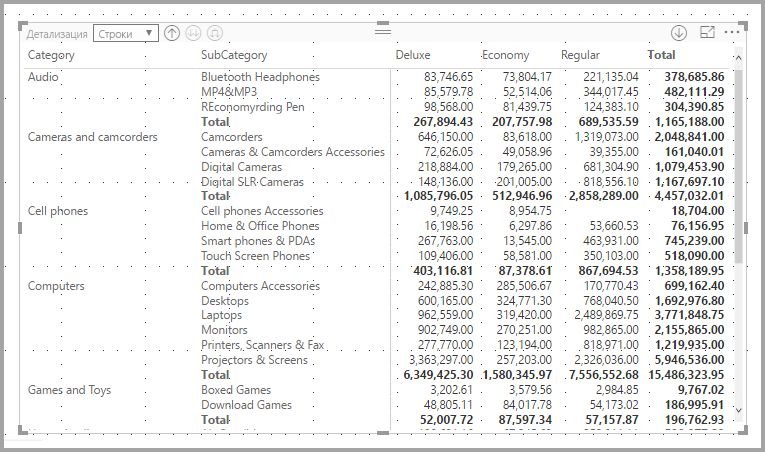

В разделе "Формат" на панели "Визуализации" разверните карту **Подытоги** и установите ползунок "Подытоги по строке" в положение **Отключено**. После этого действия подытоги больше не будут отображаться.

Для столбцов применяется тот же процесс.

## Перекрестное выделение с использованием визуальных элементов с матрицей

В визуальном элементе "Матрица" для перекрестного выделения вы можете выбрать все элементы в матрице. Выберите столбец в визуальном элементе "Матрица", и Power BI выделит столбец, как и другие визуальные элементы на странице отчета. Этот способ перекрестного выделения был доступен для других визуальных элементов, а также при выборе точки данных. Теперь он реализован и для визуального элемента "Матрица".

Кроме того, для перекрестного выделения можно также нажать клавишу CTRL и щелкнуть мышью. Например, на следующем рисунке в визуальном элементе "Матрица" выбрана коллекция подкатегорий. Обратите внимание, что элементы, которые не были выбраны в визуальном элементе, выделены серым цветом. Также оцените, как в других визуальных элементах на странице отражаются элементы, выбранные в визуальном элементе "Матрица".

## Копирование значений из Power BI для использования в других приложениях

Матрица или таблица могут иметь содержимое, которое вы можете использовать в других приложениях: Dynamics CRM, Excel или в других отчетах Power BI. Щелчком правой кнопки мыши в Power BI можно скопировать одну ячейку или набор ячеек в буфер обмена, а затем вставить их в другое приложение.

* Чтобы скопировать значение из одной ячейки, выделите нужную ячейку, щелкните ее правой кнопкой мыши и выберите **Копировать значение**. Значение ячейки без формата помещается в буфер обмена, откуда его можно вставить в другое приложение.

    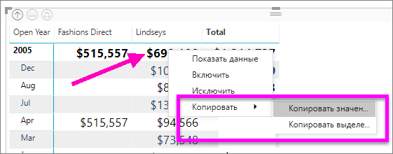

* Чтобы скопировать несколько ячеек сразу, выберите нужный диапазон ячеек или выберите несколько ячеек по очереди, удерживая клавишу CTRL. 

    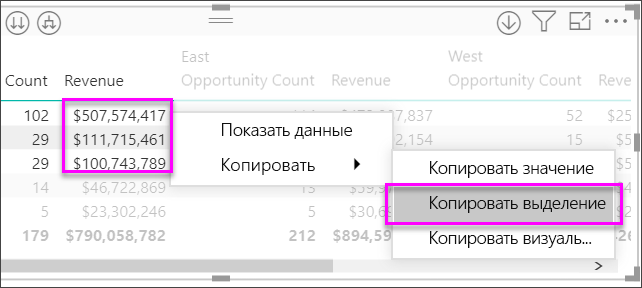

* Такая копия будет содержать заголовки столбцов и строк.

    

* Чтобы создать копию визуального элемента, содержащую только выбранные ячейки, выберите нужное число ячеек с помощью клавиши CTRL, щелкните их правой кнопкой мыши и выберите **Копировать визуальный элемент**.

    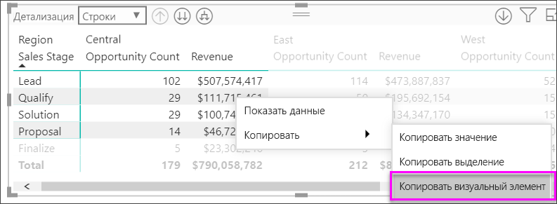

* Копия будет представлять собой еще одну визуализацию матрицы, содержащую только скопированные данные.

    

## Цвет заливки и шрифта с визуальными элементами матрицы
С помощью визуального элемента "Матрица" можно применить условное форматирование (цвет, заливка, гистограммы) фона для ячеек в матрице, а также условное форматирование текста и значений.

Чтобы применить условное форматирование, выберите визуальный элемент "Матрица" и откройте панель **Форматирование**. Разверните карточку **Условное форматирование** для параметров **Цвет фона**, **Цвет шрифта** или **Гистограммы** и установите ползунок в положение **Включено**. При включении одного из этих параметров отображается ссылка на *расширенные элементы управления*, позволяющие настроить цвета и значения для форматирования цвета.
  
  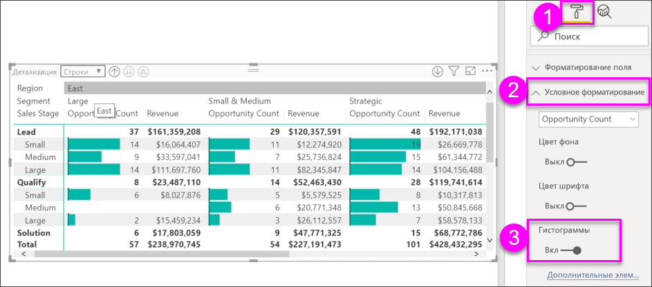

Выберите *Расширенные элементы управления* для отображения диалогового окна, в котором можно внести изменения. Этот пример показывает диалоговое окно для параметра **Гистограммы**.

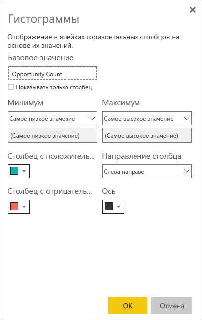

## Дальнейшие действия

[Точечные и пузырьковые диаграммы в Power BI](power-bi-visualization-scatter.md)

[Типы визуализаций в Power BI](power-bi-visualization-types-for-reports-and-q-and-a.md)