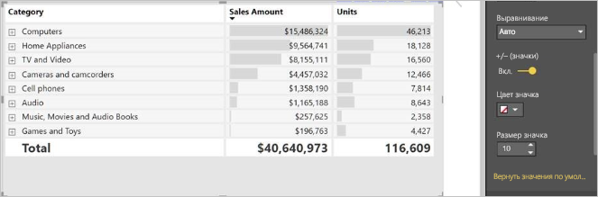

# Использование визуального элемента "Матрица" в Power BI
**Матрицы** visual аналогичен **таблицы**.  Таблицы поддерживает 2 измерения и данные не структурированы, отображаются и не суммируются значения повторяющиеся значения. Матрица упрощает для отображения данных значимо по нескольким измерениям — он поддерживается ступенчатый макет. Матрица автоматически объединяет данные и включит переход вниз. 

Можно создать визуальные элементы матрицы в **Power BI Desktop** и **службе Power BI** отчеты и перекрестно выделять элементы внутри матрицы с другими визуальными элементами на этой странице отчета. Например можно выбрать строки, столбцы и даже отдельные ячейки и перекрестное выделение. Кроме того отдельные ячейки и множественного выбора ячейки можно скопировать и вставить в другие приложения. 

Предусмотрено множество функций для матрицы, которые мы рассмотрим в следующих разделах этой статьи.

## Основные сведения о вычислении итогов в Power BI

Прежде чем использовать визуальный элемент **Матрица**, важно понять, как в Power BI вычисляются итоговое и промежуточные значения в таблицах и матрицах. Для строк итогов и промежуточных итогов мера вычисляется на основе всех строк в базовых данных. Это *не является* простым сложением всех значений в видимых или отображаемых строках. Это значит, что в результате значения в строке итогов могут отличаться от ожидаемых. 

Взгляните на следующие визуальные элементы матрицы. 

В этом примере отображается каждой строки в матрице visual правее *сумма* для каждого сочетания даты и менеджеров по продажам. Но так как для одного менеджера проводится сопоставление с несколькими датами, число может отображаться несколько раз. Таким образом, точное итоговое значение на основе базовых данных и простое сложение отображаемых значений не эквивалентны. Это распространенный подход, когда при суммировании значение представляет сторону "один" в связи "один ко многим".

Ч то касается итогов и промежуточных итогов, учитывайте, что эти значения основаны на базовых данных, а не на отображаемых значениях. 

<!-- use Nov blog post video

## Expanding and collapsing row headers
There are two ways you can expand row headers. The first is through the right-click menu. You’ll see options to expand the specific row header you clicked on, the entire level or everything down to the very last level of the hierarchy. You have similar options for collapsing row headers as well.

You can also add +/- buttons to the row headers through the formatting pane under the row headers card. By default, the icons will match the formatting of the row header, but you can customize the icons’ color and size separately if you want. 
Once the icons are turned on, they work similarly to the icons from PivotTables in Excel.

The expansion state of the matrix will save with your report. It can be pinned to dashboards as well, but consumers will need to open up the report to change the state. Conditional formatting will only apply to the inner most visible level of the hierarchy. Note that this expand/collapse experience is not currently supported when connecting to AS servers older than 2016 or MD servers.

Watch the following video to learn more about expand/collapse in the matrix:

-->
## Использование детализации в работу с визуальный элемент с матрицей
С визуальный элемент с матрицей позволяет выполнять различные интересные детализации углублением действия, недоступные ранее. Вы можете выполнить детализацию с использованием строк, столбцов и даже отдельных разделов и ячеек. Рассмотрим каждый из вариантов детализации.

### Детализация по заголовкам строк
В области **Визуализации** при добавлении нескольких полей в разделе **Строки** области **Поля** вы включаете детализацию по строкам визуального элемента "матрица". Это похоже на создание иерархии, которую затем можно детализировать (а потом обобщить), а также выполнить анализ данных на каждом уровне.

На следующем рисунке **строк** раздел содержит *этап продажи* и *размеру возможных сделок*, создание группу (или иерархию) в строках, которые можно детализировать.

Если в разделе **Строки** для визуального элемента создана группа, в верхней левой части визуального элемента отображаются значки *детализации* и *развертывания*.

Эти кнопки действуют так же, как и подобные кнопки для детализации и развертывания в других визуальных элементах: они позволяют перемещаться по уровням элементов иерархии вниз (или вверх). В этом случае мы можем перейти от *этап продажи* для *размеру возможных сделок*, как показано на следующем рисунке, где был выбран детализации углублением значок один уровень (виде разветвления).

Помимо использования этих значков, можно выбрать любой из заголовков строк и детализировать, выбрав из меню.

Обратите внимание, что в этом меню есть несколько параметров, используя которые вы получите разные результаты.

Выбрав **нижние** развернута матрица для *,* уровня строки, *за исключением* других заголовков строк, кроме заголовка строки, которая была выбрана. На следующем рисунке **предложение** > **нижние** был выбран. Обратите внимание, что другие строки верхнего уровня перестали отображаться в матрице. Этот способ детализации — полезная функция. Она очень пригодится, когда мы перейдем к разделу о **перекрестном выделении**.

Выберите **подняться** значок, чтобы вернуться к предыдущему представлению верхнего уровня. Если выбрать **предложение** > **Показать следующий уровень**, вы получаете по возрастанию список всех элементов следующего уровня (в этом случае *размеру возможных сделок* поле), без категоризации иерархии верхнего уровня.

Выберите **подняться** значок в левом верхнем углу, чтобы в матрице отобразились все категории верхнего уровня, затем выберите **предложение** > **раскрыть до следующего уровня**, увидеть все значения для обоих уровней иерархии - *этап продажи* и *размеру возможных сделок*.

Можно также использовать **Expand** пункт меню для управления отображением Дополнительно.  Например, выберите **предложение** > **Expand** > **выбора**. Power BI отображает одну строку итогов для каждой *этап продажи* и все *размеру возможных сделок* параметры *предложение*.

### Детализация по заголовкам столбцов
Как возможность детализации по строкам, вы можете также детализировать **столбцы**. На следующем рисунке, содержатся два поля в **столбцы** , создающие иерархию аналогичную мы использовали для строк ранее в этой статье. В **столбцы** полей, у нас есть *регион* и *сегмент*. Как только был добавлен во втором поле **столбцы**, нового раскрывающегося меню отображается на визуальный элемент, он сейчас отображается **строк**.

Для детализации на столбцы, выберите **столбцы** из *детализация* меню, которое можно найти в левом верхнем углу матрицы. Выберите *Восточная* область и выберите **нижние**.

При выборе **нижние**, следующий уровень в иерархии столбцов для *регион > Восточная* экранов, в данном случае является *число возможных сделок*. Другие области отображаются, но неактивен.

Остальные элементы меню действуют в столбцах так же, как в строках (см. в предыдущем разделе **детализация по заголовкам строк**). Вы можете **Показать следующий уровень** и **раскрыть до следующего уровня** со столбцами, точно так же, как и с помощью строк.

> [!NOTE]
> Значки детализации и перехода на уровень выше в верхнем левом углу визуального элемента "матрица" применяются только к строкам. Чтобы выполнить детализацию по столбцам, воспользуйтесь контекстным меню.
> 
> 

## Ступенчатый макет с визуальными элементами с матрицей
Визуальный элемент **Матрица** позволяет автоматически сделать отступы для подкатегорий в иерархии под каждой родительской категорией. Вот что собой представляет **ступенчатый макет**.

В *исходной* версии визуального элемента "Матрица" подкатегории отображались в отдельном столбце, занимая больше места в визуальном элементе. На следующем рисунке показана таблица в исходном визуальном элементе **Матрица**. Обратите внимание, что подкатегории находятся в отдельном столбце.

На следующем рисунке показан визуальный элемент **Матрица** со **ступенчатым макетом**. Обратите внимание, что в категории *Компьютеры* подкатегории ("Комплектующие для компьютеров", "Настольные компьютеры", "Ноутбуки", "Мониторы" и т. д.) немного сдвинуты. Таким образом визуальный элемент стал понятнее и меньше по размеру.

Параметры ступенчатого макета можно легко настроить. Выберите визуальный элемент **Матрица** и в области **Визуализации** в разделе **Формат** (значок в виде валика) разверните раздел **Заголовки строк**. У вас имеется два элемента: переключатель **Ступенчатый макет** (который включает или выключает этот макет) и параметр **Макет с пошаговым отступом** (позволяет указать уровень отступа в пикселях).

Если отключить **ступенчатый макет**, подкатегории будут отображаться в другом столбце, а не под родительской категорией.

## Промежуточные итоги с визуальными элементами матрицы
Промежуточные итоги можно включить или отключить в визуальных элементах матрицы для строк и столбцов. На следующем рисунке видно, что для строки промежуточных итогов задано значение **Включено**.

В разделе **Формат** на панели **Визуализации** разверните карту **Подытоги** и установите ползунок **Подытоги по строке** в положение **Выключено**. После этого действия подытоги больше не будут отображаться.

Для столбцов применяется тот же процесс.

## Перекрестное выделение с использованием визуальных элементов с матрицей
В визуальном элементе **Матрица** для перекрестного выделения вы можете выбрать все элементы в матрице. Выберите столбец в визуальном элементе **Матрица**, и он будет выделен, как и другие визуальные элементы на странице отчета. Этот способ перекрестного выделения был доступен для других визуальных элементов, а также при выборе точки данных. Теперь он реализован и для визуального элемента **Матрица**.

Кроме того, для перекрестного выделения можно также нажать клавишу CTRL и щелкнуть мышью. Например, на следующем рисунке в визуальном элементе **Матрица** выбрана коллекция подкатегорий. Обратите внимание, что элементы, которые не были выбраны в визуальном элементе, выделены серым цветом. Также оцените, как в других визуальных элементах на странице отражаются элементы, выбранные в визуальном элементе **Матрица**.

## Копирование значений из Power BI для использования в других приложениях

Матрица или таблица могут иметь содержимое, которое вы можете использовать в других приложениях, например Dynamics CRM, Excel, и даже в других отчетах Power BI. Щелчком правой кнопки мыши в Power BI можно скопировать одну ячейку или набор ячеек в буфер обмена, чтобы вставить их в другое приложение.

* Чтобы скопировать значение из одной ячейки, выделите нужную ячейку, щелкните ее правой кнопкой мыши и выберите **Копировать значение**. Значение ячейки без формата помещается в буфер обмена, откуда его можно вставить в другое приложение.

    

* Чтобы скопировать несколько ячеек сразу, выберите нужный диапазон ячеек или выберите несколько ячеек по очереди, удерживая клавишу CTRL. Такая копия будет содержать заголовки столбцов и строк.

    

## Цвет заливки и шрифта с визуальными элементами матрицы
Визуальный элемент с матрицей, позволяет применять **условное форматирование** (цвет и заливка и гистограммы) фона для ячеек в матрице, а также можно применить условное форматирование текста и значений.

Чтобы применить условное форматирование, выберите матрицу visual и откройте **формат** области. Разверните **условное форматирование** карты и для **цвет фона**, **цвет шрифта**, или **гистограммы**, установите ползунок для **На**. Включение одного из этих параметров отображается ссылка на *расширенные элементы управления*, позволяющее настраивать цвета и значения для форматирования цвета.
  
  

Выберите *расширенные элементы управления* для отображения диалогового окна, в котором можно внести изменения. В этом примере показано диалоговое окно для **гистограммы**.

## Дальнейшие действия

[Точечные и пузырьковые диаграммы в Power BI](power-bi-visualization-scatter.md)

[Типы визуализаций в Power BI](power-bi-visualization-types-for-reports-and-q-and-a.md)