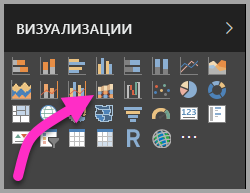
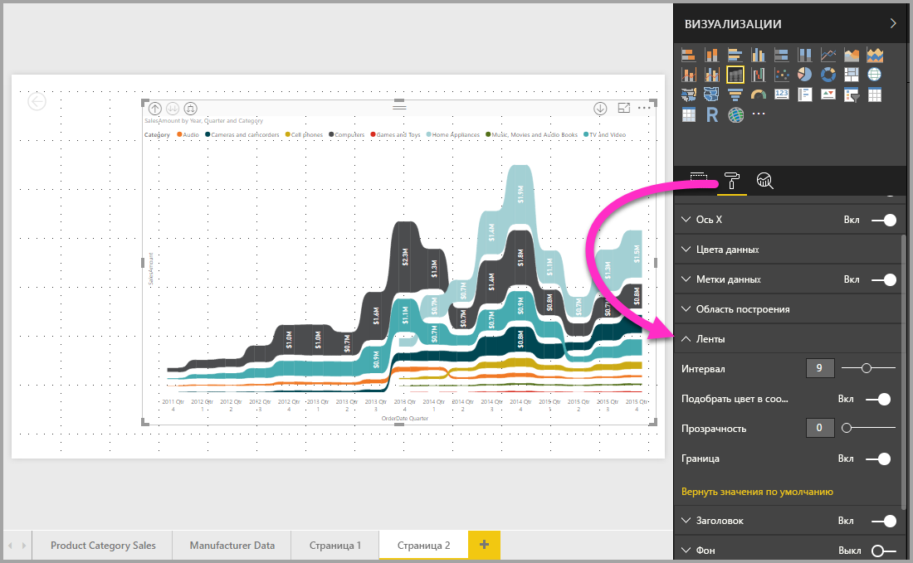

# Использование ленточных диаграмм в Power BI
**Ленточные диаграммы** в Power BI позволяют визуализировать данные и быстро определять категории данных с наивысшим рангом (максимальным значением). Ленточные диаграммы лучше всего подходят для отображения изменений ранга. Наивысший ранг (значение) за каждый период времени всегда отображается в верхней части диаграммы. Ленточные диаграммы доступны в **Power BI Desktop** начиная с выпуска за сентябрь 2017 г. и в последующих обновлениях **службы Power BI**.

## Создание ленточной диаграммы
Чтобы создать ленточную диаграмму, в области **Визуализации** нажмите кнопку **Диаграмма ленты**.

Ленточные диаграммы позволяют соединить категории данных за отображаемый период времени с помощью лент и таким образом увидеть, как указанная категория ранжируется на отрезке оси X (как правило, это временная шкала).

## Форматирование ленточной диаграммы
При создании ленточной диаграммы вы может использовать параметры форматирования, доступные в разделе **Формат** области **Визуализации**. Параметры форматирования для ленточных диаграмм такие же, как и для гистограммы с накоплением, но для ленточных диаграмм есть несколько дополнительных параметров.

Эти параметры форматирования для ленточных диаграмм позволяют настроить следующее:

* **Spacing** (Интервал). Позволяет настроить расстояние между лентами. Число представляет собой процент от максимальной высоты столбца.
* **Подобрать цвет в соответствии с последовательностью.** Позволяет подобрать цвет лент в соответствии с последовательностью. Если параметр отключен, ленты будут серыми.
* **Прозрачность.** Позволяет задать уровень прозрачности лент. Значение по умолчанию — 30.
* **Граница.** Позволяет разместить темную границу в верхней и нижней части ленты. По умолчанию границы отключены.

## Дальнейшие действия
Дополнительные сведения о **Power BI Desktop** и инструкции по началу работы см. в следующих статьях.

* [Что такое Power BI Desktop?](../desktop-what-is-desktop.md)
* [Общие сведения о запросах в Power BI Desktop](../desktop-query-overview.md)
* [Источники данных в Power BI Desktop](../desktop-data-sources.md)
* [Подключение к данным в Power BI Desktop](../desktop-connect-to-data.md)
* [Формирование и объединение данных в Power BI Desktop](../desktop-shape-and-combine-data.md)
* [Общие задачи с запросами в Power BI Desktop](../desktop-common-query-tasks.md)   

