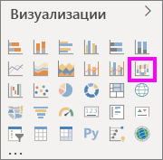
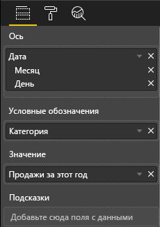
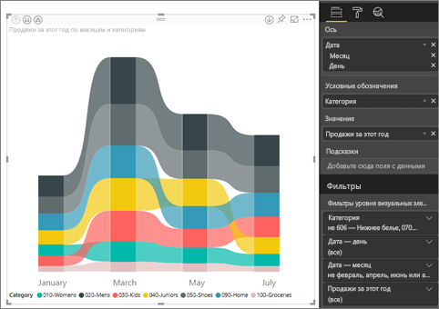
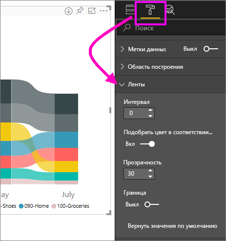
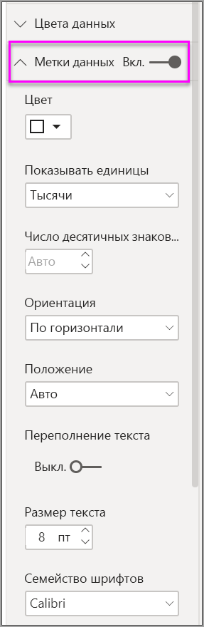
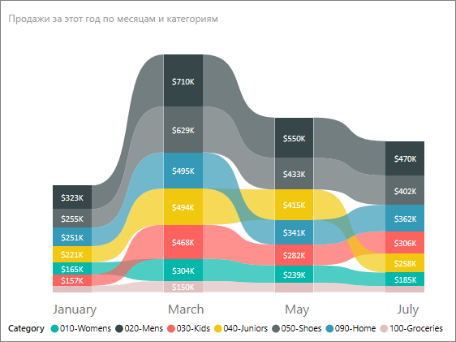

# Использование ленточных диаграмм в Power BI

[!INCLUDE [power-bi-visuals-desktop-banner](../includes/power-bi-visuals-desktop-banner.md)]

Диаграммы ленты позволяют визуализировать данные и быстро выявлять категории данных с наивысшим рангом (максимальным значением). Ленточные диаграммы лучше всего подходят для отображения изменений ранга. Наивысший ранг (значение) за каждый период времени всегда отображается в верхней части диаграммы. 

## Предварительные требования

В этом руководстве используется пример PBIX-файла с примером [Анализ розничной торговли](https://download.microsoft.com/download/9/6/D/96DDC2FF-2568-491D-AAFA-AFDD6F763AE3/Retail%20Analysis%20Sample%20PBIX.pbix).

1. В верхнем левом разделе меню выберите **Файл** > **Открыть**.
   
2. Найдите свою копию PBIX-файла с примером **Анализ розничной торговли**.

1. Откройте PBIX-файл с примером **Анализ розничной торговли** в представлении отчета .

1. Выбрать  чтобы создать новую страницу.

## Создание ленточной диаграммы

1. Чтобы создать ленточную диаграмму, в области **Визуализации** нажмите кнопку **Диаграмма ленты**.

    

    Диаграммы ленты позволяют соединить категории данных за отображаемый период времени с помощью лент и увидеть, как указанная категория ранжируется на отрезке оси X (как правило, это временная шкала).

2. Выберите поля для **оси**, **условных обозначений** и **значения**.  В этом примере мы выбрали: **Магазин** > **ДатаОткрытия**, **Позиция** > **Категория**, а также **Продажи** > **Продажи за этот год** > **Значение**.  

    

    Так как набор данных содержит данные только за один год, мы удалили поля **Год** и **Квартал** из области **Ось**.

3. Диаграмма ленты показывает ранг за каждый месяц. Обратите внимание на то, как изменяется ранг с течением времени. Например, для категории "Главная" ранг изменяется со второго на пятый с февраля по март.

    

## Форматирование ленточной диаграммы
При создании ленточной диаграммы вы может использовать параметры форматирования, доступные в разделе **Формат** области **Визуализации**. Параметры форматирования для ленточных диаграмм такие же, как и для гистограммы с накоплением, но для ленточных диаграмм есть несколько дополнительных параметров.

Эти параметры форматирования для диаграмм ленты позволяют задавать настройки.

* **Spacing** (Интервал). Позволяет настроить расстояние между лентами. Число представляет собой процент от максимальной высоты столбца.
* **Подобрать цвет в соответствии с последовательностью.** Позволяет подобрать цвет лент в соответствии с последовательностью. Если для параметра установлено значение **Отключено**, ленты будут серыми.
* **Прозрачность.** Позволяет задать уровень прозрачности лент. Значение по умолчанию — 30.
* **Граница.** Позволяет разместить темную границу в верхней и нижней части ленты. По умолчанию границы отключены.

Поскольку ленточная диаграмма не имеет меток оси Y, можно добавить метки данных. На панели форматирования выберите **Метки данных**. 

Задайте параметры форматирования для меток данных. В этом примере мы изменили цвет текста на белый и выбрали в качестве цены деления шкалы тысячи.

## Дальнейшие действия

[Точечные и пузырьковые диаграммы в Power BI](power-bi-visualization-scatter.md)

[Типы визуализаций в Power BI](power-bi-visualization-types-for-reports-and-q-and-a.md)
