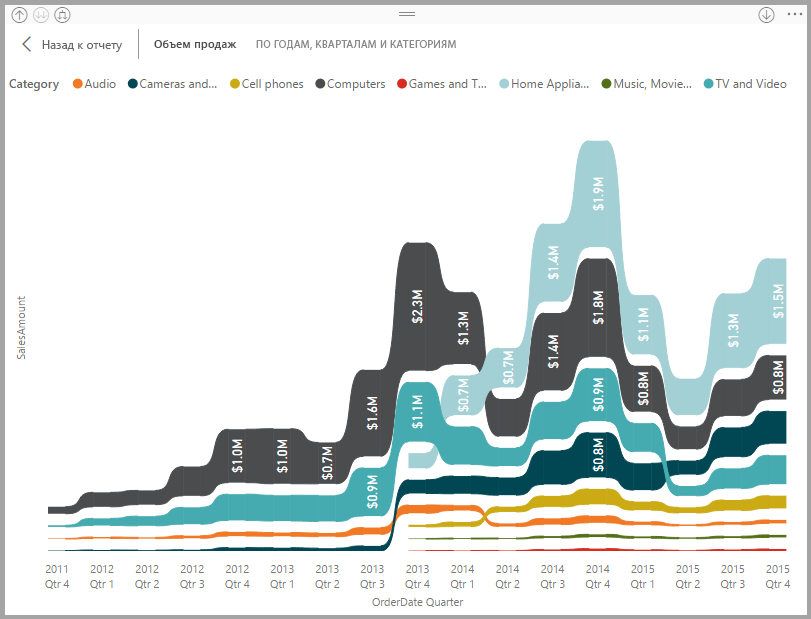

# Использование ленточных диаграмм в Power BI
Диаграммы ленты позволяют визуализировать данные и быстро выявлять категории данных с наивысшим рангом (максимальным значением). Ленточные диаграммы лучше всего подходят для отображения изменений ранга. Наивысший ранг (значение) за каждый период времени всегда отображается в верхней части диаграммы. 

## Создание ленточной диаграммы
Чтобы продолжить работу, откройте [пример отчета "Анализ розничной торговли"](../sample-retail-analysis.md). 

1. Чтобы создать ленточную диаграмму, в области **Визуализации** нажмите кнопку **Диаграмма ленты**.

    

    Диаграммы ленты позволяют соединить категории данных за отображаемый период времени с помощью лент и увидеть, как указанная категория ранжируется на отрезке оси X (как правило, это временная шкала).

2. Выберите поля для **оси**, **условных обозначений** и **значения**.  В этом примере мы выбрали: **Дата**, **Категория** и **Продажи за этот год**.  

    

    Так как набор данных содержит данные только за один год, мы удалили поле **Год** с **оси**. 

3. Диаграмма ленты показывает ранг за каждый второй месяц. Обратите внимание на то, как изменяется ранг с течением времени.  Например, категория Home (Домашняя) перемещается с третьего на четвертое, а затем обратно на третье место. Категория Juniors (Подростковая) переходит с третьего на пятое место в июле. 

    

## Форматирование ленточной диаграммы
При создании ленточной диаграммы вы может использовать параметры форматирования, доступные в разделе **Формат** области **Визуализации**. Параметры форматирования для ленточных диаграмм такие же, как и для гистограммы с накоплением, но для ленточных диаграмм есть несколько дополнительных параметров.

Эти параметры форматирования для диаграмм ленты позволяют задавать настройки.

* **Spacing** (Интервал). Позволяет настроить расстояние между лентами. Число представляет собой процент от максимальной высоты столбца.
* **Подобрать цвет в соответствии с последовательностью.** Позволяет подобрать цвет лент в соответствии с последовательностью. Если для параметра установлено значение **Отключено**, ленты будут серыми.
* **Прозрачность.** Позволяет задать уровень прозрачности лент. Значение по умолчанию — 30.
* **Граница.** Позволяет разместить темную границу в верхней и нижней части ленты. По умолчанию границы отключены.

Поскольку ленточная диаграмма не имеет меток оси Y, можно добавить метки данных. На панели форматирования выберите **Метки данных**. 

Задайте параметры форматирования для меток данных.  В этом примере мы изменили цвет текста на белый, задали число десятичных разрядов равным нулю и выбрали в качестве цены деления шкалы тысячи. 

## Дальнейшие действия

[Точечные и пузырьковые диаграммы в Power BI](power-bi-visualization-scatter.md)

[Типы визуализаций в Power BI](power-bi-visualization-types-for-reports-and-q-and-a.md)