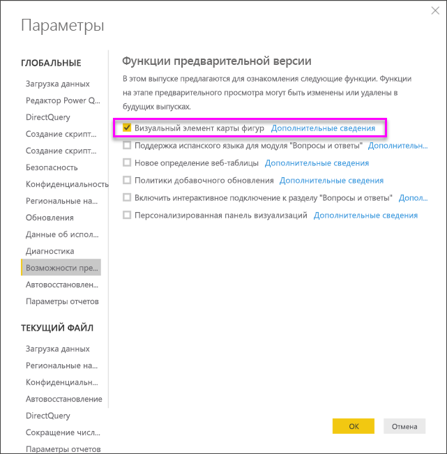
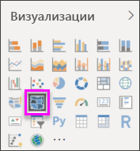
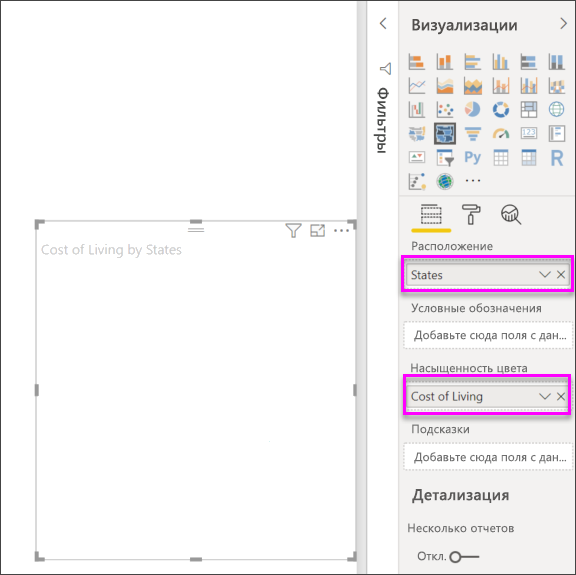
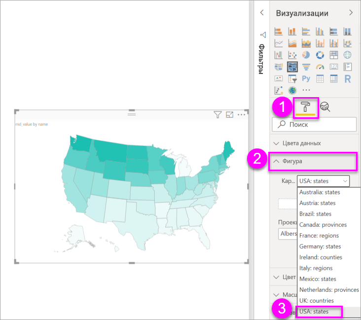
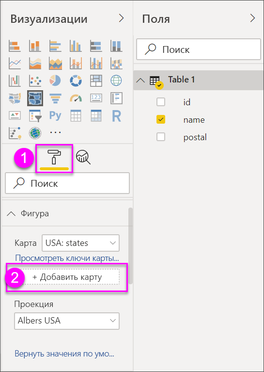
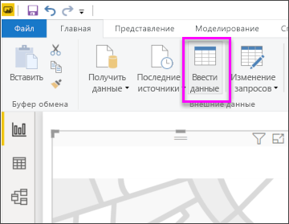
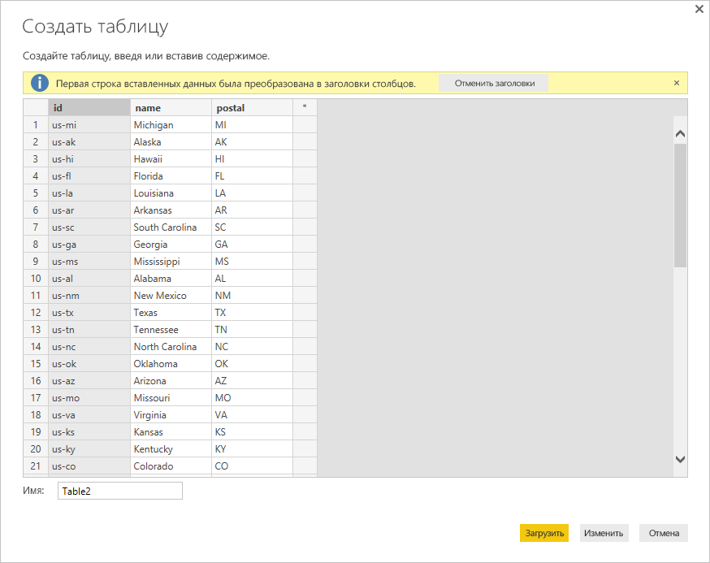

# Создание визуализаций сопоставителя фигур в Power BI Desktop (предварительная версия)

[!INCLUDE[consumer-appliesto-nyyn](../includes/consumer-appliesto-nyyn.md)]

[!INCLUDE [power-bi-visuals-desktop-banner](../includes/power-bi-visuals-desktop-banner.md)]

Создайте визуальный элемент **Карта фигур** для сравнения регионов на карте по цветам. В отличие от визуального элемента **Карта**, на визуальном элементе **Карта фигур** невозможно отобразить точное географическое расположение точек данных на карте. Его основное назначение — проиллюстрировать относительное сравнение регионов на карте с помощью разных цветов.

Визуальные элементы типа **Карта фигур** созданы на базе карт TopoJSON, позволяющих создавать и использовать собственные настраиваемые карты. (например, географические карты, планы залов и помещений и т. д.). Эта предварительная версия **Карт фигур** не поддерживает настраиваемые карты.

> [!NOTE]
> Для предоставления общего доступа к отчету Power BI и вам, и коллеге необходимо иметь отдельные лицензии Power BI Pro или сохранить отчет в емкости Премиум.

## Создание карт фигур
Вы можете проверить элемент управления **Карта фигур** с помощью карт, которые поставляются вместе с этой предварительной версией, или использовать свою карту, если она соответствует требованиям, приведенным в следующем разделе под названием **Использование пользовательских карт**.

Визуальный элемент **Карта фигур** представляет собой предварительную версию, поэтому его необходимо сначала включить в Power BI Desktop. Чтобы включить **карту фигур**, выберите **Файл > Параметры и настройки > Параметры > Предварительная версия функций** и установите флажок **Визуальный элемент "Карта фигур"** . После этого изменения приложение Power BI Desktop необходимо перезапустить.

Когда функция **Карта фигур** включена, щелкните значок **Карта фигур** в области **Визуализации**.

Power BI Desktop создаст пустой холст для визуального элемента **Карта фигур**.

Чтобы создать **карту фигур**, выполните указанные ниже действия.

1. В области **Поля** перетащите поле данных с названиями (в том числе сокращенными) регионов в контейнер **Расположение**, а поле меры данных — в контейнер **Насыщенность цвета** (карта пока не отображается).

   > [!NOTE]
   > Сведения о том, как быстро загрузить данные карт, чтобы проверить элемент **Карта фигур** в действии, см. в разделе **Получение карт** ниже.
   > 
   > 

   
2. В области параметров **Формат** разверните раздел **Фигура** и выберите вариант из раскрывающегося списка **Стандартные карты**, чтобы отобразить данные. На этом этапе появится изображение карты, как показано на рисунке ниже.

   

   > [!NOTE]
   > В разделе **Ключи регионов** в конце этой статьи перечислены таблицы с ключами регионов карт, которые можно использовать для проверки визуального элемента **Карта фигур**.
   > 
   > 
3. Затем можно изменить карту с помощью параметров форматирования, таких как **Цвет по умолчанию**, **Масштаб** и другие. Вы также можете добавить столбец категории данных в контейнер **Условные обозначения** и распределить регионы карты по категориям.

## Использование настраиваемых карт
Вы можете использовать с **картой фигур** пользовательские карты в формате **TopoJSON**. Если ваша карта в другом формате, вы можете воспользоваться онлайн-инструментами, такими как [**Map Shaper**](https://mapshaper.org/), для преобразования *файлов фигур* или карт *GeoJSON* в формат **TopoJSON**.

Чтобы использовать файл карты **TopoJSON**, добавьте в отчет визуальный элемент ShapeMap, а также добавьте данные в контейнеры *Расположение* и *Насыщенность цвета*. Затем в области **Визуализации** выберите раздел **Формат** (на который указывает стрелка (1) на следующем рисунке), разверните раздел **Фигура** и выберите **+ Добавить карту**.

## Пример настраиваемой карты
*Федеральная прокуратура США* выпускает годовой финансовый отчет о судебных разбирательствах и количестве рассматриваемых дел.  Все эти отчеты можно найти по следующей ссылке:

https://www.justice.gov/usao/resources/annual-statistical-reports

Так как штаты могут делиться на несколько округов, нужно использовать настраиваемую карту фигур.  Импортировав карту **TopoJSON** с судебными округами США в **Power BI Desktop**, можно визуализировать финансовые данные прокуратуры по округам за год.  На рисунке ниже показан пример такой карты.

Вы можете выполнять нужные действия с картами отдельного штата, а также отображать подробные сведения с учетом находящихся в нем округов. 

Если вы хотите поэкспериментировать с этим набором данных и визуализацией, можете скачать исходный PBIX-файл, использовавшийся для создания этого отчета, по приведенной ниже ссылке.

* [Демонстрационный PBIX-файл настраиваемой карты фигур](https://download.microsoft.com/download/1/2/8/128943FB-9231-42BD-8A5D-5E2362C9D589/DistrictAttorneyFiscalReport.pbix)

## Получение карт
Чтобы быстро загрузить в модель данные и протестировать визуальный элемент **Карта фигур**, скопируйте одну из таблиц, приведенных в конце этой статьи, и нажмите кнопку **Ввести данные** на ленте **Главная**.

При наличии нескольких столбцов вам потребуется вставить данные с помощью редактора, например Excel, и скопировать каждый столбец данных отдельно. Затем вставьте данные в приложение Power BI Desktop. Верхняя строка будет автоматически назначена заголовком.

Чтобы добавить новый столбец, просто введите его название (в пустом столбце справа), а затем добавьте значение в каждую ячейку (так же, как в Excel). Завершив подготовку, нажмите кнопку **Загрузить**, и столбец будет добавлен в модель данных в Power BI Desktop.

> [!NOTE]
> Указывая страны или регионы, используйте трехбуквенное сокращение для правильной работы геокодирования в визуализации карт. *Не* используйте двухбуквенные сокращения, так как некоторые страны или регионы могут не распознаваться правильно.
> 
> Если у вас есть только двухбуквенные сокращения, в [этой внешней записи блога](https://blog.ailon.org/how-to-display-2-letter-country-data-on-a-power-bi-map-85fc738497d6#.yudauacxp) вы найдете инструкции о том, как связать двухбуквенные сокращения для обозначения стран и регионов с трехбуквенными.
> 
> 

## Особенности работы и требования предварительной версии
С этим предварительным выпуском **карты фигур** связан ряд моментов и требований.

* Визуальный элемент **Карта фигур** представляет собой предварительную версию, поэтому его необходимо сначала включить в Power BI Desktop. Чтобы включить **карту фигур**, выберите **Файл > Параметры и настройки > Параметры > Предварительная версия функций** и установите флажок **Визуальный элемент "Карта фигур"** .
* Сейчас для корректной классификации по **условным обозначениям** нужно также настроить контейнер **Насыщенность цвета**.
* В окончательном выпуске **карты фигур** в пользовательском интерфейсе будут отображаться ключи текущей карты (дата окончательного выпуска пока не определена, и **карта фигур** еще находится на этапе предварительной версии). В этой предварительной версии вы можете использовать ключи регионов карт, приведенные в таблицах раздела **Ключи регионов** в этой статье.
* Визуализация **Карта фигур** будет отображать до 1500 точек данных.

## Ключи регионов

Для тестирования **карты фигур** в этой предварительной версии используйте приведенные ниже **ключи регионов**.

### Австралия: земли

| Идентификатор | abbr | iso | name | postal |
| --- | --- | --- | --- | --- |
| au-wa |WA |AU-WA |Western Australia |WA |
| au-vic |Vic |AU-VIC |Victoria |VIC |
| au-tas |Tas |AU-TAS |Tasmania |TAS |
| au-sa |SA |AU-SA |South Australia |SA |
| au-qld |Qld |AU-QLD |Queensland |QLD |
| au-nt |NT |AU-NT |Northern Territory |NT |
| au-nsw |NSW |AU-NSW |New South Wales |NSW |
| au-act |ACT |AU-ACT |Australian Capital Territory |ACT |

### Австрия: земли

| Идентификатор | iso | name | name-en | postal |
| --- | --- | --- | --- | --- |
| at-wi |AT-9 |Wien |Vienna |WI |
| at-vo |AT-8 |Vorarlberg |Vorarlberg |VO |
| at-tr |AT-7 |Tirol |Tyrol |TR |
| at-st |AT-6 |Steiermark |Styria |ST |
| at-sz |AT-5 |Salzburg |Salzburg |SZ |
| at-oo |AT-4 |Oberösterreich |Upper Austria |OO |
| at-no |AT-3 |Niederösterreich |Lower Austria |NO |
| at-ka |AT-2 |Kärnten |Carinthia |KA |
| at-bu |AT-1 |Burgenland |Burgenland |Подразделение |

### Бразилия: земли

| Идентификатор |
| --- |
| Tocantins |
| Pernambuco |
| Goias |
| Sergipe |
| Sao Paulo |
| Santa Catarina |
| Roraima |
| Rondonia |
| Rio Grande do Sul |
| Rio Grande do Norte |
| Rio de Janeiro |
| Piaui |
| Parana |
| Paraiba |
| Para |
| Minas Gerais |
| Mato Grosso |
| Maranhao |
| Mato Grosso do Sul |
| Distrito Federal |
| Ceara |
| Espirito Santo |
| Bahia |
| Amazonas |
| Amapa |
| Alagoas |
| Acre |
| Litigated Zone 1 |
| Litigated Zone 2 |
| Litigated Zone 3 |
| Litigated Zone 4 |

### Канада: провинции

| Идентификатор | iso | name | postal |
| --- | --- | --- | --- |
| ca-nu |CA-NU |Nunavut |NU |
| ca-nt |CA-NT |Northwest Territories |NT |
| ca-yt |CA-YT |Yukon |YT |
| ca-sk |CA-SK |Saskatchewan |SK |
| ca-qc |CA-QC |Quebec |QC |
| ca-pe |CA-PE |Prince Edward Island |PE |
| ca-on |CA-ON |Ontario |ON |
| ca-ns |CA-NS |Nova Scotia |NS |
| ca-nl |CA-NL |Newfoundland and Labrador |NL |
| ca-nb |CA-NB |New Brunswick |NB |
| ca-mb |CA-MB |Manitoba |MB |
| ca-bc |CA-BC |British Columbia |BC |
| ca-ab |CA-AB |Alberta |AB |

### Франция: области

| Идентификатор | name | name-en |
| --- | --- | --- |
| Auvergne-Rhone-Alpes |  |  |
| Bourgogne-Franche-Comte |  |  |
| Bretagne |Bretagne |Brittany |
| Centre-Val de Loire |Centre-Val de Loire |Centre-Val de Loire |
| Corse |Corse |Corsica |
| Grand Est |  |  |
| Гваделупа | |   |
| Hauts-de-France |  |  |
| Ile-de-France |Île-de-France |Ile-de-France |
| La Reunion |  |  |
| Майотт  |  |  |
| Normandie |Normandie |  |
| Nouvelle-Aquitaine |  |  |
| Occitanie  |  |  |
| Pays de la Loire |Pays de la Loire |Pays de la Loire |
| Provence-Alpes-Cote d'Azur |Provence-Alpes-Côte d'Azur |Provence-Alpes-Cote d'Azur |
|  |  |  |

### Германия: земли

| Идентификатор | iso | name | name-en | postal |
| --- | --- | --- | --- | --- |
| de-be |DE-BE |Berlin |Berlin |BE |
| de-th |DE-TH |Thüringen |Thuringia |TH |
| de-st |DE-ST |Sachsen-Anhalt |Saxony-Anhalt |ST |
| de-sn |DE-SN |Sachsen |Saxony |SN |
| de-mv |DE-MV |Mecklenburg-Vorpommern |Mecklenburg-Vorpommern |MV |
| de-bb |DE-BB |Brandenburg |Brandenburg |BB |
| de-sh |DE-SH |Schleswig-Holstein |Schleswig-Holstein |SH |
| de-sl |DE-SL |Saarland |Saarland |SL |
| de-rp |DE-RP |Rheinland-Pfalz |Rhineland-Palatinate |RP |
| de-nw |DE-NW |Nordrhein-Westfalen |North Rhine-Westphalia |NW |
| de-ni |DE-NI |Niedersachsen |Lower Saxony |NI |
| de-he |DE-HE |Hessen |Hesse |HE |
| de-hh |DE-HH |Hamburg |Hamburg |HH |
| de-hb |DE-HB |Bremen |Bremen |HB |
| de-by |DE-BY |Bayern |Bavaria |BY |
| de-bw |DE-BW |Baden-Württemberg |Baden-Wurttemberg |BW |

### Ирландия: графства

| Идентификатор |
| --- |
| Wicklow |
| Wexford |
| Westmeath |
| Waterford |
| Sligo |
| Tipperary |
| Roscommon |
| Offaly |
| Monaghan |
| Meath |
| Mayo |
| Louth |
| Longford |
| Limerick |
| Leitrim |
| Laoighis |
| Kilkenny |
| Kildare |
| Kerry |
| Galway |
| Dublin |
| Donegal |
| Cork |
| Clare |
| Cavan |
| Carlow |

### Италия: области

| Идентификатор | iso | name | name-en | postal |
| --- | --- | --- | --- | --- |
| it-vn |IT-34 |Veneto |Veneto |VN |
| it-vd |IT-23 |Valle d'Aosta |Aosta Valley |VD |
| it-um |IT-55 |Umbria |Umbria |UM |
| it-tt |IT-32 |Trentino-Alto Adige |Trentino-South Tyrol |TT |
| it-tc |IT-52 |Toscana |Tuscany |TC |
| it-sc |IT-82 |Sicilia |Sicily |SC |
| it-sd |IT-88 |Sardegna |Sardinia |SD |
| it-pm |IT-21 |Piemonte |Piedmont |PM |
| it-ml |IT-67 |Molise |Molise |ML |
| it-mh |IT-57 |Marche |Marche |MH |
| it-lm |IT-25 |Lombardia |Lombardy |LM |
| it-lg |IT-42 |Liguria |Liguria |LG |
| it-lz |IT-62 |Lazio |Lazio |LZ |
| it-fv |IT-36 |Friuli-Venezia Giulia |Friuli-Venezia Giulia |FV |
| it-er |IT-45 |Emilia-Romagna |Emilia-Romagna |ER |
| it-cm |IT-72 |Campania |Campania |CM |
| it-lb |IT-78 |Calabria |Calabria |LB |
| it-bc |IT-77 |Basilicata |Basilicata |BC |
| it-pu |IT-75 |Apulia |Puglia |PU |
| it-ab |IT-65 |Abruzzo |Abruzzo |AB |

### Мексика земли

| Идентификатор | abreviatura | iso | name | name-en | postal |
| --- | --- | --- | --- | --- | --- |
| mx-zac |Zac. |MX-ZAC |Zacatecas |Zacatecas |ZA |
| mx-yuc |Yuc. |MX-YUC |Yucatán |Yucatan |YU |
| mx-ver |Ver. |MX-VER |Veracruz |Veracruz |VE |
| mx-tla |Tlax. |MX-TLA |Tlaxcala |Tlaxcala |TL |
| mx-tam |Tamps. |MX-TAM |Tamaulipas |Tamaulipas |TM |
| mx-tab |Tab. |MX-TAB |Tabasco |Tabasco |TB |
| mx-son |Son. |MX-SON |Sonora |Sonora |SO |
| mx-sin |Sin. |MX-SIN |Sinaloa |Sinaloa |SI |
| mx-slp |S.L.P. |MX-SLP |San Luis Potosí |San Luis Potosi |SL |
| mx-roo |Q.R. |MX-ROO |Quintana Roo |Quintana Roo |QR |
| mx-que |Qro. |MX-QUE |Querétaro |Queretaro |QE |
| mx-pue |Pue. |MX-PUE |Puebla |Puebla |PU |
| mx-oax |Oax. |MX-OAX |Oaxaca |Oaxaca |OA |
| mx-nle |N.L. |MX-NLE |Nuevo León |Nuevo Leon |NL |
| mx-nay |Nay. |MX-NAY |Nayarit |Nayarit |NA |
| mx-mor |Mor. |MX-MOR |Morelos |Morelos |MR |
| mx-mic |Mich. |MX-MIC |Michoacán |Michoacan |MC |
| mx-mex |Méx. |MX-MEX |Estado de México |Mexico State |MX |
| mx-jal |Jal. |MX-JAL |Jalisco |Jalisco |JA |
| mx-hid |Hgo. |MX-HID |Hidalgo |Hidalgo |HI |
| mx-gro |Gro. |MX-GRO |Guerrero |Guerrero |GR |
| mx-gua |Gto. |MX-GUA |Guanajuato |Guanajuato |GT |
| mx-dur |Dgo. |MX-DUR |Durango |Durango |DU |
| mx-dif |CDMX. |MX-DIF |Ciudad de México |Mexico City |DF |
| mx-col |Col. |MX-COL |Colima |Colima |CL |
| mx-coa |Coah. |MX-COA |Coahuila |Coahuila |CA |
| mx-chh |Chih. |MX-CHH |Chihuahua |Chihuahua |CH |
| mx-chp |Chis. |MX-CHP |Chiapas |Chiapas |CP |
| mx-cam |Camp. |MX-CAM |Campeche |Campeche |CM |
| mx-bcs |B.C.S. |MX-BCS |Baja California Sur |Baja California Sur |BS |
| mx-bcn |B.C. |MX-BCN |Baja California |Baja California |BN |
| mx-agu |Ags. |MX-AGU |Aguascalientes |Aguascalientes |AG |

### Нидерланды: провинции

| Идентификатор | iso | name | name-en |
| --- | --- | --- | --- |
| nl-zh |NL-ZH |Zuid-Holland |South Holland |
| nl-ze |NL-ZE |Zeeland |Zeeland |
| nl-ut |NL-UT |Utrecht |Utrecht |
| nl-ov |NL-OV |Overijssel |Overijssel |
| nl-nh |NL-NH |Noord-Holland |North Holland |
| nl-nb |NL-NB |Noord-Brabant |North Brabant |
| nl-li |NL-LI |Limburg |Limburg |
| nl-gr |NL-GR |Groningen |Groningen |
| nl-ge |NL-GE |Gelderland |Gelderland |
| nl-fr |NL-FR |Fryslân |Friesland |
| nl-fl |NL-FL |Flevoland |Flevoland |
| nl-dr |NL-DR |Drenthe |Drenthe |

### Соединенное Королевство: Страны

| Идентификатор | iso | name |
| --- | --- | --- |
| gb-wls |GB-WLS |Wales |
| gb-sct |GB-SCT |Scotland |
| gb-nir |GB-NIR |Northern Ireland |
| gb-eng |GB-ENG |England |

### США: земли

| Идентификатор | name | postal |
| --- | --- | --- |
| us-mi |Michigan |MI |
| us-ak |Alaska |AK |
| us-hi |Hawaii |HI |
| us-fl |Florida |FL |
| us-la |Louisiana |LA |
| us-ar |Arkansas |AR |
| us-sc |South Carolina |SC |
| us-ga |Georgia |GA |
| us-ms |Mississippi |MS |
| us-al |Alabama |AL |
| us-nm |New Mexico |NM |
| us-tx |Texas |TX |
| us-tn |Tennessee |TN |
| us-nc |North Carolina |NC |
| us-ok |Oklahoma |ОК |
| us-az |Arizona |AZ |
| us-mo |Missouri |MO |
| us-va |Virginia |VA |
| us-ks |Kansas |KS |
| us-ky |Kentucky |KY |
| us-co |Colorado |CO |
| us-md |Maryland |MD |
| us-wv |West Virginia |WV |
| us-de |Delaware |DE |
| us-dc |District of Columbia |DC |
| us-il |Illinois |IL |
| us-oh |Ohio |OH |
| us-ca |California |CA |
| us-ut |Utah |UT |
| us-nv |Nevada |NV |
| us-in |Indiana |IN |
| us-nj |New Jersey |NJ |
| us-ri |Rhode Island |RI |
| us-ct |Connecticut |CT |
| us-pa |Pennsylvania |PA |
| us-ny |New York |NY |
| us-ne |Nebraska |NE |
| us-ma |Massachusetts |MA |
| us-ia |Iowa |IA |
| us-nh |New Hampshire |NH |
| us-or |Oregon |OR |
| us-mn |Minnesota |MN |
| us-vt |Vermont |VT |
| us-id |Idaho |ID |
| us-wi |Wisconsin |WI |
| us-wy |Wyoming |WY |
| us-sd |South Dakota |SD |
| us-nd |North Dakota |ND |
| us-me |Maine |ME |
| us-mt |Montana |MT |
| us-wa |Washington |WA |

## Дальнейшие действия

* [Использование визуального элемента "Матрица" в Power BI Desktop](desktop-matrix-visual.md)

* [Типы визуализаций в Power BI](power-bi-visualization-types-for-reports-and-q-and-a.md)
