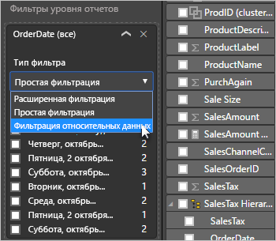

# Использование среза и фильтра относительных дат в Power BI Desktop

**Срез относительных дат** или **фильтр относительных дат** позволяют применять фильтры с учетом времени для любого столбца даты в модели данных. Например, вы можете использовать **срез относительных дат**, чтобы отобразились только данные по продажам за последние 30 дней (или месяц, календарный месяц и т. д). Когда вы обновляете данные, период относительного времени автоматически применяет ограничение относительной даты.

## Использование среза для диапазона относительных дат

Вы можете использовать срез диапазона относительных дат так же, как и любой другой срез. Создайте визуальный элемент **Срез** для отчета, а затем выберите значение даты для параметра **Поле**. На следующем изображении выбрано поле *OrderDate* (Дата заказа).

Выберите срез на холсте, а затем угловую скобку в правом верхнем углу визуального элемента среза. Если визуальный элемент содержит данные даты, в меню будет отображаться параметр **Относительные**.

Для среза относительных дат выберите *Относительное значение*.

Затем можно выбрать параметры.

Для первого параметра в *срезе относительных дат* можно выбрать один из следующих вариантов:

* Последний

* Далее

* Эта

Второй параметр (средний) в *срезе относительных дат* позволяет ввести число, определяющее диапазон относительных дат.

Третий параметр позволяет выбрать меру даты. Можно выбрать следующие значения:

* Дни

* Weeks (Недели);

* Weeks (Calendar) (Календарные недели);

* Months (Месяцы);

* Months (Calendar) (Календарные месяцы);

* Years (Годы);

* Годы (календарь)

Если выбрать в списке **Months** (Месяцы), а для среднего параметра ввести значение *2*, произойдет следующее:

* Если сегодня 20 июля,

* в ограниченных срезом визуальных элементах будут показаны данные за два предыдущих месяца,

* начиная с 21 мая и по 20 июля (текущая дата)

Для сравнения, если вы выбрали *Months (Calendar)* (Календарные месяцы), в ограниченных визуальных элементах отобразятся данные с 1 мая по 30 июня (за два последних полных календарных месяца).

## Использование фильтра для диапазона относительных дат

Кроме того, вы можете создать фильтр диапазона относительных дат для всего отчета или его отдельной страницы. Для этого перетащите поле даты в области **Фильтры на уровне страницы** или **Фильтры на уровне отчета** на панели **Поле**.

После этого можно изменить диапазон относительных дат. Процесс аналогичен настройке **среза относительных дат**. В раскрывающемся списке **Тип фильтра** выберите **Фильтрация относительных дат**.

После выбора **фильтрации относительных дат** отобразятся три раздела, которые можно изменить, включая цифровое поле посередине, как и для среза.

## Рекомендации и ограничения

В настоящее время к **срезу** и фильтру диапазона относительных дат применяются описанные ниже ограничения и рекомендации.

* Модели данных в **Power BI** не включают сведения о часовом поясе. В моделях можно сохранить данные времени, но без определения часового пояса, к которому они принадлежат.

* Срезы и фильтры всегда основаны на времени в формате UTC. Если задать фильтр в отчете и отправить его коллеге в другом часовом поясе, отобразятся те же данные. Если вы не находитесь в часовом поясе UTC, вам и вашим коллегам следует учитывать смещение времени, с которым придется столкнуться.

* Можно преобразовать данные, зафиксированные в местном часовом поясе, в формат UTC с помощью **редактора запросов**.

## Дальнейшие действия

Дополнительные сведения см. в разделе [Группирование данных и разделение их на ячейки в Power BI Desktop](../desktop-grouping-and-binning.md).
