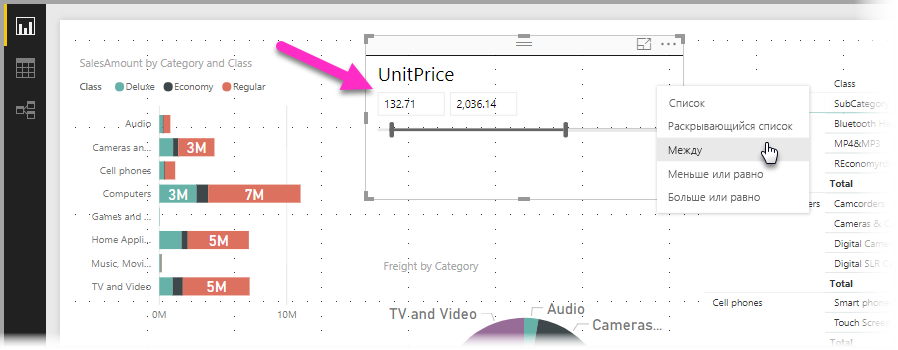
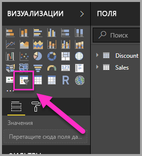
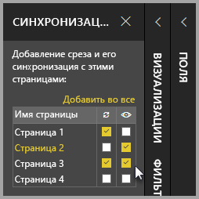

# Использование срезов в Power BI Desktop

Вы можете использовать **срезы** в **Power BI Desktop**, чтобы фильтровать результаты визуальных элементов на странице отчета. Также с их помощью вы можете легко настроить фильтр, который применяется при взаимодействии с самим срезом. Кроме того, можно задать параметры отображения среза и взаимодействия с ним. На следующем изображении показан срез с его раскрывающимся списком *Тип*. 

Можно отобразить срез одного из нескольких типов:

* Список
* Раскрывающийся список
* Между
* Меньше или равно
* Больше или равно

Вы можете добавить срез в отчет, щелкнув визуальный элемент **среза** в области **Визуализации**.

В **Power BI Desktop** и **службе Power BI** функции срезов схожи. Сведения об использовании срезов см. в статье [Срезы в службе Power BI](power-bi-visualization-slicers.md).

## Синхронизация срезов на страницах отчетов

В **Power BI Desktop** можно синхронизировать срезы на нескольких страницах отчета. Для этого в области **Вид** на ленте выберите **Синхронизация срезов**. При синхронизации срезов появится область **Синхронизация срезов**, как показано на следующем рисунке.

В области **Синхронизация срезов** можно указать, как синхронизировать срезы на страницах отчетов. Вы можете указать, следует ли **применять** каждый срез к каждой странице отдельного отчета, и должен ли срез **отображаться** на каждой странице отчета.

Например, можно поместить срез на **вторую страницу** отчета, как показано на приведенном ниже изображении. Затем можно указать, следует ли *применить* этот срез к каждой выбранной странице, и должен ли этот срез *отображаться* на каждой выбранной странице в отчете. Вы можете применить эти сочетания к каждому срезу. 

Если в области щелкнуть ссылку **Add to all** (Добавить во все), выбранный срез будет применен ко всем страницам в отчете.

Обратите внимание, что выбранные параметры в области **Синхронизация срезов** применяются только к *выбранному срезу*. Вы можете применить несколько срезов к разным страницам, определив на панели, как каждый срез применяется к отдельным страницам в отчете. 

Если выбранные срезы можно синхронизировать, то другие параметры, такие как стили, редактирование и удаление, *не* синхронизируются. 

## Дополнительные параметры срезов

Вы также можете применить **имя группы** к коллекции срезов в разделе **Дополнительные параметры** области **Синхронизация срезов**, чтобы срезы, относящиеся к одной группе, синхронизировались на страницах. 

Таким образом можно создать группу срезов для синхронизации. В поле приводится имя по умолчанию, но его можно изменить на любое другое. 

Имя группы повышает гибкость работы со срезами. Вы можете создавать отдельные группы для синхронизации срезов с общим полем или поместить в одну группу срезы с разными полями. 

## Влияние фильтрации на выбор в срезах

Если вы выбираете какой-то элемент в срезе, а затем применяете фильтр, который удаляет этот элемент, такой элемент останется в нижней части соответствующего списка в срезе. Если фильтр удаляется, функция выделения будет по-прежнему доступна в срезе. Если отменить выбор элемента в срезе, он исчезнет из списка.

## Дальнейшие действия

Рекомендуем также ознакомиться со следующими материалами:

* [Срезы в службе Power BI](power-bi-visualization-slicers.md)
* [Использование среза числового диапазона в Power BI Desktop](../desktop-slicer-numeric-range.md)
* [Использование среза и фильтра относительных дат в Power BI Desktop](desktop-slicer-filter-date-range.md)

