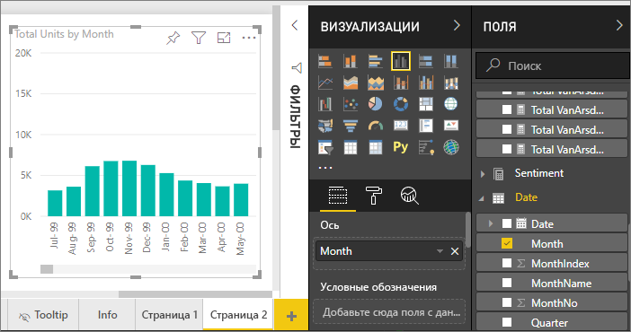
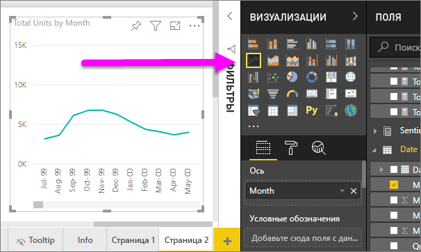
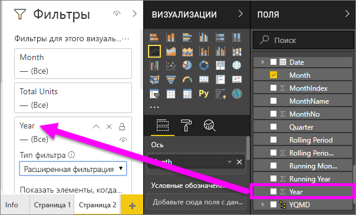
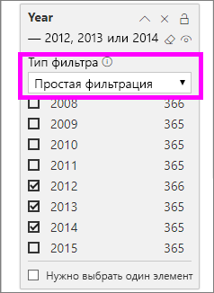
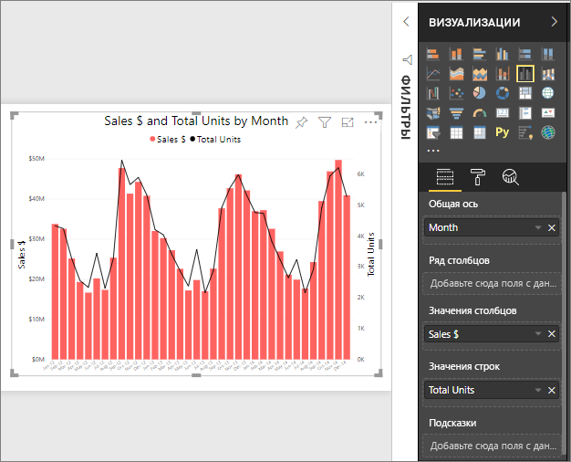
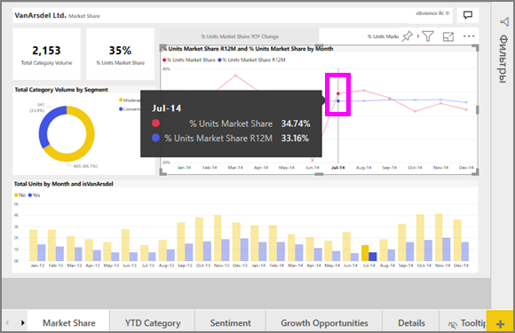

# Графики в Power BI
График — это серия точек данных, которые представлены точками и соединены прямыми линиями. График может иметь одну или несколько линий. Графики имеют оси X и Y. 

## Создание графика
В этих инструкциях используется приложение "Продажи и маркетинг — пример" для создания графика, в котором отображаются продажи за этот год по категориям. Чтобы выполнить эту процедуру, получите образец приложения от appsource.com.

1. Начните с пустой страницы отчета. Если вы используете службу Power BI, нужно открыть отчет в [режиме правки](../service-interact-with-a-report-in-editing-view.md).

2. В области полей выберите **SalesFact** \> **Итого единиц** и щелкните **Дата** > **Месяц**.  Power BI создаст гистограмму в холсте отчета.

    

4. Преобразуйте в график, выбрав соответствующий шаблон графика на панели визуализации. 

    
   

4. Отфильтруйте график, чтобы отобразить данные за 2012-2014 год. Если область фильтров свернута, разверните ее. В области полей выберите **Дата** \> **Год** и перетащите поле года в область фильтров. Поместите его под заголовком **Фильтры для этого визуального элемента**. 
     
    

    Замените **Расширенные фильтры** на **Базовые фильтры**, после чего выберите **2012**, **2013** и **2014**.

    

6. При необходимости [настройте размер и цвет текста диаграммы](power-bi-visualization-customize-title-background-and-legend.md). 

    

## Добавьте дополнительные линии в график
Линии графика могут иметь много различных линий. И, в некоторых случаях, значения в строках могут быть настолько несоответствующими, что будут плохо отображаться вместе. Посмотрим, как добавить дополнительные линии в график, а затем узнаем, как его форматировать, когда значения, представленные линиями, сильно отличаются. 

### Добавьте дополнительные линии
Вместо того, чтобы рассматривать общее количество единиц для всех регионов как отдельную линию на графике, давайте разделим общее количество единиц по регионам. Добавьте дополнительные линии, перетащив **геообъект** > **Регион** в контейнер условных обозначений.

   

### Используйте две оси Y
Что необходимо делать, если вы захотите посмотреть общие продажи и общее количество единиц на одном графике? Номера продаж намного выше, чем номера единиц, что делает график непригодным для использования. На самом деле красная линия для общего количества единиц отображается как нуль.

   

Чтобы отобразить сильно расходящиеся значения на одном графике, используйте комбинированную диаграмму. Вы можете узнать все о комбинированных диаграммах, прочитав раздел [Комбинированные диаграммы в Power BI](power-bi-visualization-combo-chart.md). В примере ниже можно отобразить продажи и общее количество единиц на одном графике, добавив вторую ось Y. 

   

## Выделение и перекрестная фильтрация
Сведения об использовании области "Фильтры" см. в разделе [Добавление фильтра в отчет](../power-bi-report-add-filter.md).

С помощью выделения точек данных на графике можно выполнить перекрестное выделение и перекрестную фильтрацию этих данных в других зрительных образах на странице отчета (и наоборот). Чтобы выполнить эту процедуру, откройте вкладку **Доля рынка**.  

На линейном графике одна точка данных является пересечением точек на осях X и Y. При выделении точки данных Power BI добавляет маркеры, указывающие, какая точка (для одной линии) или точки (если есть две или больше линий) являются источником для перекрестного выделения и перекрестной фильтрации других визуальных элементов в странице отчета. Если визуальный элемент очень плотный, Power BI выберет ближайшую точку, где вы щелкаете по визуальному элементу.

В этом примере мы выбрали точку данных, которая включает в себя: Июль 2014 г.,R12 33,16 % доли рынка единиц и 34,74% доли рынка.

Обратите внимание на то, как гистограмма выделена перекрестным выделением, а индикатор — перекрестной фильтрацией.

Сведения о том, как настроить параметры перекрестного выделения и фильтрации диаграмм, см. в статье [Visualization interactions in a Power BI report](../service-reports-visual-interactions.md) (Взаимодействия визуализаций в отчете Power BI).

## Рекомендации и устранение неполадок
* Один график не может иметь двойные оси Y.  Вместо этого необходимо использовать комбинированную диаграмму.
* В приведенных выше примерах графики были отформатированы для увеличения размера шрифта, изменения цвета шрифта, добавления заголовков осей, центрирования заголовка и условных обозначений графика, начала обеих осей с нуля и т. д. Панель форматирования (значок кисти ролика) имеет, на первый взгляд, бесконечный набор параметров для того, чтобы графики выглядели так, как вы хотите. Лучший способ научиться — открыть панель форматирования и изучить ее.

## Дальнейшие действия

[Типы визуализаций в Power BI](power-bi-visualization-types-for-reports-and-q-and-a.md)

