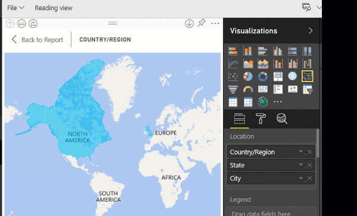

# Советы и рекомендации для визуализаций карт Power BI
Power BI интегрируется с Картами Bing для предоставления стандартных картографических координат (этот процесс называется геокодированием) для создания карт. Совместно эти технологии используют алгоритмы для определения надлежащего расположения, но иногда это просто вариант высокой вероятности. Если Power BI не удается самостоятельно создать визуализацию, используются Карты Bing. 

Вам или администратору может потребоваться обновить брандмауэр, чтобы разрешить доступ к URL-адресам, которые Bing использует для геокодирования.  Ниже приведены эти URL-адреса:
* https://dev.virtualearth.net/REST/V1/Locations
* https://platform.bing.com/geo/spatial/v1/public/Geodata
* https://www.bing.com/api/maps/mapcontrol

Чтобы увеличить вероятность правильного геокодирования, воспользуйтесь следующими советами. Первый блок советов используется, когда у вас есть доступ к набору данных. Второй блок включает советы по работе с Power BI без доступа к набору данных. 

## Какие данные отправляются в Карты Bing?
Служба Power BI и Power BI Desktop отправляют в Bing геоданные, которые используются для создания визуализации карты. Сюда могут входить данные в контейнерах **Расположение**, **Широта** и **Долгота** и географические поля в любом из контейнеров фильтра **уровня отчета**, **уровня страницы** или **уровня визуальных элементов**. Отправленные данные зависят от типа карты. См. дополнительные сведения об обеспечении [конфиденциальности в Картах Bing](https://go.microsoft.com/fwlink/?LinkID=248686).

* Если для карт (пузырьковых или точечных) указана широта и долгота, данные не будут отправлены в Bing. В противном случае все данные в контейнерах **расположения** (и фильтра) будут отправлены в Bing.     

* Для картограмм требуется поле в контейнере **расположения**, даже при наличии данных широты и долготы. Все данные в контейнерах **расположения**, **широты** и **долготы** отправляются в Bing.
  
    В приведенном ниже примере поле **Vendor** (Поставщик) используется для геокодирования, поэтому все данные поставщика отправляются в Bing. Данные из контейнеров **Размер** и **Насыщенность цвета** не отправляются в Bing.
  
    
  
    Во втором примере ниже для геокодирования используется поле **Territory** (Территория), поэтому все данные территории отправляются в Bing. Данные из контейнеров **Legend** (Условные обозначения) и **Color saturation** (Насыщенность цвета) не отправляются в Bing.
  
    

## Набор данных: советы по улучшению базового набора данных
Если у вас есть доступ к набору данных, который используется для создания визуализации карты, есть несколько действий, которые способствуют правильному геокодированию.

**1. Классифицируйте географические поля в Power BI Desktop**

В Power BI Desktop можно обеспечить правильное геокодирование полей, указав для полей данных *категорию данных*. Выберите нужный столбец в представлении данных. На ленте выберите вкладку **Моделирование** и задайте **категорию данных**: **Адрес**, **Город**, **Континент**, **Страна или регион**, **Округ**, **Почтовый индекс**, **Штат** или **Область**. Эти категории данных помогают Bing правильно расшифровать данные. Дополнительные сведения см. в разделе [Категоризация данных в Power BI Desktop](../desktop-data-categorization.md). При динамическом подключении к службам SQL Server Analysis Services необходимо задать категории данных за пределами Power BI с помощью [SQL Server Data Tools (SSDT)](https://docs.microsoft.com/sql/ssdt/download-sql-server-data-tools-ssdt).

**2. Используйте несколько столбцов для данных расположения.**     
 В некоторых случаях даже задания категорий для картографической информации недостаточно для того, чтобы служба Bing правильно определила намерения пользователя. Некоторые географические обозначения повторяются, так как в нескольких странах или регионах могут быть расположения с одинаковыми названиями. Например, ***Саутгемптон*** есть в Англии, а также штатах Пенсильвания и Нью-Йорк.

Power BI использует [службу неструктурированного шаблона URL-адреса](https://msdn.microsoft.com/library/ff701714.aspx) Bing, чтобы получить координаты широты и долготы на основе набора значений адресов для любой страны. Если данные не содержат достаточно сведений о расположении, добавьте эти столбцы и классифицируйте их соответствующим образом.

 Например, если используется только столбец "Город", при геокодировании в Bing могут возникнуть трудности. Добавьте дополнительные столбцы для геокодирования, чтобы данные расположения были однозначными.  Иногда достаточно добавить в набор данных один столбец расположения — в нашем случае это штат или область. И не забудьте правильно присвоить категорию (см. пункт 1 выше).

Убедитесь, что каждому полю назначена только одна категория расположения. Например, в поле расположения "Город" должно быть значение **Саутгемптон**, а не **Саутгемптон, Нью-Йорк**.  Поле адреса должно содержать значение **1 Microsoft Way**, а не **1 Microsoft Way, Redmond, WA**.

**3. Используйте конкретные широту и долготу**

Добавьте в набор данных значения широты и долготы. Это позволяет устранить неоднозначность и быстрее получить результаты. Поля широты и долготы должны иметь формат *десятичного числа* , который можно задать в модели данных.

<iframe width="560" height="315" src="https://www.youtube.com/embed/ajTPGNpthcg" frameborder="0" allowfullscreen></iframe>

**4. Используйте категорию "Местоположение" для столбцов, содержащих полные сведения о расположении**

Хотя мы рекомендуем применять на картах географическую иерархию, если необходимо использовать только столбец с полными сведениями о географическом расположении, вы можете задать категорию данных **Местоположение**. Например, если в столбце указан полный адрес (1 Microsoft Way, Redmond Washington 98052), категория обобщенных данных будет лучше работать с Bing. 

## Power BI: советы для получения лучших результатов при использовании визуализаций карт
**1. Используйте поля широты и долготы (если они существуют)**

Если в используемом наборе данных в Power BI есть поля для широты и долготы, используйте их.  В Power BI есть специальные контейнеры, которые помогают устранить неоднозначность данных карты. Просто перетащите поле, содержащее сведения о широте, в область **Визуализации > Широта**.  Сделайте то же самое для сведений о долготе. Для этого при создании своих визуализаций заполните поле *Местоположение* . В противном случае данные агрегируются по умолчанию, например широта и долгота будут связаны на уровне области, а не на уровне города.

 

## Используйте иерархии геообъектов, чтобы можно было детализировать расположение на различных уровнях
Если в наборе уже есть данные расположения различных уровней, вы и ваши коллеги можете использовать Power BI для создания *иерархий геообъектов*. Для этого перетащите несколько полей в контейнер **Расположение**. Эти совместно используемые поля образуют иерархию геообъектов. В примере ниже мы добавили поля для следующих геообъектов: страна или регион, штат и город. В Power BI вы и ваши коллеги сможете изменять уровень детализации с помощью этой иерархии геообъектов.

  

   

При детализации данных с помощью иерархии геообъектов важно знать, как работает каждая кнопка детализации и какая информация отправляется в службу "Карты Bing". 

* Кнопка детализации в правом верхнем углу, которая включает режим детализации  , позволяет выбрать карту "Расположение" и детализировать определенное расположение каждый раз на один уровень. Например, если включить режим детализации и щелкнуть в области Северной Америки, вы переместитесь на уровень ниже в иерархии — на штаты Северной Америки. При использовании функции геокодирования Power BI отправляет в службу "Карты Bing" данные о стране и штате только для Северной Америки.  
* В левой части экрана представлены два других параметра детализации. Первый параметр,  , позволяет детализировать карту до следующего уровня иерархии одновременно для всех расположений. Например, если на карте показаны страны и вы используете этот параметр, чтобы перейти на следующий уровень (например, штаты), Power BI отображает данные об административных единицах всех стран. При использовании функции геокодирования Power BI отправляет службе "Карты Bing" данные об административных единицах (без данных о странах) для всех расположений. Этот параметр можно использовать, если каждый уровень иерархии не связан с уровнем выше. 
* Второй параметр,  похож на режим детализации, за исключением того, что не нужно щелкать область на карте.  Он позволяет развернуть карту до следующего уровня иерархии, учитывая контекст текущего уровня. Например, если вы щелкнете этот значок, когда на карте показаны страны, вы перейдете к следующему уровню в иерархии — административным единицам. Чтобы получить более точные результаты геокодирования в службе "Карты Bing", Power BI отправляет в службу данные о каждой административной единице и соответствующей стране. Для большинства карт вы будете использовать этот параметр или параметр "Режим детализации" в правом верхнем углу, чтобы отправлять в Bing как можно больше информации и получать точные сведения о расположении. 

## Дальнейшие действия
[Детализация в визуализации Power BI](../consumer/end-user-drill.md)

[Визуализации в Power BI](power-bi-report-visualizations.md)

Появились дополнительные вопросы? [Ответы на них см. в сообществе Power BI.](https://community.powerbi.com/)

