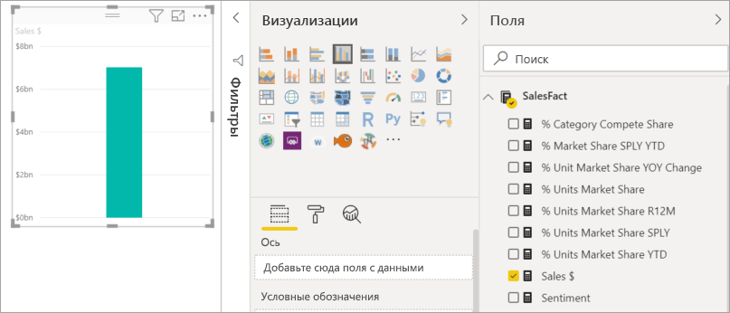
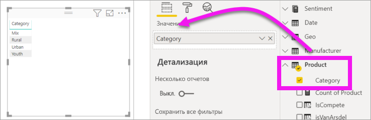
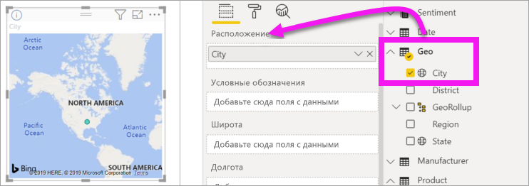
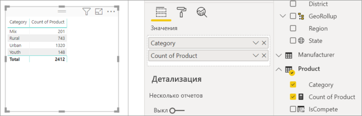
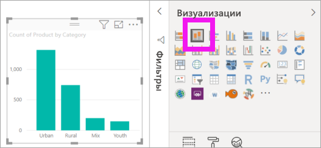
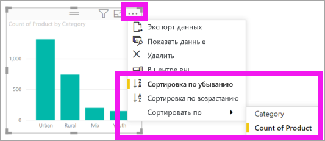

# Добавление визуальных элементов в отчет Power BI (часть 1)

[!INCLUDE [power-bi-visuals-desktop-banner](../includes/power-bi-visuals-desktop-banner.md)]

В этой статье содержатся краткие вводные сведения о создании визуализации в отчете. Эта информация относится к службе Power BI и к Power BI Desktop. Дополнительные сведения см. в [части 2](power-bi-report-add-visualizations-ii.md) этой серии. В этом видео Аманда покажет вам несколько разных способов создания, изменения и форматирования визуальных элементов на холсте отчетов. Теперь попробуйте сделать это сами, использовав раздел [Продажи и маркетинг — пример](../sample-datasets.md) для создания собственного отчета.

<iframe width="560" height="315" src="https://www.youtube.com/embed/IkJda4O7oGs" frameborder="0" allowfullscreen></iframe>

## Предварительные требования

В этом руководстве используется [PBIX-файл "Продажи и маркетинг"](https://download.microsoft.com/download/9/7/6/9767913A-29DB-40CF-8944-9AC2BC940C53/Sales%20and%20Marketing%20Sample%20PBIX.pbix).

1. В верхнем левом разделе меню Power BI Desktop выберите пункты **Файл** > **Открыть**.
   
2. Найдите свою копию **PBIX-файла "Продажи и маркетинг"** .

1. Откройте PBIX-файл **Продажи и маркетинг** в представлении отчета .

1. Выбрать  чтобы создать новую страницу.

## Добавление визуализаций к отчету

1. Создайте визуализацию, выбрав поле на панели **Поля** .

    Начните с числового поля, например **Sales** > **TotalSales** (Продажи - Общие продажи). Power BI создаст гистограмму с одним столбцом.

    

    Начните с поля категории, например **Имя** или **Продукт**. Создайте в Power BI таблицу и добавьте поле в область **Значения**.

    

    Кроме того, можно начать с поля для географических данных, такого как **Геообъект** > **Город**. Создание визуализации карты при помощи Power BI и Карт Bing.

    

## Изменение типа визуализации

 Создайте визуализацию и измените ее тип. 
 
 1. Выберите **Продукт** > **Категория**, а затем **Продукт** > **Число продуктов**, чтобы добавить эти поля в раздел **Значения**.

    

1. Измените визуализацию на гистограмму, выбрав значок **Гистограмма с накоплением**.

   

1. Чтобы изменить способ сортировки визуального элемента, выберите **Дополнительные действия** (...).  Используйте параметры сортировки, чтобы изменить направление сортировки (по возрастанию или по убыванию) и столбец, используемый для сортировки (**Сортировать по**).

   
  
## Дальнейшие действия

 Дальнейшие действия

* [Часть 2. Добавление визуализаций в отчет Power BI](power-bi-report-add-visualizations-ii.md)

* [Взаимодействовать с визуализациями](../consumer/end-user-reading-view.md) в отчете.

