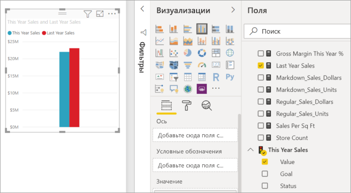
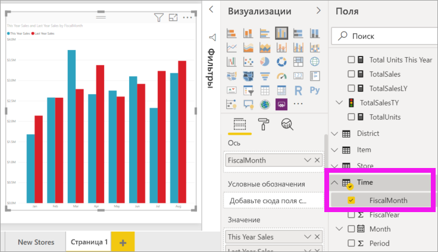
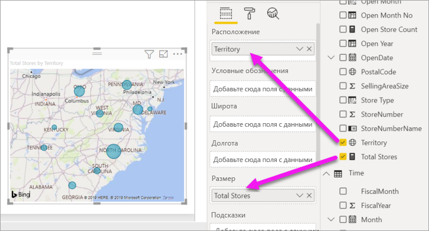
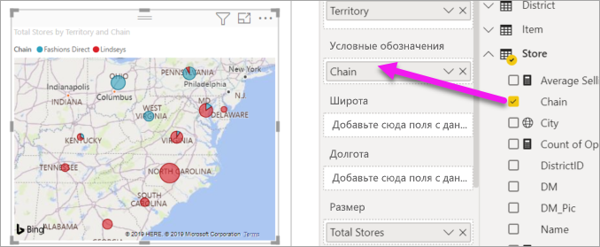

# Добавление визуальных элементов в отчет Power BI (часть 2)

[!INCLUDE [power-bi-visuals-desktop-banner](../includes/power-bi-visuals-desktop-banner.md)]

В [части 1](power-bi-report-add-visualizations-i.md) вы создали базовую визуализацию, установив флажки рядом с именами полей.  Во второй части вы узнаете, как использовать функцию перетаскивания и полностью реализовать возможности панелей **Поля** и **Визуализации** для создания и изменения визуализаций.

## Создание новой визуализации
В этом руководстве мы подробно рассмотрим набор данных по анализу розничной торговли и создадим несколько ключевых визуализаций.

## Предварительные требования

В этом руководстве используется пример PBIX-файла с примером [Анализ розничной торговли](https://download.microsoft.com/download/9/6/D/96DDC2FF-2568-491D-AAFA-AFDD6F763AE3/Retail%20Analysis%20Sample%20PBIX.pbix).

1. В верхнем левом разделе меню Power BI Desktop выберите пункты **Файл** > **Открыть**.
   
2. Найдите свою копию PBIX-файла с примером **Анализ розничной торговли**.

1. Откройте PBIX-файл с примером **Анализ розничной торговли** в представлении отчета .

1. Выбрать  чтобы создать новую страницу.

## Добавление визуализаций к отчету

Создайте визуализацию, выбрав поле на панели **Поля** . Тип создаваемой визуализации будет зависеть от типа выбранного поля. Power BI использует тип данных, чтобы определить, какая визуализация будет использоваться для отображения результатов. Можно изменить тип визуализации, щелкнув другой значок в области "Визуализация". Помните, что не все визуализации могут отображать ваши данные. Например, географические данные не будут отображаться правильно с помощью диаграммы воронки или графика. 

### Добавьте диаграмму с областями для показателей объема продаж текущего года по сравнению с продажами в предыдущем году.

1. В таблице **Продажи** последовательно выберите элементы **Продажи этого года** > **Значение** и **Продажи прошлого года**. Power BI создаст гистограмму.  Она представляет интерес и требует более глубокого анализа. Как продажи распределяются по месяцам?  
   
   

2. Из таблицы времени перетащите **Финансовый месяц** в область **Оси**.  
   

3. [Измените визуализацию](power-bi-report-change-visualization-type.md) на диаграмму с областями.  Для выбора доступно множество типов визуализации. Сведения об использовании нужного типа см. в статьях с [описаниями каждого типа, советами, рекомендациями и учебниками](power-bi-visualization-types-for-reports-and-q-and-a.md). Выберите соответствующий значок диаграммы  с областями на панели "Визуализации".

4. Отсортируйте визуальные элементы, нажав кнопку **Дополнительные действия** (...) и выбрав пункт **Сортировать по** >  **FiscalMonth**.

5. [Измените размер визуализации](power-bi-visualization-move-and-resize.md). Для этого выберите визуализацию, щелкните и перетащите один из кругов. Сделайте ее достаточно широкой, чтобы исключить полосу прокрутки, и достаточно небольшой, чтобы оставить место для добавления другой визуализации.
   
   
6. [Сохраните отчет](../service-report-save.md).

### Добавьте визуализацию карты для отслеживания продаж по расположению.

1. В таблице **Магазин** выберите **Территория**. Перетащите элемент **Всего магазинов** в область "Размер". Power BI распознает, что территория является расположением, и создает визуализацию карты.  
   

2. Добавьте условные обозначения.  Чтобы просмотреть данные по названию магазина, перетащите элемент **Магазин** > **Сеть** в область условных обозначений.  
   

## Дальнейшие действия
* Подробнее о [визуализациях в отчетах Power BI](power-bi-report-visualizations.md).  
* Появились дополнительные вопросы? [Ответы на них см. в сообществе Power BI.](https://community.powerbi.com/)

