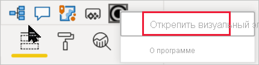

# Визуализации в отчетах Power BI

[!INCLUDE[consumer-appliesto-yyyn](../includes/consumer-appliesto-yyyn.md)]    

Визуализации (также называемые визуальными элементами) отображают сведения, обнаруженные в данных. Отчет Power BI может содержать одну страницу с одной визуализацией или большое количество и тех, и других. Служба Power BI позволяет [закрепить визуальные элементы из отчетов на панели мониторинга](../create-reports/service-dashboard-pin-tile-from-report.md).

Важно различать *создателей* и *пользователей* отчетов.  Тот, кто создает или изменяет отчет, — его создатель.  Создатели имеют разрешения на изменение отчета и базового набора данных. В Power BI Desktop это означает, что вы сможете открывать набор данных в режиме представления данных и создавать визуальные элементы в представлении отчета. В службе Power BI это означает возможность открывать набор данных или отчет в редакторе отчетов [в режиме редактирования](../consumer/end-user-reading-view.md). Если к отчету или панели мониторинга [вам предоставлен общий доступ ](../consumer/end-user-shared-with-me.md)другим лицом, вы считаетесь *потребителем* отчета. Вы сможете просматривать отчет и его визуальные элементы, а также взаимодействовать с ними, но не сможете вносить те же изменения, что и *автор*.

Есть много разных типов визуальных элементов, которые вы можете добавить прямо из панели визуализаций в Power BI.

Дополнительные визуальные элементы Power BI доступны на [веб-сайте сообщества Microsoft AppSource](https://appsource.microsoft.com). В AppSource можно просмотреть и [скачать](https://appsource.microsoft.com/marketplace/apps?page=1&product=power-bi-visuals) [визуальные элементы Power BI](../developer/visuals/custom-visual-develop-tutorial.md), предоставляемые корпорацией Майкрософт и сообществом.

Если вы недавно начали использовать Power BI или вам необходимо вспомнить ранее изученные сведения, используйте приведенные ниже ссылки для изучения основ визуализации Power BI.  Кроме того, воспользуйтесь содержанием (в левой части этой статьи), чтобы найти больше полезной информации.

## Добавление визуализации в Power BI

[Создавайте визуализации](power-bi-report-add-visualizations-i.md) на страницах отчетов. Просматривайте [список доступных визуализаций и учебников по работе с визуализациями.](power-bi-visualization-types-for-reports-and-q-and-a.md) 

## Отправка визуализации из файла или AppSource

Добавьте визуализацию, созданную вами или найденную на [сайте сообщества Майкрософт AppSource](https://appsource.microsoft.com/marketplace/apps?product=power-bi-visuals). Чувствуете творческий порыв? Изучите наш исходный код и примените наши [средства разработчика](../developer/visuals/custom-visual-develop-tutorial.md), чтобы создать новый тип визуализации и [поделиться им с сообществом](../developer/visuals/office-store.md). См. дополнительные сведения о [разработке визуальных элементов Power BI](../developer/visuals/custom-visual-develop-tutorial.md).

## Персонализация области визуализации

Область визуализации можно персонализировать, добавляя и удаляя визуальные элементы Power BI. Если вы удалили визуальные элементы по умолчанию из области визуализации, можно восстановить ее стандартный вид и вернуть все визуальные элементы по умолчанию.

### Добавление визуального элемента в область визуализации

Если вы используете одну и ту же визуализацию во множестве отчетов, вы можете добавить ее в область визуализации. Добавлять можно визуальные элементы AppSource, визуальные элементы организации, а также визуальные элементы из файлов. Чтобы добавить визуальный элемент, щелкните его правой кнопкой мыши.

Когда визуализация закреплена, она переносится туда же, где находятся другие стандартные визуальные элементы. Этот визуальный элемент теперь привязан к учетной записи в системе, поэтому все ваши новые отчеты автоматически будут содержать его при условии, что вы вошли в систему. Вам больше не нужно добавлять регулярно используемый визуальный элемент в каждый отдельный отчет.

### Удаление визуального элемента из области визуализации

Если вы больше не используете визуальный элемент регулярно, можно щелкнуть его правой кнопкой мыши и удалить из области визуализации. Из области визуализации можно удалить визуальный элемент любого типа, в том числе стандартные визуальные элементы, файлы, а также визуальные элементы организации и AppSource.

### Восстановление области визуализации

При восстановлении области визуализации на нее просто возвращаются стандартные визуальные элементы. Добавленные на нее визуальные элементы останутся доступными. Если вы хотите удалить визуальные элементы AppSource или файловые визуальные элементы из области визуализации, это необходимо сделать вручную.

Чтобы восстановить стандартный вид области визуализации, щелкните "Дополнительные параметры" и выберите **Восстановить визуальные элементы по умолчанию**.

## Изменение типа визуализации

Попробуйте [изменить тип визуализации](power-bi-report-change-visualization-type.md), чтобы выбрать наиболее эффективный способ отображения данных.

## Закрепление визуализации

В службе Power BI готовую визуализацию можно [закрепить на панели мониторинга](../create-reports/service-dashboard-pin-tile-from-report.md) в виде плитки. При изменении используемой в отчете визуализации после ее закрепления плитка на панели мониторинга не изменяется. Если это график, то он остается графиком, даже если в отчете он изменен на кольцевую диаграмму.

## Ограничения и рекомендации
- В зависимости от источника данных и количества полей (мер или столбцов) визуальный элемент может загружаться медленно.  Рекомендуется ограничить количество визуальных элементов 10–20 полями для удобства чтения и повышения производительности. 

- Верхний предел для визуальных элементов — 100 полей (мер или столбцов). Если не удается загрузить визуальный элемент, уменьшите число полей.

## Дальнейшие действия

* [Типы визуализаций в Power BI](power-bi-visualization-types-for-reports-and-q-and-a.md)
* [Визуальные элементы Power BI](../developer/visuals/power-bi-custom-visuals.md)
