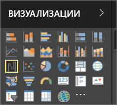

# Визуализации в отчетах Power BI
Визуализации (также называемые визуальными элементами) отображают сведения, обнаруженные в данных. Отчет Power BI может содержать одну страницу с одной визуализацией или большое количество и тех, и других. Служба Power BI позволяет [закрепить визуальные элементы из отчетов на панели мониторинга](../service-dashboard-pin-tile-from-report.md). 

Здесь важно знать об отличиях между *создателями* и *потребителями* отчетов. Создателем считается тот, кто разрабатывает или изменяет отчет.  Создатели имеют разрешения на изменение отчета и базового набора данных. В Power BI Desktop это означает, что вы сможете открывать набор данных в режиме представления данных и создавать визуальные элементы в представлении отчета. В службе Power BI это означает возможность открывать набор данных или отчет в редакторе отчетов [в режиме редактирования](../service-reading-view-and-editing-view.md). Если к отчету или панели мониторинга [вам предоставлен общий доступ ](../service-shared-with-me.md)другим лицом, вы считаетесь **потребителем** отчета. Вы сможете просматривать отчет и его визуальные элементы, а также взаимодействовать с ними, но не сможете сохранить изменения.

Есть много разных типов визуальных элементов, которые вы можете добавить прямо из панели визуализаций в Power BI. 

Чтобы получить еще больше возможностей, посетите [веб-сайт сообщества Майкрософт AppSource](https://appsource.microsoft.com). Там вы сможете найти и скачать [пользовательские визуальные элементы](https://appsource.microsoft.com/marketplace/apps?product=power-bi-visuals&page=1), созданные корпорацией Майкрософт и членами сообщества.    

<iframe width="560" height="315" src="https://www.youtube.com/embed/SYk_gWrtKvM?list=PL1N57mwBHtN0JFoKSR0n-tBkUJHeMP2cP" frameborder="0" allowfullscreen></iframe>

  Если вы недавно начали использовать Power BI или вам необходимо вспомнить ранее изученные сведения, используйте приведенные ниже ссылки для изучения основ визуализации Power BI.  Кроме того, воспользуйтесь содержанием (в левой части этой статьи), чтобы найти больше полезной информации.

## Добавление визуализации в Power BI
[Создавайте визуализации](power-bi-report-add-visualizations-i.md) на страницах отчетов. Просматривайте [список доступных визуализаций и учебников по работе с визуализациями.](power-bi-visualization-types-for-reports-and-q-and-a.md) 

## Отправка пользовательской визуализации и ее использование в Power BI
Добавьте пользовательскую визуализацию, созданную вами или найденную на [сайте сообщества Майкрософт AppSource](https://appsource.microsoft.com/marketplace/apps?product=power-bi-visuals). Чувствуете творческий порыв? Подробно изучите исходный код наших примеров и, используя [средства разработчика](../service-custom-visuals-getting-started-with-developer-tools.md), создайте новый тип визуализации и [поделитесь им с сообществом](../developer/office-store.md).

## Изменение типа визуализации
Попробуйте [изменить тип визуализации](power-bi-report-change-visualization-type.md), чтобы выбрать наиболее эффективный способ отображения данных.

## Закрепление визуализации
В службе Power BI готовую визуализацию можно [закрепить на панели мониторинга](../service-dashboard-pin-tile-from-report.md) в виде плитки. Если вы позже измените визуализацию, которая используется в отчете и закреплена, плитка на панели мониторинга не изменится. График всегда останется здесь графиком, даже если исходная визуализация в отчете станет кольцевой диаграммой.

## Дальнейшие действия
[Типы визуализаций в Power BI](power-bi-visualization-types-for-reports-and-q-and-a.md)