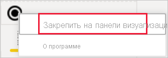
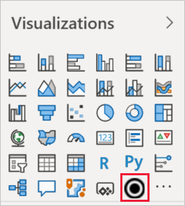

# Визуализации в отчетах Power BI

Визуализации (также называемые визуальными элементами) отображают сведения, обнаруженные в данных. Отчет Power BI может содержать одну страницу с одной визуализацией или большое количество и тех, и других. Служба Power BI позволяет [закрепить визуальные элементы из отчетов на панели мониторинга](../service-dashboard-pin-tile-from-report.md).

Важно различать *создателей* и *пользователей* отчетов.  Тот, кто создает или изменяет отчет, — его создатель.  Создатели имеют разрешения на изменение отчета и базового набора данных. В Power BI Desktop это означает, что вы сможете открывать набор данных в режиме представления данных и создавать визуальные элементы в представлении отчета. В службе Power BI это означает возможность открывать набор данных или отчет в редакторе отчетов [в режиме редактирования](../consumer/end-user-reading-view.md). Если к отчету или панели мониторинга [вам предоставлен общий доступ ](../consumer/end-user-shared-with-me.md)другим лицом, вы считаетесь *потребителем* отчета. Вы сможете просматривать отчет и его визуальные элементы, а также взаимодействовать с ними, но не сможете вносить те же изменения, что и *автор*.

Есть много разных типов визуальных элементов, которые вы можете добавить прямо из панели визуализаций в Power BI.

Чтобы получить еще больше возможностей, посетите [веб-сайт сообщества Майкрософт AppSource](https://appsource.microsoft.com). Там вы сможете найти и [скачать](https://appsource.microsoft.com/marketplace/apps?page=1&product=power-bi-visuals) [пользовательские визуализации](../developer/visuals/custom-visual-develop-tutorial.md), созданные корпорацией Майкрософт и членами сообщества.

<iframe width="560" height="315" src="https://www.youtube.com/embed/SYk_gWrtKvM?list=PL1N57mwBHtN0JFoKSR0n-tBkUJHeMP2cP" frameborder="0" allowfullscreen></iframe>

Если вы недавно начали использовать Power BI или вам необходимо вспомнить ранее изученные сведения, используйте приведенные ниже ссылки для изучения основ визуализации Power BI.  Кроме того, воспользуйтесь содержанием (в левой части этой статьи), чтобы найти больше полезной информации.

## Добавление визуализации в Power BI

[Создавайте визуализации](power-bi-report-add-visualizations-i.md) на страницах отчетов. Просматривайте [список доступных визуализаций и учебников по работе с визуализациями.](power-bi-visualization-types-for-reports-and-q-and-a.md) 

## Отправка пользовательской визуализации и ее использование в Power BI

Добавьте пользовательскую визуализацию, созданную вами или найденную на [сайте сообщества Майкрософт AppSource](https://appsource.microsoft.com/marketplace/apps?product=power-bi-visuals). Чувствуете творческий порыв? Изучите наш исходный код и примените наши [средства разработчика](../developer/visuals/custom-visual-develop-tutorial.md), чтобы создать новый тип визуализации и [поделиться им с сообществом](../developer/office-store.md). См. дополнительные сведения о [разработке пользовательских визуальных элементов Power BI](../developer/visuals/custom-visual-develop-tutorial.md).

## Персонализация области визуализации (предварительная версия)

Если вы используете одну и ту же настраиваемую визуализацию во множестве отчетов, вы можете закрепить ее на панели визуализации. Чтобы закрепить визуализацию, щелкните ее правой кнопкой мыши, чтобы закрепить на панели.

Когда визуализация закреплена, она переносится туда же, где находятся другие встроенные визуальные элементы. Этот визуальный элемент теперь привязан к учетной записи в системе, поэтому все ваши новые отчеты автоматически будут содержать его при условии, что вы вошли в систему. Это упрощает стандартизацию определенного визуального элемента без необходимости его добавления в каждый отдельный отчет.

Пока эта функция находится на этапе предварительной версии, вы будете видеть только закрепленные визуальные элементы в Power BI Desktop. Кроме того, необходимо войти в систему, чтобы эта функция была доступна.

## Изменение типа визуализации

Попробуйте [изменить тип визуализации](power-bi-report-change-visualization-type.md), чтобы выбрать наиболее эффективный способ отображения данных.

## Закрепление визуализации

В службе Power BI готовую визуализацию можно [закрепить на панели мониторинга](../service-dashboard-pin-tile-from-report.md) в виде плитки. Если вы позже измените визуализацию, которая используется в отчете и закреплена, плитка на панели мониторинга не изменится. График всегда останется здесь графиком, даже если исходная визуализация в отчете станет кольцевой диаграммой.

## Рекомендации и ограничения
- В зависимости от источника данных и количества полей (мер или столбцов) визуальный элемент может загружаться медленно.  Рекомендуется ограничить количество визуальных элементов 10–20 полями для удобства чтения и повышения производительности. 

- Верхний предел для визуальных элементов — 100 полей (мер или столбцов). Если не удается загрузить визуальный элемент, уменьшите число полей.   

## Дальнейшие действия

* [Типы визуализаций в Power BI](power-bi-visualization-types-for-reports-and-q-and-a.md)
* [Пользовательские визуальные элементы](../developer/power-bi-custom-visuals.md)
