# Карты ArcGIS в Power BI Desktop

[!INCLUDE [power-bi-visuals-desktop-banner](../includes/power-bi-visuals-desktop-banner.md)]

Это руководство посвящено созданию карты ArcGIS для Power BI. Пользователь, которому *автор* предоставил общий доступ к карте ArcGIS Maps for Power BI, может просматривать карту и взаимодействовать с ней, но не может сохранять изменения. Дополнительные сведения о просмотре карты ArcGIS см. в статье о [взаимодействии с картами ArcGIS Maps for Power BI](power-bi-visualizations-arcgis.md).

Сочетание карт ArcGIS и Power BI — это больше, чем просто отображение точек на карте. Прекрасные информативные визуализации для карт можно создать, используя базовые карты, типы расположения, темы, стили символов и ссылочные слои. Сочетание официальных слоев данных на карте с пространственным анализом помогает лучше понять данные в визуализации.

 На мобильном устройстве нельзя создавать карты ArcGIS Maps for Power BI, но можно просматривать их и взаимодействовать с ними. См. статью о [взаимодействии с картами ArcGIS](power-bi-visualizations-arcgis.md).

> [!TIP]
> GIS расшифровывается как Geographic Information Systems (географические информационные системы).

В приведенном ниже примере на темно-сером холсте показана тепловая карта значений региональных продаж на фоне демографического слоя с наложением значений медианного совокупного чистого дохода за 2016 г. Как будет видно далее, ArcGIS Maps for Power BI предлагает практически безграничные возможности сопоставления, демографические данные и еще более привлекательную визуализацию карт, чтобы лучше всего представить данные.

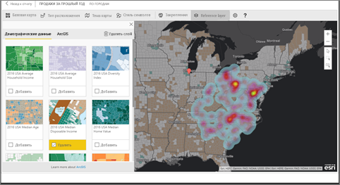

> [!TIP]
> Посетите [страницу компании Esri в ArcGIS Maps for Power BI](https://www.esri.com/powerbi), на которой есть множество примеров и отзывов. Затем перейдите на страницу компании Esri со сведениями о [начале работы с ArcGIS Maps for Power BI](https://doc.arcgis.com/en/maps-for-powerbi/get-started/about-maps-for-power-bi.htm).

## Согласие пользователя
Решения ArcGIS Maps for Power BI предоставляются компанией Esri (https://www.esri.com). Использование карт ArcGIS для Power BI регулируется условиями и политикой конфиденциальности компании Esri. Пользователи Power BI, желающие использовать визуальный элемент "Карты ArcGIS для Power BI", должны принять условия в диалоговом окне получения согласия.

**Ресурсы**

[Условия](https://go.microsoft.com/fwlink/?LinkID=826322)

[Политика конфиденциальности](https://go.microsoft.com/fwlink/?LinkID=826323)

[Страница продукта "Карты ArcGIS для Power BI"](https://www.esri.com/powerbi)

## Предварительные требования

В этом руководстве используется Power BI Desktop и пример PBIX-файла [Анализ розничной торговли](https://download.microsoft.com/download/9/6/D/96DDC2FF-2568-491D-AAFA-AFDD6F763AE3/Retail%20Analysis%20Sample%20PBIX.pbix). Карты ArcGIS Maps for Power BI также можно создавать с помощью службы Power BI. 

1. В левом верхнем разделе строки меню выберите **Файл** \> **Открыть**.
   
2. Найдите на локальном компьютере пример PBIX-файла **Анализ розничной торговли**.

1. Откройте **пример анализа розничной торговли** в представлении отчета .

1. Выбрать  чтобы создать новую страницу.

   
## Создание визуального элемента ArcGIS Maps for Power BI

Просмотрите видео о создании разных визуализаций, а затем с помощью приведенных ниже инструкций попробуйте сделать это самостоятельно с помощью [PBIX-файла с примером анализа розничной торговли](../sample-datasets.md).
    

   > [!NOTE]
   > В этом видео используется более старая версия Power BI Desktop.
   > 

> [!VIDEO https://www.youtube.com/embed/EKVvOZmxg9s]

1. Щелкните на панели "Визуализации" значок карт ArcGIS для Power BI.
   
    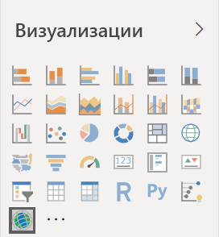    

2. Power BI добавляет пустой шаблон на холст отчетов. В этом руководстве мы будем использовать бесплатную версию.
   
   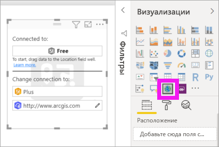

3. Из панели **Поля** перетащите поле данных в контейнеры **Расположение** или (и) **Широта** и **Долгота**. В этом примере используется **Store > City** (Магазин > Город).
   
   > [!NOTE]
   > Карты ArcGIS для Power BI автоматически определяют, как лучше всего просматривать выбранные поля — как фигуры или точки на карте. Значение по умолчанию можно изменить в настройках (см. ниже).
   > 
   > 
   
    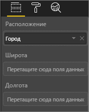

4. Из панели **Поля** перетащите меру в контейнер **Размер**, чтобы изменить способ представления данных. В этом примере выберите **Sales > Last Year Sales** (Продажи > Продажи за прошлый год).
   
    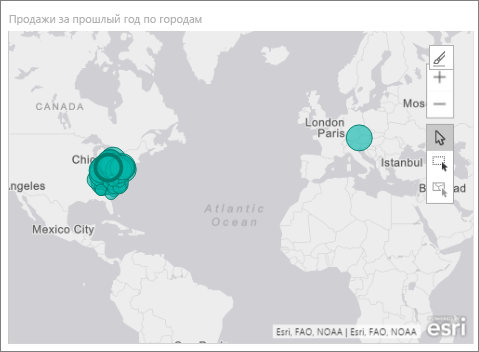

Вы создали первую карту ArcGIS Maps for Power BI. Теперь давайте настроим и отформатируем ее с помощью базовых карт, типов расположения, тем и других элементов.

## Настройки и форматирование для ArcGIS Maps for Power BI
Чтобы получить доступ к функциям форматирования **карт ArcGIS для Power BI**, нужно сделать следующее:

1. Чтобы получить доступ к дополнительным функциям, нажмите кнопку **Дополнительные действия** (...) в правом верхнем углу визуализации и выберите команду **Изменить**.
   
   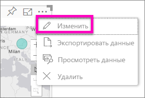
   
   Визуализация развернется, и доступные функции отобразятся в ее верхней части. При выборе каждой функции открывается область задач с подробными параметрами. 
   
   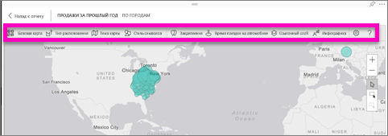
   

> [!TIP]
> Компания **Esri** предоставляет [полную документацию](https://go.microsoft.com/fwlink/?LinkID=828772) по набору функций **карт ArcGIS для Power BI**.

### Базовые карты
Предоставлены четыре базовые карты: Dark Gray Canvas, Light Gray Canvas, OpenStreetMap и Streets.  *Streets* — это стандартная базовая карта в ArcGIS.

Чтобы применить базовую карту, выберите ее в области задач.

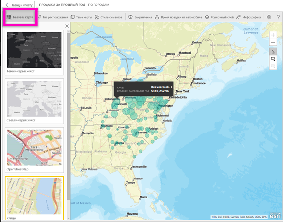

### Тип расположения
ArcGIS Maps for Power BI автоматически определяет, как лучше всего показать данные на карте. Выбираются точки или границы. С помощью параметров типа расположения можно точно настроить выбранный способ.

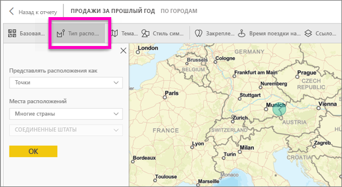

**Границы** будут работать, только если данные содержат стандартные географические значения. ArcGIS Maps for Power BI автоматически распознает фигуру, которую нужно показать на карте. К стандартным географическим значениям относятся страны, области, почтовые индексы и т. д. Но, как и в случае с геокодированием, Power BI может не определить, что поле по умолчанию должно быть границей, или может не найти границу для данных.  

### Тема карты
Предоставляются четыре темы карт. Power BI автоматически выбирает тему **Только расположение** или **Размер** на основе полей, добавленных в контейнеры **Расположение** и **Размер**. По умолчанию для нашей карты используется **Размер**, так как мы добавили поля в оба контейнера. Попробуйте другие темы и снова выберите тему **Размер** перед тем, как переходить к следующему шагу.  

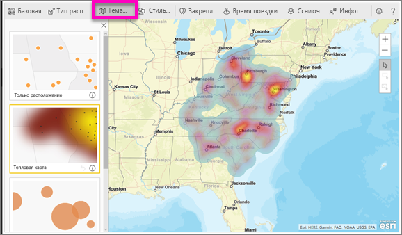

<table>
<tr><th>Тема</th><th>Описание</th>
<tr>
<td>Только расположение</td>
<td>Отображает на карте точки данных или заполненные границы в соответствии с полем, добавленным в контейнер "Расположение".</td>
</tr>
<tr>
<td>Тепловая карта</td>
<td>Отображает интенсивность данных на карте. Области с более высокой активностью или ценностью представлены более яркими и насыщенными цветами. </td>
</tr>
<tr>
<td>Размер</td>
<td>Отображает на карте точки данных в соответствии с полем, добавленным в контейнер "Размер".</td>
</tr>
<tr>
<td>Кластеризация</td>
<td>Точки в указанном радиусе кластеризации объединяются в один символ, представляющий количество точек в этой области карты. </td>
</tr>
</table>

### Стиль символов
С помощью стилей символов можно точно настроить способ представления данных на карте. Стили символов зависят от контекста и основаны на выбранных типе расположения и теме карты. В примере ниже для темы карты установлен параметр **Размер** и задано несколько настроек прозрачности, стиля и размера символов. 

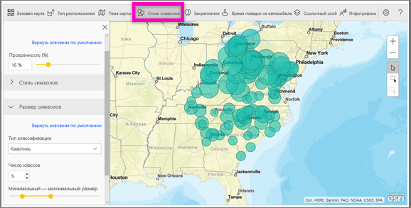

### Закрепления
Привлекайте внимание к точкам на карте с помощью закреплений.  

1. Выберите вкладку **Pins** (Закрепления).
2. В поле поиска введите ключевые слова (например, адреса, места и важные объекты) и выберите нужные данные из раскрывающегося списка. На карте отображается символ, и для расположения автоматически увеличивается масштаб. Результаты поиска сохраняются на панели "Pins" (Закрепления) как карты расположения. Можно сохранить до 10 карт расположения.
   
   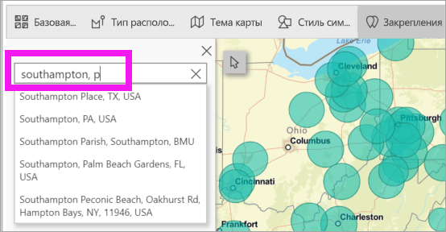
3. Power BI добавит закрепление к этому расположению. Цвет закрепления можно изменить.
   
   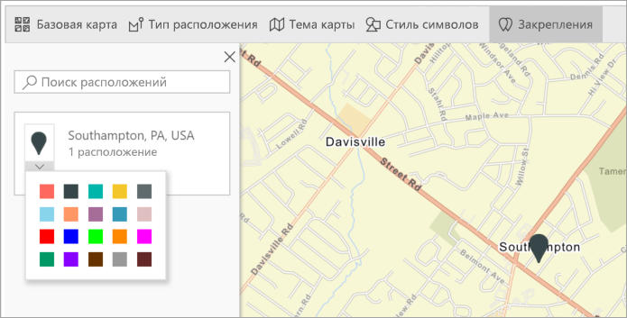
4. Добавляйте и удаляйте закрепления.
   
   

### Время поездки на автомобиле
В области "Drive time" (Время поездки автомобилем) можно выбрать расположение и определить другие элементы карты в пределах указанного радиуса или периода поездки. В примере ниже показан радиус 80 км от Вашингтона, округ Колумбия.  Выполните указанные ниже действия, чтобы создать собственный слой с временем поездки. 
    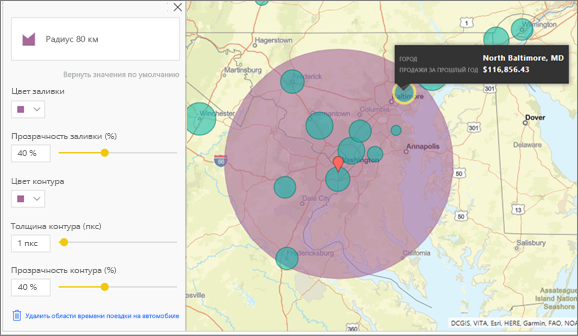

1. Выберите инструмент единичного выбора, а затем выберите вешку или пузырек. В этом примере мы выбрали вешку для аэропорта Шарлотт/Дуглас.

   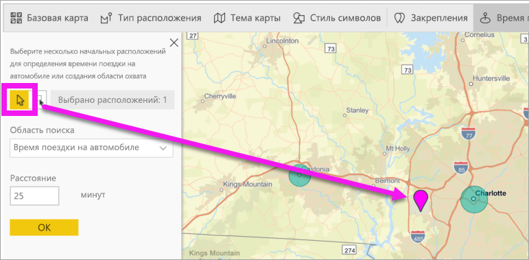
   
   > [!TIP]
   > Увеличение масштаба на карте упростит выбор расположения. Изменить масштаб можно с помощью значка "+" или прокрутки мышью.
   > 
   > 
2. Предположим, вы на несколько дней летите в аэропорт Шарлотт/Дуглас и вам нужно узнать, какие магазины сети есть в приемлемых пределах для поездки автомобилем. Задайте для области поиска значение **Drive time** (Время поездки) и укажите для расстояния значение **25** минут. Нажмите кнопку "ОК".    
   
    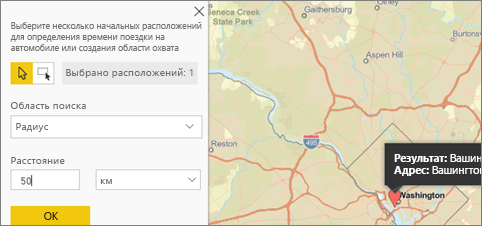

    

3. За 25 минут можно доехать до двух магазинов. На карте отобразится участок, окрашенный фиолетовым цветом. Выберите любое расположение для отображения сведений о нем. При необходимости отформатируйте изображение, изменив цвет и контур участка.
   
    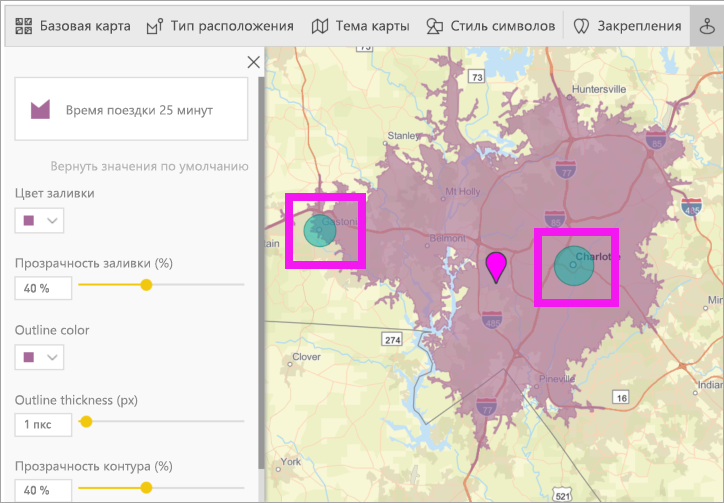

### Ссылочный слой
#### Ссылочный слой — демографические данные
В картах ArcGIS для Power BI представлено множество демографических слоев, с помощью которых можно согласовать данные Power BI с контекстом.

1. Выберите вкладку **Ссылочный слой** и нажмите кнопку **Демографические данные**.
2. Возле каждого названия слоя есть флажок. Установите флажок, чтобы добавить слой на карту.  В этом примере добавлены среднестатистические доходы населения. 
   
    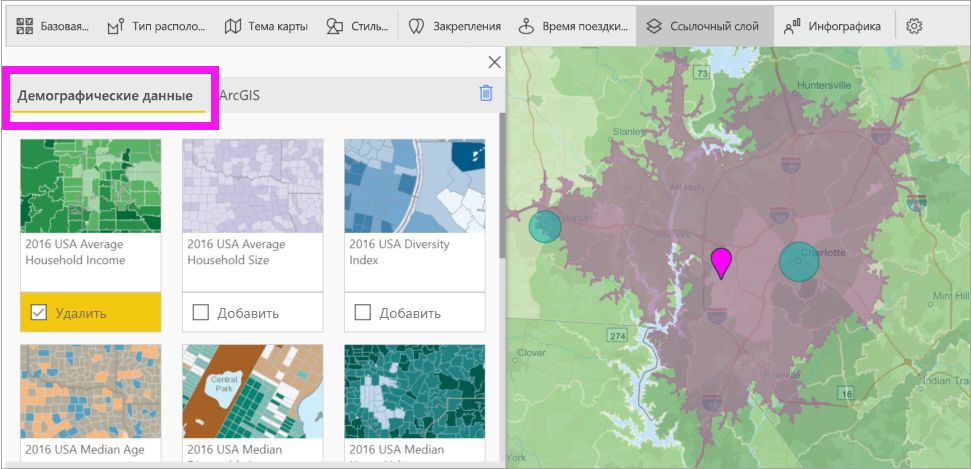
3. Каждый слой — интерактивный. Чтобы просмотреть подробные сведения, наведите указатель мыши на пузырек. Чтобы просмотреть подробные сведения в форме диаграмм, щелкните затененную область. Здесь мы выбрали почтовый индекс 28227, и отображаются две диаграммы.
   
    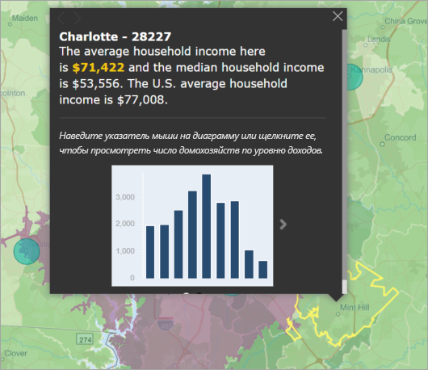

#### Ссылочный слой — ArcGIS
ArcGIS Online дает возможность организациям публиковать общедоступные веб-карты. Кроме того, компания Esri предоставляет проверенный набор веб-карт с помощью Living Atlas. На вкладке ArcGIS можно найти все общедоступные веб-карты или карты Living Atlas и добавить их как ссылочные слои.

1. Выберите вкладку **Ссылочный слой** и выберите **ArcGIS**.
2. Введите условия поиска, а затем выберите слой карты. В этом примере выбраны избирательные округи США.
   
    
3. Чтобы просмотреть подробные сведения, выберите затененную область для активации элемента *Select from reference layer* (Выбрать из ссылочного слоя). Используйте средство выбора ссылочного слоя для выделения границ или объектов этого слоя.

 

## Выбор точек данных
Карты ArcGIS для Power BI поддерживают пять режимов выбора, которые позволяют правильно и быстро выбирать данные.

Чтобы изменить режим выделения, наведите указатель мыши на значок инструмента "одинарный выбор", показанный на рисунке ниже. Это позволит развернуть скрытую панель, чтобы отобразить дополнительные инструменты.

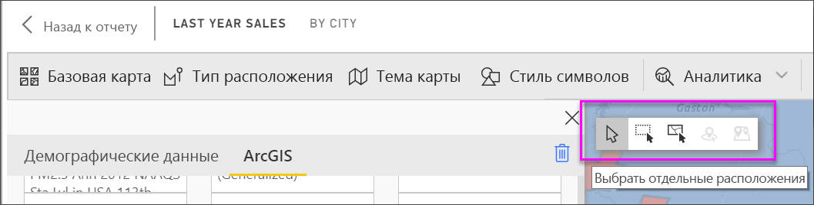

У каждого средства есть уникальная роль, позволяющая выбрать данные. 

 Позволяет выбрать отдельные точки данных.

 Позволяет начертить прямоугольник на карте и выбрать точки данных, содержащиеся в нем.

 Позволяет использовать границы или многоугольники в ссылочных слоях для выбора содержащихся в них точек данных.

 Позволяет выбирать данные с помощью слоя буфера.

 Позволяет выбирать точки данных, которые похожи друг на друга.

> [!NOTE]
> Одновременно можно выбрать не более 250 точек.
> 
> 

 

## Получение справки
Компания **Esri** предоставляет [полную документацию](https://go.microsoft.com/fwlink/?LinkID=828772) по набору функций **карт ArcGIS для Power BI**.

Чтобы узнать последние сведения или сообщить о проблеме, можно задать вопросы и получить ответы в [темах сообщества Power BI, связанных с **картами ArcGIS для Power BI**](https://go.microsoft.com/fwlink/?LinkID=828771).

Если у вас есть предложения по улучшению, отправьте их в [список идей Power BI](https://ideas.powerbi.com).

 

## Управление использованием карт ArcGIS для Power BI в организации
С помощью Power BI авторы, администраторы клиентов и ИТ-администраторы могут управлять использованием ArcGIS Maps for Power BI. Ниже приводятся действия, которые может выполнять каждая роль. 

### Возможности для авторов
В Power BI Desktop авторы могут отключить ArcGIS Maps for Power BI на вкладке "Безопасность". Последовательно выберите **Файл** > **Параметры и настройки**, а затем выберите **Параметры** > **Безопасность**. Если карты ArcGIS отключены, они не загружаются по умолчанию.

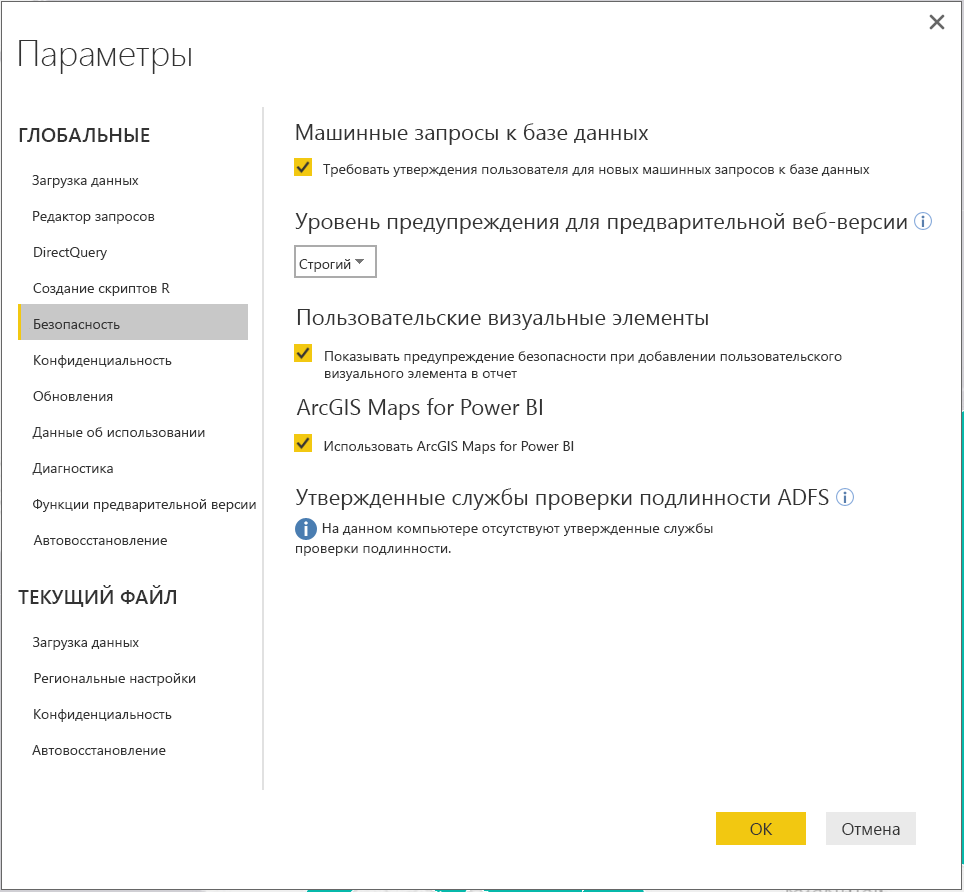

### Параметры администратора клиента
На сайте PowerBI.com администраторы клиента могут отключить ArcGIS Maps for Power BI для всех пользователей. Последовательно выберите **Параметры** > **Портал администрирования** > **Параметры клиента**. После этого в Power BI в области "Визуализации" больше не будет отображаться значок ArcGIS Maps for Power BI.

### Параметры ИТ-администратора
Power BI Desktop поддерживает использование **групповой политики**, чтобы отключать карты ArcGIS для Power BI на компьютерах, развернутых в организации.

<table>
<tr><th>Атрибут</th><th>Значение</th>
</tr>
<tr>
<td>key</td>
<td>Software\Policies\Microsoft\Power BI Desktop&lt;/td&gt;
</tr>
<tr>
<td>valueName</td>
<td>EnableArcGISMaps</td>
</tr>
</table>

Значение 1 (десятичное) позволяет включить карты ArcGIS для Power BI.

Значение 0 (десятичное) позволяет отключить карты ArcGIS для Power BI.

## Рекомендации и ограничения
Карты ArcGIS для Power BI доступны в следующих службах и приложениях.

<table>
<tr><th>Службы или приложения</th><th>Доступность</th></tr>
<tr>
<td>Power BI Desktop</td>
<td>Да</td>
</tr>
<tr>
<td>Служба Power BI (app.powerbi.com)</td>
<td>Да</td>
</tr>
<tr>
<td>Мобильные приложения Power BI</td>
<td>Да</td>
</tr>
<tr>
<td>Публикация в Интернете через Power BI</td>
<td>Нет</td>
</tr>
<tr>
<td>Power BI Embedded</td>
<td>Нет</td>
</tr>
<tr>
<td>Внедрение службы Power BI (PowerBI.com)</td>
<td>Нет</td>
</tr>
</table>

В службах или приложениях, для которых карты ArcGIS для Power BI недоступны, визуализация отобразится как пустой визуальный элемент с эмблемой Power BI.

При геокодировании будут обработаны только первые 1500 адресов. Геокодирование географических названий или стран не ограничивается 1500 адресами.

 

**Как карты ArcGIS Maps for Power BI работают вместе?**
Решения ArcGIS Maps for Power BI предоставляются компанией Esri (https://www.esri.com). Использование карт ArcGIS Maps for Power BI регулируется [условиями](https://go.microsoft.com/fwlink/?LinkID=8263222) и [политикой конфиденциальности](https://go.microsoft.com/fwlink/?LinkID=826323) компании Esri. Пользователи Power BI, желающие использовать визуальные элементы ArcGIS Maps for Power BI, должны принять условия в диалоговом окне получения согласия (подробности см. в разделе "Согласие пользователя").  Использование ArcGIS Maps for Power BI регулируется политикой конфиденциальности и условиями компании Esri, которые также связаны с диалоговым окном согласия. Перед началом использования ArcGIS Maps for Power BI каждый пользователь должен согласиться с условиями. Как только пользователь согласится с условиями, данные, привязанные к визуальному элементу, отправляются в службы Esri по крайней мере для геокодирования, то есть преобразования сведений о расположении в сведения о широте и долготе, которые могут быть представлены на карте. Следует исходить из того, что любые данные, привязанные к визуализации данных, могут быть переданы в службы Esri. Компания Esri предоставляет такие службы, как обзорные карты, пространственная аналитика, геокодирование и т. д. Визуальные элементы ArcGIS Maps for Power BI взаимодействуют с этими службами, используя соединение SSL, защищенное сертификатом, который предоставляется и поддерживается компанией Esri. Дополнительные сведения о картах ArcGIS Maps for Power BI можно получить на [странице продукта ArcGIS Maps for Power BI](https://www.esri.com/powerbi).

Когда пользователь регистрируется для получения подписки Plus, предоставляемой Esri через ArcGIS Maps for Power BI, он входит в прямое отношение с Esri. Power BI не отправляет в Esri персональные данные пользователя. Пользователь выполняет вход и устанавливает отношение доверия с предоставляемым Esri приложением AAD, используя собственное удостоверение AAD. Таким образом, пользователь предоставляет доступ к своим персональным данным непосредственно компании Esri. После того как пользователь добавит контент Plus в визуальный элемент ArcGIS Maps for Power BI, другим пользователям Power BI также потребуется подписка от Esri для просмотра или изменения этого контента. 

Технические вопросы о работе ArcGIS Maps for Power BI компании Esri можно задать на сайте технической поддержки Esri.

**Какие данные передаются компании Esri?**
Сведения о данных, передаваемых в компанию Esri, приводятся на ее [сайте документации](https://doc.arcgis.com/en/maps-for-powerbi/get-started/data-transfer.htm).

**Требуется ли платить за использование карт ArcGIS для Power BI?**

Элемент ArcGIS Maps for Power BI предоставляется компанией **Esri** бесплатно. Необходимо принять пользовательское соглашение.  

**В Power BI Desktop отображается сообщение о том, что кэш заполнен**

Мы работаем над устранением этой проблемы.  Тем временем, чтобы очистить кэш, попробуйте удалить файлы в расположении C:\Users\\AppData\Local\Microsoft\Power BI Desktop\CEF, а затем перезапустите Power BI.

**Поддерживают ли карты ArcGIS для Power BI файлы фигур ESRI?**

Карты ArcGIS для Power BI автоматически определяют стандартные границы стран, регионов, штатов и провинций, а также почтовые индексы. Если нужно создать собственные фигуры, это можно сделать с помощью [карт фигур для Power BI Desktop](desktop-shape-map.md).

**Можно ли просматривать карты ArcGIS автономно?**

Нет. Чтобы отобразить карты Power BI, требуется сетевое подключение.

**Можно ли подключиться к учетной записи ArcGIS Online через Power BI?**

Эта возможность пока недоступна. [Голосуйте за эту идею](https://ideas.powerbi.com/forums/265200-power-bi-ideas/suggestions/9154765-arcgis-geodatabases), и мы отправим вам на почту сообщение, когда начнем работу над этой функцией.  

## Дальнейшие действия
[Взаимодействие с картой ArcGIS, к которой вам предоставлен общий доступ](power-bi-visualizations-arcgis.md)

[Запись блога о доступных картах ArcGIS для Power BI](https://powerbi.microsoft.com/blog/announcing-arcgis-maps-for-power-bi-by-esri-preview/)

Появились дополнительные вопросы? [Попробуйте задать вопрос в сообществе Power BI.](https://community.powerbi.com/)

