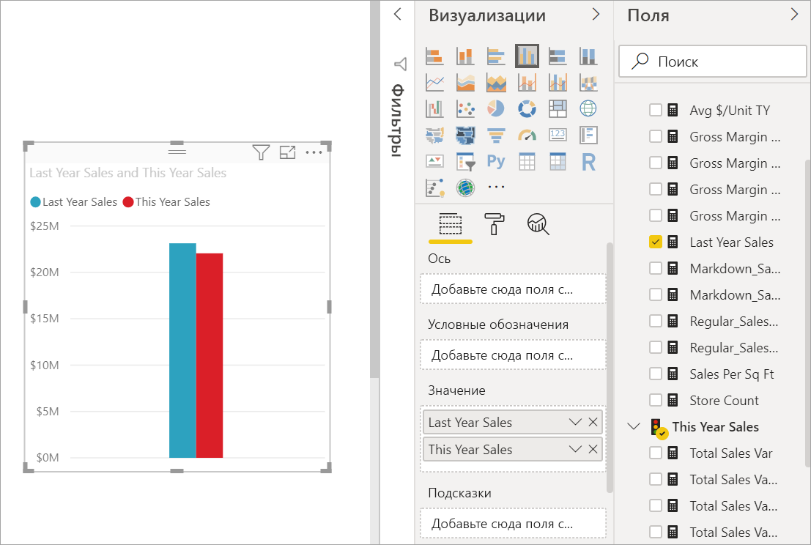
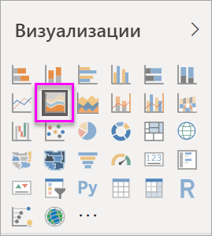
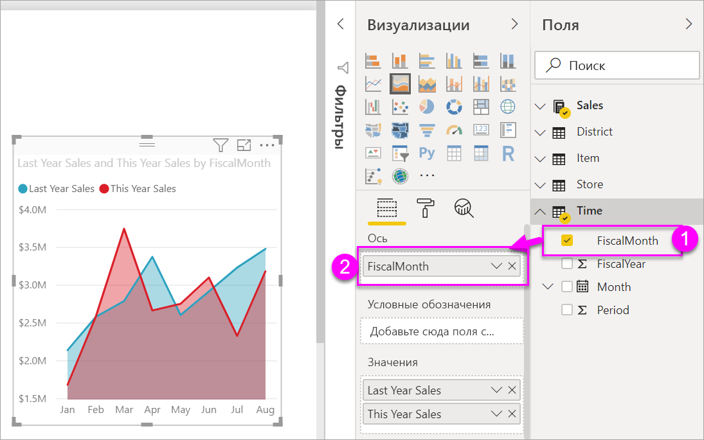

# Простые диаграммы с областями

[!INCLUDE [power-bi-visuals-desktop-banner](../includes/power-bi-visuals-desktop-banner.md)]

Простая диаграмма с областями (или многоуровневая диаграмма с областями) основана на графике. Область между осью и линией заполняется цветами, чтобы указать объем. 

Диаграммы с областями подчеркивают величину изменения в динамике по времени и могут использоваться для привлечения внимания к общему значению в рамках тренда. Например, данные, представляющие прибыль в динамике по времени, можно отобразить на диаграмме с областями, чтобы подчеркнуть общую прибыль.

## Сферы применения простой диаграммы с областями
Простая диаграмма с областями отлично подходит:

* для просмотра и сравнения трендов объема по временным рядам; 
* для отображения отдельных рядов, представляющих физическое счетное множество.

### Предварительные требования
В этом руководстве используется пример PBIX-файла с примером [Анализ розничной торговли](https://download.microsoft.com/download/9/6/D/96DDC2FF-2568-491D-AAFA-AFDD6F763AE3/Retail%20Analysis%20Sample%20PBIX.pbix).

1. В верхнем левом разделе меню выберите **Файл** > **Открыть**.
   
2. Найдите свою копию PBIX-файла с примером **Анализ розничной торговли**.

1. Откройте PBIX-файл с примером **Анализ розничной торговли** в представлении отчета .

1. Выбрать  чтобы создать новую страницу.

## Создание простой диаграммы с областями
 

1. По этим инструкциям вы сможете создать диаграмму с областями, отображающую продажи за этот год и продажи за прошлый год по месяцам.
   
   а. В области "Поля" выберите **Sales \> Last Year Sales** (Продажи > Продажи за прошлый год) и **This Year Sales > Value** (Продажи за этот год > Значение).

   

   б.  Преобразуйте диаграмму в простую диаграмму с областями, выбрав соответствующий значок диаграммы с областями на панели "Визуализации".

   
   
   в.  Выберите **Time\> FiscalMonth** (Время > Отчетный месяц), чтобы добавить время в качестве **оси**.   
   
   
   г.  Чтобы отобразить диаграмму по месяцам, нажмите кнопку с многоточием (в правом верхнем углу визуального элемента) и выберите **Сортировать по месяцам**. Чтобы изменить порядок сортировки, снова нажмите кнопку с многоточием и выберите **Сортировка по возрастанию** или **Сортировка по убыванию**.

## Выделение и перекрестная фильтрация
Сведения об использовании области "Фильтры" см. в разделе [Добавление фильтра в отчет](../power-bi-report-add-filter.md).

Чтобы выделить конкретную область диаграммы, выберите эту область или ее верхнюю границу.  Если на той же странице есть другие визуализации, при выделении диаграммы с областями не выполняется перекрестная фильтрация других визуализаций на странице отчета. Это правило не работает в других типах визуализаций. Однако диаграмма с областями может быть целевым объектом для перекрестной фильтрации, запускаемой другими визуализациями на странице отчета. 

1. Попробуйте ее в деле: выберите диаграмму с областями и скопируйте ее на страницу отчета **New Store Analysis** (Анализ новых магазинов) с помощью сочетаний клавиш CTRL+C и CTRL+V.
2. Выберите одну, а затем другую затененную область на диаграмме с областями. Обратите внимание, что это не влияет на другие визуализации на странице.
1. Теперь выберите элемент. Обратите внимание, как это влияет на диаграмму с областями: данные на ней отфильтровываются перекрестно.

     

Дополнительные сведения см. в статье [Взаимодействия с визуализациями в отчете Power BI](../service-reports-visual-interactions.md).

## Рекомендации и устранение неполадок   
* [Как сделать отчет более доступным для людей с ограниченными возможностями](../desktop-accessibility.md)
* Простые диаграммы с областями неэффективны для сравнения значений из-за их перекрытия в многоуровневых областях. Power BI использует прозрачность для обозначения перекрывающихся областей. Тем не менее этот режим хорошо работает только с двумя или тремя разными областями. При необходимости сравнить тренд с большим количеством показателей попробуйте использовать графики. При необходимости сравнить объем с большим количеством показателей попробуйте использовать диаграмму дерева.

## Дальнейшие действия
[Отчеты в Power BI](power-bi-visualization-card.md)  

