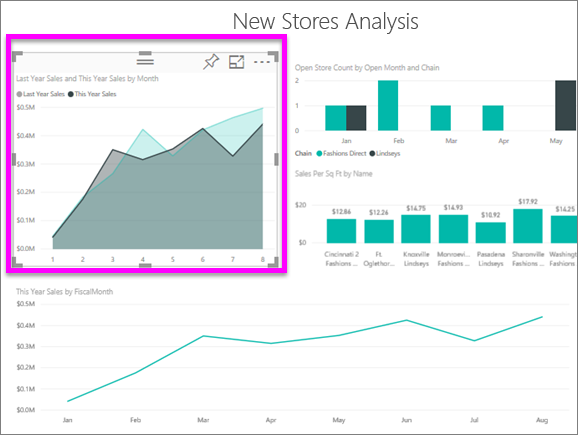
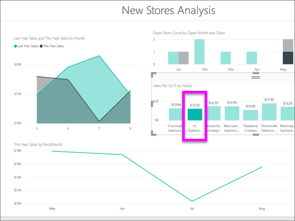

# Простые диаграммы с областями
Простая диаграмма с областями (или многоуровневая диаграмма с областями) основана на графике. Область между осью и линией заполняется цветами, чтобы указать объем. 

Диаграммы с областями подчеркивают величину изменения в динамике по времени и могут использоваться для привлечения внимания к общему значению в рамках тренда. Например, данные, представляющие прибыль в динамике по времени, можно отобразить на диаграмме с областями, чтобы подчеркнуть общую прибыль.

## Сферы применения простой диаграммы с областями
Простая диаграмма с областями отлично подходит:

* для просмотра и сравнения трендов объема по временным рядам; 
* для отображения отдельных рядов, представляющих физическое счетное множество.

### Предварительные требования
 - службе Power BI
 - Анализ розничной торговли — пример

Для выполнения этой процедуры войдите в службу Power BI и выберите **Получить данные\> Примеры \> Анализ розничной торговли — пример > Подключиться**. Затем выберите **Перейти к информационной панели**. 

## Создание простой диаграммы с областями
 

1. На панели мониторинга "Анализ розничной торговли — пример" выберите **Total Stores** (Всего магазинов), чтобы открыть отчет "Анализ розничной торговли — пример".
2. Выберите пункт **Изменить отчет** , чтобы открыть отчет в режиме редактирования.
3. Добавьте новую страницу отчета, выбрав желтый значок "плюс" (+) в нижней части отчета.
4. Создайте диаграмму с областями, отображающую продажи за этот год и продажи за прошлый год по месяцам.
   
   а. В области "Поля" выберите **Sales \> Last Year Sales** (Продажи > Продажи за прошлый год) и **This Year Sales > Value** (Продажи за этот год > Значение).

   

   б.  Преобразуйте диаграмму в простую диаграмму с областями, выбрав соответствующий значок диаграммы с областями на панели "Визуализации".

   
   
   в.  Выберите **Time \> Month** (Время > Месяц), чтобы добавить время в качестве **оси**.   
   
   
   г.  Чтобы отобразить диаграмму по месяцам, нажмите кнопку с многоточием (в правом верхнем углу визуального элемента) и выберите **Сортировать по месяцам**. Чтобы изменить порядок сортировки, снова нажмите кнопку с многоточием и выберите **Сортировка по возрастанию** или **Сортировка по убыванию**.

## Выделение и перекрестная фильтрация
Сведения об использовании области "Фильтры" см. в разделе [Добавление фильтра в отчет](../power-bi-report-add-filter.md).

Чтобы выделить конкретную область диаграммы, выберите эту область или ее верхнюю границу.  Если на той же странице есть другие визуализации, при выделении диаграммы с областями не выполняется перекрестная фильтрация других визуализаций на странице отчета. Это правило не работает в других типах визуализаций. Однако диаграмма с областями может быть целевым объектом для перекрестной фильтрации, запускаемой другими визуализациями на странице отчета. 

1. Попробуйте ее в деле: выберите диаграмму с областями и скопируйте ее на другую страницу отчета (с помощью сочетаний клавиш CTRL+C и CTRL+V).
2. Выберите одну затененную область, а затем другую. Обратите внимание, что это не влияет на другие визуализации на странице.

    

3. Теперь выберите элемент на одной из других визуализаций на странице, например столбец на гистограмме или месяц на графике. Обратите внимание, как это влияет на диаграмму с областями: данные на ней отфильтровываются.  

     

Дополнительные сведения см. в статье [Взаимодействия с визуализациями в отчете Power BI](../service-reports-visual-interactions.md).

## Рекомендации и устранение неполадок   
* [Как сделать отчет более доступным для людей с ограниченными возможностями](../desktop-accessibility.md)
* Простые диаграммы с областями неэффективны для сравнения значений из-за их перекрытия в многоуровневых областях. Power BI использует прозрачность для обозначения перекрывающихся областей. Тем не менее этот режим хорошо работает только с двумя или тремя разными областями. При необходимости сравнить тренд с большим количеством показателей попробуйте использовать графики. При необходимости сравнить объем с большим количеством показателей попробуйте использовать диаграмму дерева.

## Дальнейшие действия
[Отчеты в Power BI](power-bi-visualization-card.md)  

