# <a name="best-design-practices-for-reports-and-visuals"></a>Рекомендации по проектированию отчетов и визуализаций

Эта статья содержит рекомендации по проектированию отчетов в Power BI. В ней рассматриваются принципы проектирования, которые можно применять для создания отчетов, а также входящих в них страниц и отдельных визуальных элементов. Многие из этих рекомендаций можно использовать и при проектировании панели мониторинга.

> [!NOTE]
> В этой статье собраны общие рекомендации, которые вы можете применять по необходимости. При этом каждый описываемый нами принцип может в некоторых случаях нарушаться.

Мы надеемся, что эта статья послужит вам хорошей отправной точкой, и вы сможете применять полученные знания для создания собственных отчетов и визуализаций. Кроме того, мы всегда готовы продолжить общение в [Сообществе Microsoft Power BI](http://community.powerbi.com/). Проектирование отчетов бизнес-аналитики и использование визуализации сейчас очень актуально. Эта тема широко освещается многими авторами и блоггерами на многих веб-сайтах. Мы перечислили несколько источников в конце статьи.

> *Мы перегружены информацией не потому, что ее слишком много, но потому, что не умеем ее осваивать.*
— Стивен Фью.

## <a name="a-look-at-the-landscape-and-terminology"></a>Описание среды и терминология

В Power BI отчет может состоять из одной или нескольких страниц. Совокупно все эти страницы называются отчетом. Основные элементы отчета — это визуальные элементы (также известные как визуализации), отдельные изображения и текстовые поля. Доступно множество параметров форматирования, которые применимы как к отдельным точкам данных, так и к элементам отчета, включая страницы.

Мы начнем с этапа планирования отчета, затем рассмотрим базовые принципы проектирования отчета, обсудим принципы проектирования визуализаций, и в заключение предложим современные рекомендации по использованию отдельных типов визуализаций.

Подробные инструкции по созданию и использованию отчетов Power BI см. на странице [Обучение Power BI](https://powerbi.microsoft.com/learning/).

## <a name="before-you-build-your-first-visualization-focus-on-requirements"></a>Создавая визуализации, помните о требованиях

Работа над отчетом начинается еще до создания первой визуализации. Чтобы получить качественный отчет, его нужно тщательно спланировать. Определите характер используемых данных и запишите все требования к новому отчету. Дайте ответы на следующие вопросы:

* Какую бизнес-задачу вы решаете?

* Каким образом читатели будут использовать эти данные?

* Кто будет использовать эти данные?

* Какие решения сможет принять читатель на основе этого отчета?

Ответы на эти вопросы и определят требования к проекту. Каждый отчет — это история. Убедитесь, что ваша история соответствует поставленной бизнес-задаче. Иногда есть искушение добавить визуализации с эффектными данными. Но если эти данные не соответствуют бизнес-задаче, отчет не будет полезным. Таким образом вы только отвлечете внимание пользователей. Кроме того, вы можете обнаружить, что сведения, необходимые для принятия решения, невозможно получить из представленных вами данных. Позволяет ли этот отчет оценить именно то, что нужно?

Отчеты можно использовать для выполнения поиска, отслеживания, прогнозирования, измерения и тестирования, управления, мониторинга и множества других операций с данными. Например, вашей организации нужен отчет о продажах для оценки производительности. Вы можете включить в такой отчет анализ текущих продаж, сравнение с продажами за прошлые периоды, сравнение с аналогичными показателями конкурентов, а также ряд ключевых индикаторов производительности, которые активируют оповещения. Возможно, читатели захотят подробно изучить статистику продаж, чтобы найти проблемы, связанные с работой магазина или цепочкой поставок, которые влияют на объем продаж. Также полезной может оказаться группировка данных о продажах по магазинам, регионам, товарам, сезонам и т. п.

Подумайте, кто будет использовать ваш отчет. Включите в него привычную для целевой аудитории терминологию и данные соответствующего уровня детализации и сложности. Предполагается разнородная аудитория? Это означает разные задачи. Создайте разные страницы отчета с учетом уровня осведомленности пользователей. Обязательно четко обозначьте каждую страницу, чтобы читатели могли сами разобраться в представленной информации. Или же можно включить срезы, чтобы пользователи могли изменять содержимое страницы в соответствии со своими задачами. Думайте о своей аудитории при планировании отчета, чтобы избежать типичной ошибки — подмены потребностей пользователей своими представлениями о них. В случае этой ошибки будьте готовы в любой момент начать все сначала.

Когда вы определите бизнес-задачу, целевую аудиторию и необходимые для отчета метрики, переходите к следующему шагу. Теперь вам нужно выбрать наиболее уместные визуальные элементы, а также определить наиболее эффективный метод их подачи. Для начала давайте рассмотрим базовые принципы проектирования отчета.

## <a name="principles-of-report-design"></a>Принципы проектирования отчета

На странице отчета не очень много места, поэтому вместить все нужные элементы, сохраняя информативность и наглядность, действительно непросто. При этом нельзя недооценивать и эстетический фактор. Залог успеха — найти баланс между эстетикой и практичностью.

Давайте рассмотрим такие понятия, как макет, наглядность и эстетика.

### <a name="layout-of-the-report-canvas"></a>Макет холста отчета

Холст отчета — это достаточно ограниченное в размерах пространство. Если на одну страницу отчета не вмещаются все нужные элементы, разбейте документ на множество страниц. Страницы отчета можно адаптировать под определенную аудиторию (например, отдел кадров, ИТ-отдел, продажи, стратегическое руководство). Вы можете сгруппировать страницы по определенным бизнес-вопросам:

* Как дефекты влияют на время простоя?

* Как маркетинговые кампании влияют на тональность?

На страницах можно последовательно развертывать данные. На первой странице можно представить общий обзор или привлекающий внимание факт, а на следующих поместить анализ данных, более подробные сведения и т. д. Хорошо, если весь отчет помещается на одной странице. Если нет, разделите его на несколько страниц в соответствии с логикой повествования. Не забывайте присваивать страницам имена, которые помогут читателям разобраться в структуре.

Рассматривайте этот процесс по аналогии с оформлением картинной галереи. Никто же не станет вешать на стены маленькой комнаты сразу 50 картин, заполняя ее стульями до отказа и окрашивая каждую стену в разные цвета. Вы, как куратор галереи, отвечаете за то, чтобы все элементы были тематически связаны. Вам необходимо позаботиться о том, чтобы их расположение оставляло посетителям пространство для передвижений и размышлений. Вы также можете установить возле них таблички с полезным описанием. Практически во всех современных галереях стены оформлены очень просто, и тому есть причина!

Давайте для примера рассмотрим отчет, который необходимо структурировать. Применяя рекомендации и принципы проектирования, мы увидим, как он улучшается.


**Рисунок 1. Над этой страницей отчета требуется основательно поработать**

Этот пример — одна сплошная проблема с размещением элементов (все это мы обсудим далее):

* выравнивание, упорядочивание и взаиморасположение элементов;

* неоптимальное использование пространства и сортировки;

* визуальный мусор.

### <a name="alignment-order-and-proximity"></a>Выравнивание, упорядочивание и взаиморасположение элементов

Макет отчета влияет на восприятие читателя, определяя порядок, в котором нужно изучать страницу отчета. Расположение и взаимодействие элементов — это визуальное представление вашего повествования. Например, с помощью макета вы можете указать читателю, куда и в каком порядке ему следует смотреть и как представленные элементы связаны друг с другом.

* Люди преимущественно читают слева направо и сверху вниз. Поэтому самый важный элемент следует располагать в левом верхнем углу отчета. Остальные визуализации расположите так, чтобы взгляд по ним скользил в соответствии с логикой изучения информации.

* Элементы, на основе которых принимаются решения, размещайте слева от визуализаций, на которые эти решения повлияют (например, при использовании срезов).

* Связанные элементы располагайте ближе друг к другу. Близость подразумевает наличие связи между элементами.

* Также связи можно подчеркнуть общей границей или цветом фона вокруг связанных элементов. И наоборот, между независимыми частями отчета поместите разделитель.

* Используйте свободное пространство так, чтобы визуально разделить части отчета, представленные на странице.

* Заполните страницу отчета. Если свободного пространства слишком много, увеличьте визуализации или уменьшите размер холста.

* Осмысленно выбирайте размеры элементов отчета. Размер визуализации не должен определяться только наличием свободного пространства.

* Важные элементы следует делать крупнее, чем остальные. Для привлечения внимания используйте дополнительные визуальные элементы, например стрелки.

* Выравнивайте элементы на странице отчета так, чтобы создать симметрию или, наоборот, подчеркнуть ее отсутствие.

Давайте рассмотрим принцип выравнивания более подробно.

#### <a name="alignment"></a>Выравнивание

Выравнивание не означает, что все компоненты должны быть одинакового размера или что в каждой строке отчета должно быть одинаковое число компонентов. Выравнивание означает, что структура страницы просто должна способствовать удобству навигации и восприятию информации.

Ниже приведен обновленный отчет, компоненты которого теперь выровнены по левому и правому краям. Мы также выровняли каждую строку по горизонтали и вертикали. Элементы управления срезами расположены слева от визуализаций, на которые они влияют.


**Рисунок 2. Тот же неупорядоченный отчет, но с улучшенным макетом**

Power BI содержит инструменты, которые помогают выравнивать визуализации. Выбрав в Power BI Desktop несколько визуализаций, вы можете упорядочить их с помощью элементов **Выровнять** и **Распределить**, размещенных на вкладке **Визуальные средства**.

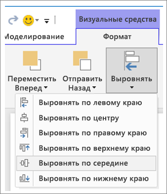

**Рисунок 3а. Средства выравнивания визуализаций в Power BI Desktop**


**Рисунок 3б. Средства выравнивания визуализаций в службе Power BI**

В службах Power BI и Power BI Desktop вы также можете контролировать размер и положение визуализаций. Этот элемент управления находится на вкладке **Общие** на панели **форматирования**. Его можно использовать для всех визуализаций.

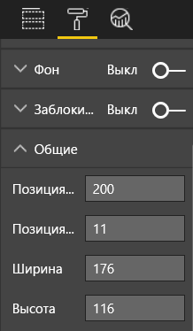

**Рисунок 4. Настройка точного положения визуализации**

На странице отчета из нашего примера (рис. 2) Power BI присваивает параметру **Позиция по оси X** для двух карт и большой границы одинаковое значение 200.

#### <a name="fit-to-the-space"></a>Заполнение пространства

Старайтесь наиболее эффективно использовать все доступное пространство. Если вы знаете, как пользователи будут просматривать или демонстрировать ваш отчет, учитывайте это при проектировании. Исключайте пустое пространство, заполняя холст целиком. Старайтесь не допускать полосы прокрутки на отдельных визуализациях. Заполняя пространство, также не допускайте скученности элементов.

##### <a name="adjust-the-page-size"></a>Настройка размера страницы

Если вы уменьшите размер страницы, отдельные элементы станут крупнее по отношению к странице. Отмените выбор всех визуализаций на странице с помощью вкладки **Размер страницы** на панели **форматирования**.

Ниже представлена одна и та же страница отчета с соотношением сторон **4:3** и **16:9**. Посмотрите, насколько лучше она смотрится в формате 16:9. Здесь даже осталось достаточно места, чтобы убрать полосу прокрутки из второй визуализации.

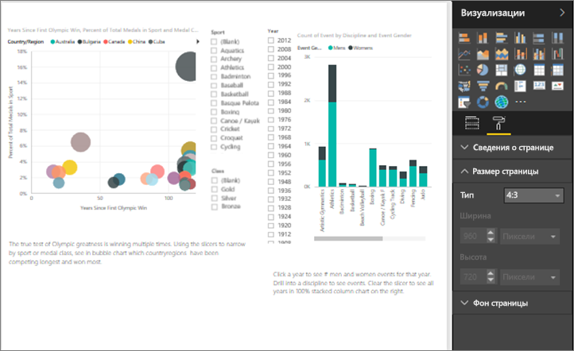

**Рисунок 5а. Страница отчета с соотношением сторон 4:3**

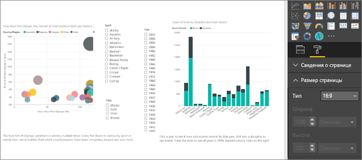

**Рисунок 5б. Страница отчета с соотношением сторон 16:9**

Ваш отчет будут просматривать на экране с соотношением сторон 4:3 или 16:9? Или в другом формате? Это будет небольшой экран или наоборот, огромный? Будут ли использоваться экраны всех представленных размеров и форм? Учитывайте это при проектировании.

На странице отчета из нашего примера несколько тесновато. Отмените выбор визуализаций.

1. Выберите , чтобы открыть панель **форматирования**.

1. Разверните раздел **Размер страницы**.

1. Для параметра **Тип** выберите **Настраиваемый**.

1. Для параметра **Высота** укажите значение **900**.

    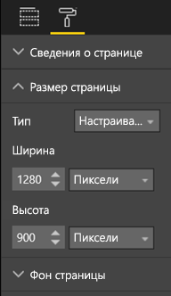

**Рисунок 6. Увеличение высоты страницы**

#### <a name="reduce-clutter"></a>Устранение мусора

Переполненную мусором страницу отчета сложно просматривать. Иногда настолько, что читатели даже не будут пытаться. Исключите все ненужные элементы отчета. Не добавляйте избыточные функции, которые только мешают восприятию или навигации. Страница отчета должна отражать информацию настолько четко, быстро и связно, насколько это возможно.

Эдвард Тафти (Edward Tufte) в своей книге *The Visual Display of Quantitative Information* (Визуальное представление количественных данных) называет этот принцип "соотношением данных и чернил". Иными словами, удаляйте все, кроме самого важного.

Исключив мусор, вы освободите пространство на странице отчета. Таким образом вы получите больше возможностей для применения рекомендаций из раздела о [выравнивании, упорядочивании и взаиморасположении элементов](#alignment-order-and-proximity).

Теперь наш пример стал выглядеть еще лучше. Мы удалили мусор, преобразовали и геометрически структурировали элементы. Фоновое изображение отправилось в мусорную корзину, ненужные стрелка и текстовое поле — следом за ним, одна визуализация переместилась на другую страницу отчета и т. д. Кроме того, мы удлинили страницу, чтобы добавить больше свободного пространства.


**Рисунок 7. Наш неструктурированный отчет после устранения мусора**

### <a name="tell-a-story-at-a-glance"></a>Краткость — сестра таланта

Качество отчета проверяется тем, сможет ли человек без опыта в предметной области быстро уловить суть без дополнительных комментариев. Читатель должен с первого взгляда понять, о чем эта страница отчета, включая каждую диаграмму или таблицу на ней.

Когда читатель смотрит на отчет, его внимание должен привлечь именно тот элемент, который вы хотите продемонстрировать первым. Затем взгляд читателя перемещается слева направо и сверху вниз. Можно изменять эту схему, добавляя визуальные подсказки: текстовые поля, фигуры, границы, размер и цвет элементов.

#### <a name="text-boxes"></a>Текстовые поля

Иногда заголовки визуализаций не могут передать всю суть. Дополните их текстовыми полями с информацией для пользователей, которые будут изучать ваш отчет. С помощью текстовых полей можно описать страницу отчета, сгруппировать визуализации или дать пояснения к некоторым из них. Текстовые поля описывают результаты, подробно раскрывают смысл визуализаций, описывают их отдельные компоненты или связи между ними. С помощью текстовых полей вы можете привлечь внимание читателя, предлагая различные критерии оценки.

В службе Power BI выберите элемент **Текстовое поле** в верхней строке меню. (В Power BI Desktop выберите элемент **Текстовое поле** в области **Вставка** на ленте.)

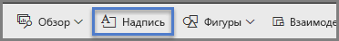

**Рисунок 8. Добавление текстового поля в службе Power BI**

Введите текст в созданное пустое поле. Затем с помощью элементов управления выберите шрифт, размер, выравнивание и другие параметры. Используйте маркеры, чтобы изменить размер поля.

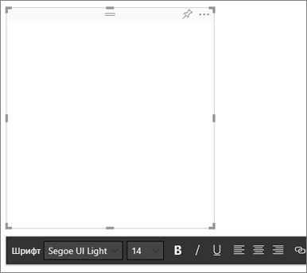

**Рисунок 9. Форматирование текстового поля.**

Здесь важно не перестараться. Слишком большой объем текста в отчете будет отвлекать от визуализаций. Если вы видите, что страница отчета вмещает избыточные пояснения, лучше все переделать. Может быть, другая визуализация лучше представит данные? Может быть, визуализацию можно улучшить, используя ее заголовок?

#### <a name="text"></a>Текстовые

Определитесь со стилем оформления текста и применяйте его ко всем страницам отчета. Выберите небольшое количество шрифтов, размеров и цветов для текста. Примените этот стиль оформления не только к текстовым элементам, но и ко всем шрифтовым компонентам визуализаций. Ознакомьтесь с разделом [Заголовки и метки, которые являются частью визуализаций](#titles-and-labels-that-are-part-of-the-visualizations). Установите правила использования для полужирного начертания, курсива, крупных размеров шрифта, цветов и т. д. Старайтесь не использовать слова в верхнем регистре или подчеркивание.

#### <a name="shapes"></a>Фигуры

Фигуры также могут способствовать навигации и пониманию. С их помощью можно группировать связанные сведения, выделять важные данные или управлять вниманием читателя. Фигуры указывают читателям, где начинается ваш отчет и как его трактовать. В терминах оформления этот принцип называется *контрастностью*.

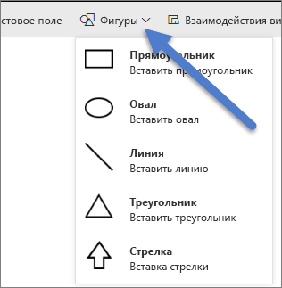

**Рисунок 10а. Фигуры в службе Power BI**

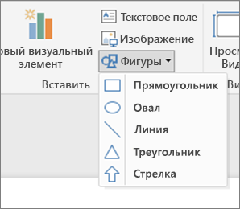

**Рисунок 10б. Фигуры в Power BI Desktop**

Как вам теперь нравится страница из нашего примера? На рис. 11 мы видим, что страница стала чище, мусора стало меньше, а также упорядочены размеры, шрифты и цвета текста. Заголовок страницы в верхнем левом углу сообщает, о чем эта страница.


**Рисунок 11. Отчет из нашего примера с заголовком и последовательным применением стиля оформления**

К странице из нашего примера мы добавили заголовок в левый верхний угол — туда, куда в первую очередь смотрит читатель. Шрифт Segoe Bold размера 28 выделяет заголовок на фоне остального текста на странице. Наши принципы оформления текста гласят, что фоновые рисунки не используются, а заголовки, условные обозначения и метки должны быть черного цвета. Эти правила применены ко всем визуализациям на странице, для которых это возможно (метки и подписи осей для комбинированной диаграммы не редактируются). Кроме того, эти элементы настроены в соответствии с принципами стиля оформления текста:

* Карточки: **меткам категорий** присвоено значение **Выкл.** , для **заголовка** указано значение **Вкл.** , выбран размер шрифта 12 черного цвета и настроено выравнивание по центру.

* Заголовки визуализаций: если они **включены**, выбран размер 12 и выравнивание по левому краю.

* Срезы: для **колонтитула** задано значение **Выкл.** , а для **заголовка** — **Вкл.** ; для параметра **Элементы** > **Текст** оставлен серый цвет и размер 10;

* для точечной диаграммы и гистограммы установлен черный цвет шрифта для заголовков и подписей по осям X и Y (если используются).

#### <a name="color"></a>Цвет

Цвет должен использоваться согласованно. Ниже в разделе [Принципы визуального оформления](#principles-of-visual-design) мы детальнее рассмотрим использования цвета. Пока же ограничимся напоминанием о том, что цвет следует выбирать осознанно. Он не должен отвлекать читателей и мешать быстрому восприятию данных в отчете. Слишком много ярких цветов перегружает зрение. В этом разделе мы поговорим о том, что с цветом делать не следует.

#### <a name="backgrounds"></a>Фон

Выбирая оформление фона для страниц отчета, следите за тем, чтобы эти цвета не создавали нагрузку на глаза и не конфликтовали с самим отчетом и другими цветами на странице. Учтите, что некоторые цвета имеют определенное контекстуальное значение. Например, в США красный цвет в отчетах традиционно означает что-то плохое.

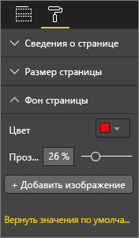

**Рисунок 12. Выбор фона для отчета**

Вы создаете не произведение искусства, а функциональный отчет. Выберите такой цвет, который повысит читаемость и наглядность включенных в отчет данных. Исследование восприятия цветов и визуализаций, используемых на веб-страницах, показало, что высокий контраст между цветами ускоряет обработку информации. Эта тема раскрывается в приведенных ниже документах:

* [The effect of text and background colour on visual search of Web pages](https://www.sciencedirect.com/science/article/pii/S0141938202000410) (Влияние цвета текста и фона на просмотр веб-страниц)

* [Determining Users’ Perception of Web Page Visual Complexity and Aesthetic Characteristics](https://www.researchgate.net/publication/301362579_Determining_Users'_Perception_of_Web_Page_Visual_Complexity_and_Aesthetic_Characteristics) (Оценка восприятия визуальной сложности и эстетики веб-страниц пользователями)

Мы применили некоторые рекомендации в отношении цвета к нашему примеру (см. рис. 20 и 21). Самое заметное изменение — использование черного цвета фона. Желтый был слишком ярким и чрезмерно нагружал зрение. Кроме того, на диаграмме **Count of athlete name by year and class** (Количество спортсменов по годам и классам) желтый фон делал невидимыми желтые сегменты колонок. Черный (или белый) фон обеспечит максимальную контрастность, позволяя сфокусироваться на визуализациях.

Ниже описаны дополнительные действия, которые мы выполнили для улучшения отчета из нашего примера.

#### <a name="page-title"></a>Заголовок страницы

Когда мы изменили цвет фона на черный, исчез заголовок. Дело в том, что для текстовых полей допускается только черный шрифт. Чтобы устранить эту проблему, используйте заголовок текстового поля.

1. Выбрав текстовое поле, удалите из него текст.

1. На вкладке **Визуализации** выберите параметр **Заголовок** и задайте для него значение **Вкл.**

1. Выберите стрелку, чтобы развернуть параметры **заголовка**.

1. Введите **Летние Олимпийские игры** в поле **Текст заголовка**.

1. Для параметра **Цвет шрифта** выберите значение "Белый".

    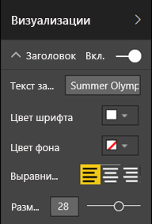

    **Рисунок 13. Добавление заголовка страницы**

#### <a name="cards"></a>Карты

Для визуализаций с картами:

1. Выберите , чтобы открыть панель **форматирования**.

1. Для параметра **Фон** задайте значение **Вкл.**

1. Выберите белый цвет. Для **прозрачности** укажите значение **0 %** .

    

1. Для параметра **Заголовок** задайте значение **Вкл.**

1. В разделе **Цвет шрифта** выберите белый цвет, а в разделе **Цвет фона** — черный.

    

#### <a name="slicers"></a>Срезы

До этого момента у нас было две области срезов с разным форматированием. Это нелепо в контексте оформления. Для двух срезов: 

1. Измените цвет фона на серый.

    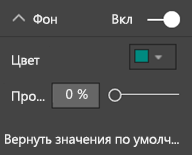

    **Рисунок 14. Изменение цвета фона для среза**

    Это удачный цвет, так как он уже входит в цветовую палитру нашей страницы: он есть на картограмме, гистограмме и диаграмме "дерево".

1. Добавьте тонкую белую рамку.

    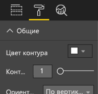

    **Рисунок 15. Добавление рамки для среза**

1. Серый шрифт плохо заметен на голубом фоне, поэтому измените цвет **элементов** на белый.

    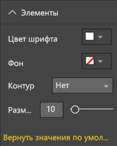

    **Рисунок 16. Изменение цвета шрифта для среза**

1. Наконец, в разделе **Заголовок** измените **цвет шрифта** на белый и добавьте черный **цвет фона**.

    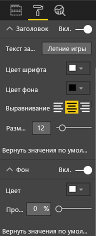

    **Рисунок 17. Форматирование заголовка среза**

#### <a name="rectangle-shape"></a>Прямоугольник

Прямоугольник также потерялся на черном фоне. Чтобы устранить эту проблему, сделайте следующе:

1. Выберите фигуру.

1. На панели **Форматировать фигуру** для параметра **Фон** выберите значение **Вкл.**

    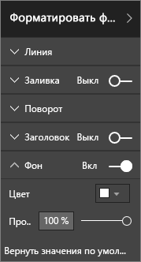

    **Рисунок 18. Форматирование фигуры**

#### <a name="column-charts-bubble-chart-filled-map-and-treemap"></a>Гистограммы, пузырьковая диаграмма, картограмма и диаграмма "дерево"

Добавьте белый фон для остальных визуализаций на странице отчета. На панели **форматирования** сделайте следующее:

1. Разверните параметр **Фон**.

1. Задайте белый **цвет**.

1. Для **прозрачности** укажите значение "0".

    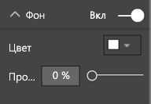

    **Рисунок 19. Добавление белого фона для остальных визуализаций**

После повторного форматирования наш отчет выглядит следующим образом:


**Рисунок 20. Пример отчета после применения рекомендаций по использованию цвета (черный фон)**


**Рисунок 21. Пример отчета после применения рекомендаций по использованию цвета (белый фон)**

### <a name="aesthetics"></a>Эстетика

Ранее мы рассмотрели основную часть параметров, отвечающих за эстетическое восприятие (использование выравнивания, выбор цвета и шрифта, исключение ненужного). Но есть смысл обсудить еще несколько принципов проектирования отчетов. Они имеют отношение к общему представлению отчета.

Не забывайте, что основное назначение отчета — решать бизнес-задачи, а не быть красивым. Без эстетики также нельзя обойтись, особенно когда нам важно произвести хорошее первое впечатление. Консультант компании Nashville Тони Бодо (Tony Bodoh) объясняет это так: "Эмоции срабатывают на полсекунды раньше, чем успевает включиться логика." Сначала читатели реагируют на ваш отчет на эмоциональном уровне, и только потом они его анализируют. Если страница выглядит хаотично, сумбурно или непрофессионально, ваш читатель, скорее всего, даже не заметит суть представленного материала.

Блоггер и промышленный аналитик TechTarget Уэйн Экерсон (Wayne Eckerson) приводит великолепную аналогию. Проектирование отчета похоже на декорирование комнаты. Вы уже успели приобрести диван, вазу, журнальный столик и картину. По отдельности все они вам очень нравятся. Хотя выбор каждого из них был осмысленным, собранные вместе эти предметы конфликтуют друг с другом или перетягивают на себя внимание.

Вот чему нужно уделить внимание:

* создайте общую тему для отчета и примените ее ко всем страницам;

* используйте автономные изображения и графические элементы, которые соответствуют сведениям, а не отвлекают от них;

* применяйте все рекомендации, которые обсуждались ранее в этой статье.

## <a name="principles-of-visual-design"></a>Принципы визуального оформления

Мы рассмотрели основные принципы проектирования отчета и узнали, как правильно разместить элементы отчета, чтобы он был наглядным. Теперь мы перейдем к принципам оформления самих визуализаций. В следующем разделе мы подробно изучим отдельные визуализации и обсудим рекомендации по использованию нескольких самых распространенных шаблонов.

Мы ненадолго расстанемся с нашим отчетом и рассмотрим другие примеры. Мы вернемся к этой странице отчета, когда рассмотрим принципы визуального оформления и применим полученную информацию. Ниже в этой статье приведены пошаговые инструкции.

### <a name="planning--choose-the-right-visual"></a>Планирование — выбирайте правильные визуализации

Спланировать каждую визуализацию не менее важно, чем тщательно спланировать весь отчет еще до его создания. Ответьте на вопрос, какую историю вы хотите рассказать с помощью этой визуализации. И теперь попробуйте определить, какой шаблон визуализации лучше всего подойдет для этого. Например, процесс цикла продаж можно отобразить даже на линейчатой диаграмме, но, согласитесь, каскадная или воронкообразная диаграммы справятся с этой задачей лучше. Рекомендации по выполнению этого процесса см. в последнем разделе этой статьи [Шаблоны визуализаций и рекомендации для них](#visual-types-and-best-practices). В нем описаны рекомендации для некоторых наиболее распространенных шаблонов визуализаций. Не удивляйтесь, если выбранный изначально шаблон визуализации окажется впоследствии не лучшим вариантом. Попробуйте несколько шаблонов, и выберите тот, который лучше всего передает основную идею.

Важно понимать различия между количественными и категориальными данными и знать, какие шаблоны визуализаций лучше подходят для разных типов данных. Количественные данные часто называются мерами. Обычно они выражаются числовыми значениями. Категориальные данные часто называются измерениями. Это данные, которые легко поддаются классификации. Подробно этот вопрос рассмотрен в разделе [Выбор правильной меры](#choose-the-right-measure).

Избегайте соблазна использовать более сложные или замысловатые шаблоны визуализаций только для того, чтобы отчет выглядел внушительно. Всегда ищите наиболее простой вариант презентации данных. Горизонтальная гистограмма и простой график очень быстро передают информацию. Они хорошо знакомы и привычны большинству читателей, благодаря чему они смогут быстро понять их суть. Дополнительное преимущество этих шаблонов заключается в том, что большая часть вашей аудитории читает слева направо и сверху вниз. Таким образом люди быстро оценивают и воспринимают информацию на диаграммах этих двух шаблонов.

Обязательно ли нужна прокрутка, чтобы представить данные на визуализации? Избегайте прокрутки всеми возможными средствами. Попробуйте применить фильтры, иерархическую группировку и детализацию. Если это не поможет избавиться от полосы прокрутки, выберите другой шаблон визуализации. Если без прокрутки не обойтись никак, горизонтальная прокрутка будет лучшим выбором по сравнению с вертикальной.

Даже если вы подберете идеальную визуализацию, для презентации данных могут понадобиться дополнительные средства. Эту помощь вам предоставят метки, заголовки, меню, цвета и размеры. Все эти элементы мы обсудим далее в разделе [Элементы оформления](#design-elements).

### <a name="choose-the-right-measure"></a>Выбор правильной меры

Привлекателен ли способ представления данных на вашей визуализации? Насколько важен этот способ? Добавление визуализаций не должно являться самоцелью. Возможно, вы думали, что визуализация будет интересной, но это оказалось не так. Не бойтесь начать все с начала, чтобы найти более интересные варианты. Возможно, в этом способе тоже есть потенциал, но его нужно реализовать иначе.

Предположим, вы хотите оценить успешность менеджеров по продажам. Какие меры позволят вам это сделать? Как вы будете выбирать лучшего — по общему объему продаж, по общей прибыли, по росту в сравнении с прошлым годом или по выполнению плана продаж? Возможно, самый большой доход продемонстрировал Семен. На линейчатой диаграмме, построенной по суммам дохода, он затмит всех остальных менеджеров по продажам. Если у Семена очень высокая стоимость продаж (командировочные расходы, затраты на доставку и производство и т. п.), это означает, что сумма дохода — не главный показатель.

#### <a name="reflect-reality-dont-distort-reality"></a>Отображение реальности без искажений

Вы можете создать такую визуализацию, которая искажает факты. Есть даже специальный веб-сайт, на котором энтузиасты собирают примеры визуализаций, которые они считают плохими. В комментариях к этим примерам выражается разочарование в компаниях, создающих и распространяющих такие визуализации. Такие компании как будто заявляют, что им нельзя доверять.

Поэтому, представляя данные, всегда следите, чтобы ваши визуализации не искажали реальность. Вот хороший пример.


**Рисунок 22. Диаграмма, искажающая реальность**

Из этого примера создается впечатление, что разница между четырьмя представленными компаниями огромна и что CorpB более успешна, чем три другие компании. Обратите внимание, что ось X начинается не с нуля. Реальная разница между компаниями скорее всего находится в пределах погрешности измерений. Ниже представлены те же данные, но ось X теперь начинается с нуля.


**Рисунок 23. Реалистичная диаграмма**

Читатели, как правило, ожидают, что отсчет по оси X всегда начинается с нуля. Если вы решите изменить точку отсчета, следите за тем, чтобы это не исказило результаты. Подумайте, возможно, стоит добавить визуальную подсказку или текстовое поле, чтобы подчеркнуть отличия от нормы.

### <a name="design-elements"></a>Элементы оформления

Итак, вы выбрали меру и шаблон визуализации, затем создали эту визуализацию. Теперь постарайтесь максимально оптимизировать ее, скорректировав способ представления данных. В этом разделе мы рассмотрим:

* макет, пространство и размер;

* текстовые элементы: метки, аннотации, меню, заголовки;

* сортировку;

* визуальное взаимодействие;

* цвет.

#### <a name="tweaking-visuals-for-best-use-of-space"></a>Настройка визуализаций для эффективного использования пространства

Если вы хотите поместить в отчет несколько диаграмм, для эффективной презентации данных нужно использовать максимально возможное "соотношение между данными и чернилами". Как мы уже упоминали ранее, этот принцип придумал Эдвард Тафти. Наша цель — исключить из диаграммы как можно больше меток, но чтобы это не снизило ее информативность.

В первом наборе представленных ниже диаграмм есть избыточные метки осей: **январь 2014 г.** , **апрель 2014 г.** и т. д. В заголовках слова **по дате** повторяются. Заголовки каждой диаграммы также требуют дополнительного пространства по горизонтали. Если мы удалим заголовки диаграмм и включим индивидуальные метки оси, мы избавимся от некоторого количества чернил и более эффективно распределим пространство. Подписи к осям для двух верхних диаграмм также можно удалить, оставив еще больше места для данных.

Если для вас важно выделить определенные периоды времени, можно нарисовать дополнительные фоновые линии или прямоугольники для всех диаграмм. Это упростит поиск и сравнение информации.

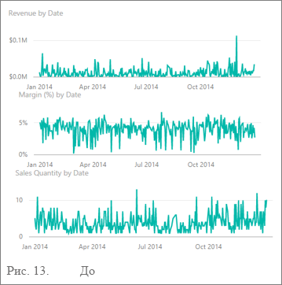

**Рисунок 24. До**


**Рисунок 25. После**

**Включение и отключение заголовков осей**

1. Выберите визуализацию, чтобы сделать ее активной.

1. Выберите , чтобы открыть панель **форматирования**.

1. Разверните параметры для **оси X** или **оси Y**.

1. Перетащите ползунок для параметра **Заголовок** в положение "Выкл.".

    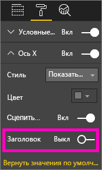

    **Рисунок 26. Включение и отключение заголовков осей**

##### <a name="to-turn-axis-labels-on-and-off"></a>Включение и отключение меток осей

1. Выберите визуализацию, чтобы сделать ее активной.

1. Выберите , чтобы открыть панель **форматирования**.

1. Рядом с параметрами **Ось X** и **Ось Y** отображены ползунки.

1. Перетащите нужный ползунок, чтобы включить или выключить метку соответствующей оси.

    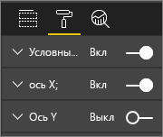

    **Рисунок 27. Включение и отключение меток осей**

    > [!TIP]
    > Например, метки оси можно отключить, если у вас включены **метки данных**.

##### <a name="to-remove-visual-titles"></a>Удаление заголовков визуализации

1. Выберите визуализацию, чтобы сделать ее активной.

1. Выберите , чтобы открыть панель **форматирования**.

1. Установите ползунок для параметра **Заголовок** в положение **Выкл.**

    

    **Рисунок 28. Удаление заголовков из визуализаций**

Подумайте, как читатели будут просматривать отчет. Проверьте, чтобы размер и контрастность всех визуализаций и текстовых элементов позволяли их хорошо рассмотреть. Если одна из визуализаций на странице пропорционально больше других, читатель может предположить, что она самая важная. Оставляйте некоторое свободное пространство между визуализациями, чтобы отчет не выглядел перегруженным и беспорядочным. Выровняйте визуализации, чтобы нужным образом сфокусировать внимание читателя.

##### <a name="to-resize-a-visual"></a>Изменение размера визуализации

1. Выберите визуализацию, чтобы сделать ее активной.

1. Щелкните и перетащите любой из маркеров, чтобы изменить размер.

    

    **Рисунок 29. Изменение размеров визуального элемента**

##### <a name="to-move-a-visual"></a>Перемещение визуализации

1. Выберите визуализацию, чтобы сделать ее активной.

1. Выберите и щелкните полосу захвата по центру верхней границы визуализации.

1. Перетащите ее в новое расположение.

    

    **Рисунок 30. Перемещение визуализации**

#### <a name="titles-and-labels-that-are-part-of-the-visualizations"></a>Заголовки и метки, которые являются частью визуализаций

Следите за тем, чтобы заголовки и метки легко читались и отображали суть. Текст в заголовках и метках должен быть оптимального размера и контрастного цвета. Помните про руководство по стилю оформления (см. раздел про [принципы оформления текста](#text) выше)? Ограничьте используемые для текста цвета и размеры. Слишком большое разнообразие сделает страницу аляповатой. Постарайтесь использовать один цвет и один размер шрифта для заголовков всех визуализаций на странице отчета. Кроме того, выберите одинаковое выравнивание для всех заголовков на странице отчета.

**Панель форматирования**

Для выполнения любого из перечисленных ниже изменений форматирования выберите значок валика , чтобы открыть панель **форматирования**.

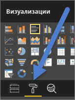

**Рисунок 31. Переход в панель форматирования**

После этого выберите визуальный элемент для настройки и убедитесь, что для него задано значение **Вкл.** Ниже приведены примеры визуальных элементов. **Ось x**, **оси y**, **Title**, **метки данных** и **условные обозначения**. В следующем примере представлен элемент **Заголовок**.

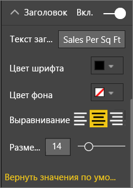

**Рисунок 32. Форматирование заголовка визуализации**

##### <a name="set-the-text-size"></a>Установка размера текста

Размер шрифта можно изменять для заголовков и меток данных, но нельзя изменять для осей X и Y и для условных обозначений. Для меток данных мы отдельно рекомендуем поэкспериментировать с **единицами измерения** и количеством **десятичных знаков**. В конечном счете, вы сможете найти оптимальный уровень детализации своего отчета.

##### <a name="set-the-text-alignment"></a>Установка выравнивания текста

Заголовки можно выравнивать по левому краю, по правому краю или по центру. Выберите один вариант и примените его ко всем визуализациям на странице.

##### <a name="set-the-text-position"></a>Установка положения текста

Положение текста можно настроить для некоторых осей Y и для условных обозначений. Какой бы вариант вы ни выбрали, используйте его для всех остальных осей Y и условных обозначений на этой странице.

##### <a name="set-the-title-and-label-length"></a>Установка длины заголовка и метки

Вы можете изменить длину названия, заголовков осей, меток данных и условных обозначений. Если вы решите отображать эти элементы, настройте длину текста (и размер шрифта) так, чтобы избежать усечения этих значений в службе Power BI.

* Для **заголовка** и **условных обозначений** можно настроить **текст заголовка**. Введите текст, который будет отображаться на визуализации.

* Для **оси X** и **оси Y** можно применить **стиль**, выбрав его в раскрывающемся списке.

* Для **меток данных** используются параметры **Отображение** и **Десятичное**. Раскрывающийся список **Отображение** позволяет выбрать единицы измерения: **миллионы**, **тысячи**, **без единиц**, **автоматический выбор** и т. д. Поле **Десятичное** сообщает Power BI, сколько десятичных разрядов нужно отображать.

##### <a name="set-the-text-color"></a>Установка цвета текста

Цвет текста можно изменить для заголовков, осей и меток данных.

#### <a name="titles-and-labels-that-arent-part-of-the-visualizations"></a>Заголовки и метки, которые не являются частью визуализаций

Ранее мы рассмотрели, как добавлять текстовые поля на страницы отчета. Иногда заголовки визуализаций не могут передать всю суть. Добавляя текстовые поля, вы можете предложить читателю отчета дополнительную информацию.

Чтобы страница отчета не выглядела слишком запутанной или аляповатой, соблюдайте единообразие в использовании шрифтов, размеров, цветов и выравнивания для текстовых полей. Чтобы изменить текст в текстовом поле, выберите нужное поле. Откроется меню форматирования.


**Рисунок 33. Форматирование шрифта, используемого для текстового поля**

#### <a name="sorting"></a>Сортировка

Сортировка визуализаций — это простой способ быстро проанализировать данные. Например, сортировка линейчатых диаграмм в порядке возрастания или убывания позволяет моментально оценить добавочные данные, не используя дополнительные элементы.

Чтобы отсортировать диаграмму, сделайте следующее:

1. Щелкните значок многоточия в правом верхнем углу диаграммы.

1. Выберите **Сортировать**.

1. Выберите нужное поле и направление сортировки.

Дополнительные сведения см. в статье [Изменение порядка сортировки диаграммы в отчете Power BI](../consumer/end-user-change-sort.md).

#### <a name="chart-interaction-and-interplay"></a>Взаимодействие и взаимное влияние диаграмм

Пожалуй, одной из главных возможностей Power BI можно считать то, что вы можете настраивать взаимодействие между диаграммами. По умолчанию для диаграмм используется перекрестное выделение. Если вы выбираете точку данных, выделяются все связанные данные в других диаграммах, а несвязанные данные затемняются. Вы можете переопределить это поведение, назначив любую диаграмму на роль фильтра. Это позволяет более эффективно использовать пространство на странице. Чтобы внести изменения, в службе Power BI выберите в строке меню **Взаимодействие визуальных элементов**.

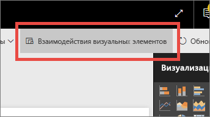

**Рисунок 34. Взаимодействия визуальных элементов**

Затем для каждой визуализации определите, будет ли она выполнять фильтрацию и выделение элементов, или не будет выполнять никаких действий. Некоторые визуализации невозможно выделить. Для них элемент управления выделением будет недоступен. Дополнительные сведения см. в статье [Перекрестная фильтрация визуальных элементов в отчете Power BI](../consumer/end-user-interactions.md).

> [!TIP]
> Для читателей, которые плохо знакомы с Power BI, возможность взаимодействовать с отчетами может оказаться неочевидной. Добавьте текстовые поля, которые подскажут, что нужно выбрать, чтобы получить подробные сведения.

#### <a name="the-use-of-color-in-visuals"></a>Использование цвета в визуализациях

Ранее в этой статье мы говорили, насколько важно разработать план использования цвета в отчете. Здесь мы расскажем о принципах использованию цвета в отдельных визуализациях; эти рекомендации могут пересекаться. Здесь применяются те же основные принципы: используйте цвет, чтобы связать отчет в единое целое, привлечь внимание к деталям или помочь читателю понять визуализацию. Слишком большое разнообразие цветов отвлекает читателя. Оно мешает ему понять, куда нужно смотреть. Не жертвуйте удобочитаемостью ради красоты. Добавляйте цвет только там, где он способствует пониманию.

> [!TIP]
> Представьте свою аудиторию и изучите общепризнанные правила использования цвета. Например, в США зеленым цветом обычно отмечают что-то хорошее, а красным — что-то плохое.

Следующий раздел охватывает несколько тем:

* цвет данных;

* цвет меток данных;

* цвет для категориальных значений;

* цвет для числовых значений.

##### <a name="use-colors-to-highlight-interesting-data"></a>Использование цвета для выделения интересных данных

Самый простой способ использования цвета —изменить цвет одной или нескольких точек данных, чтобы привлечь к ним внимание. В этом примере изменяется цвет при переходе от 4-летнего Олимпийского цикла к 2-летнему циклу с чередованием летних и зимних Игр.


**Рисунок 35. Использование цвета для представления данных**

Цвет точек данных можно изменить, используя вкладку **Цвета данных** на панели **форматирования**. Чтобы отдельно настроить каждую точку, обязательно задайте для параметра **Показать все** значение **Вкл.**

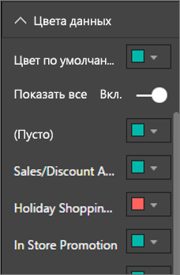

**Рисунок 36. Настройка цветов для точек данных**

> [!NOTE]
> Power BI применяет ко всем элементам отчета тему по умолчанию. Конструкторы подобрали цвета этой темы так, чтобы обеспечить хороший контраст и разнообразие. Чтобы отойти от палитры по умолчанию, выберите **Настраиваемый цвет**.
>
> 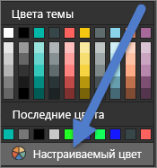
>
> **Рисунок 37. Выбор пользовательского цвета**

В Power BI Desktop можно даже выделять **выбросы** или часть строки с помощью второго ряда.


**Рисунок 38. Выделение выбросов значений в Power BI Desktop**

В этом примере в ряд **выбросов** попадают только те точки, в которых средняя температура августа опускалась ниже 60 градусов. Для этого мы создали вычисляемый столбец DAX с помощью следующей формулы:

```
Outliers = if(Editions[Temp]<60, Editions[Temp], BLANK())
```

Мы видим три выброса значений: в **1952**, **1956** и **2000** гг.

##### <a name="colors-for-labels-and-titles"></a>Цвета для меток и заголовков

Изучая доступные параметры форматирования, вы будете находить новые возможности добавить цвет в заголовки или условные обозначения. Например, вы можете изменить цвет для заголовков осей и меток данных. Используйте эти возможности осторожно. Обычно лучше всего использовать один цвет для всех заголовков визуализаций. Как и в случае со всеми остальными рекомендациями, приведенными в этой статье, могут существовать ситуации и причины, требующие нарушить это правило. Но вам обязательно нужна веская причина, чтобы его нарушать.

##### <a name="colors-for-categorical-values"></a>Цвет для категориальных значений

Обычно диаграммы с рядами данных используют в условных обозначениях категориальные значения. Например, в следующем примере каждый цвет обозначает определенную страну или регион.


**Рисунок 39. Применение цветов по умолчанию**

Конструкторы выбрали цвета Power BI по умолчанию, которые позволяют хорошо различать цвета для разных категориальных значений. Иногда эти цвета заменяются другими в соответствии с корпоративным стилем. Это может привести к проблемам.


**Рисунок 40. Применение цветов, представляющих оттенки одного цвета**

Если использовать один оттенок цвета и изменять только его насыщенность, у зрителя создается ложное ощущение упорядоченности категорий. Такая цветовая схема намекает, что более темные фигуры на какой-то шкале измерений находятся выше или ниже, чем фигуры светлых оттенков. Но обычно категориальные значения не имеют никакого определенного упорядочения, кроме алфавитного порядка имен.

Чтобы изменить цвета по умолчанию, выберите  Откроется панель **форматирования**. Выберите на ней **Цвета данных**.

##### <a name="colors-for-numerical-values"></a>Цвет для числовых значений

Для полей, которые действительно имеют определенный порядок и числовые значения, можно изменять цвет точек данных в зависимости от этих значений. Это пригодится, когда нужно будет продемонстрировать распределение значений, а также отобразить в Power BI на одной диаграмме две переменные. На приведенной ниже диаграмме показано, что Китай завоевал больше медалей, но зато Япония и Таиланд чаще участвовали в Олимпийских играх.


**Рисунок 41. Зависимость цвета точек данных от значения**

Чтобы создать такую диаграмму, сделайте следующее:

1. Выберите визуализацию, чтобы сделать ее активной.

1. Выберите , чтобы открыть панель **форматирования**.

1. Выберите параметры **Цвета данных** > **Условное форматирование** .

    

    **Рисунок 42. Выбор условного форматирования**

1. Настройте эти цвета в диалоговом окне **Default color — *Data colors*** (Цвет по умолчанию — Цвета данных).

    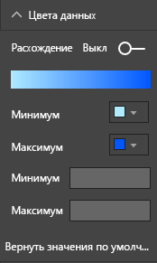

    **Рисунок 43. Корректировка цветов, используемых для насыщенности**

С помощью этих цветов вы также можете подчеркнуть дисперсию относительно базового значения. Например, можно выделять зеленым цветом положительные значения, а красным —отрицательные. Когда выбираете цвета для положительных и отрицательных значений, обязательно учитывайте культурные различия. Не во всех регионах красный воспринимается как плохой цвет, а зеленый — как хороший.


**Рисунок 44. Цвет подчеркивает дисперсию относительно базового значения**

### <a name="principles-of-visual-design--applied-to-example-report-page"></a>Принципы визуального оформления в применении к странице отчета из примера

Теперь давайте применим все принципы визуального оформления, которые мы обсуждали выше, к нашему образцу отчета.


**Рисунок 45. Наш пример отчета (до изменений)**


**Рисунок 46. Наш пример отчета (после изменений)**

#### <a name="what-did-we-do"></a>Что мы сделали?

| Элемент | Описание |
| ---- | ----------- |
| Срез | Удалили пустые значения из вариантов для среза, добавив фильтр на уровне страницы по значениям **Золото**, **Серебро** и **Бронза**. <br> В разделе **Элементы управления выбором** задали для параметров **Единичный выбор** и **Выбрать все** значение **Выкл.** |
| Пузырьковая карта | В условных обозначениях было так много элементов, что они выходили за пределы отведенного места и предполагали использование полосы прокрутки. Мы удалили условные обозначения и взамен включили **Метки категорий**. Теперь пользователи могут наводить курсор на каждый пузырек, чтобы просмотреть сведения о нем.<br> Сократили заголовок и убрали текст "по странам и регионам", так как это очевидно. <br> Для меток обеих осей задали значение **Вкл.** , чтобы диаграмма стала более понятной. |
| Картограмма | Изменили **цвета данных**, чтобы сделать ее более заметной. <br> Включили **Расхождение** и установили розовый цвет для **минимума** и красный для **максимума**.
| Диаграмма-дерево | Удалили фильтр, который фильтровал данные только по США. <br> Установили для **меток данных** ограничение до одного десятичного знака. <br> В визуализации использовалось поле **Класс**, которое отображало мало полезной информации. Распределение медалей почти всегда было равномерным: по 33 % на золото, серебро и бронзу. <br> Мы заменили его более интересным полем **Пол**. Для улучшения оформления мы изменили цвета: синий для водных видов спорта и серый для атлетики.
| Верхняя линейчатая диаграмма | Сократили заголовок, убрали метки данных, отключили заголовок условных обозначений. <br> Изменили порядок слов в заголовка, чтобы он соответствовал самой диаграмме.
| Нижняя линейчатая диаграмма | Отсортировали данные по году так же, как на верхней диаграмме. <br> Изменили цвета, чтобы они соответствовали классам. <br> Изменили заголовок. <br> Отключили условные обозначения, чтобы освободить место для данных. <br> Включили метки данных. Они не отображаются в отчете, так как здесь размер визуализации слишком мал. Они будут видны при открытии визуализации в режиме **фокусировки**. Ознакомьтесь с [дополнительными сведениями о режиме фокусировки](../consumer/end-user-focus.md). <br> Добавили **Count of Event (Distinct)** (Число соревнований (отдельные)) в поле **Подсказки**. Теперь при наведении курсора на гистограмму с накоплением можно увидеть, сколько видов соревнований проводилось в этот год. |
| Взаимодействия визуальных элементов | Отключили взаимодействие для обеих карт, чтобы они всегда показывали общее число игр и видов спорта. |

## <a name="visual-types-and-best-practices"></a>Шаблоны визуализаций и рекомендации для них

Power BI предлагает множество встроенных шаблонов визуализаций. Их можно дополнить списком пользовательских визуализаций, которые предлагают корпорация Майкрософт и сообщество Power BI. Количество доступных вариантов слишком велико, чтобы все их здесь описать. Мы рассмотрим несколько самых распространенных встроенных шаблонов визуализаций.

### <a name="line-charts"></a>Графики


Графики — это мощное средство для просмотра временных рядов данных. Считывание данных в табличном виде не сравнится по скорости с восприятием пиковых значений и плато, а также закономерностей и повторов в графическом представлении. В приведенном ниже примере демонстрируются тенденции по количеству вручаемых медалей и количеству медалистов.


**Рисунок 47. Графики**

#### <a name="best-practices"></a>Советы и рекомендации

* Когда человек смотрит на график, он прежде всего замечает форму кривой. Поэтому нужно выбрать такой параметр для оси X, который сделает эту кривую осмысленной, например время или категорию распределения. Если вы поместите на ось X категориальные поля, например товары или регионы, график будет неинтересным. Форма кривой не будет отображать значимые сведения.

* Если вы решите разместить друг под другом несколько графиков, как показано здесь, выровняйте их по оси X, чтобы упростить сравнение данных. Используйте фильтры, чтобы значения в Power BI отображались в одном диапазоне. Если вы просматриваете данные по диапазонам дат, используйте одинаковые диапазоны. Здесь это годы с 1896 по 2012 на обоих графиках.

* Полностью используйте пространство. Если позволяют ваши данные, задайте **начальную** и **конечную** точки для оси Y так, чтобы исключить пустое пространство в верхней и нижней части графика. Это позволит лучше продемонстрировать точки фактических данных. Чтобы установить **начальную** и **конечную** точки, сделайте следующее:

  1. Выберите визуализацию, чтобы сделать ее активной.

  1. Выберите , чтобы открыть панель **форматирования**.
  
  1. Разверните зону **оси Y** и укажите значения для точек **Начало** и **Конец**.
  
      
  
      **Рисунок 48. Установка начальной и конечной точек**

* Кроме того, будет полезно явным образом задать **начальную** и **конечную** точки, если вы сравниваете на одной странице два или несколько графиков с одним и тем же параметром для оси Y. Например, если вы отображаете число соревнований, в которых участвовали представители страны, то для Великобритании эти данные лежат в диапазоне от 1 до 70, а для Австралии — от 1 до 12. Эти два графика будет иметь очень разные оси Y (см. рисунок 49). Так очень сложно быстро сравнить данные. Вместо этого установите для этих графиков один и тот же диапазон для оси Y (см. рисунок 50).
  
  
  
  **Рисунок 49. Графики с разными диапазонами для оси Y**
  
  
  
  **Рисунок 50. Графики с одинаковыми диапазонами для оси Y**

Дополнительные сведения см. в следующих статьях:

* [Настройка свойств осей X и Y](power-bi-visualization-customize-x-axis-and-y-axis.md)

* [Line charts and irregular intervals: An Incompatible Partnership](http://www.perceptualedge.com/articles/visual_business_intelligence/line_graphs_and_irregular_intervals.pdf) (Графики с нерегулярными интервалами времени: несовместимая связь)

* [Data Visualization 101: Line Charts](http://www.columnfivemedia.com/data-visualization-101-line-charts) (Визуализация данных 101: графики)

### <a name="bar-and-column-charts"></a>Линейчатые диаграммы и гистограммы


Аналогично тому, как графики являются стандартным решением для временных рядов данных, линейчатые диаграммы идеально подходят для рассмотрения определенного значения по разным категориям. Если отсортировать столбцы по значению параметра, сразу будут хорошо видны максимальные значения и распределение значений. Горизонтальные линейчатые диаграммы хорошо подходят для длинных меток.


**Рисунок 51. Горизонтальная линейчатая диаграмма**

#### <a name="best-practices"></a>Советы и рекомендации

* Отображайте метки данных для значений. Это позволяет легко определять конкретные значения. Чтобы отобразить метки данных, сделайте следующее: 

  1. Выберите визуализацию, чтобы сделать ее активной.

  1. Выберите , чтобы открыть панель **форматирования**.
  
  1. Задайте для параметра **Метки данных** значение **Вкл.**

      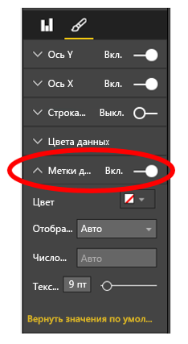

      **Рисунок 52. Включение меток данных**

* Представленная выше линейчатая диаграмма подходит для сравнения одной меры со многими значениями на конкретный момент времени. На графике мы наблюдали тенденцию изменения значений во времени, а линейчатая диаграмма демонстрирует распределение значений для одной категории на определенный момент времени. Здесь с первого взгляда видно, что в Испании один из высочайших в мире уровней безработицы (24,70 %).

* Если гистограмма или линейчатая диаграмма не помещается целиком в отведенное место, Power BI добавляет полосы прокрутки. Везде, где это возможно и практически оправдано, старайтесь оформлять визуализацию и отчет так, чтобы диаграмма помещалась полностью. Тогда читатель сможет быстро оценить все особенности распределения. К сожалению, в нашем примере это невозможно — стран в мире очень много.

  Мы можем уменьшить количество отображаемых значений с помощью фильтра. Например, добавьте на **уровне визуализации** фильтр, который выделит только те страны, где уровень безработицы имеет значение выше 20 %.

* Линейчатые диаграммы и гистограммы позволяют переходить на более глубокий уровень детализации (и возвращаться обратно). Это отличный способ вместить большой объем сведений в одну визуализацию, не занимая дополнительное пространство. В приведенном ниже примере используются два уровня иерархии: регионы и страны. Двойной щелчок по полосе региона переносит нас к списку стран, входящих в состав этого региона. Дополнительные сведения о детализации см. в статье [Режим детализации в визуализации в Power BI](../consumer/end-user-drill.md).
  
  
  
  **Рисунок 53. Углубленная детализация**

Дополнительные сведения о линейчатых диаграммах и гистограммах.

* [Data Visualization 101: Bar Charts](https://insights.newscred.com/data-visualization-101-bar-charts/) (Визуализация данных 101: линейчатые диаграммы)

* [Каталог визуализации данных: линейчатая диаграмма](http://www.datavizcatalogue.com/methods/bar_chart.html#.VYV-hY3bLJw)

* [Каталог визуализации данных: Линейчатая диаграмма с несколькими наборами данных](http://www.datavizcatalogue.com/methods/multiset_barchart.html#.VYV_gI3bLJw)

### <a name="stacked-bar-and-column-charts"></a>Линейчатые диаграммы и гистограммы с накоплением


Вы можете добавить в гистограмму и линейчатую диаграмму дополнительное измерение, разместив в каждом столбце или строке несколько категорий. Теперь диаграмма не только передает сведения об одной общей тенденции (по высоте и длине элементов), но и демонстрирует влияние отдельных категорий на эту тенденцию. На приведенной ниже диаграмме показано, как общий объем доходов лучших футбольных команд мира вырос до 6 миллиардов к 2014 году.


**Рисунок 54. Нормированная гистограмма с накоплением**

Эта гистограмма с накоплением показывает нам, что **общий доход** постоянно растет, и это определяется стабильным ростом по категориям **Коммерция** и **Вещание**. Но на этой диаграмме не очень удобно оценить влияние каждой из трех категорий друг на друга. Например, какая из категорий демонстрирует более высокий рост в дни проведения матчей — "Коммерция" или "Вещание"? Для отображения таких данных оптимальным решением будет график, заменяющий или дополняющий эту визуализацию.

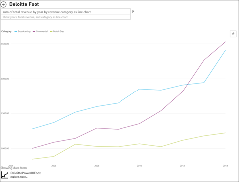

**Рисунок 55. Преобразование в график**

На этом графике хорошо видно, что в дни проведения матчей больше всего растет доход по категории "Коммерция", а следом за ней идет категория "Вещание".

#### <a name="best-practices"></a>Советы и рекомендации

* Как и в случае с гистограммами и линейчатыми диаграммами, вы можете выбирать горизонтальное или вертикальное отображение. Горизонтальный формат лучше подходит при наличии длинных меток, а вертикальный — если вы имеете дело с данными временных рядов.

* Не используйте линейчатые диаграммы и гистограммы с накоплением, если ваша задача — продемонстрировать тенденции и закономерности в изменении значений с течением времени. С этим гораздо лучше справятся другие диаграммы, например графики.

* Вы также можете отображать параметры в долях от общего объема или в процентах.

* Как отмечает Стивен Фью:

    > *... сегменты линейчатого столбца с накоплением трудно сравнивать. Если бы все сегменты располагались рядом друг с другом и начинались от одного уровня, сравнить их высоту было бы легко. Но при размещении одного над другим эта задача усложняется. Кроме того, здесь достаточно легко отследить изменения (дохода) от месяца к месяцу, но довольно трудно понять, как (доход) изменяется по другим (категориям)* .

* Нормированные диаграммы можно считать хорошим выбором, если вы демонстрируете значения в процентах, которые в сумме составляют 100 %. В приведенном ниже примере мы видим соотношения между категориями для разных команд. Процентные показатели являются относительными и позволяют нам быстро заметить закономерности. У клуба Everton доход связан в первую очередь с категорией "Вещание" (более 70 %), тогда как для PSG эта категория дает лишь 20 % от общего дохода. Выбор горизонтального формата позволяет легко разместить метки с названиями команд и хорошо продемонстрировать соотношение между типами доходов.

  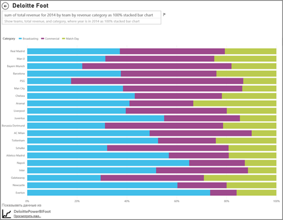

  **Рисунок 56. Горизонтальная диаграмма с накоплением**

Дополнительные сведения о диаграммах с накоплением по следующим ссылкам:

* [Каталог визуализации данных: линейчатые графы с накоплением](http://www.datavizcatalogue.com/methods/stacked_bar_graph.html#top)

* [When are 100% stacked bar graphs useful?](http://www.perceptualedge.com/blog/?p=2239) (В каких случаях полезны нормированные гистограммы?)

### <a name="combo-bar-and-column-charts"></a>Комбинированные линейчатые диаграммы и гистограммы


В Power BI вы можете объединять гистограммы и графики в одну комбинированную диаграмму. Доступные варианты: 

* график и гистограмма с накоплением; 

* график и гистограмма с группировкой.

Вы сможете сэкономить ценное пространство на холсте, объединяя две визуализации в одну.

На следующих двух снимках экрана представлены варианты до и после такого объединения.


 **Рисунок 57. Две отдельные диаграммы**

Первый снимок экрана содержит две отдельные визуализации: гистограмму зависимости населения от времени и график зависимости объема ВВП от времени. Эти диаграммы являются отличными кандидатами на объединение в комбинированную диаграмму, поскольку по оси X у них один и тот же параметр (год) и одинаковые значения (с 2002 по 2012 гг.). Нам ничто не мешает представить эти две тенденции на одной визуализации. Объединение двух диаграмм позволяет быстрее сравнивать данные.


 **Рисунок 58. Одна комбинированная диаграмма**

Новая страница отчета содержит только одну визуализацию график и гистограмма с накоплением. Здесь подойдет и другой вариант — график и гистограмма с группировкой. Теперь стало проще искать связи между двумя тенденциями. Отчетливо видно, что до 2008 года численность населения и ВВП изменялись схожим образом. Но начиная с 2009 года рост численности населения замедлился, а изменения ВВП стали более непредсказуемыми.

#### <a name="best-practices"></a>Советы и рекомендации

* Комбинированные диаграммы лучше всего работают в тех случаях, когда у двух визуализаций есть хотя бы одна общая ось.

* Следите за осями! Удобно ли читать и легко ли понимать вашу комбинированную диаграмму? Используются ли на ней разные диапазоны и значения? Если шкала оси Y для гистограммы будет существенно мельче, чем шкала оси Y для графика, комбинированная диаграмма не сможет донести смысл. Обратите внимание на третью (голубую) линию графика, размещенную в самом низу.

   

   **Рисунок 59. Неудачный график**

  Комбинированная диаграмма также будет бесполезной, если для гистограммы и для графика используются две разные меры, но вы не создадите для них вторую ось. Например, один параметр будет в долларах, а другой в процентах. Обязательно разместите в визуализации обе оси, чтобы читатель мог понять представленные данные. Возможно, следует даже добавить метки осей.

  Чтобы создать вторую ось, сделайте следующее:

    1. Выберите визуализацию, чтобы сделать ее активной.

    1. Выберите , чтобы открыть панель **форматирования**.

    1. Разверните объект **Ось Y** и установите для параметра **Показать вторичные** значение **Вкл.**

          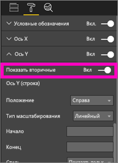

          **Рисунок 60. Показать вторичную ось**

    1. Выберите **Ось Y (гистограмма)**  > **Заголовок** и задайте для заголовка значение **Вкл.**

    1. Выберите **Ось Y (график)**  > **Заголовок** и задайте для заголовка значение **Вкл.**

  Отчет будет выглядеть следующим образом:

  

  **Рисунок 61. Создание комбинированной диаграммы**

* Используйте возможности двух осей. Они позволяют сравнивать несколько мер с разными диапазонами значений. Кроме того, они демонстрируют корреляцию между двумя мерами в одной визуализации.

Дополнительные сведения см. в следующих статьях:

* [Комбинированная диаграмма в Power BI](power-bi-visualization-combo-chart.md)

* [Dual-Scaled Axes in Graphs: Are They Ever the Best Solution?](http://www.perceptualedge.com/articles/visual_business_intelligence/dual-scaled_axes.pdf) (Оси с двойными диапазонами в графах. Являются ли они лучшим решением?)

### <a name="scatter-chart"></a>точечная диаграмма;


Иногда у нас есть много переменных, которые нужно продемонстрировать одновременно. Точечная диаграмма помогает увидеть общую картину. Точечные диаграммы отображают соотношения между двумя (точечные) или тремя (пузырьковые) количественными мерами. Точечная диаграмма всегда включает две оси значений: вдоль горизонтальной оси отображается один набор числовых данных, а вдоль вертикальной — другой. На диаграмме отображаются точки пересечения числовых значений X и Y, объединяя их в отдельные точки данных. В Power BI эти точки данных могут распределяться вдоль горизонтальной оси равномерно или неравномерно. Это зависит от данных.

В пузырьковой диаграмме точки данных заменяются пузырьками, размер которых определяется еще одним измерением данных.

Представленная ниже пузырьковая диаграмма демонстрирует для всех стран Южной Америки три показателя: ВВП на душу населения (ось Y), совокупный ВВП (ось X) и численность населения.


**Рисунок 62. ВВП и население стран Южной Америки на пузырьковой диаграмме**

Численность населения в стране отображается размером соответствующего пузырька. Бразилия имеет наибольшую численность населения (размер пузырька) и наибольшую долю ВВП в Южной Америке (самая дальняя позиция по оси X). Но при этом мы видим, что Уругвай, Чили и Аргентина имеют более высокий ВВП на душу населения. Они расположены выше по оси Y.

Если добавить ось воспроизведения, можно будет описать развитие истории во времени, как это делает Ханс Рослинг: [From Data to Insight & Impact: Showing Africa's Progress with Power View and PPI by Microsoft](https://www.youtube.com/watch?v=PbaDBJWCeD4) (От данных до аналитики и воздействия: демонстрация прогресса Африки с помощью Power View и PPI от Майкрософт). Чтобы добавить ось воспроизведения, перетащите поле даты и времени в зону **Ось воспроизведения**.

#### <a name="best-practices"></a>Советы и рекомендации

* Точечная и пузырьковая диаграммы хорошо умеют рассказывать истории. Но они не слишком полезны для исследования данных. Стивен Фью объясняет это:

    > *Сила этого подхода проявляется в повествовании. Когда рассказ Рослинга о данных на диаграмме сопровождается перемещением пузырьков и изменением их размеров в соответствии с заданным сюжетом, информация оживает. Но анимированные пузырьковые диаграммы гораздо хуже подходят для изучения и понимания данных. Я сомневаюсь, что Рослинг применяет этот метод для поиска своих сюжетов. С его помощью он только рассказывает то, что уже знает. Мы не можем уследить одновременно за несколькими перемещающимися пузырьками, и если нам нужно как следует разобраться в происходящем, приходится запускать анимацию снова и снова. Можно было бы добавить след к некоторым пузырькам, чтобы отслеживать их полную траекторию. Но если таких пузырьков будет много, диаграмма слишком быстро станет перегруженной. Главная мысль, которую я хочу донести, — этот формат не очень подходит для изучения и анализа такой информации.*

* Добавьте метки осей X и Y, которые помогут рассказать историю. Это особенно важно для пузырьковых диаграмм, которые включают очень много компонентов. Метки помогут читателям разобраться в визуализации.

* Добавьте метки данных, чтобы облегчить понимание визуализации. Это особенно важно для пузырьковых диаграмм с большим количеством элементов. Если собрать их все в условные обозначения, не всегда легко различить схожие цвета. В приведенной выше визуализации цвета для Суринама, Колумбии и Эквадора похожи.

* Что делать, если созданная точечная диаграмма демонстрирует только одну точку данных, в которой суммируются все значения по осям X и Y? Диаграмма суммирует все значения вдоль горизонтальных или вертикальных линий? Чтобы исправить такие ситуации, добавьте поле в область **Сведения**, чтобы сообщить Power BI, каким образом нужно группировать значения. Поле должно быть уникальным для каждой точки, которую нужно отобразить. Дополнительную информацию вам предоставит статья [Руководство. Точечные и пузырьковые диаграммы в Power BI](power-bi-visualization-scatter.md).

### <a name="treemap-charts"></a>Диаграммы "дерево"


Диаграмма "дерево" может быть полезной для оценки относительного размера нескольких компонентов единого целого, особенно если их можно сгруппировать по категориям. Каждый раз, когда вы пытаетесь разобраться в новой организации, отображение с помощью диаграммы "дерево" основных компонентов помогает понять общую ситуацию.

На первой из представленных ниже диаграмм вы сразу видите, что на долю Бразилии приходится около половины общего ВВП Южной Америки, а доли Колумбии и Чили примерно равны.

Предположим, что вам нужно одновременно обрисовать общую ситуацию и дать представление о влиянии крупнейших стран. Создайте иерархические визуализации, разместив отдельные члены категорий (страны) внутри регионов. Вторая диаграмма "дерево" в первую очередь дает представление об относительных размерах регионов. В пределах же каждого региона мы видим, какие страны вносят наибольший вклад. Хорошо заметно, что есть три крупных региона: Европа, Азия и Северная Америка. В этих регионах легко найти крупнейшие страны или регионы.

Основное ограничение диаграммы "дерево" заключается в том, что прямоугольники меньшего размера сложно сравнивать. Это хорошая диаграмма для обзора общей ситуации, но гистограмма или линейчатая диаграмма, скорее всего, дадут более точное представление об относительных размерах компонентов.

Первая диаграмма "дерево" дает представление о соотношении размеров ВВП. Но здесь трудно выделить различия между отдельными странами, особенно в прямоугольниках малого размера без надписей. Для таких данных, где сравнивается одно группирование, гистограмма или линейчатая диаграмма могут оказаться более правильным выбором.

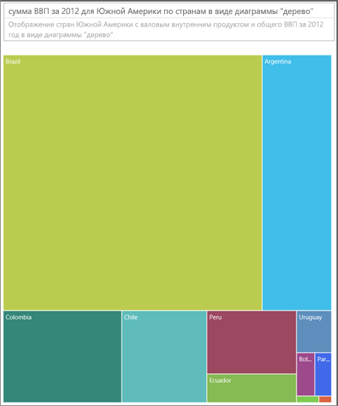

**Рисунок 63. Сравнение ВВП стран Южной Америки на диаграмме "дерево"**

Здесь мы добавили еще один уровень данных — регион. Теперь мы можем увидеть вклад отдельных регионов в совокупный ВВП. Кроме того, мы можем видеть и относительное влияние стран в каждом регионе. Обратите внимание, что при таком представлении несуммативных мер (например, средних значений) сумма значений по отдельным элементам может не соответствовать фактическому значению на уровне группирования.


**Рисунок 64. ВВП по регионам и странам на диаграмме "дерево"**

Ознакомьтесь с дополнительными сведениями о диаграммах "дерево", перейдя по следующим ссылкам:

* [Discovering Business Intelligence Using Treemap Visualizations](http://www.perceptualedge.com/articles/b-eye/treemaps.pdf) (Обнаружение бизнес-аналитики с помощью визуализаций диаграммы "дерево")

* [Каталог визуализации данных: диаграмма "дерево"](http://www.datavizcatalogue.com/methods/treemap.html#.VYhylI3bL7Y)

### <a name="other-charts"></a>Другие диаграммы

#### <a name="pie-or-donut-charts"></a>Круговые и кольцевые диаграммы


Графики, гистограммы и линейчатые диаграммы позволяют решить почти любую задачу. Хорошо известно, что человеку трудно правильно воспринимать информацию на круговой и кольцевой диаграммах. На самом деле эти шаблоны часто искажают данные. Избегайте их по возможности. Стивен Фью отлично описал историю и риски использования этого шаблона в статье [Save the Pies for Dessert](https://www.perceptualedge.com/articles/08-21-07.pdf) (Оставьте пироги на десерт).

Он приводит один сценарий, в котором круговые диаграммы могут быть полезны. Это задача сравнения соотношений между частями и целым. Их эффективность редко будет значимо выше, чем у нормированной линейчатой диаграммы с накоплением.

На сайте [Darkhorse Analytics](http://www.darkhorseanalytics.com/blog/salvaging-the-pie) вы можете найти еще одну забавную статью (с анимацией) о круговых диаграммах.

#### <a name="radial-gauges--kpis"></a>Радиальные датчики и ключевые показатели эффективности


Радиальные датчики могут казаться удобным способом наглядной демонстрации фактических достижений в сравнении с планом. Они часто используются на панелях мониторинга для руководителей. Но у них есть два важных недостатка. Как и в случае с круговой диаграммой, человеку сложно оценить угол наклона и долю выделенной области в сравнении с полной дугой или положением целевой отметки. Также они используют много места для отображения всего одной меры.

Более предпочтительным вариантом является простая визуализация ключевого показателя эффективности:


Ключевые показатели эффективности, занимая ту же площадь, демонстрируют одновременно значение, состояние, цель, отклонение от цели и тенденцию развития. Зеленый цвет станет красным, если цель не достигнута, или, например, желтым, если выполнены некоторые промежуточные цели. Такой вариант гораздо проще воспринимать, чем вариант с датчиком.

Дополнительные сведения см. в следующих статьях:

* [Диаграммы "Радиальный датчик" в Power BI](power-bi-visualization-radial-gauge-charts.md)

* [Визуальные элементы КПЭ](power-bi-visualization-kpi.md)

## <a name="conclusion"></a>Заключение

Теперь настало время применить все эти рекомендации на практике. И не забывайте сообщать нам о своих идеях и предложениях. Может быть, вы не согласны с нашими рекомендациями или нашли вескую причину их нарушить? Об этом мы тоже хотели бы услышать.

Появились дополнительные вопросы? [Ответы на них см. в сообществе Power BI.](http://community.powerbi.com/)

### <a name="book-recommendations"></a>Рекомендации по литературе

Сейчас доступно много хороших книг, которые помогают обновить свои знания о визуальном проектировании. Обязательна к прочтению книга Стивена Фью *Information Dashboard Design* (Проектирование панели мониторинга данных). Еще подробнее он рассматривает эти вопросы в двух других книгах: *Show Me the Numbers* (Покажите мне числа) и *Now you see it* (Теперь вы это видите). Фью и многие другие черпали вдохновение в работах Эдварда Тафти. Его книга *The Visual Display of Quantitative Information* (Визуальное представление количественных данных) уже считается классикой в этой области. Также он написал книги *Visual Explanations* (Визуальные объяснения), *Envisioning Information* (Представление информации) и *Beautiful Evidence* (Красивое доказательство). Рекомендуем новую книгу Э. Кирка (Andy Kirk) *Data Visualization: A Handbook for Data Driven Design (Визуализация данных: руководство по проектированию на основе данных)* . Вот еще несколько авторов, на которых стоит обратить внимание: Лахлан Джеймс (Lachlan James), Уильям Макнайт (William McKnight) и аналитик Forrester Борис Эвелсон (Boris Evelson); а также ресурс Darkhorse Analytics.
