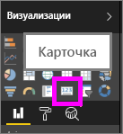
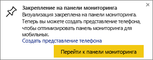
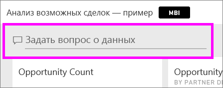
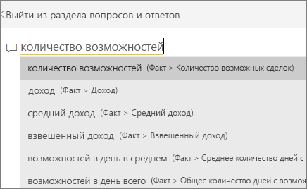
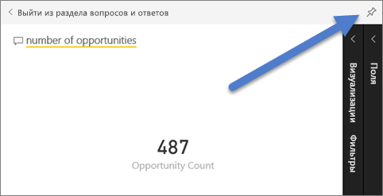
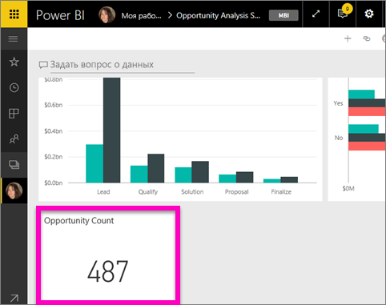
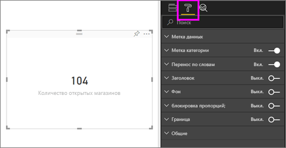
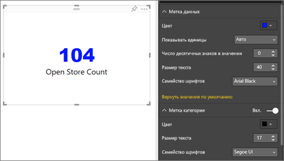
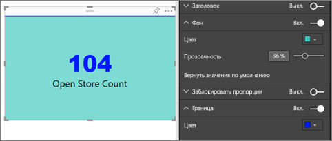

# Визуализации в виде карточек
Иногда на панели мониторинга или в отчете Power BI очень важно отслеживать одно число, например показатель общего объема продаж, долю на рынке в годовом исчислении или общее число возможных сделок. Такой тип визуализации называется *карточкой*. Как и практически все собственные визуализации Power BI, карточки можно создавать при помощи редактора отчетов или функции вопросов и ответов.

## Создание карточки с помощью редактора отчетов
Здесь используется пример "Анализ розничной торговли". Чтобы продолжить работу, [скачайте пример](../sample-datasets.md) для службы Power BI (app.powerbi.com) или Power BI Desktop.   

1. Откройте [пустую страницу отчета ](../power-bi-report-add-page.md) и выберите поле **Сохранение** \> **Open store count (Открыть счетчик сохранений)**. Если вы используете службу Power BI, нужно открыть отчет в [режиме правки](../service-interact-with-a-report-in-editing-view.md).

    Power BI создаст гистограмму с одним числом.

   
2. На панели "Визуализации" выберите значок карты.

   
6. Наведите указатель мыши на карточку и выберите значок булавки , чтобы добавить визуализацию на панель мониторинга.

   
7. Закрепите плитку на существующей или новой панели мониторинга.

   * Существующая информационная панель: выберите имя панели в раскрывающемся списке.
   * Новая информационная панель: введите имя новой панели.
8. Выберите **Закрепить**.

   Сообщение об успешном выполнении (рядом с правым верхним углом экрана) позволяет узнать, что визуализация была добавлена на панель мониторинга в качестве плитки.

   
9. Выберите **Перейти к панели мониторинга**. Здесь вы можете [изменить и переместить](../service-dashboard-edit-tile.md) закрепленную визуализацию.

## Создание карточки в поле вопроса функции "Вопросы и ответы"
Поле вопроса функции "Вопросы и ответы" — самый простой способ создания карточки. Поле вопроса функции "Вопросы и ответы" доступно в службе Power BI (app.powerbi.com) на панели мониторинга или в отчете. Ниже приведены инструкции по созданию карточки на панели мониторинга в службе Power BI. Чтобы создать карточку при помощи функции "Вопросы и ответы" в Power BI Desktop, [следуйте этим инструкциям](https://powerbi.microsoft.com/en-us/blog/power-bi-desktop-december-feature-summary/#QandA) для предварительной версии функции "Вопросы и ответы" в отчетах Desktop.

1. Создайте [панель мониторинга](../service-dashboards.md) и [получите данные](../service-get-data.md). Здесь используется пример [Анализ возможностей](../sample-opportunity-analysis.md).

1. В верхней части информационной панели начните вводить вопрос о данных в поле вопроса. 

   

>**СОВЕТ.** В отчете службы Power BI в [режиме правки](../service-reading-view-and-editing-view.md) выберите **Задать вопрос** в строке меню сверху. В отчете Power BI Desktop дважды щелкните пустую область, чтобы открыть поле вопроса.

3. Например, введите "количество возможных сделок".

   

   В поле вопроса предоставляются рекомендации и переформулировки, а также отображается общее число.  
4. В правом верхнем углу щелкните значок булавки , чтобы добавить карточку на панель мониторинга.

   
5. Закрепите карточку как плитку на существующей или новой панели мониторинга.

   * Существующая информационная панель: выберите имя панели в раскрывающемся списке. Вы сможете выбрать только информационные панели, доступные в текущей рабочей области.
   * "Новая информационная панель". Введите имя новой информационной панели, и она будет добавлена в текущую рабочую область.
6. Выберите **Закрепить**.

   Сообщение об успешном выполнении (в правом верхнем углу экрана) позволяет узнать, что визуализация была добавлена на панель мониторинга в виде плитки.  

   
7. Выберите **Перейти на информационную панель**, чтобы просмотреть новую плитку. Здесь вы можете [изменить имя или размер, добавить гиперссылку и переместить плитку, а также выполнить другие действия](../service-dashboard-edit-tile.md) на панели мониторинга.

   

## Рекомендации и устранение неполадок
- Если поле для вопроса не отображается, обратитесь к системному администратору или администратору клиента.    
- Если вы используете Desktop и после двойного щелчка пустой области в отчете окно "Вопросы и ответы" не открывается, возможно, потребуется включить эту функцию.  Выберите **Файл > Параметры и настройки > Параметры > Предварительная версия функций > Вопросы и ответы** и перезапустите Desktop.

## Форматирование карты
Для изменения меток, текста, цвета и многого другого есть много параметров. Лучший способ обучения — создать карту и ознакомиться с панелью форматирования. Здесь описаны только некоторые из доступных параметров. 

1. Для начала откройте панель форматирования, щелкнув значок кисти. 

    
2. Разверните элемент **Метка данных** и измените семейство шрифтов, размер и цвет. Если у вас тысячи магазинов, можно использовать элемент **Показывать единицы** для отображения числа магазинов в тысячах и управления десятичными разрядами. Например, можно отобразить 125,8 тыс. вместо 125 832,00.

3.  Разверните элемент **Метка категории** и измените цвет и размер.

    

4. Разверните элемент **Фон** и переместите ползунок в положение "Вкл.".  Теперь можно изменить цвет фона и уровень прозрачности.

    

5. Продолжайте изучать параметры форматирования, пока вы не измените свою карту так, как вам нужно. 

    

## Дальнейшие действия
[Плитки панели мониторинга в Power BI](../service-dashboard-tiles.md)

[Панели мониторинга в Power BI](../service-dashboards.md)

[Power BI — основные понятия](../service-basic-concepts.md)

Появились дополнительные вопросы? [Ответы на них см. в сообществе Power BI.](http://community.powerbi.com/)
