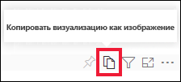

# Копирование и вставка визуализации отчета

[!INCLUDE[consumer-appliesto-yyyn](../includes/consumer-appliesto-yyyn.md)]

В этой статье описаны два разных способа копирования и вставки визуального элемента. 
* Копирование визуального элемента в отчете и вставка его на другой странице отчета (требуются разрешения на изменение отчета)

* Копирование изображения визуального элемента из Power BI в буфер обмена и вставка его в других приложениях

## Копирование и вставка в пределах одного отчета
Визуальные элементы в отчетах Power BI можно копировать с одной страницы отчета на ту же страницу или на другую страницу в одном отчете. 

Для копирования и вставки визуализации требуются разрешения изменять отчет. В службе Power BI это означает возможность открыть отчет в [режиме правки](../consumer/end-user-reading-view.md). 

Визуализации на *панелях мониторинга* нельзя копировать и вставлять в отчеты Power BI или другие панели мониторинга.

1. Откройте отчет, который содержит хотя бы одну визуализацию.  

2. Выберите визуализацию и используйте сочетание клавиш **CTRL + C** для копирования и **CTRL + V** для вставки.      

   

## Копирование визуального элемента в качестве изображения в буфер обмена

Возникала ли у вас когда-либо потребность поделиться изображением из отчета или панели мониторинга Power BI? Теперь вы можете скопировать визуальный элемент и вставить его в любое другое приложение, которое поддерживает вставку. 

При копировании статического изображения визуального элемента вы получаете его копию вместе с метаданными. Сюда относится следующие действия:
* ссылка на исходный отчет или панель мониторинга Power BI;
* название отчета или панели мониторинга;
* уведомление о наличии конфиденциальной информации на изображении;
* метка времени последнего обновления;
* фильтры, примененные к визуальному элементу.

### Копирование с плитки панели мониторинга

1. Перейдите к панели мониторинга, с которой необходимо выполнить копирование.

2. В правом верхнем углу визуального элемента щелкните **Дополнительные параметры (...)** и выберите пункт **Копировать визуализацию как изображение**. 

    

3. Когда откроется диалоговое окно **Визуальный элемент готов к копированию**, выберите команду **Копировать в буфер обмена**.

    

4. Когда визуальный элемент будет готов, вставьте его в другое приложение, нажав клавиши **CTRL + V** или выбрав команду "Вставить" в контекстном меню. На приведенном ниже снимке экрана визуальный элемент был вставлен в Microsoft Word. 

    

### Копирование из визуального элемента отчета 

1. Перейдите к отчету, из которого необходимо выполнить копирование.

2. В правом верхнем углу визуального элемента щелкните значок **Копировать визуализацию как изображение**. 

    

3. Когда откроется диалоговое окно **Визуальный элемент готов к копированию**, выберите команду **Копировать в буфер обмена**.

    

4. Когда визуальный элемент будет готов, вставьте его в другое приложение, нажав клавиши **CTRL + V** или выбрав команду "Вставить" в контекстном меню. На приведенном ниже снимке экрана визуальный элемент был вставлен в сообщение электронной почты.

    

5. Если к отчету применена метка конфиденциальности данных, то при выборе значка копирования появится предупреждение.  

    

    Метка конфиденциальности будет добавлена к метаданным под вставленным визуальным элементом. 

    

### Управление возможностью копирования визуального элемента как изображения
Если вы являетесь владельцем содержимого или администратором клиента, то можете управлять возможностью копирования визуального элемента из отчета или панели мониторинга в качестве изображения.

#### Отключение копирования в качестве изображения для определенного визуального элемента
Чтобы запретить пользователям копирование определенного визуального элемента, можно удалить для него значок копирования.
1. Откройте панель форматирования, щелкнув значок валика. 

1. Откройте карточку **визуального форматирования**.
1. Прокрутите содержимое вниз до карточки **Заголовок визуального элемента**, разверните ее и отключите параметр **Значок копирования**.

    

1. Если вы не можете найти параметр **Заголовок визуального элемента**, включите современный визуальный заголовок в разделе **Параметры отчета**. 

    

1. Сохраните изменения. При необходимости снова предоставьте общий доступ и повторно опубликуйте отчет.

#### Отключение копирования в качестве изображения для группы пользователей

Если вы являетесь владельцем содержимого или администратором клиента, то можете управлять тем, кто может копировать визуальные элементы. Этот параметр блокирует возможность *копирования визуальных элементов в качестве изображений* для всего содержимого, доступного пользователям в клиенте Power BI.
  
1. Перейдите на портал администрирования.

1. В **параметрах клиента** выберите раздел **Параметры экспорта и совместного доступа**. 

    

1. Отключите параметр **Копирование и вставка визуальных элементов** для выбранных групп пользователей. 

1. Сохраните изменения. После этого указанные группы не смогут использовать команду **Копировать визуализацию как изображение** в Power BI. 
  

## Рекомендации и устранение неполадок

   

Вопрос. Почему значок копирования отключен на визуальном элементе?    
Ответ. В настоящее время поддерживаются собственные визуальные элементы Power BI и сертифицированные визуальные элементы. Поддержка ограничена для некоторых визуальных элементов, в том числе следующих. 
- ESRI и другие визуальные элементы карт 
- Визуализация с помощью инструментов Python 
- Визуальные элементы R 
- PowerApps 
- Несертифицированные пользовательские визуальные элементы. Чтобы узнать, как обеспечить поддержку своего пользовательского визуального элемента, см. статью [Получите сертификацию для визуального элемента Power BI](../developer/visuals/power-bi-custom-visuals-certified.md). 

Вопрос. Почему визуальный элемент вставляется неправильно?    
Ответ. На копирование визуальных элементов в качестве изображений налагается ряд ограничений. 
- Пользовательские визуальные элементы: 
    - визуальные элементы с примененными темами и цветами; 
    - масштабирование плиток при вставке; 
    - пользовательские визуальные элементы с анимацией. 
- Ограничения при вставке: 
    - нельзя скопировать недавно закрепленную плитку панели мониторинга; 
    - нельзя перенаправлять пользователей к содержимому с фильтрами OData и закрепленным состоянием, например личным закладкам. 
- В приложениях с ограниченной поддержкой вставки содержимого в формате HTML из буфера обмена может отображаться не все скопированное содержимое визуального элемента. 

## Дальнейшие действия
Подробнее о [визуализациях в отчетах Power BI](power-bi-report-visualizations.md).

Появились дополнительные вопросы? [Ответы на них см. в сообществе Power BI.](https://community.powerbi.com/)

