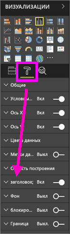
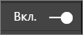
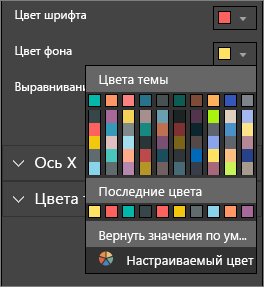
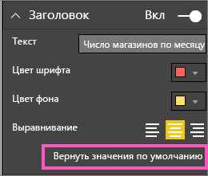
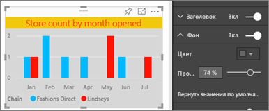
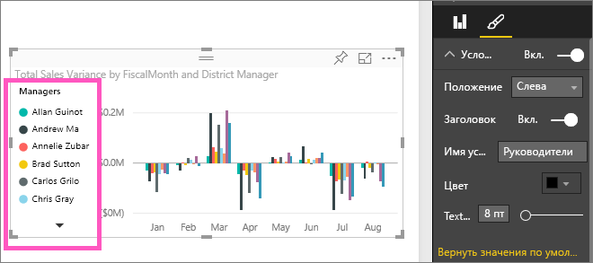

# Настройка заголовков визуализаций, условных обозначений и фона

В этом руководстве описано несколько способов настройки визуализации. Существует так много вариантов настройки визуализации. Лучший способ изучить их всех — ознакомиться с областью **форматирования** (выберите значок валика). Из этой статьи вы узнаете, как приступить к работе и настроить заголовок визуализации, условные обозначения и фон.

Не удается настроить все визуализации. Чтобы узнать больше сведений о визуализации, см. [полный список](#visualization-types-that-you-can-customize).

Перейдите к видео на 4:50, где показано, как настроить визуализацию.

<iframe width="560" height="315" src="https://www.youtube.com/embed/IkJda4O7oGs" frameborder="0" allowfullscreen></iframe>

Теперь сделайте то же самое в соответствии с приведенными ниже инструкциями, используя свои данные.

## Предварительные требования

- Служба Power BI или Power BI Desktop

- Пример отчета "Анализ розничной торговли"

## Настройка заголовка визуализации в отчете

Чтобы продолжить, войдите [в службу Power BI](https://app.powerbi.com) и откройте [пример отчета "Анализ розничной торговли"](../sample-datasets.md) в представлении [изменения отчета](../service-interact-with-a-report-in-editing-view.md).

> [!NOTE]
> При закреплении визуализации на информационной панели она становится плиткой. Для самой плитки можно также настроить [подпись, подзаголовок, гиперссылку, а также изменить ее размер](../service-dashboard-edit-tile.md).

1. Перейдите на страницу **Новые магазины** примера отчета **Анализ розничной торговли**.

1. Выберите гистограмму с группировкой **Количество открытых магазинов по месяцу открытия и сетям магазинов**.

1. В области **визуализации** выберите значок валика для отображения параметров форматирования.

1. Выберите **Заголовок**, чтобы развернуть этот раздел.

   

1. Переместите ползунок **Заголовок** в положение **Вкл.** .

   

1. Измените текст заголовка, введя *Количество магазинов по месяцам открытия* в поле **Текст заголовка**.

1. Измените **цвет шрифта** на оранжевый, а **цвет фона** — на желтый.

    1. Щелкните раскрывающийся список и выберите цвет в одном из разделов: **Цвета темы**, **Последние цвета**, **Дополнительный цвет**.

        

    1. Щелкните раскрывающийся список, чтобы закрыть окно цвета.

       Сохраните текущие изменения.

       Если вам когда-либо понадобится отменить все изменения, вы можете вернуться к цветам по умолчанию, выбрав **Вернуть цвет по умолчанию** в окне цвета.

1. Увеличьте размер шрифта до **12 пт**.

1. Последняя настройка, которую вы выполните с заголовком диаграммы, — выровняете его по центру визуализации.

    

Сейчас заголовок вашей гистограммы с группировкой будет выглядеть примерно так:

Сохраните внесенные изменения и перейдите к следующему разделу.

Если вы захотите отменить все изменения, нажмите кнопку **Вернуть значения по умолчанию** в нижней части панели настройки **заголовка**.

## Настройка цвета фона визуализации

Для этой же гистограммы с группировкой разверните параметры **фона**.

1. Переместите ползунок **фона** в положение **Вкл.** .

1. Выберите серый цвет в раскрывающемся списке.

1. Измените **прозрачность** до **74 %** .

Сейчас фон вашей гистограммы с группировкой будет выглядеть примерно так:

Сохраните внесенные изменения и перейдите к следующему разделу.

Если вы захотите отменить все изменения, нажмите кнопку **Вернуть значения по умолчанию** в нижней части панели настройки **фона**.

## Настройка условных обозначений визуализации

1. Откройте страницу отчета **Обзор** и выберите диаграмму **Разница в общем объеме продаж по FiscalMonth и региональным менеджерам**.

1. Откройте панель **форматирования**, щелкнув значок валика.

1. Разверните параметры **условных обозначений**:

      

1. Переместите ползунок **условных обозначений** в положение **Вкл.** .

1. Расположение условные обозначения слева от визуализации.

1. Добавьте заголовок условных обозначений путем переключения **заголовка** в положение **Вкл.** .

1. Введите *Диспетчеры* в поле **Имя условных обозначений**.

Сейчас условные обозначения вашей гистограммы с группировкой будут выглядеть примерно так:

Сохраните внесенные изменения и перейдите к следующему разделу.

Если вы захотите отменить все изменения, нажмите кнопку **Вернуть значения по умолчанию** в нижней части панели настройки **условных обозначений**.

## Типы визуализации, которые вы можете настроить

Ниже приведены список визуализаций и параметры настроек, доступных для каждого пользователя:

| Визуализация | Заголовок | Фон | Условные обозначения |
|:--- |:--- |:--- |:--- |
| С областями | да | да |да |
| Линейчатая | да | да |да |
| Карточка | да | да |Н/Д |
| Многострочная карточка | да | да | Н/Д |
| Столбец | да | да | да |
| Комбинированная | да | да | да |
| кольцевой график; | да | да | да |
| Картограмма | да | да | да |
| Воронкообразная диаграмма | да | да | Н/Д |
| Индикаторная диаграмма | да | да | Н/Д |
| КПЭ | да | да | Н/Д |
| Линия | да | да | да |
| Карта | да | да | да |
| Матрица | да | да | Н/Д |
| Круговая | да | да | да |
| Точечная диаграмма | да | да | да |
| Срез | да | да | Н/Д |
| Таблица | да | да | Н/Д |
| Текстовое поле | нет | да | Н/Д |
| Диаграмма-дерево | да | да | да |
| Каскадная диаграмма | да | да | да |

## Дальнейшие действия

- [Настройка свойств осей X и Y](power-bi-visualization-customize-x-axis-and-y-axis.md)

- [Начало работы с форматированием цветом и свойствами осей](service-getting-started-with-color-formatting-and-axis-properties.md)

- [Основные понятия для потребителей службы Power BI](../consumer/end-user-basic-concepts.md)

Появились дополнительные вопросы? [Ответы на них см. в сообществе Power BI.](http://community.powerbi.com/)
