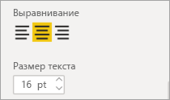

# Настройка заголовков визуализаций, фона и условных обозначений

В этом руководстве описано несколько способов настройки визуализации. Существует так много вариантов настройки визуализации. Лучший способ изучить их всех — ознакомиться с областью **форматирования** (выберите значок валика). Из этой статьи вы узнаете, как приступить к работе и настроить заголовок визуализации, условные обозначения и фон, а также добавить тему.

Не удается настроить все визуализации. Чтобы узнать больше сведений о визуализации, см. [полный список](#visualization-types-that-you-can-customize).

## Предварительные требования

- Служба Power BI или Power BI Desktop

- Пример отчета "Анализ розничной торговли"

## Настройка заголовка визуализации в отчете

Чтобы продолжить, войдите в Power BI Desktop и откройте отчет [Анализ розничной торговли](../sample-datasets.md).

> [!NOTE]
> При закреплении визуализации на информационной панели она становится плиткой. Для самой плитки можно также настроить [подпись, подзаголовок, гиперссылку, а также изменить ее размер](../service-dashboard-edit-tile.md).

1. Перейдите на страницу **Новые магазины** примера отчета **Анализ розничной торговли**.

1. Выберите гистограмму с группировкой **Количество открытых магазинов по месяцу открытия и сетям магазинов**.

1. В области **визуализации** выберите значок валика для отображения параметров форматирования.

1. Выберите **Заголовок**, чтобы развернуть этот раздел.

   

1. Переместите ползунок **Заголовок** в положение **Вкл.** .

1. Измените текст заголовка, введя *Количество магазинов по месяцам открытия* в поле **Текст заголовка**.

    

1. Измените **цвет шрифта** на белый, а **цвет фона** — на синий.    

    а. Щелкните раскрывающийся список и выберите цвет в одном из разделов: **Цвета темы**, **Последние цвета**, **Дополнительный цвет**.
    
    

    б. Щелкните раскрывающийся список, чтобы закрыть окно цвета.

1. Увеличьте размер шрифта до **16 пт**.

1. Последняя настройка, которую вы выполните с заголовком диаграммы, — выровняете его по центру визуализации.

    

    Сейчас заголовок вашей гистограммы с группировкой будет выглядеть примерно так:

    

Сохраните внесенные изменения и перейдите к следующему разделу.

Если вы захотите отменить все изменения, нажмите кнопку **Вернуть значения по умолчанию** в нижней части панели настройки **заголовка**.

## Настройка цвета фона визуализации

Для этой же гистограммы с группировкой разверните параметры **фона**.

1. Переместите ползунок **фона** в положение **Вкл.** .

1. Выберите серый цвет в раскрывающемся списке.

1. Измените **прозрачность** до **74 %** .

Сейчас фон вашей гистограммы с группировкой будет выглядеть примерно так:

Сохраните внесенные изменения и перейдите к следующему разделу.

Если вы захотите отменить все изменения, нажмите кнопку **Вернуть значения по умолчанию** в нижней части панели настройки **фона**.

## Настройка условных обозначений визуализации

1. Откройте страницу отчета **Обзор** и выберите диаграмму **Разница в общем объеме продаж по FiscalMonth и региональным менеджерам**.

1. Откройте панель **форматирования**, щелкнув значок валика.

1. Разверните параметры **условных обозначений**:

    

1. Переместите ползунок **условных обозначений** в положение **Вкл.** .

1. Расположение условные обозначения слева от визуализации.

1. Добавьте заголовок условных обозначений путем переключения **заголовка** в положение **Вкл.** .

1. В поле **Имя условных обозначений** введите *Руководитель*.

1. Измените **цвет** на черный.

Сохраните внесенные изменения и перейдите к следующему разделу.

Если вы захотите отменить все изменения, нажмите кнопку **Вернуть значения по умолчанию** в нижней части панели настройки **условных обозначений**.

## Настройка цветов с помощью темы

С помощью тем отчета можно применить изменения макета ко всему отчету, например использовать корпоративные цвета, изменить наборы значков или применить новое визуальное форматирование по умолчанию. При применении темы отчета для всех визуальных элементов в отчете используются цвета и форматирование из выбранной темы.

Чтобы применить тему к отчету, в строке меню выберите команду **Переключить тему**. Выберите тему.  В приведенном ниже отчете используется тема **Солнечная**.

 

## Типы визуализации, которые вы можете настроить

Ниже приведены список визуализаций и параметры настроек, доступных для каждого пользователя:

| Визуализация | Название | Фон | Условные обозначения |
|:--- |:--- |:--- |:--- |
| С областями | да | да |да |
| Линейчатая | да | да |да |
| Карточка | да | да |Н/Д |
| Многострочная карточка | да | да | Н/Д |
| Столбец | да | да | да |
| Комбинированная | да | да | да |
| кольцевой график; | да | да | да |
| Картограмма | да | да | да |
| Воронкообразная диаграмма | да | да | Н/Д |
| Индикаторная диаграмма | да | да | Н/Д |
| Ключевой фактор влияния | да | да | Н/Д |
| КПЭ | да | да | Н/Д |
| Линия | да | да | да |
| Карта | да | да | да |
| Матрица | да | да | Н/Д |
| Круговая | да | да | да |
| Вопросы и ответы | да | да | Н/Д |
| Точечная диаграмма | да | да | да |
| Фигура | да | да | да |
| Срез | да | да | Н/Д |
| Таблица | да | да | Н/Д |
| Текстовое поле | нет | да | Н/Д |
| Диаграмма-дерево | да | да | да |
| Каскадная диаграмма | да | да | да |

## Дальнейшие действия

- [Настройка свойств осей X и Y](power-bi-visualization-customize-x-axis-and-y-axis.md)

- [Начало работы с форматированием цветом и свойствами осей](service-getting-started-with-color-formatting-and-axis-properties.md)

Появились дополнительные вопросы? [Ответы на них см. в сообществе Power BI.](https://community.powerbi.com/)
