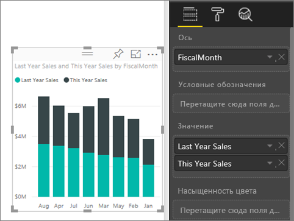
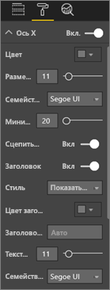
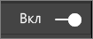
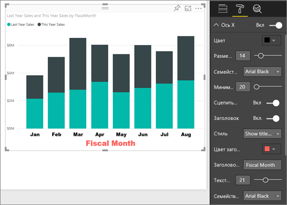
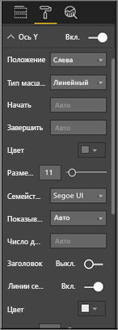
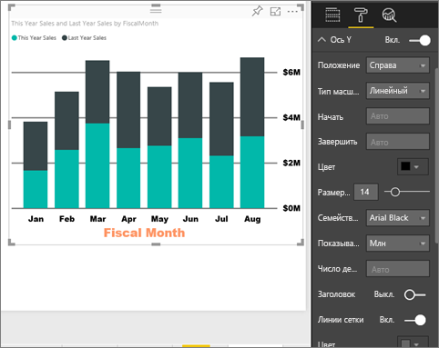
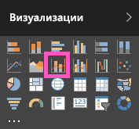
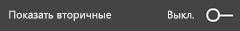
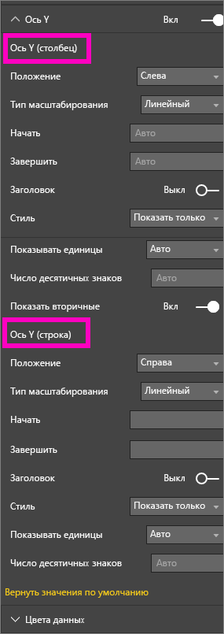
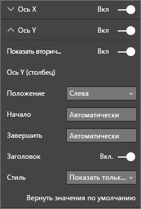

# Настройка свойств осей X и Y
В этом руководстве вы узнаете о различных способах настройки оси X и оси Y визуальных элементов. Не все визуальные элементы имеют оси, и не все они могут быть настроены. Например, круговые диаграммы не имеют осей. Варианты настройки отличаются в зависимости от визуальных элементов. Этих вариантов слишком много, чтобы описать их в одной статье. Поэтому мы рассмотрим некоторые наиболее часто используемые варианты настройки осей, чтобы вы могли уверенно использовать вкладку форматирования визуальных элементов на холсте отчетов Power BI.  

> [!NOTE]
> Информация на этой странице относится к службе Power BI и к Power BI Desktop. Эти настройки, доступ к которым можно получить, щелкнув значок **форматирования** (значок с изображением валика ), также имеются в Power BI Desktop.  
>
>

Узнайте, как Аманда настраивает оси X и Y, а также управляет объединением при переходах между уровнями детализации. Затем сделайте то же самое в соответствии с пошаговыми инструкциями, приведенными под видео, используя пример "Анализ розничной торговли".

<iframe width="560" height="315" src="https://www.youtube.com/embed/9DeAKM4SNJM" frameborder="0" allowfullscreen></iframe>

## Настройка оси X визуализации в отчетах
## Создание диаграммы с накоплением
Войдите в службу Power BI и откройте пример отчета **Анализ розничной торговли** в [режиме редактирования](../service-interact-with-a-report-in-editing-view.md). Для продолжения работы [подключитесь к примеру "Анализ розничной торговли"](../sample-datasets.md).

1. Создайте гистограмму, отображающую значение выручки за текущий и прошлый года по финансовым месяцам.
2. Преобразуйте ее в гистограмму с накоплением.

    

## Настройка оси X
1. В области Visualizations and Filters (Визуализации и фильтры) щелкните значок **форматирования** (значок с изображением валика ), чтобы отобразить параметры настройки.
2. Разверните параметры оси X.

   
3. Для включения или отключения оси X используйте ползунок "Вкл." или "Выкл." Пока оставьте значение **Вкл.**  Одна из причин, по которым может понадобиться отключить ось Y, — освобождение пространства для других данных.

    
4. Отформатируйте цвет, размер и шрифт текста. В этом примере для **цвета текста** мы задали черный, для **размера текста** — значение 14 и для **шрифта** — Arial Black.  
5. Установите для заголовка оси X значение **Вкл.** и отобразите имя оси X, в нашем примере — **ФинМесяц**.  
6. Отформатируйте цвет, размер и шрифт заголовка.  В этом примере для **цвета заголовка** мы задали оранжевый, изменили **заголовок оси** на **Финансовый месяц** и установили для **размера текста заголовка** значение 21.
7. Чтобы отсортировать по финансовому месяцу, щелкните многоточие (...) в правом верхнем углу диаграммы и выберите **Сортировать по финансовому месяцу**.

    После этих настроек гистограмма должна выглядеть примерно так:

     

Чтобы отменить все сделанные настройки оси X, нажмите кнопку **Вернуть значения по умолчанию** в нижней части панели настройки **Ось X**.

## Настройка оси Y
1. Разверните параметры оси Y.

   

2. Для включения или отключения оси Y используйте ползунок "Вкл." или "Выкл." Пока оставьте значение **Вкл.**  Одна из причин, по которым может понадобиться отключить ось Y, — освобождение пространства для других данных.
   
    
3. Задайте для параметра **Положение** оси Y значение "Справа".
4. Отформатируйте цвет, размер и шрифт текста. В этом примере для **цвета текста** мы задали черный, для **размера текста** — значение 14 и для **шрифта** — Arial Black.  
5. Оставьте для параметра **Отображаемые единицы** значение "Млн", а для **Число десятичных знаков для значений** — 0.
6. Заголовок оси Y не улучшит эту визуализацию, поэтому не включайте параметр **Заголовок**.  
7. Давайте выделим линии сетки, изменив **цвет** на темно-серый и увеличив **ширину штриха** до двух.

    После этих настроек гистограмма должна выглядеть примерно так:

     

## Настройка визуализаций с двумя осями Y
Для начала создайте комбинированную диаграмму, отображающую, какое влияние на выручку имеет количество магазинов.  Это та же самая диаграмма, создание которой описано в разделе [Учебник. Комбинированная диаграмма](power-bi-visualization-combo-chart.md). После этого вы настроите диаграмму с двумя осями Y.

### Создание диаграммы с двумя осями Y
1. Создайте график для отслеживания параметра **Продажи > Процент валовой прибыли за прошлый год** по периоду **Время > ФинМесяц**.
2. Отсортируйте визуальные элементы по месяцам, нажав кнопку с многоточием (…) и выбрав пункт **Sort by Month** (Сортировать по месяцам).

    

    > [NOTE]: For help sorting by month, see [sorting by other criteria](../consumer/end-user-change-sort.md#other)

    В январе процент валовой прибыли составил 35 %, в апреле вырос до 45 %, в июле упал, а в августе снова подскочил. Похожа ли эта картина на данные за предыдущий год?
     
3. Добавьте к графику показатели **This Year Sales (Выручка за этот год) > Значение** и **Last Year Sales** (Выручка за прошлый год). Масштаб показателя **Процент валовой прибыли за прошлый год** (синяя линия, которая проходит по линии сетки 0% прибыли) намного меньше, чем масштаб показателя **Продажи**, что усложняет сравнение. К тому же проценты меток оси Y выглядят странно.      

    

5. Чтобы упростить чтение и понимание визуального элемента, преобразуйте график в линейную гистограмму и гистограмму с накоплением.

   

6. Перетащите параметр **Gross Margin Last Year %** (% валовой прибыли за прошлый год) из области **Значения столбцов** в область **Значения строк**. Теперь у нас есть созданная ранее гистограмма с накоплением ***и*** график.  При необходимости воспользуйтесь инструкциями выше, чтобы отформатировать цвет и размер шрифта оси.
   
   Power BI создаст две оси, позволяя тем самым по-разному отображать шкалы наборов данных: левая ось служит для отображения объемов продаж, а правая — для процентов.

   

### Форматирование вспомогательной оси Y
1. В области **Визуализации** щелкните значок валика для отображения параметров настройки.    
2. Разверните параметры оси Y, выбрав стрелку "вниз".    
3. Прокручивайте список, пока не найдете параметры **Показать вторичные**. Измените положение переключателя **Показать вторичные** с **Выкл.** на **Вкл.**    

   

   

4. (Необязательно) Настройте обе оси. Если изменить значение параметра **Положение** для оси столбцов или линии строк, обе оси изменят свое положение.

   

### Добавление подписей к обеим осям
Поскольку визуализация оказалась довольно сложной, будет полезно добавить к осям подписи.  Подписи помогут вашим коллегам понять информацию, представляемую визуализацией.

1. Установите переключатель **Заголовок** в положение **Вкл.** для параметров **Ось Y (столбец)** и **Ось Y (строка)**.
2. Для параметра **Стиль** установите параметр **Показывать только подпись**.

       
3. На комбинированной диаграмме теперь отображаются две оси с заголовками.

   

Дополнительные сведения см. в разделе [Советы и рекомендации по настройке цветов, подписей и свойств осей](service-tips-and-tricks-for-color-formatting.md).

## Рекомендации и устранение неполадок
Если владелец отчета присвоил оси X тип Date, отобразится параметр **Тип**, и вы сможете выбрать один из вариантов — "Постоянная" или "Категориальная".

## Дальнейшие действия
Подробнее о [визуализациях в отчетах Power BI](power-bi-report-visualizations.md).

[Настройка подписей, фона и условных обозначений](power-bi-visualization-customize-title-background-and-legend.md)

[Настройка цветов и свойств оси](service-getting-started-with-color-formatting-and-axis-properties.md)

[Power BI — основные понятия](../consumer/end-user-basic-concepts.md)

Появились дополнительные вопросы? [Ответы на них см. в сообществе Power BI.](http://community.powerbi.com/)
