- где находится линия валовой прибыли по годам в процентах? Я могу использовать несколько линейчатых диаграмм, но не несколько графиков.

# Настройка свойств осей X и Y

[!INCLUDE [power-bi-visuals-desktop-banner](../includes/power-bi-visuals-desktop-banner.md)]

В этом учебнике вы узнаете о различных способах настройки осей X и Y для визуальных элементов. Не все визуальные элементы имеют оси. Например, круговые диаграммы не имеют их. Варианты настройки отличаются в зависимости от визуальных элементов. Этих вариантов слишком много, чтобы описать их в одной статье, поэтому мы рассмотрим некоторые наиболее часто используемые варианты настройки, чтобы вы могли уверенно использовать панель **форматирования** визуальных элементов на холсте отчетов Power BI.  

В следующем видео Аманда настраивает оси X и Y. Она также будет демонстрировать различные способы управления объединением при использовании детализации углублением и обобщением.

> [!NOTE]
> В этом видео используется более старая версия Power BI.

<iframe width="560" height="315" src="https://www.youtube.com/embed/9DeAKM4SNJM" frameborder="0" allowfullscreen></iframe>

## Предварительные требования

- Power BI Desktop

- [Пример "Анализ розничной торговли"](https://download.microsoft.com/download/9/6/D/96DDC2FF-2568-491D-AAFA-AFDD6F763AE3/Retail%20Analysis%20Sample%20PBIX.pbix).

## Добавление новой визуализации

Перед настройкой визуализации необходимо создать ее.

1. Откройте пример"Анализ розничной торговли" в Power BI Desktop.  

2. В нижней части экрана щелкните желтый значок плюса, чтобы добавить новую страницу. 

    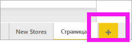

1. На панели **Визуализации** выберите значок гистограммы с накоплением. При этом на холст отчета добавляется пустой шаблон.

    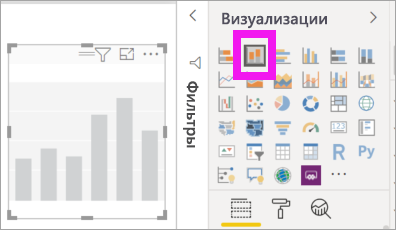

1. Чтобы задать значения по оси X, в области **Поля** выберите **Время** > **Фин.Месяц**.

1. Чтобы настроить значения по оси Y, в области **Поля** выберите **Продажи** > **Last Year Sales** (Продажи за прошлый год) и **Продажи** > **This Year Sales** (Продажи за этот год) > **Значение**.

    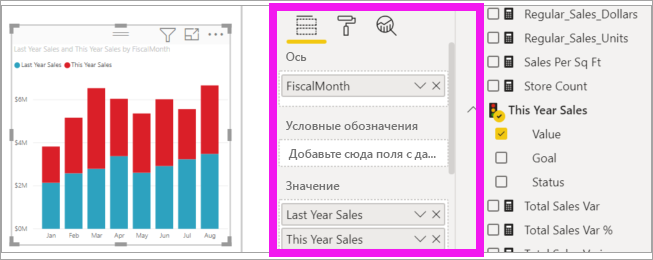

    Теперь можно настроить ось Х. Power BI предоставляет практически неограниченные варианты форматирования визуализации. 

## Настройка оси X
Существует множество свойств и компонентов, которые можно настроить для оси X. Вы можете добавлять и изменять метки данных и заголовок оси X. Для категорий можно изменить ширину, размер и заполнение гистограмм, столбцов, линий и областей. Для значений можно изменять отображаемые единицы, количество десятичных знаков и линии сетки. В следующем примере показана настройка гистограммы. Давайте добавим несколько настроек, чтобы помочь вам ознакомиться с некоторыми параметрами. Остальные вы сможете изучить самостоятельно.

### Настройка меток оси X
Метки оси X отображаются под столбцами диаграммы. Сейчас они светло серые и небольшого размера. Их трудно прочитать. Давайте изменим это.

1. В области **Визуализации** выберите **значок форматирования** (с изображением валика ), чтобы отобразить параметры настройки.

2. Разверните параметры оси X.

   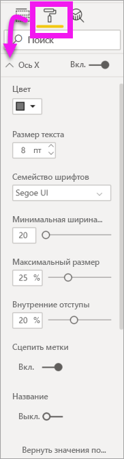

3. Переместите ползунок **Ось X** в положение **Вкл.**

    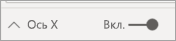

    Этот ползунок может понадобиться переместить в положение **Выкл.** по таким причинам: если визуализация понятна без меток или если имеется переполненная страница отчета и требуется освободить место для отображения дополнительных данных.

4. Отформатируйте цвет, размер и шрифт текста:

    - **Цвет**: выберите черный.

    - **Размер текста**: введите *14*.

    - **Семейство шрифтов**: выберите **Arial Black**.

    - **Внутренние отступы**: введите *40 %* .

        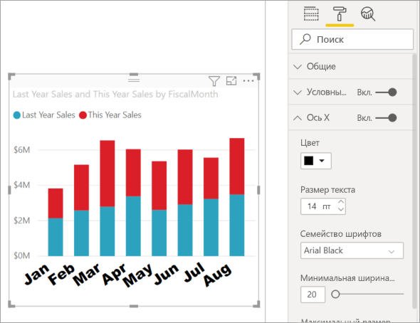
    
5. Возможно, вам не нравится, что текст на оси X отображается по диагонали. У вас есть несколько вариантов. 
    - Настройте меньший размер текста (меньше 14).
    - Увеличьте визуализацию. 
    - Отобразите меньшее число столбцов и добавьте полосу прокрутки, увеличив **минимальную ширину категории**. 
    
    Здесь мы выбрали второй вариант и потянули одну из полос изменения размера, чтобы расширить визуализацию. Теперь в нее помещается текст с размером 14 без необходимости отображать его в наклоненном состоянии или с полосой прокрутки. 

   

### Настройка заголовка оси X
Если заголовок оси X **включен**, то он отображается под метками оси X. 

1. Для начала переместите ползунок заголовка оси X в положение **Вкл.**  

    

    Вы сразу заметите, что в визуализации для оси X отображается заголовок по умолчанию.  В этом случае это **ФинМесяц**.

   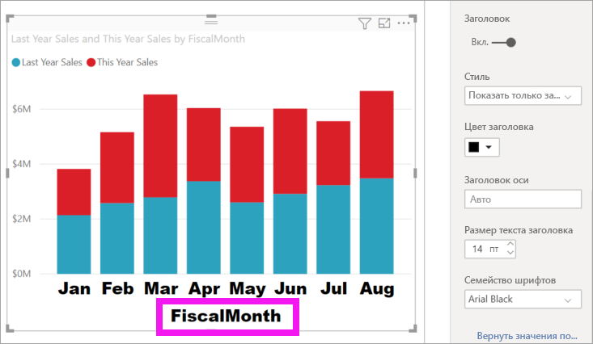

1. Отформатируйте цвет, размер и шрифт заголовка:

    - **Цвет заголовка**: выберите оранжевый цвет.

    - **Заголовок оси**: введите *Финансовый месяц* (с пробелом).

    - **Размер текста заголовка**: введите *18*.

    После завершения настройки гистограмма с накоплением будет выглядеть следующим образом:

    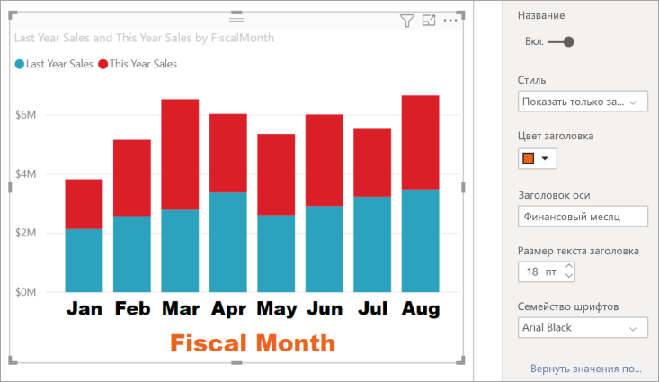

1. Сохраните внесенные изменения и перейдите к следующему разделу. Если вы захотите отменить все изменения, нажмите кнопку **Вернуть значения по умолчанию** в нижней части панели настройки **Ось X**. Теперь мы настроим ось Y.

## Настройка оси Y
Существует множество свойств и компонентов, которые можно настроить для оси Y. Вы можете добавлять и изменять метки данных, заголовок оси Y и линии сетки. Для значений можно изменять отображаемые единицы, количество десятичных знаков, начальную точку и конечную точку. Для категорий можно изменить ширину, размер и заполнение гистограмм, столбцов, линий и областей. 

В следующем примере мы продолжаем настраивать нашу гистограмму. Давайте внесем несколько изменений, чтобы вы могли ознакомиться с дополнительными параметрами. Остальные вы сможете изучить самостоятельно.

### Настройка меток оси Y
Метки оси Y по умолчанию отображаются слева. Сейчас они светло серые и небольшого размера. Их трудно прочитать. Давайте изменим это.

1. Разверните параметры оси Y.

   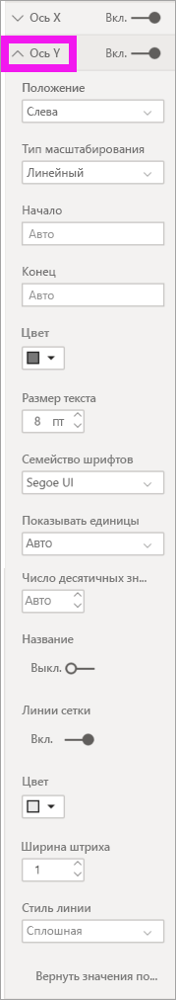

1. Переместите ползунок **Ось Y** в положение **Вкл.**  

    

    Одна из причин, по которым может понадобиться отключить ось Y, — освобождение пространства для других данных.

1. Отформатируйте цвет, размер и шрифт текста:

    - **Цвет**: выберите черный.

    - **Размер текста**: введите *10*.

    - **Отображаемые единицы**: выберите **Миллионы**.

    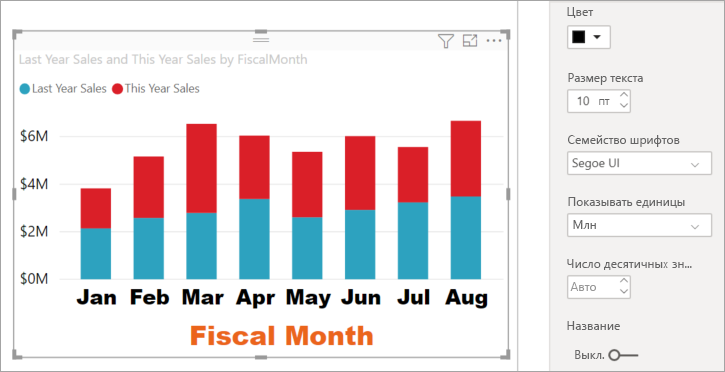

### Настройка заголовка оси Y
Если заголовок оси Y **включен**, то он отображается рядом с метками оси Y. Заголовок оси Y не улучшит эту визуализацию, поэтому не **включайте** параметр **Заголовок**. Далее в этом учебнике мы добавим заголовки осей Y к визуализации с двумя осями. 

### Настройка линий сетки
Давайте выделим линии сетки, изменив цвет и увеличив ширину штриха:

- **Цвет**: выберите оранжевый цвет.

- **Ширина штриха**: введите *2*.

После этих настроек гистограмма должна выглядеть примерно так:

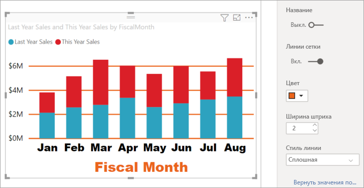

## Настройка визуализаций с двумя осями Y

В некоторых визуализациях полезно использовать две оси Y. Комбинированные диаграммы являются хорошим примером. Прежде чем можно будет форматировать две оси Y, мы создадим комбинированную диаграмму, которая сравнивает тенденции продаж и валовой прибыли.  

### Создание диаграммы с двумя осями Y

1. Выберите комбинированную диаграмму и измените ее тип на *График и гистограмма с накоплением*. Этот тип визуального элемента поддерживает одно значение графика и несколько значений столбцов с накоплением. 

    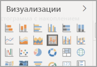
   

2. Перетащите пункты **Продажи** > **Gross Margin Last Year %** (Процент валовой прибыли за прошлый год) с области "Поля" в контейнер **Значения строк**.

    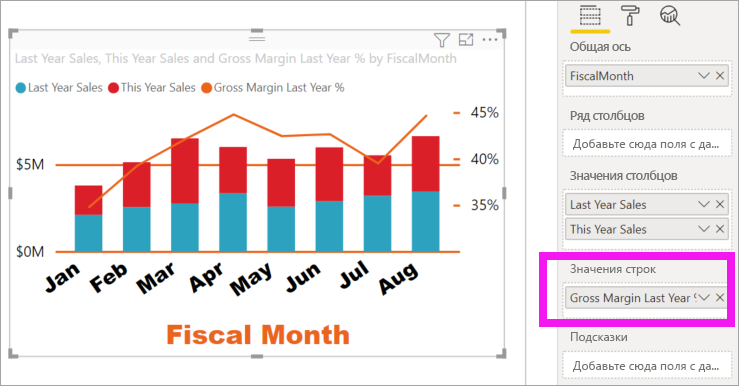

    
3. Переформатируйте визуализацию, чтобы удалить наклоненные метки оси X. 

   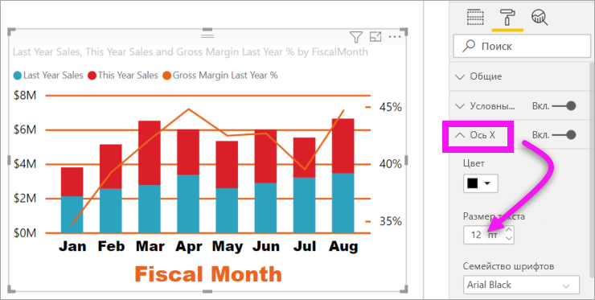

   Power BI создаст две оси Y, позволяя масштабировать значения по-разному. Левая ось служит для отображения объема продаж в долларах, а правая — для валовой прибыли в процентах.

### Форматирование вспомогательной оси Y
Так как мы начали с визуализации с одной отформатированной осью Y, служба Power BI создала вторую ось Y, используя те же параметры. Но это можно изменить. 

1. В области **Визуализации** выберите значок валика для отображения параметров форматирования.

1. Разверните параметры оси Y.

1. Прокрутите вниз, пока не найдете параметр **Показать вторичные**. Убедитесь, что он **включен**. Вспомогательная ось Y представляет график.

   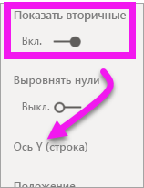

1. (Необязательно.) Настройте цвет шрифта, размер и отображаемые единицы для двух осей. Если изменить значение параметра **Положение** для оси столбцов или линии строк, обе оси изменят свое положение.

### Добавление подписей к обеим осям

В случае сложной визуализации полезно добавить к осям подписи.  Подписи помогут вашим коллегам понять информацию, представляемую визуализацией.

1. Установите переключатель **Заголовок** в положение **Вкл.** для параметров **Ось Y (столбец)** и **Ось Y (строка)** .

1. Для параметра **Стиль** установите значение **Показывать только заголовок** для обоих осей.

   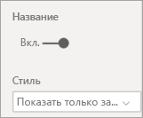

1. На комбинированной диаграмме теперь отображаются две оси с заголовками.

   

1. Отформатируйте заголовки. В этом примере мы сократили один из заголовков и уменьшили размер шрифта для обоих. 
    - Размер шрифта: **9**.
    - Мы сократили **заголовок оси** для первой оси Y (гистограммы): "Продажи за этот год и за прошлый год".

    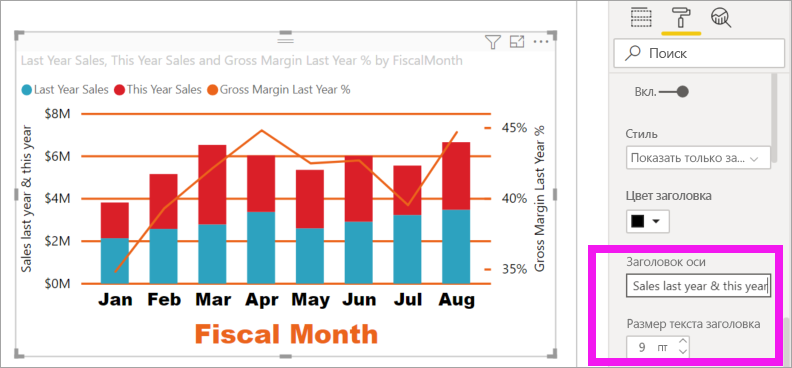

Дополнительные сведения см. в статьях [Советы и рекомендации по форматированию цветом в Power BI](service-tips-and-tricks-for-color-formatting.md) и [Настройка заголовков визуализации, условных и фоновых обозначений](power-bi-visualization-customize-title-background-and-legend.md). Вскоре будут добавлены обновления, касающиеся форматирования заголовков. 

## Дальнейшие действия

- [Визуализации в отчетах Power BI](power-bi-report-visualizations.md)

Появились дополнительные вопросы? [Ответы на них см. в сообществе Power BI.](https://community.powerbi.com/)
