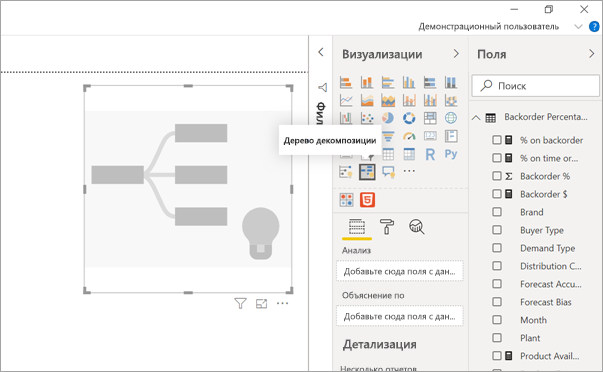
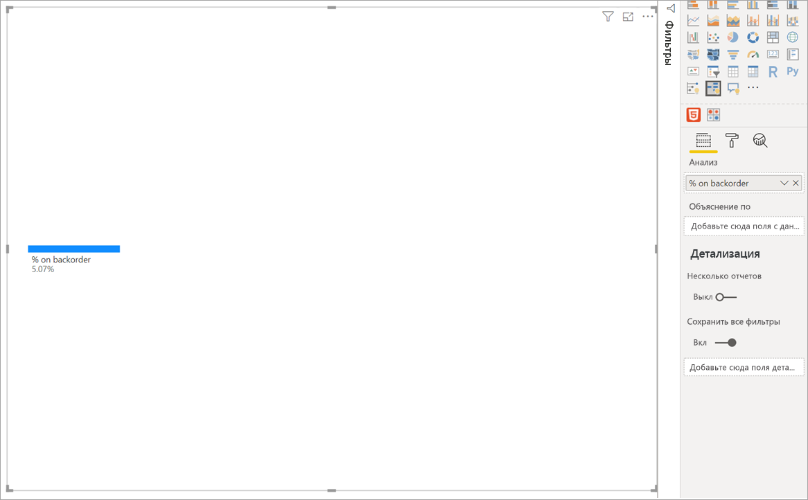
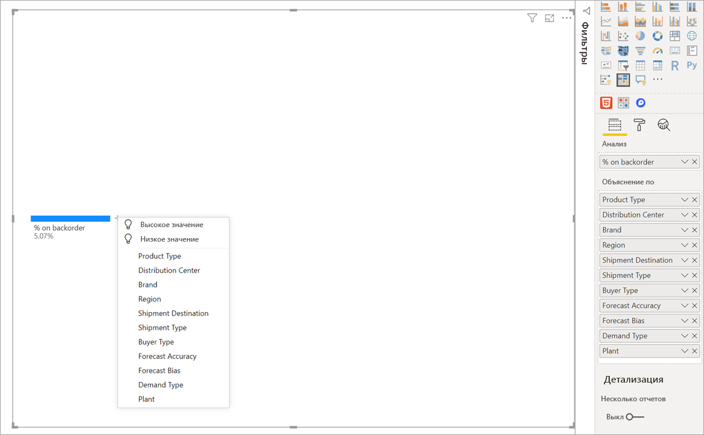
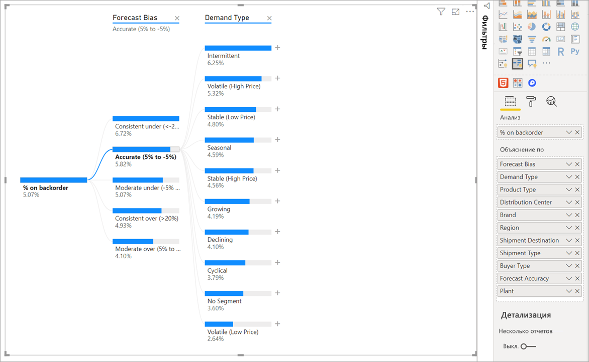
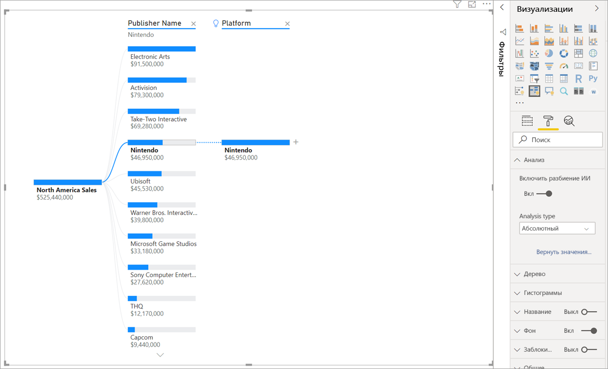
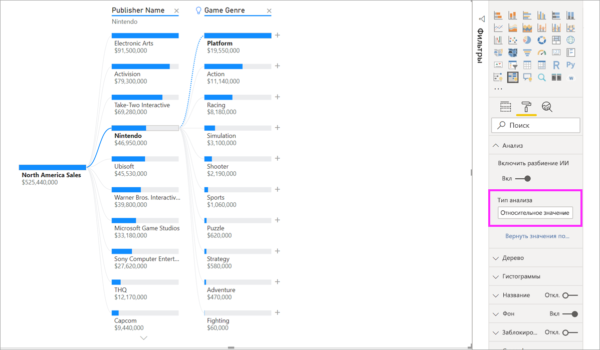
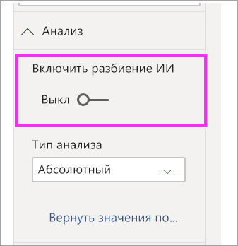

# Создание и просмотр визуальных элементов дерева декомпозиции в Power BI

[!INCLUDE[consumer-appliesto-nyyn](../includes/consumer-appliesto-nyyn.md)]

[!INCLUDE [power-bi-visuals-desktop-banner](../includes/power-bi-visuals-desktop-banner.md)]

Визуализация в виде дерева декомпозиции в Power BI позволяет визуализировать данные в нескольких измерениях. Она автоматически выполняет статистическую обработку данных и позволяет детализировать измерения в любом порядке. Это визуализация искусственного интеллекта (ИИ), которая может искать новые измерения для выполнения детализации на основе определенных критериев. Она выступает ценным инструментом для специализированного изучения и проведения анализа первопричин.

В этом учебнике используются два примера:

- сценарий цепочки поставок, в котором анализируется процентное соотношение продуктов для дозаказа (которых нет в наличии);  
- сценарий продаж, который разбивает продажи видеоигр по множеству факторов, таких как жанр игры и издатель.

PBIX-файл, используемый в сценарии цепочки поставок, можно найти здесь: [PBIX-файл примера цепочки поставок](
https://github.com/microsoft/powerbi-desktop-samples/blob/master/Sample%20Reports/Supply%20Chain%20Sample.pbix).

> [!NOTE]
> Для предоставления общего доступа к отчету Power BI и вам, и коллеге необходимо иметь отдельные лицензии Power BI Pro или сохранить отчет в емкости Премиум.    

## Начало работы
Выберите значок дерева декомпозиции в области "Визуализация".

Для визуализации требуется два типа входных данных.

 - **Анализ** — метрика, которую требуется проанализировать. Это должна быть мера или статистическая функция.  
 - **Объяснение по** — одно или несколько измерений, для которых требуется выполнить детализацию.

После перетаскивания меры в область полей визуальный элемент обновится и отобразит агрегированную меру. В приведенном ниже примере мы будем визуализировать средний процент продуктов, которые требуется дозаказать (5,07 %).

Далее требуется выбрать одно или несколько измерений, для которых необходимо выполнить детализацию. Добавьте эти поля в контейнер **Объяснение по**. Обратите внимание, что рядом с корневым узлом отображается знак "плюс". С помощью знака "плюс" можно выбрать, для какого поля нужно выполнить детализацию (вы можете детализировать поля в любом порядке).

Щелкните **Forecast bias** (Смещение прогноза), чтобы развернуть дерево и разбить меры по значениям в столбце. Этот процесс можно повторить, выбрав другой узел для детализации.

Если выбрать узел из последнего уровня, будет выполнена перекрестная фильтрация данных. Выбор узла на более раннем уровне приведет к изменению пути.

При взаимодействии с другими визуальными элементами осуществляется перекрестная фильтрация дерева декомпозиции. В результате порядок узлов в уровнях может измениться.
В приведенном ниже примере выполнена перекрестная фильтрация дерева по критерию Ubisoft. Путь обновляется, и продажи Xbox перемещаются с первого на второе место, уступая первенство PlayStation. 

Если затем перекрестно отфильтровать дерево по Nintendo, продажи Xbox будут пустыми, так как игры Nintendo, разработанные для Xbox, отсутствуют. Xbox, а также его последующий путь, отфильтровывается из представления.

Несмотря на то что путь не отображается, существующие уровни (в нашем случае игровой жанр) остаются закрепленными в дереве. Таким образом, при выборе узла Nintendo дерево автоматически развертывается до уровня игрового жанра.

## Разбиение ИИ

Разбиение ИИ можно использовать, чтобы выяснить, где в данных следует искать дальше. Эти разбиения отображаются в верхней части списка и помечаются с помощью лампочки. Разбиение позволяет автоматически находить высокие и низкие значения в данных.

Анализ может выполняться двумя способами в зависимости от ваших предпочтений. Поведение по умолчанию выглядит следующим образом:

 - **Высокое значение**. Рассматривает все доступные поля и определяет, какое из них нужно детализировать, чтобы получить наибольшее значение анализируемой меры.  
 - **Низкое значение**. Рассматривает все доступные поля и определяет, какое из них нужно детализировать, чтобы получить наименьшее значение анализируемой меры.  

При выборе **высокого значения** в примере с дозаказываемым товаром выдается следующее:

Рядом с полем **Тип продукта** появится лампочка, указывающая, что было выполнено разбиение ИИ. В дереве также появится пунктирная линия, рекомендующая узел **Patient Monitoring** (Мониторинг состояния пациентов), так как по нему определяется наибольшее значение дозаказа (9,2 %). 

Наведите указатель мыши на лампочку, чтобы увидеть подсказку. В этом примере подсказка "% при дозаказе имеет наибольшее значение, если в качестве типа продукта выбран мониторинг состояния пациентов".

Можно настроить визуальный элемент для поиска **относительных** разбиений ИИ, а не **абсолютных**. 

В относительном режиме выполняется поиск высоких значений, которые выделяются (по сравнению с остальными данными в столбце). Рассмотрим пример ниже.

На приведенном выше снимке экрана показаны продажи видеоигр в Северной Америке. Сначала разбейте дерево по **имени издателя**, а затем выполните детализацию Nintendo. Если щелкнуть **Высокое значение**, мы получим развертывание платформы **Nintendo**. Так как Nintendo (издатель) разрабатывает игры только для консолей Nintendo, существует только одно значение, и поэтому неудивительно, что оно самое высокое.

Тем не менее интереснее посмотреть, какое высокое значение выделяется относительно других значений в том же столбце. Если изменить тип анализа с **абсолютного** на **относительный**, мы получим следующий результат для Nintendo: 

На этот раз рекомендуемое значение — **платформа в столбце игрового жанра**.  Платформа не приводит к более высокому абсолютному значению, чем для Nintendo (19 950 000 по сравнению с 46 950 000 долл. США). Тем не менее это значение выделяется.

Так как в столбце игрового жанра 10 значений, ожидаемое значение для платформы — 4,6 млн долл. США, если бы они были распределены равномерно. Значение для платформы почти 20 млн долл. США. Это интересный результат, так как это в четыре раза выше ожидаемого результата.

Вычисление выполняется следующим образом.

Продажи в Северной Америке для платформ / Abs (Avg (продажи в Северной Америке для игрового жанра))  
в сравнении с  
продажами в Северной Америке для Nintendo / Abs (Avg (продажи в Северной Америке для платформы))  

Это преобразуется в:

19 550 000 / (19 550 000 + 11 140 000 + ... + 470 000 + 60 000 /10) = 4,25x  
в сравнении с  
46 950 000/ (46 950 000/1) = 1x  

Если вы предпочитаете не использовать какие-либо разбиения ИИ в дереве, вы можете отключить их в разделе **Analysis formatting** (Форматирование анализа).  

## Взаимодействие элементов дерева с разбиениями ИИ

Вы можете получить несколько последующих уровней искусственного интеллекта. Вы также можете комбинировать различные виды уровней искусственного интеллекта (переход от высокого значения к низкому значению и обратно к высокому):

Если выбрать другой узел в дереве, разбиение ИИ будет пересчитано с нуля. В примере ниже мы изменили выбранный узел на уровне **Forecast bias** (Смещение прогноза). Последующие уровни изменяются, чтобы получить правильные высокие и низкие значения.

Уровни ИИ также пересчитываются при перекрестной фильтрации дерева декомпозиции по другим визуальным элементам. В приведенном ниже примере мы видим, что наш процент дозаказа является наивысшим для фабрики #0477.

Но если выбрать **Апрель** на линейчатой диаграмме, то наиболее высокие изменения будут для типа продукта **Advanced Surgical** (Перспективное хирургическое оборудование). В этом случае были переупорядочены не только узлы, но и был выбран совершенно другой столбец. 

Если мы хотим, чтобы уровни с использованием ИИ вели себя как уровни без ИИ, выберите лампочку, чтобы вернуть поведение по умолчанию. 

Хотя несколько уровней с ИИ можно объединить в цепочку, уровень, отличный от ИИ, не может следовать за уровнем с ИИ. Если выполнить разбиение вручную после разбиения ИИ, лампочка из уровня ИИ исчезает, а уровень преобразуется в нормальный. 

## Блокировка

Создатель содержимого может блокировать уровни для потребителей отчетов. Когда уровень заблокирован, его нельзя удалить или изменить. Потребитель может исследовать различные пути в пределах заблокированного уровня, но он не может изменить сам уровень. Если создатель наведет указатель на существующий уровень, отобразится значок замка. Вы можете заблокировать столько уровней, сколько хотите, но вы не сможете разблокировать уровни, предшествующие заблокированным.

В примере ниже первые два уровня заблокированы. Это означает, что пользователи отчетов могут изменять уровни 3 и 4, а затем даже добавлять новые уровни. Однако первые два уровня нельзя изменить:

## Известные ограничения

Максимальное число уровней для дерева — 50. Максимальное количество точек данных, которые можно наглядно представлять в дереве, — 5000. Мы усекаем уровни, чтобы отобразить первые n уровней. В настоящее время значение первых n для каждого уровня составляет 10. 

Дерево декомпозиции не поддерживается в следующих сценариях:  
-   локальные службы Analysis Services.

Разбиение ИИ не поддерживается в следующих сценариях:  
-   Azure Analysis Services
-   Cервере отчетов Power BI
-   Публикация в Интернете
-   сложные меры и меры из схем расширений в режиме "Анализ".

Другие ограничения:
- поддержка в модуле "Вопросы и ответы".

## Дальнейшие действия

[Кольцевые диаграммы в Power BI](power-bi-visualization-doughnut-charts.md)

[Визуализации в отчетах Power BI](power-bi-report-visualizations.md)

