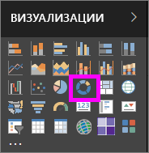

# Кольцевые диаграммы в Power BI
Кольцевая диаграмма похожа на круговую диаграмму в том, что она показывает отношение между целым и частями. Единственное отличие в том, что центр диаграммы пуст и в него можно добавить подпись или значок.

## Создание кольцевой диаграммы
В этих инструкциях используется набор данных "Анализ розничной торговли — прием" для создания кольцевой диаграммы, в которой отображаются продажи за этот год по категориям. Чтобы продолжить работу, [скачайте пример](../sample-datasets.md) для службы Power BI или Power BI Desktop.

1. Начните с пустой страницы отчета. Если вы используете службу Power BI, нужно открыть отчет в [режиме правки](../service-interact-with-a-report-in-editing-view.md).

2. В области "Поля" выберите **Продажи**\>**Продажи за прошлый год**.  
   
3. В области "Визуализации" щелкните значок кольцевой диаграммы , чтобы преобразовать линейчатую диаграмму в кольцевую. Если поля **Продажи за прошлый год** нет в области **Значения**, перетащите его туда.
     
   

4. Выберите **Элемент** \> **Категория**, чтобы добавить его в область **Условные обозначения**. 
     
    

5. При необходимости [настройте размер и цвет текста диаграммы](power-bi-visualization-customize-title-background-and-legend.md). 

## Рекомендации и устранение неполадок
* Сумма значений кольцевой диаграммы должна составлять 100 %.
* Слишком большое число категорий затрудняет чтение и понимание.
* Кольцевые диаграммы лучше подходят для сравнения определенной части с целым, а не отдельных частей друг с другом. 

## Дальнейшие действия
[Воронкообразные диаграммы в Power BI](power-bi-visualization-funnel-charts.md)

[Типы визуализаций в Power BI](power-bi-visualization-types-for-reports-and-q-and-a.md)

